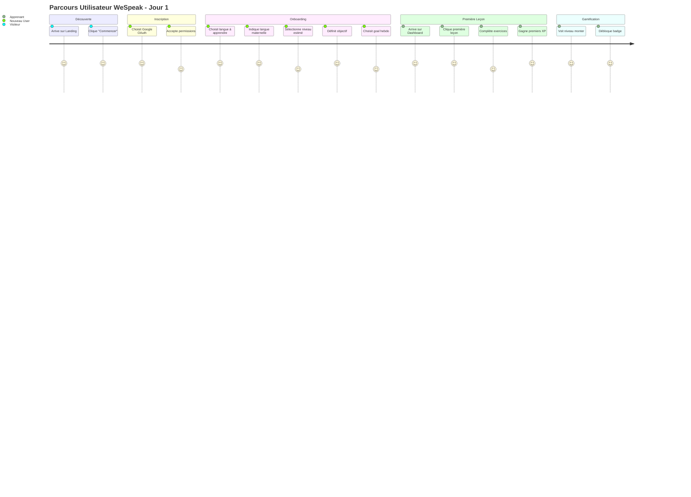
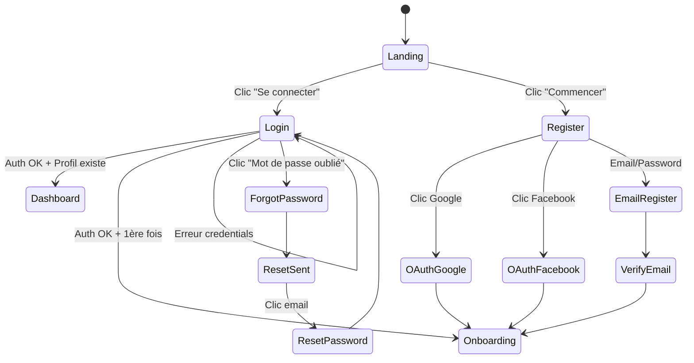
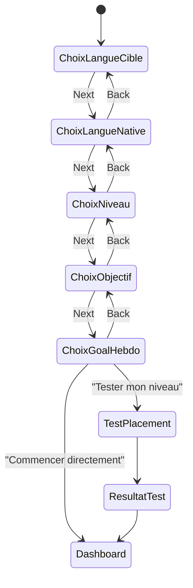
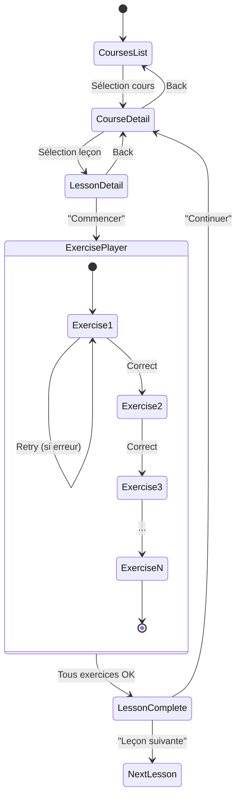
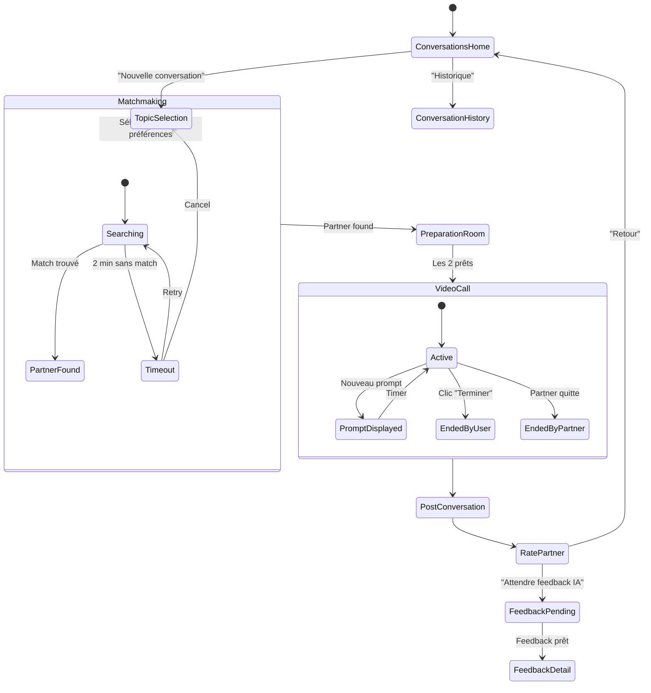

# WeSpeak Frontend - Flux Utilisateur Principal

## 2. Parcours Utilisateur Type



---

## 3. Flux de Navigation Détaillé

### 3.1 Flux Authentification



### 3.2 Flux Onboarding



### 3.3 Flux Leçon



### 3.4 Flux Conversation



---

## 4. États de l'Application

### 4.1 États Globaux

```typescript
interface AppState {
  // Auth
  isAuthenticated: boolean;
  currentUser: User | null;
  accessToken: string | null;
  
  // Profil d'apprentissage actif
  activeLearningProfile: LearningProfile | null;
  
  // Gamification temps réel
  currentXP: number;
  currentLevel: number;
  currentStreak: number;
  
  // Notifications
  unreadNotifications: number;
  pendingFeedbacks: number;
  
  // UI
  sidebarOpen: boolean;
  currentTheme: 'light' | 'dark' | 'system';
  uiLanguage: string;
}
```

### 4.2 États par Module

```typescript
// Lesson Module State
interface LessonState {
  courses: Course[];
  currentCourse: Course | null;
  currentLesson: Lesson | null;
  currentExerciseIndex: number;
  sessionScore: number;
  sessionErrors: ExerciseError[];
  isLoading: boolean;
}

// Conversation Module State
interface ConversationState {
  availableTopics: ConversationTopic[];
  matchRequest: MatchRequest | null;
  matchStatus: 'idle' | 'searching' | 'found' | 'timeout';
  currentSession: ConversationSession | null;
  peerConnection: RTCPeerConnection | null;
  localStream: MediaStream | null;
  remoteStream: MediaStream | null;
  currentPrompt: string | null;
  isRecording: boolean;
}

// Feedback Module State
interface FeedbackState {
  feedbackList: FeedbackSummary[];
  currentFeedback: FeedbackReport | null;
  userStats: UserStats | null;
  progressHistory: ProgressDataPoint[];
}

// Gamification Module State
interface GamificationState {
  profile: GamificationProfile | null;
  badges: Badge[];
  earnedBadges: string[];
  activeChallenges: Challenge[];
  leaderboard: LeaderboardEntry[];
  recentXPGains: XPTransaction[];
}
```
