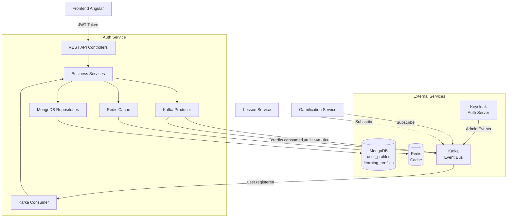
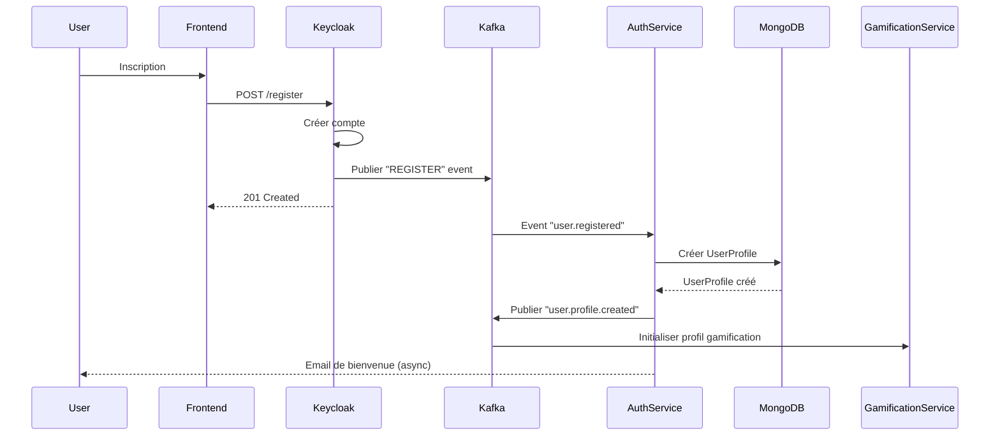
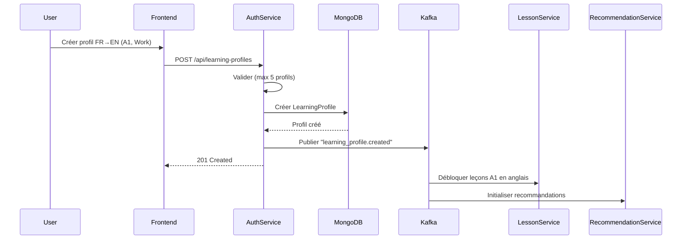

# Auth Service - Spécifications Techniques v2.0

## 📋 Vue d'Ensemble

### 1.1 Responsabilité

Le **Auth Service** gère les profils utilisateurs, les profils d'apprentissage multi-langues, et les crédits/quotas d'utilisation. Il s'intègre avec **Keycloak** pour l'authentification (délégation complète de la gestion des comptes, mots de passe, tokens JWT).

**Périmètre** :
- ✅ Gestion des profils utilisateurs (données métier)
- ✅ Profils d'apprentissage multi-langues (LearningProfile)
- ✅ Gestion des crédits et quotas (free/premium tiers)
- ✅ Synchronisation avec Keycloak via Kafka events
- ❌ Authentification / Login / JWT (délégué à Keycloak)
- ❌ Gestion des mots de passe (délégué à Keycloak)

### 1.2 Dépendances

**Services externes** :
- **Keycloak** : Authentification, gestion des utilisateurs, JWT
- **MongoDB** : Stockage des profils et crédits
- **Redis** : Cache des profils, sessions
- **Kafka** : Événements asynchrones (sync Keycloak, notifications)

**Services internes consommateurs** :
- `lesson-service` : Validation quotas, récupération profils apprentissage
- `conversation-service` : Validation crédits conversations, matchmaking
- `gamification-service` : Profils utilisateurs pour XP/badges
- `recommendation-service` : Profils apprentissage pour recommandations

### 1.3 Technologies

**Stack** :
- **Java 21**
- **Spring Boot 4.0** (WebFlux - Reactive)
- **Spring Data MongoDB Reactive**
- **Spring Kafka**
- **Spring Security** (OAuth2 Resource Server - JWT validation)
- **Redis** (Lettuce - Reactive)
- **MongoDB 7.0**
- **Kafka 3.6**

**Patterns** :
- Reactive Programming (Mono/Flux)
- Event-Driven Architecture
- Repository Pattern
- DTO Pattern

---

## 🎯 Fonctionnalités Principales

### 1. Gestion des Profils Utilisateurs

- Synchronisation automatique avec Keycloak (Kafka events)
- CRUD profils utilisateurs (données métier uniquement)
- Gestion préférences utilisateur (theme, notifications, langue UI)
- Gestion abonnements (free, premium, enterprise)

### 2. Profils d'Apprentissage Multi-Langues

- Création de profils d'apprentissage (native → target language)
- Support de plusieurs profils par utilisateur (max 5)
- Gestion des objectifs d'apprentissage (work, travel, studies, etc.)
- Sélection du niveau CECRL (A1-C2)
- Préférences d'accent (en-US, en-GB, etc.)

### 3. Système de Crédits et Quotas

**Free Tier** :
- 3 conversations/semaine
- 10 rapports feedback IA/mois
- Reset hebdomadaire (lundi 00:00)

**Premium Tier** :
- Conversations illimitées
- 30 minutes feedback IA/mois
- Accès features premium
- Priorité matchmaking

### 4. Intégration Keycloak

**Événements Keycloak écoutés** :
- `REGISTER` → Créer UserProfile dans MongoDB
- `UPDATE_EMAIL` → Mettre à jour email
- `VERIFY_EMAIL` → Flag emailVerified
- `DELETE_ACCOUNT` → Soft delete

---

## 📊 Architecture

### Diagramme d'Architecture



### Flux d'Inscription Utilisateur



### Flux de Création de Profil d'Apprentissage



---

## 🔗 Liens vers Documentation Détaillée

- **[Modèles de Données](./data-models/README.md)** : Schémas MongoDB UserProfile et LearningProfile
- **[API REST](./api/endpoints.md)** : Liste complète des endpoints
- **[Événements Kafka](./events/published-events.json)** : Format des événements publiés
- **[Diagrammes](./diagrams/)** : Architecture, séquence, ERD
- **[User Stories](./user-stories/stories.md)** : Fonctionnalités et critères d'acceptation
- **[Checklist Emergent.sh](./emergent/CHECKLIST.md)** : Guide de génération de code

---

## 🚀 Démarrage Rapide

### Prérequis

- Java 21
- Maven 3.9+
- MongoDB 7.0
- Redis 7.0
- Kafka 3.6 (ou Redpanda)
- Keycloak 23+

### Lancement Docker Compose

```bash
cd ../docker
docker-compose up -d keycloak mongodb redis kafka
cd ../01-auth-service
mvn spring-boot:run
```

### Configuration

Variables d'environnement requises :

```bash
MONGODB_URI=mongodb://localhost:27017/wespeak_auth
REDIS_HOST=localhost
REDIS_PORT=6379
KAFKA_BOOTSTRAP_SERVERS=localhost:9092
KEYCLOAK_REALM=wespeak
KEYCLOAK_AUTH_URL=http://localhost:8080
KEYCLOAK_ADMIN_USERNAME=admin
KEYCLOAK_ADMIN_PASSWORD=admin
```

---

## 📈 Métriques et Monitoring

**Métriques Prometheus** :
- `auth_service_user_registrations_total`
- `auth_service_learning_profiles_created_total`
- `auth_service_credits_consumed_total`
- `auth_service_quota_exceeded_total`

**Health Checks** :
- `/actuator/health` : État global
- `/actuator/health/mongodb` : Connexion MongoDB
- `/actuator/health/redis` : Connexion Redis
- `/actuator/health/kafka` : Connexion Kafka

---

## 🧪 Tests

```bash
# Tests unitaires
mvn test

# Tests d'intégration (Testcontainers)
mvn verify

# Coverage
mvn jacoco:report
```

---

## 📦 Déploiement

**Dockerfile multi-stage** :
```bash
docker build -t auth-service:latest .
docker push ghcr.io/we-speak-org/auth-service:latest
```

**GitHub Actions** :
- Voir `.github/workflows/auth-service-ci.yml`
- Build automatique sur push main
- Tests + SonarQube
- Push vers GHCR

---

## 📝 Notes Importantes

### Limitation de Scope avec Keycloak

⚠️ **Ce service ne gère PAS** :
- Login / Logout (Keycloak)
- Génération de JWT (Keycloak)
- Gestion des mots de passe (Keycloak)
- Réinitialisation mot de passe (Keycloak)
- Vérification email (Keycloak envoie email)

✅ **Ce service gère UNIQUEMENT** :
- Données métier utilisateurs (displayName, preferences, etc.)
- Profils d'apprentissage (langues, niveaux, objectifs)
- Crédits et quotas (conversations, feedback IA)
- Synchronisation avec Keycloak via Kafka

### Gestion des Crédits

- Les crédits sont **consommés de manière optimiste** (pas de lock distribué)
- En cas de race condition, le premier arrivé consomme le crédit
- Reset hebdomadaire via scheduled job (Spring @Scheduled)

---

**Version** : 2.0.0  
**Dernière mise à jour** : 2026-01-02  
**Auteur** : WeSpeak Product Owner AI
