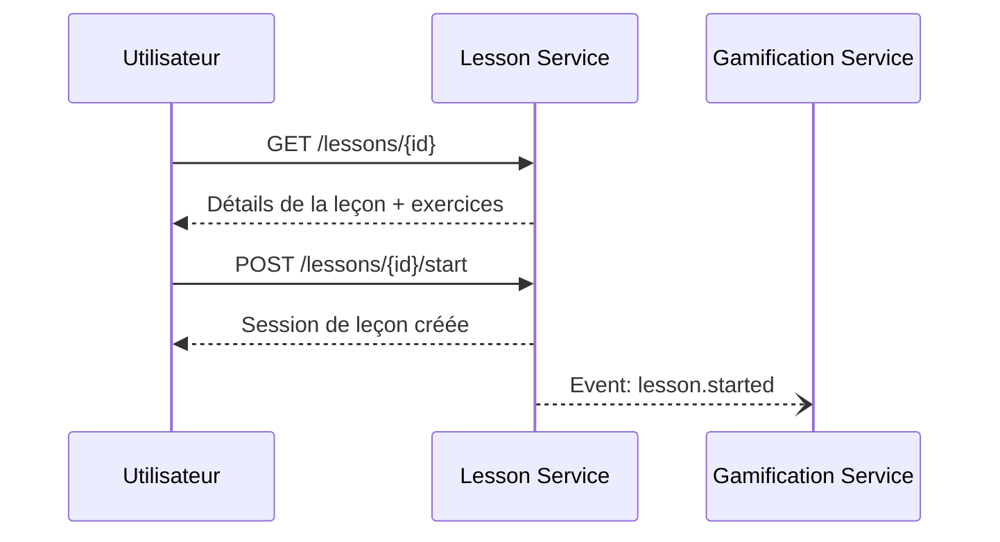
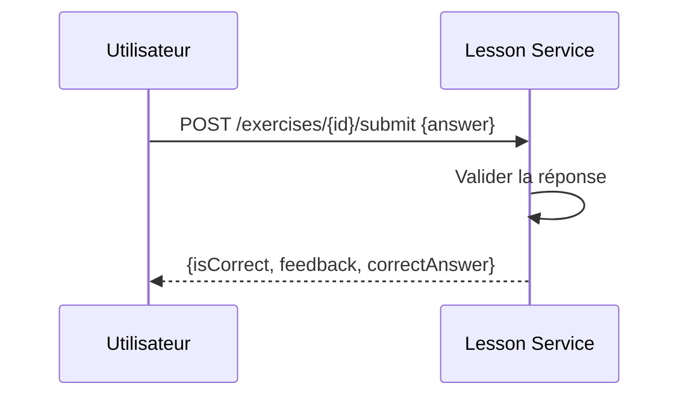
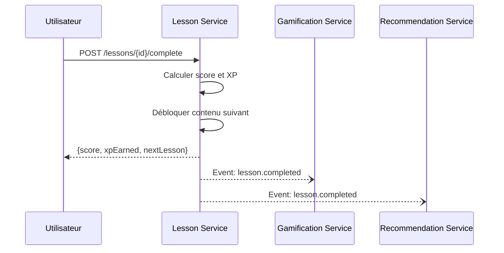

# Lesson Service - Spécification Fonctionnelle v1.0

## 1. Vue d'Ensemble

### 1.1 Objectif du Service

Le **Lesson Service** est le cœur pédagogique de WeSpeak. Il gère la structure d'apprentissage et la progression des utilisateurs à travers un curriculum organisé.

### 1.2 Responsabilités

| Responsabilité | Description |
|---------------|-------------|
| **Gestion du contenu** | Stocker et servir les cours, leçons et exercices |
| **Progression utilisateur** | Suivre l'avancement de chaque apprenant par langue |
| **Déblocage** | Appliquer les règles de déblocage séquentiel du contenu |
| **Validation** | Vérifier les réponses aux exercices et calculer les scores |

### 1.3 Ce que le service ne fait PAS

- ❌ Gamification (XP, badges, streaks) → **gamification-service**
- ❌ Conversations 1v1 → **conversation-service**
- ❌ Feedback IA avancé → **feedback-service**
- ❌ Authentification → **auth-service**

---

## 2. Concepts Fonctionnels

### 2.1 Structure Pédagogique

Le contenu est organisé en **4 niveaux hiérarchiques** :

```
Cours (Course)
  └── Unité (Unit)
        └── Leçon (Lesson)
              └── Exercice (Exercise)
```

**Exemple concret :**

```
📚 Anglais pour Débutants (A1)
    📁 Unité 1 : Les Salutations
        📖 Leçon 1.1 : Dire bonjour
            ❓ Exercice : QCM "Comment dit-on bonjour ?"
            ❓ Exercice : Compléter la phrase
        📖 Leçon 1.2 : Se présenter
    📁 Unité 2 : Au Restaurant
        📖 Leçon 2.1 : Commander à manger
```

### 2.2 Types de Leçons

| Type | Description | Exemple |
|------|-------------|---------|
| `vocabulary` | Apprentissage de vocabulaire | Mots du quotidien |
| `grammar` | Règles grammaticales | Conjugaison au présent |
| `listening` | Compréhension orale | Écouter un dialogue |
| `speaking` | Expression orale | Répéter une phrase |
| `conversation_prep` | Préparation aux conversations | Phrases utiles au restaurant |

### 2.3 Types d'Exercices

| Type | Description | Interaction utilisateur |
|------|-------------|------------------------|
| `mcq` | Question à choix multiple | Sélectionner une option |
| `fill_gap` | Texte à trous | Compléter les mots manquants |
| `translation` | Traduction | Écrire la traduction |
| `listen_repeat` | Écouter et répéter | Enregistrer sa voix |
| `match_pairs` | Associer des paires | Glisser-déposer |
| `ordering` | Remettre dans l'ordre | Ordonner les éléments |

---

## 3. Règles Métier

### 3.1 Déblocage du Contenu

Le contenu se débloque de manière **séquentielle** pour guider l'apprenant.

#### Règle 1 : Premier contenu débloqué par défaut
- Le **premier cours** d'une langue est accessible immédiatement
- La **première unité** d'un cours débloqué est accessible
- La **première leçon** d'une unité débloquée est accessible

#### Règle 2 : Déblocage par complétion
- Une leçon est **débloquée** si la leçon précédente a été complétée avec un score ≥ 70%
- Une unité est **débloquée** si toutes les leçons de l'unité précédente sont complétées
- Un cours est **débloqué** si l'utilisateur a atteint le nombre d'XP requis

### 3.2 Calcul du Score

Après une leçon, le score est calculé ainsi :

```
Score = (Réponses correctes / Total exercices) × 100
```

**Seuils importants :**

| Score | Signification |
|-------|--------------|
| ≥ 90% | Excellent - Bonus XP (+20%) |
| ≥ 70% | Réussite - Leçon suivante débloquée |
| < 70% | Échec - Recommencer conseillé |

### 3.3 Attribution des XP

Le service **calcule** les XP gagnés mais **publie un événement** pour que le gamification-service les attribue.

```
XP gagné = XP de base de la leçon × (score / 100)

Bonus :
- Score ≥ 90% : +20% XP
- Premier essai réussi : +10% XP
```

### 3.4 Progression Multi-Langues

Un utilisateur peut apprendre **plusieurs langues simultanément**. Sa progression est **isolée par langue** :

- Progression en Anglais : Cours A1, Unité 3, Leçon 5
- Progression en Espagnol : Cours A1, Unité 1, Leçon 2

---

## 4. Parcours Utilisateur

### 4.1 Commencer une Leçon



### 4.2 Soumettre un Exercice



### 4.3 Terminer une Leçon



---

## 5. Interactions avec les Autres Services

### 5.1 Événements Publiés

| Événement | Destinataires | Déclencheur |
|-----------|---------------|-------------|
| `lesson.started` | gamification-service | Utilisateur démarre une leçon |
| `lesson.completed` | gamification-service, recommendation-service | Utilisateur termine une leçon |
| `unit.completed` | gamification-service | Toutes les leçons d'une unité terminées |
| `course.completed` | gamification-service | Toutes les unités d'un cours terminées |

### 5.2 Événements Consommés

| Événement | Source | Action |
|-----------|--------|--------|
| `user.registered` | auth-service | Créer une progression initiale pour la langue choisie |
| `learning_profile.created` | auth-service | Créer une nouvelle progression pour cette langue |

---

## 6. Considérations Techniques

### 6.1 Stack Technique

| Composant | Technologie |
|-----------|-------------|
| Backend | Spring Boot 4, Java 21 |
| Base de données | MongoDB |
| Cache | Redis |
| Messaging | Kafka (Spring Cloud Stream) |

### 6.2 Performance

- **Cache Redis** sur les cours et leçons (contenu statique)
- **Pagination** obligatoire sur les listes
- **Index MongoDB** sur userId + targetLanguageCode pour les progressions

### 6.3 Sécurité

- Endpoints de consultation (GET) : **publics**
- Endpoints d'action (POST start/complete/submit) : **JWT requis**
- Un utilisateur ne peut modifier que **sa propre progression**

---

## 7. Limites et Quotas

| Limite | Free | Premium |
|--------|------|---------|
| Leçons par jour | 10 | Illimité |
| Tentatives par exercice | 3 | 5 |
| Accès aux cours avancés (B2+) | ❌ | ✅ |

---

## 8. Glossaire

| Terme | Définition |
|-------|------------|
| **Course** | Un cours complet pour un niveau CECRL (A1, A2, B1...) |
| **Unit** | Une unité thématique regroupant plusieurs leçons |
| **Lesson** | Une leçon individuelle avec objectif pédagogique |
| **Exercise** | Un exercice interactif dans une leçon |
| **Progress** | L'état d'avancement d'un utilisateur dans une langue |
| **Completion** | L'enregistrement d'une leçon terminée avec son score |
