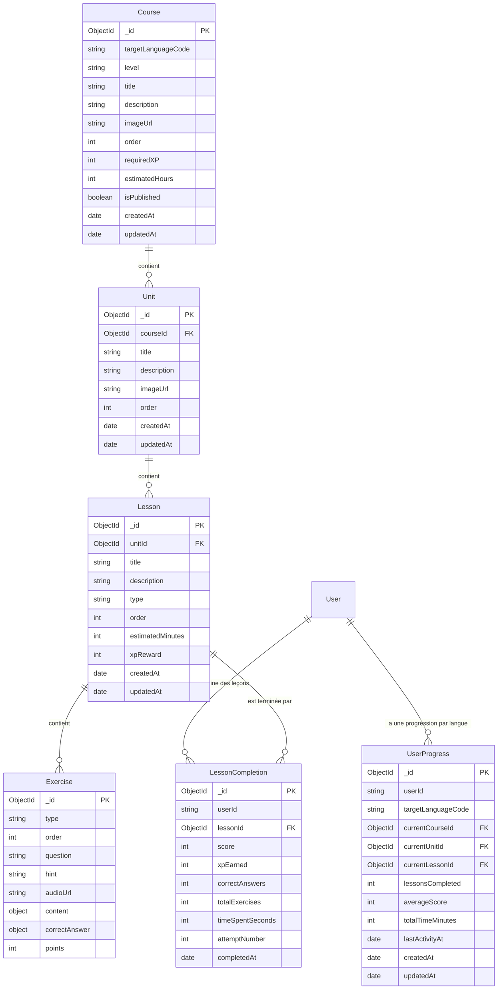
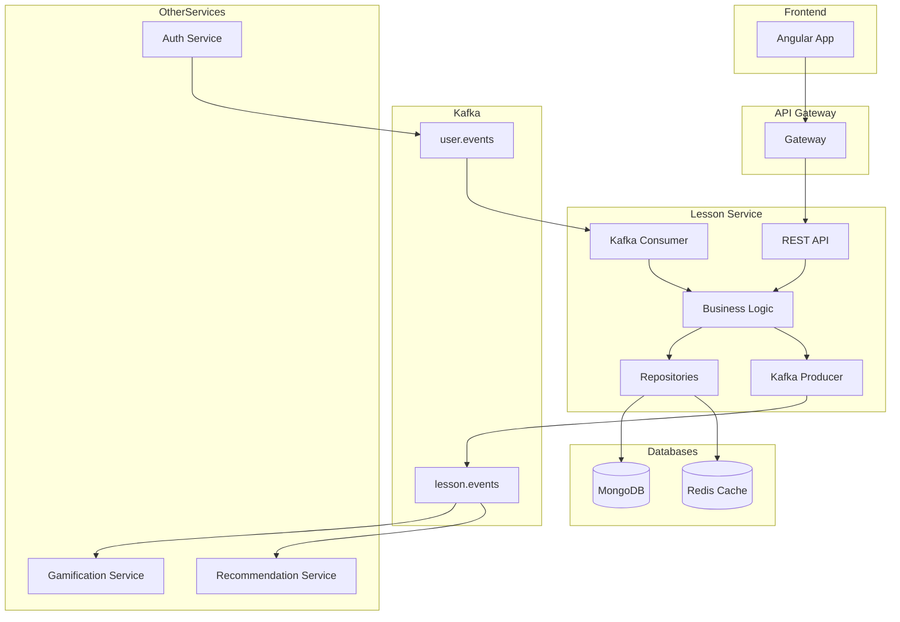
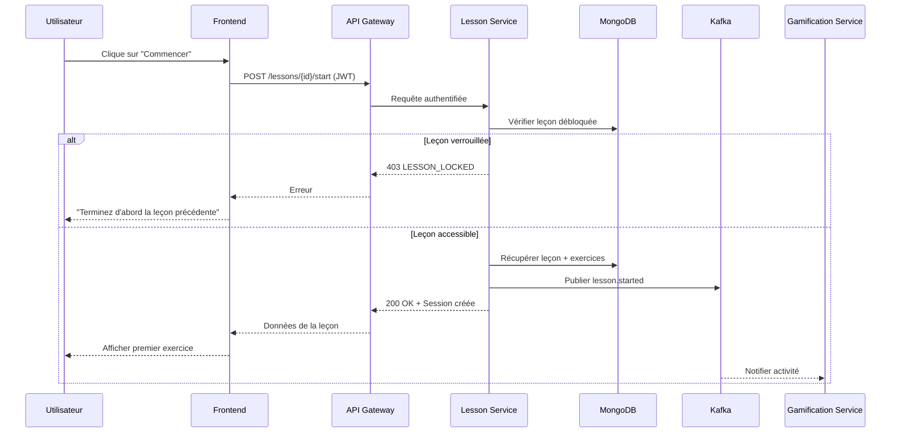
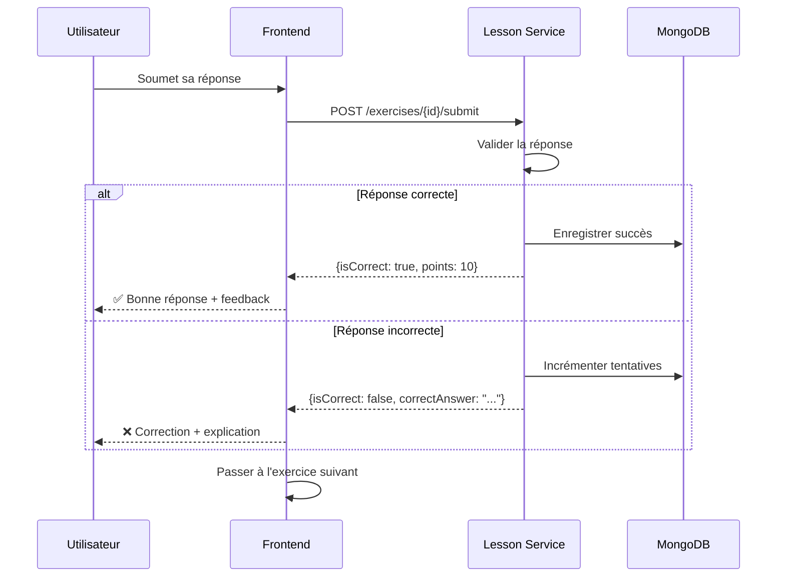
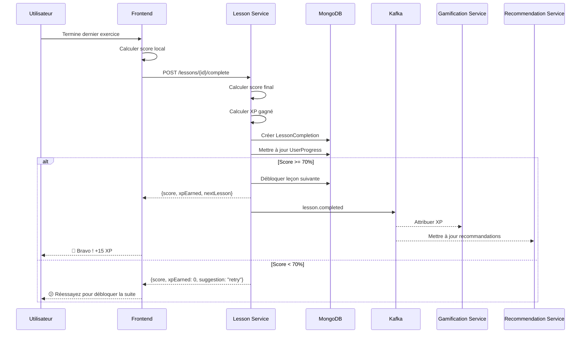
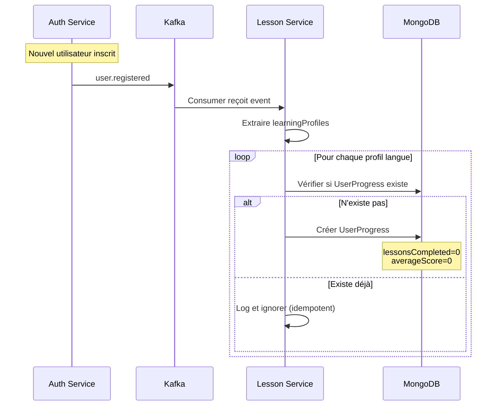
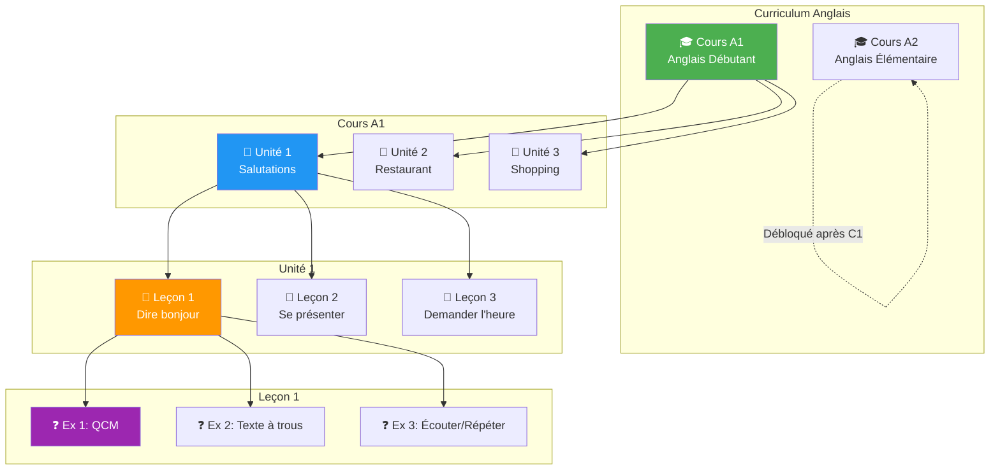
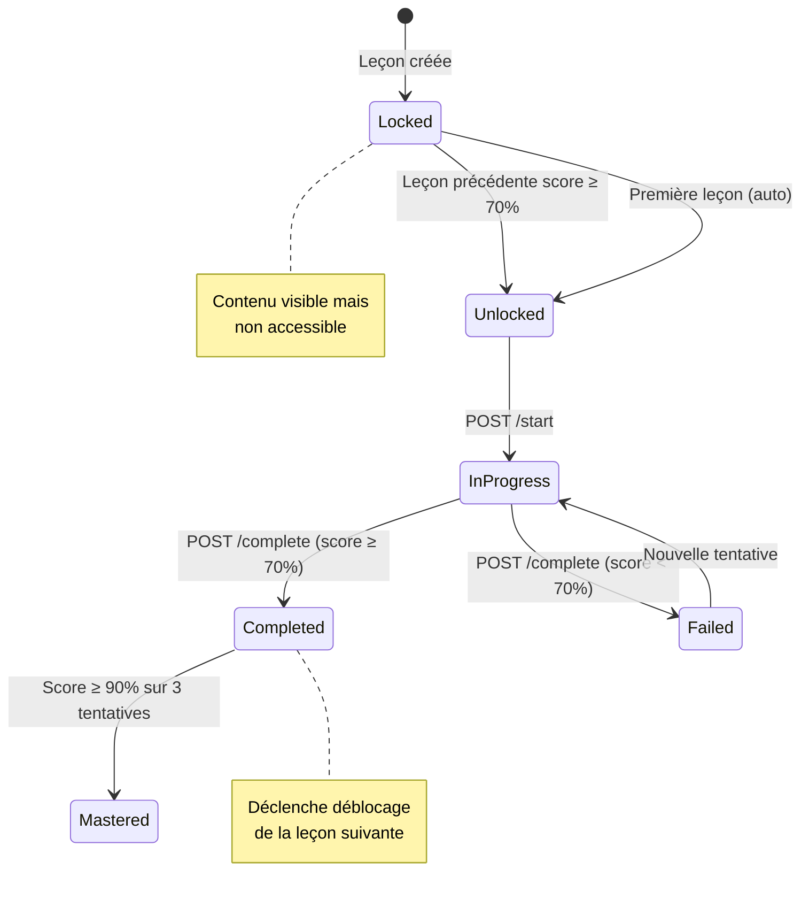

# Lesson Service - Diagrammes

## 1. Modèle de Données (ERD)

---

## 2. Architecture du Service

---

## 3. Flux : Démarrer une Leçon

---

## 4. Flux : Soumettre un Exercice

---

## 5. Flux : Terminer une Leçon

---

## 6. Flux : Création de Progression (Event)

---

## 7. Structure Hiérarchique du Contenu

---

## 8. Règles de Déblocage

