# Lesson Service - Diagrammes

## 1. Modèle de Données (ERD)

---

## 2. Architecture du Service

---

## 3. Flux : Démarrer une Leçon

```mermaid
sequenceDiagram
    participant U as Utilisateur
    participant FE as Frontend
    participant GW as API Gateway
    participant LS as Lesson Service
    participant DB as MongoDB
    participant K as Kafka
    participant GS as Gamification Service

    U->>FE: Clique sur "Commencer"
    FE->>GW: POST /lessons/{id}/start (JWT)
    GW->>LS: Requête authentifiée
    
    LS->>DB: Vérifier leçon débloquée
    alt Leçon verrouillée
        LS-->>GW: 403 LESSON_LOCKED
        GW-->>FE: Erreur
        FE-->>U: "Terminez d'abord la leçon précédente"
    else Leçon accessible
        LS->>DB: Récupérer leçon + exercices
        LS->>K: Publier lesson.started
        LS-->>GW: 200 OK + Session créée
        GW-->>FE: Données de la leçon
        FE-->>U: Afficher premier exercice
        K-->>GS: Notifier activité
    end
```

---

## 4. Flux : Soumettre un Exercice

```mermaid
sequenceDiagram
    participant U as Utilisateur
    participant FE as Frontend
    participant LS as Lesson Service
    participant DB as MongoDB

    U->>FE: Soumet sa réponse
    FE->>LS: POST /exercises/{id}/submit
    
    LS->>LS: Valider la réponse
    
    alt Réponse correcte
        LS->>DB: Enregistrer succès
        LS-->>FE: {isCorrect: true, points: 10}
        FE-->>U: ✅ Bonne réponse + feedback
    else Réponse incorrecte
        LS->>DB: Incrémenter tentatives
        LS-->>FE: {isCorrect: false, correctAnswer: "..."}
        FE-->>U: ❌ Correction + explication
    end
    
    FE->>FE: Passer à l'exercice suivant
```

---

## 5. Flux : Terminer une Leçon

```mermaid
sequenceDiagram
    participant U as Utilisateur
    participant FE as Frontend
    participant LS as Lesson Service
    participant DB as MongoDB
    participant K as Kafka
    participant GS as Gamification Service
    participant RS as Recommendation Service

    U->>FE: Termine dernier exercice
    FE->>FE: Calculer score local
    FE->>LS: POST /lessons/{id}/complete
    
    LS->>LS: Calculer score final
    LS->>LS: Calculer XP gagné
    LS->>DB: Créer LessonCompletion
    LS->>DB: Mettre à jour UserProgress
    
    alt Score >= 70%
        LS->>DB: Débloquer leçon suivante
        LS-->>FE: {score, xpEarned, nextLesson}
        LS->>K: lesson.completed
        K-->>GS: Attribuer XP
        K-->>RS: Mettre à jour recommandations
        FE-->>U: 🎉 Bravo ! +15 XP
    else Score < 70%
        LS-->>FE: {score, xpEarned: 0, suggestion: "retry"}
        FE-->>U: 😕 Réessayez pour débloquer la suite
    end
```

---

## 6. Flux : Création de Progression (Event)

```mermaid
sequenceDiagram
    participant AUTH as Auth Service
    participant K as Kafka
    participant LS as Lesson Service
    participant DB as MongoDB

    Note over AUTH: Nouvel utilisateur inscrit
    AUTH->>K: user.registered
    
    K->>LS: Consumer reçoit event
    LS->>LS: Extraire learningProfiles
    
    loop Pour chaque profil langue
        LS->>DB: Vérifier si UserProgress existe
        alt N'existe pas
            LS->>DB: Créer UserProgress
            Note over DB: lessonsCompleted=0<br/>averageScore=0
        else Existe déjà
            LS->>LS: Log et ignorer (idempotent)
        end
    end
```

---

## 7. Structure Hiérarchique du Contenu

```mermaid
graph TD
    subgraph "Curriculum Anglais"
        C1[🎓 Cours A1<br/>Anglais Débutant]
        C2[🎓 Cours A2<br/>Anglais Élémentaire]
    end
    
    subgraph "Cours A1"
        U1[📁 Unité 1<br/>Salutations]
        U2[📁 Unité 2<br/>Restaurant]
        U3[📁 Unité 3<br/>Shopping]
    end
    
    subgraph "Unité 1"
        L1[📖 Leçon 1<br/>Dire bonjour]
        L2[📖 Leçon 2<br/>Se présenter]
        L3[📖 Leçon 3<br/>Demander l'heure]
    end
    
    subgraph "Leçon 1"
        E1[❓ Ex 1: QCM]
        E2[❓ Ex 2: Texte à trous]
        E3[❓ Ex 3: Écouter/Répéter]
    end
    
    C1 --> U1
    C1 --> U2
    C1 --> U3
    C2 -.-> |Débloqué après C1| C2
    
    U1 --> L1
    U1 --> L2
    U1 --> L3
    
    L1 --> E1
    L1 --> E2
    L1 --> E3
    
    style C1 fill:#4CAF50,color:#fff
    style U1 fill:#2196F3,color:#fff
    style L1 fill:#FF9800,color:#fff
    style E1 fill:#9C27B0,color:#fff
```

---

## 8. Règles de Déblocage

```mermaid
stateDiagram-v2
    [*] --> Locked: Leçon créée
    Locked --> Unlocked: Leçon précédente score ≥ 70%
    Locked --> Unlocked: Première leçon (auto)
    
    Unlocked --> InProgress: POST /start
    InProgress --> Completed: POST /complete (score ≥ 70%)
    InProgress --> Failed: POST /complete (score < 70%)
    
    Failed --> InProgress: Nouvelle tentative
    Completed --> Mastered: Score ≥ 90% sur 3 tentatives
    
    note right of Locked
        Contenu visible mais
        non accessible
    end note
    
    note right of Completed
        Déclenche déblocage
        de la leçon suivante
    end note
```

