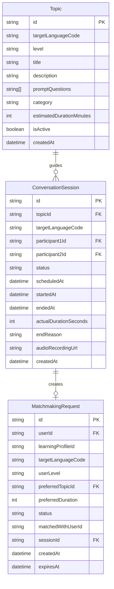
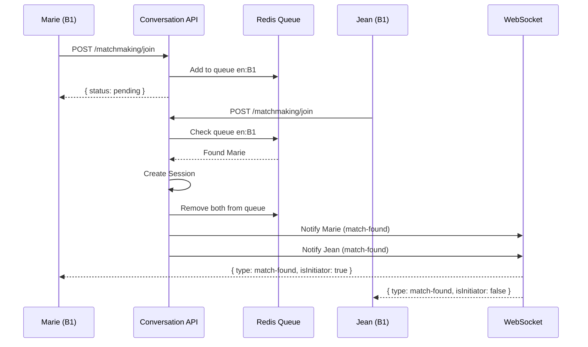
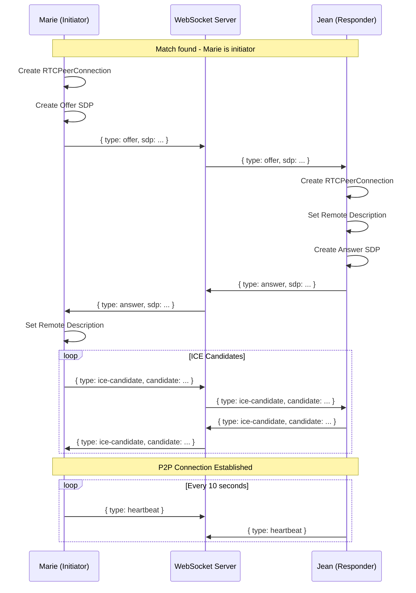
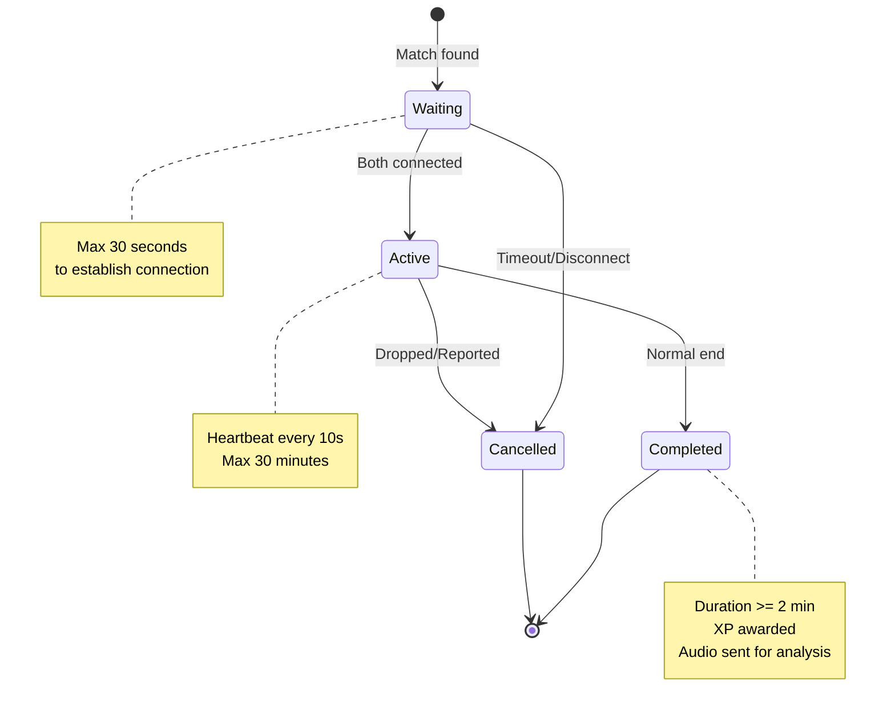
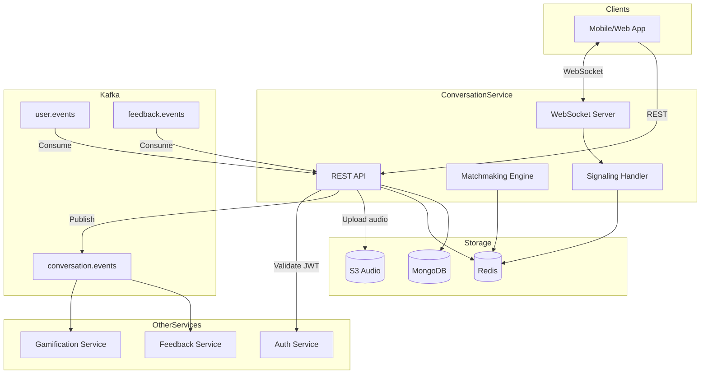
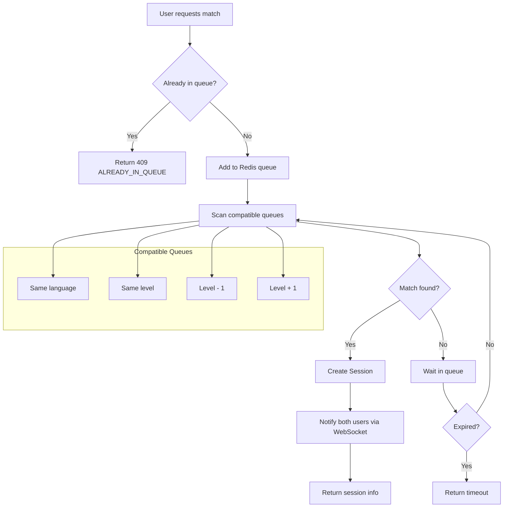

# Conversation Service - Diagrammes

## Diagramme ERD

---

## Flux de Matchmaking

---

## Flux WebRTC Signaling

---

## Cycle de Vie d'une Session

---

## Architecture du Service

---

## Algorithme de Matchmaking

