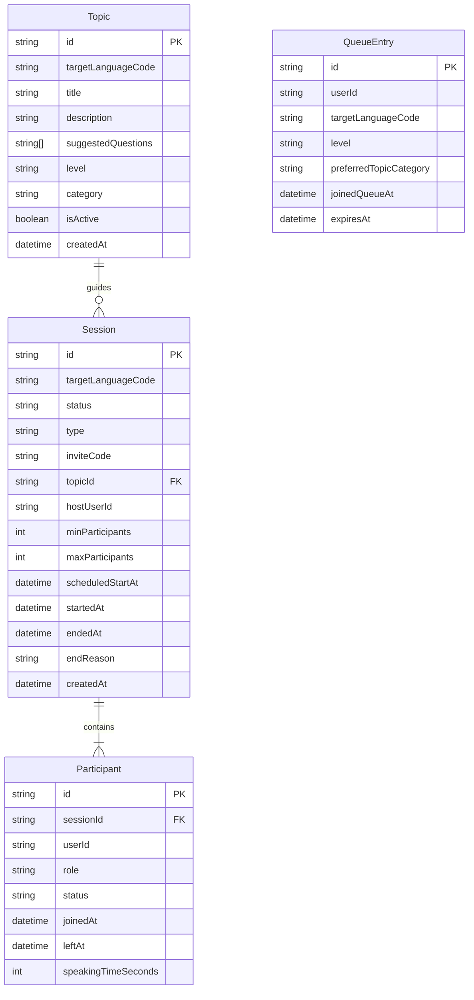
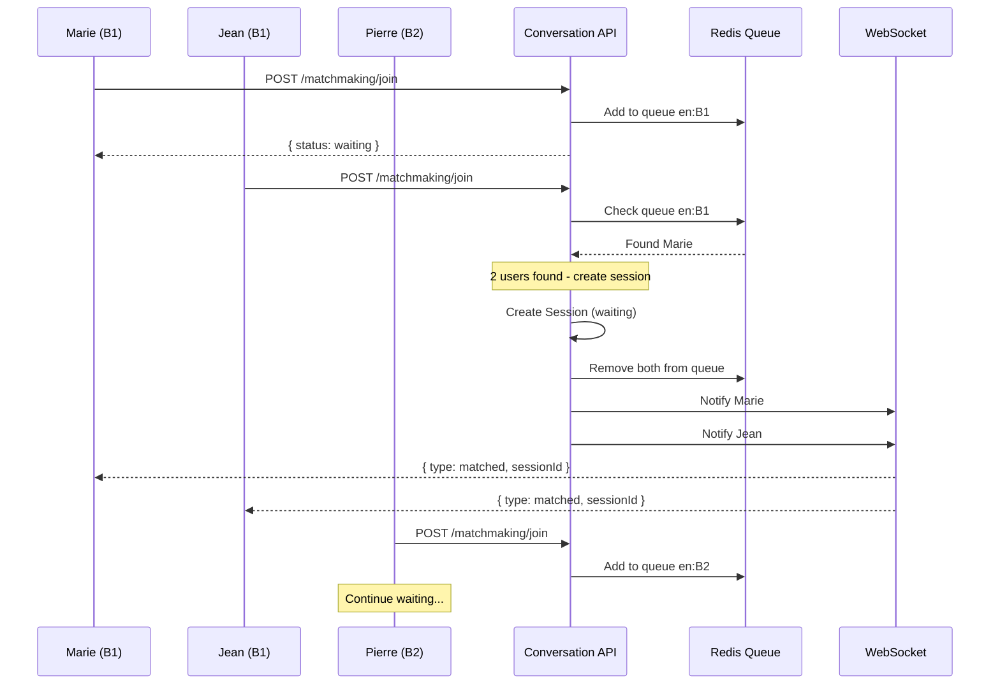
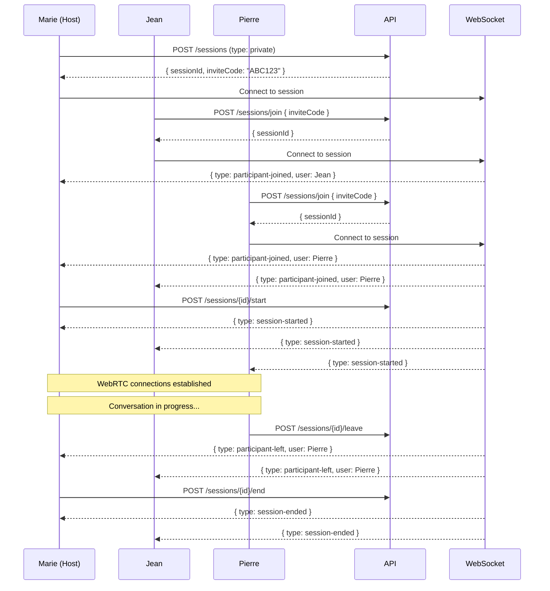
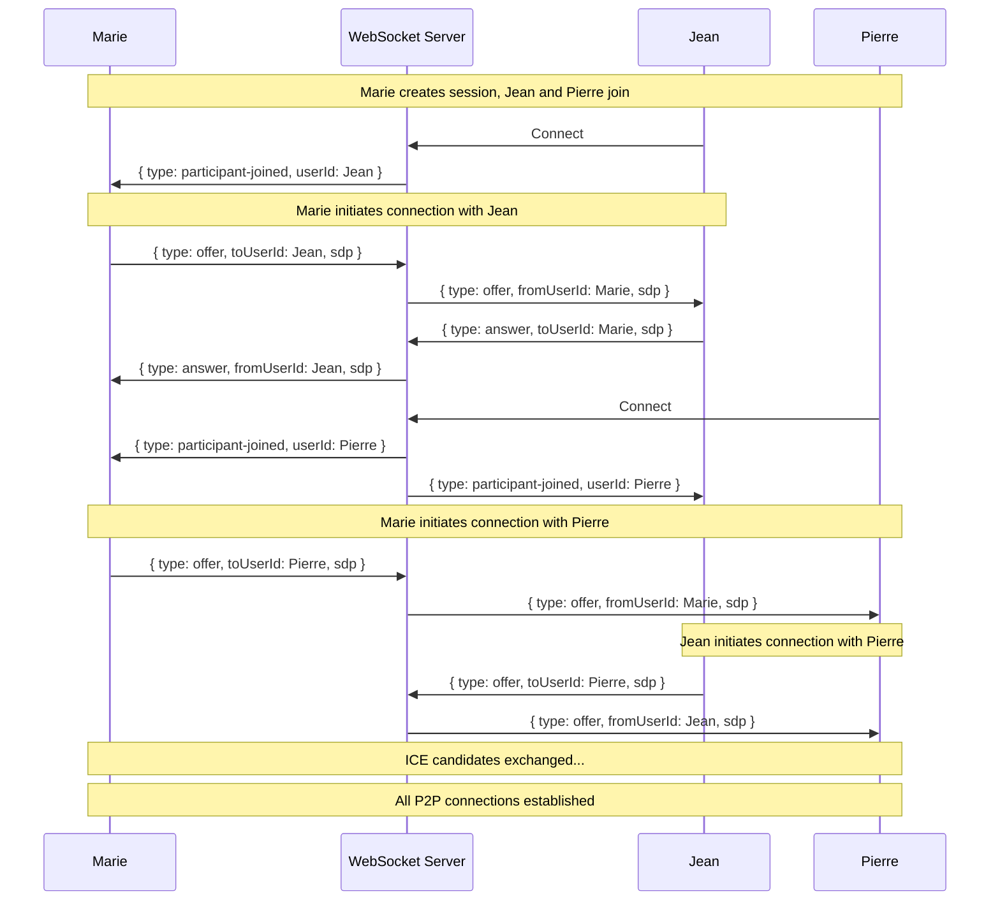
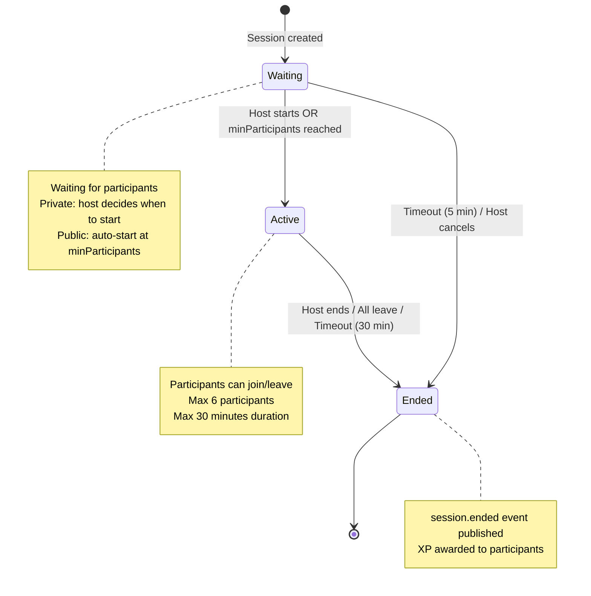
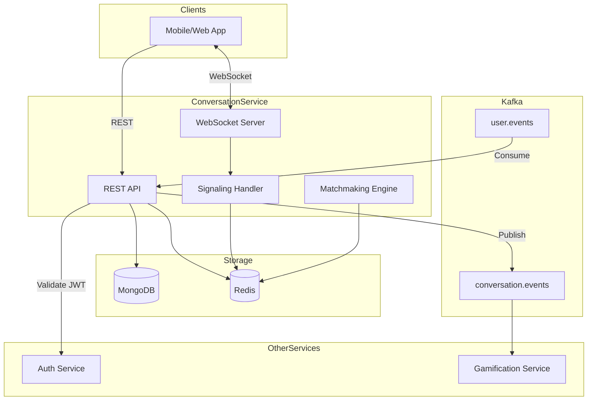
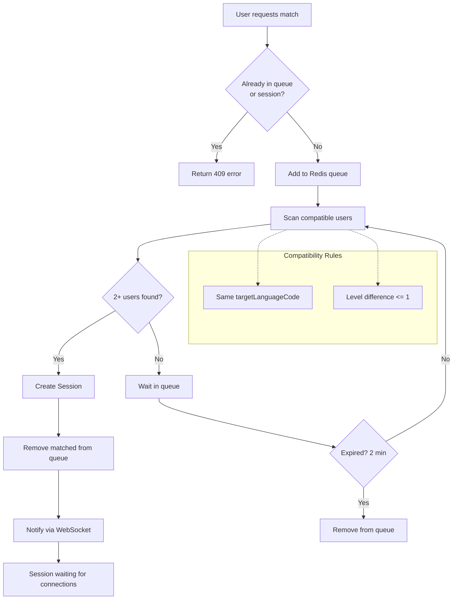

# Conversation Service - Diagrammes

## Diagramme ERD

---

## Flux de Matchmaking (Quick Match)

---

## Flux Session Multi-Participants

---

## Flux WebRTC Signaling (Multi-Peers)

---

## Cycle de Vie d'une Session

---

## Architecture du Service

---

## Algorithme de Matchmaking

