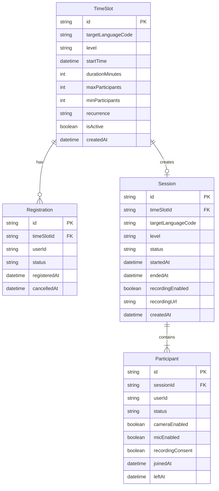
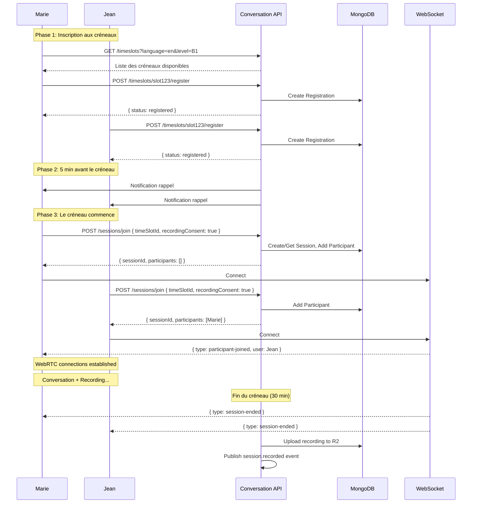
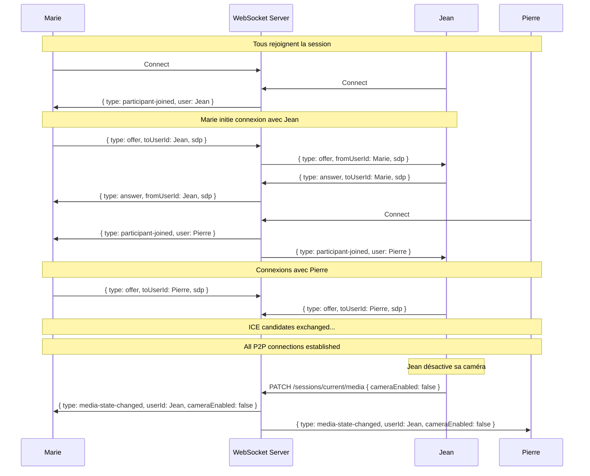
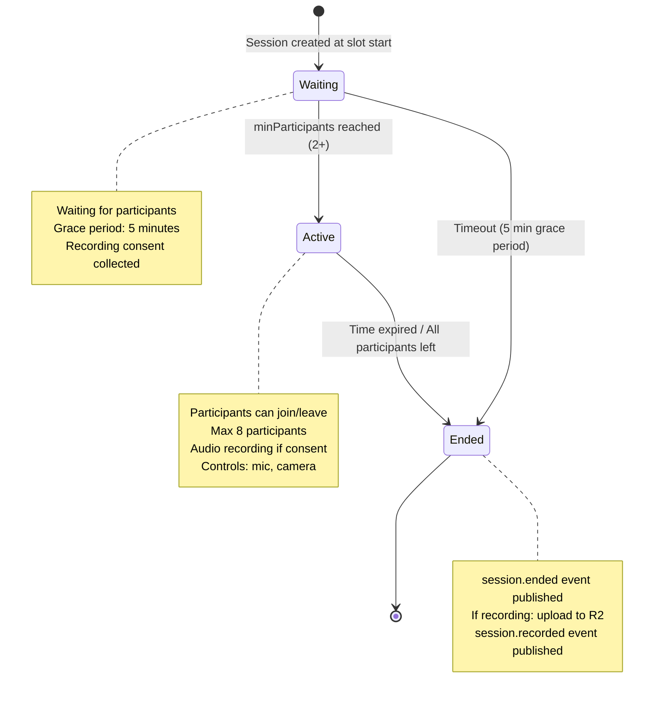
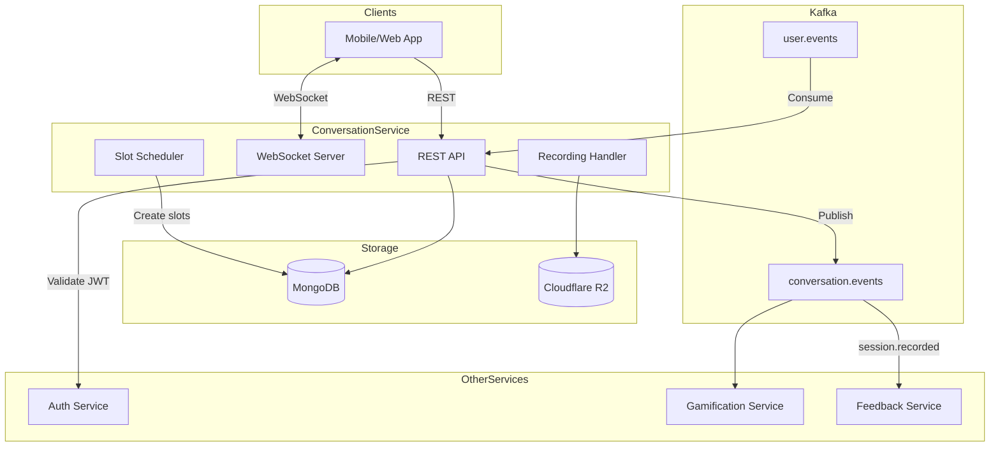
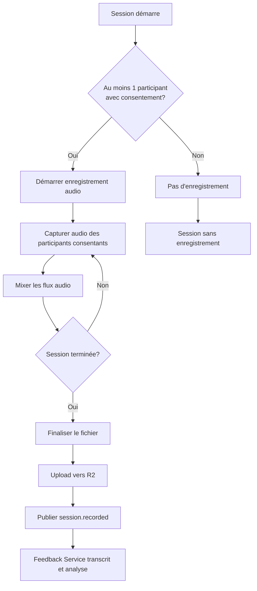

# Conversation Service - Diagrammes

## Diagramme ERD

---

## Flux Inscription et Session

---

## Flux WebRTC Signaling

---

## Cycle de Vie d'une Session

---

## Architecture du Service

---

## Flux d'Enregistrement

