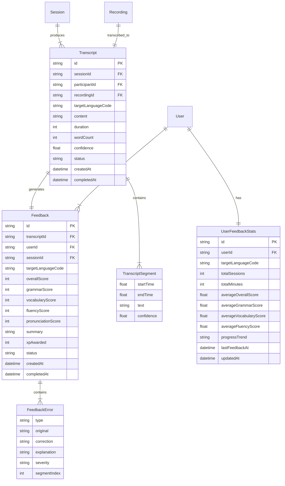
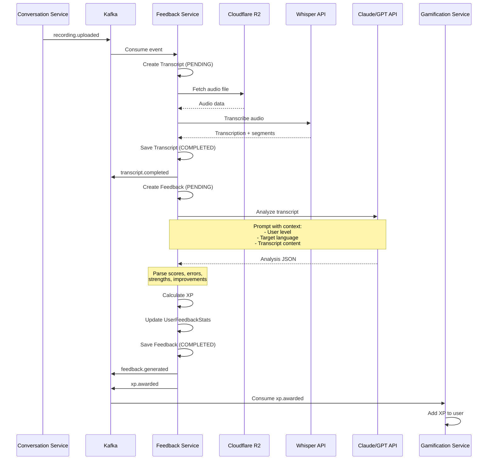
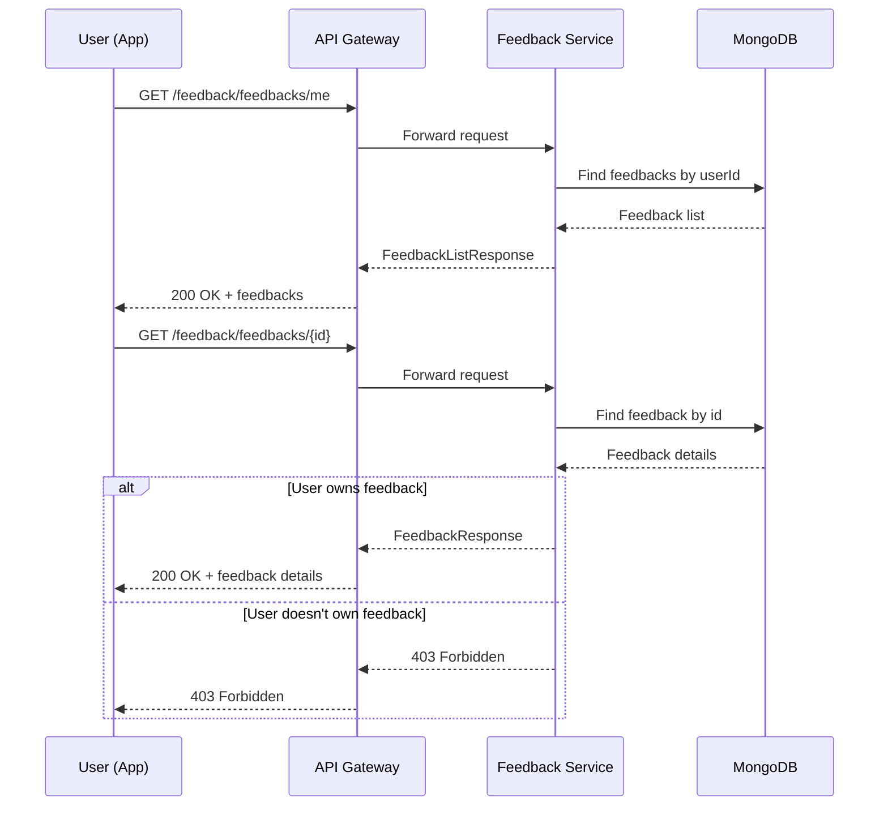
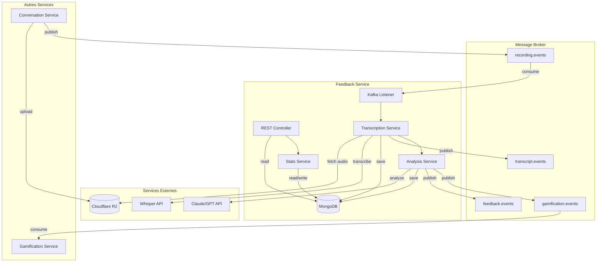
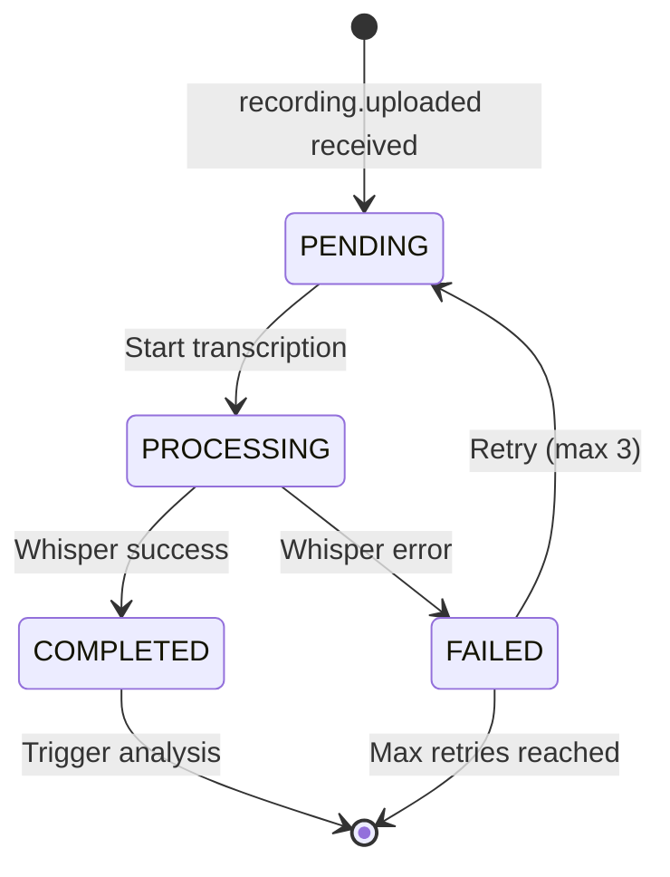
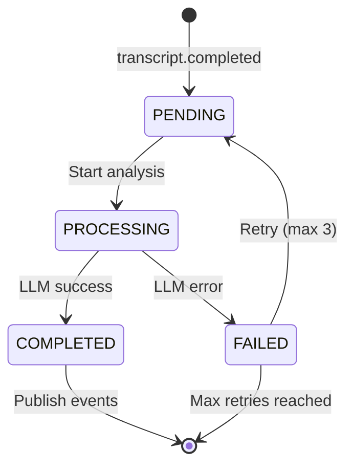

# Feedback Service - Diagrammes

## Diagramme ERD

## Diagramme de Séquence - Pipeline de Feedback

## Diagramme de Séquence - Consultation Feedback

## Diagramme d'Architecture

## Diagramme d'État - Transcript

## Diagramme d'État - Feedback

