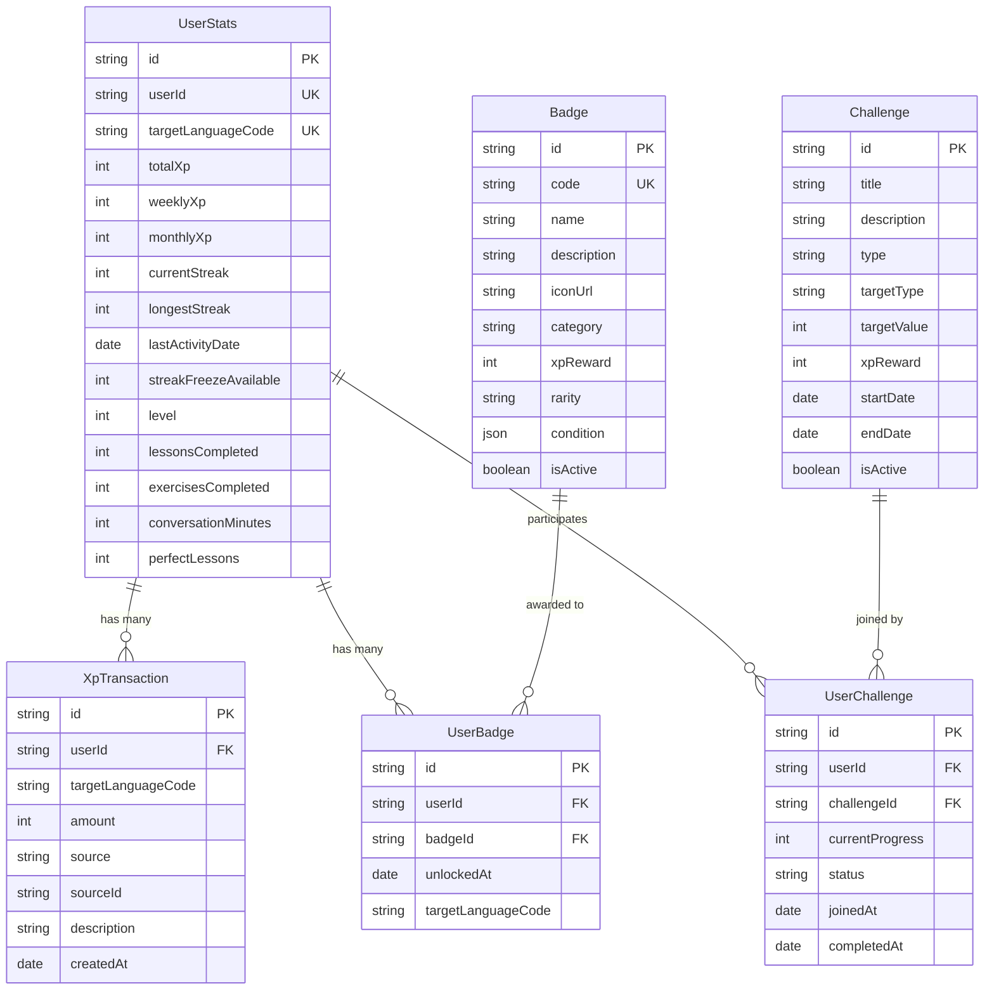
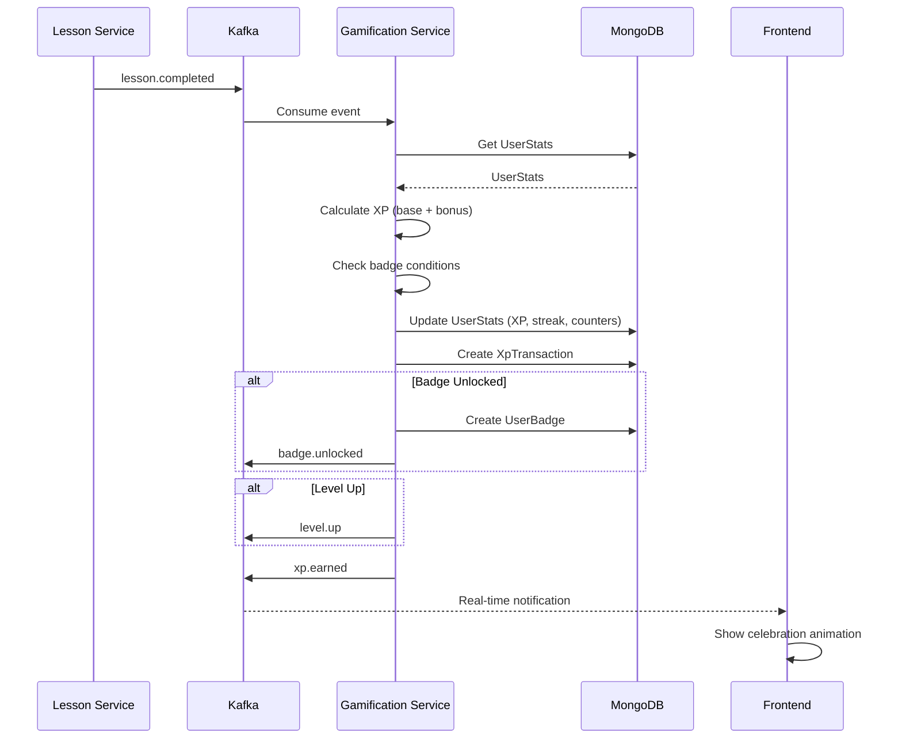
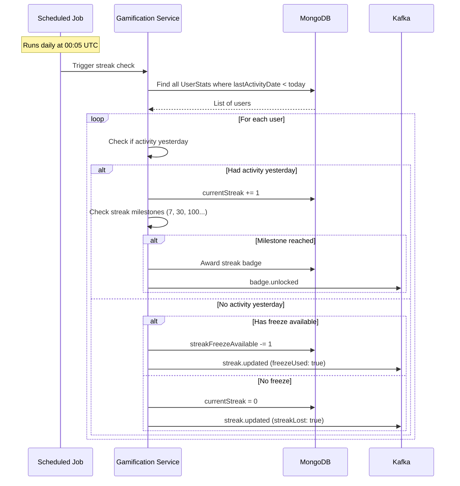
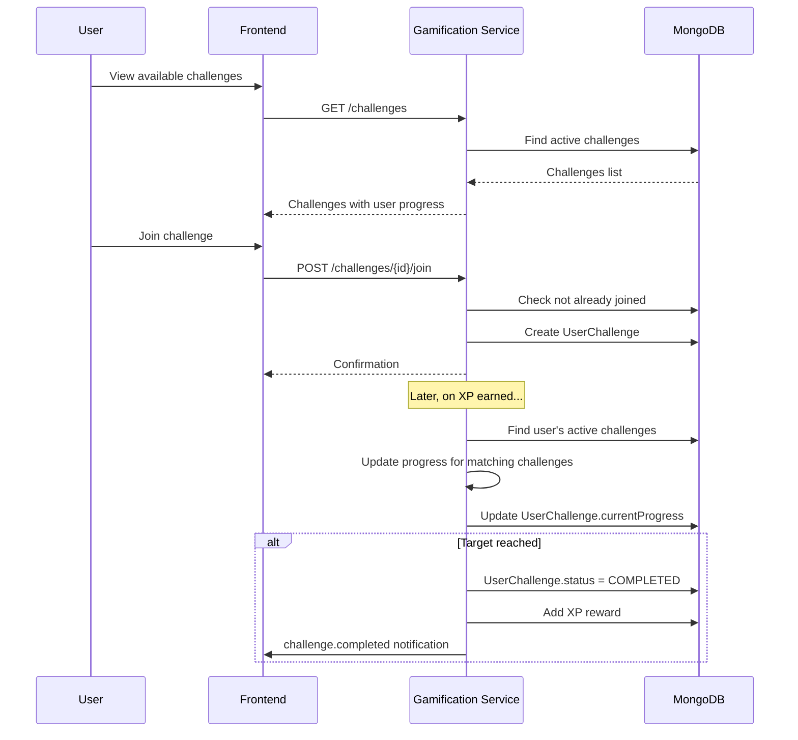

# Gamification Service - Diagrammes

## Diagramme de Classes (ERD)



## Flux d'Attribution d'XP



## Gestion du Streak (Job Nocturne)



## Leaderboard Architecture

```mermaid
flowchart TB
    subgraph "Data Sources"
        US[(UserStats<br/>MongoDB)]
    end

    subgraph "Leaderboard Service"
        LB[Leaderboard<br/>Calculator]
        CACHE[Leaderboard<br/>Cache]
    end

    subgraph "Types"
        W[Weekly<br/>Reset Monday]
        M[Monthly<br/>Reset 1st]
        G[Global<br/>All time]
    end

    US --> LB
    LB --> W
    LB --> M
    LB --> G
    
    W --> CACHE
    M --> CACHE
    G --> CACHE

    subgraph "API"
        API[GET /leaderboard]
    end

    CACHE --> API

    Note1[Cache TTL: 5 min]
    CACHE --- Note1
```

## Flux de Participation à un Défi


