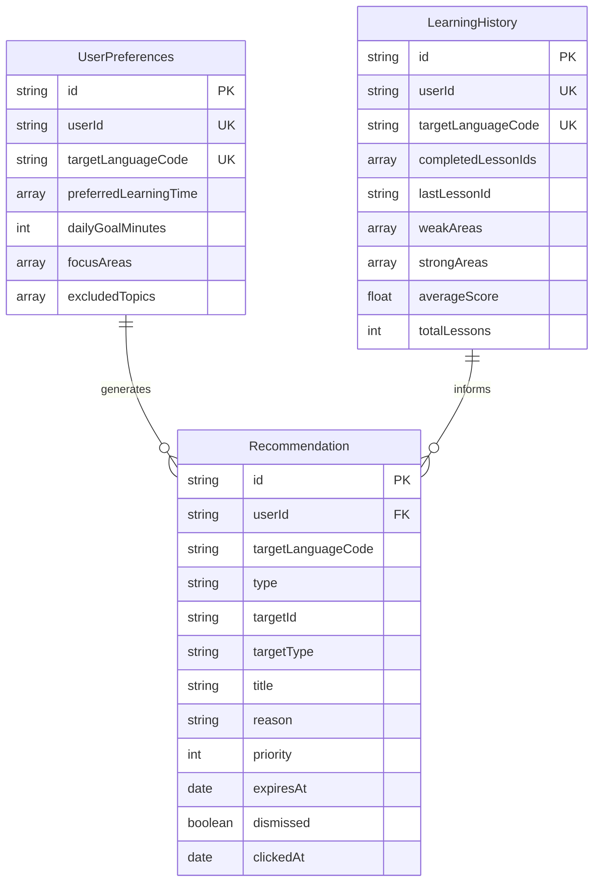
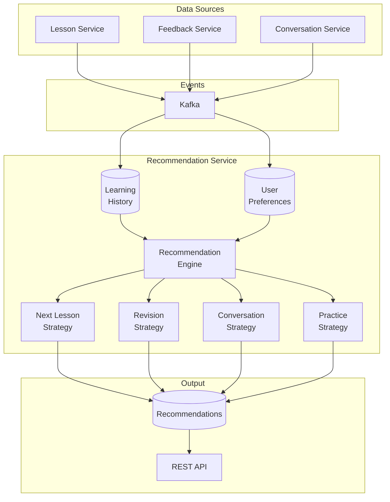
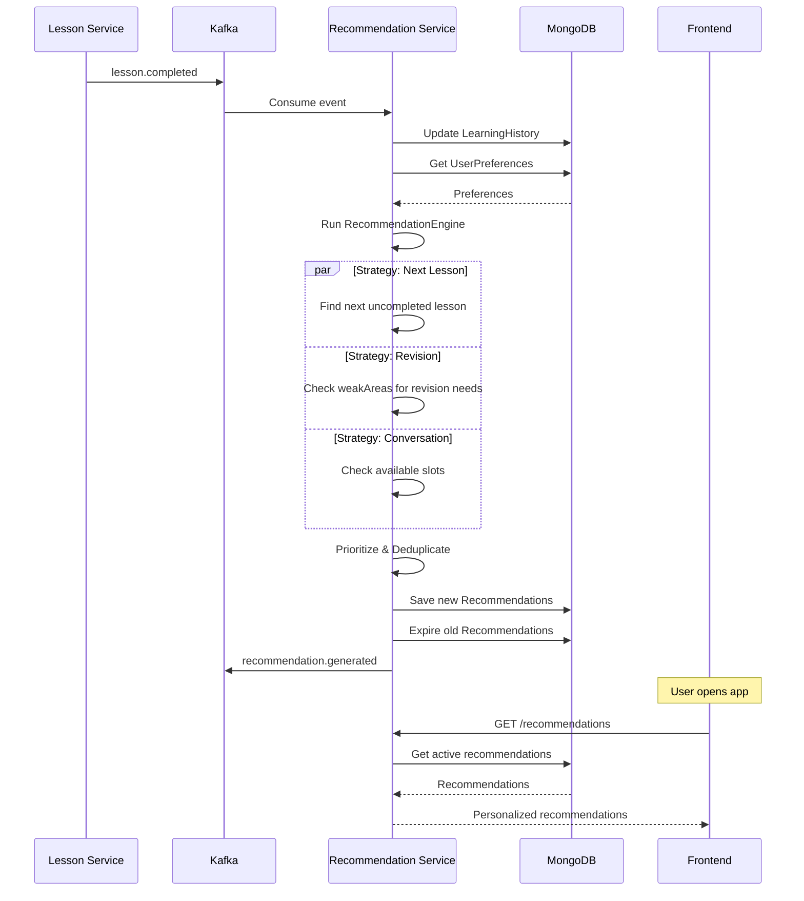
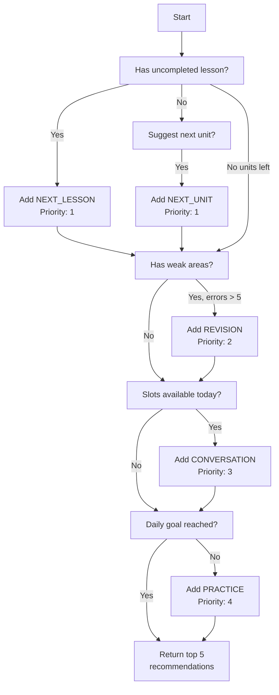
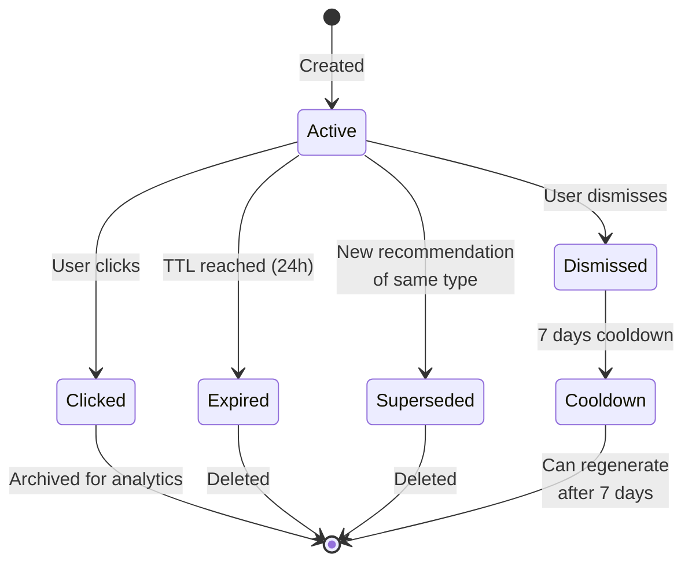

# Recommendation Service - Diagrammes

## Diagramme de Classes (ERD)

## Architecture du Moteur de Recommandation

## Flux de Génération de Recommandations

## Algorithme de Priorisation

## Cycle de Vie d'une Recommandation

