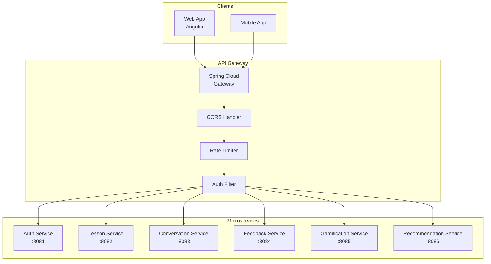
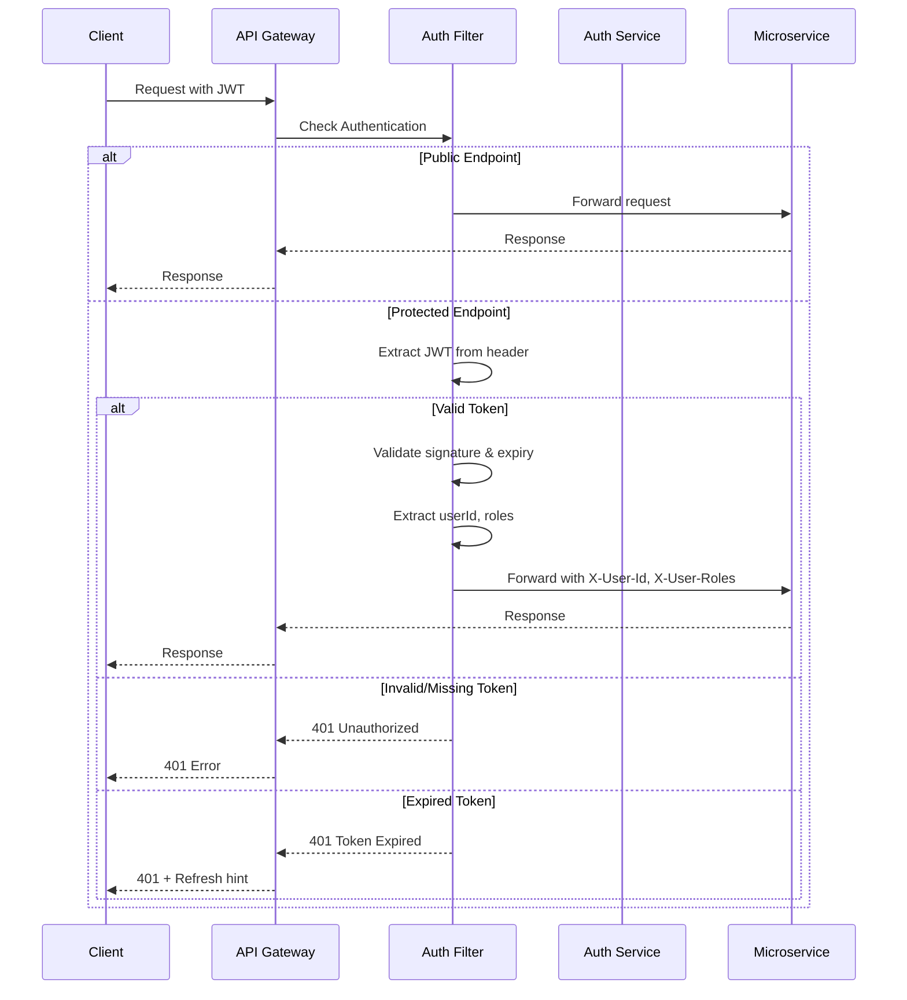
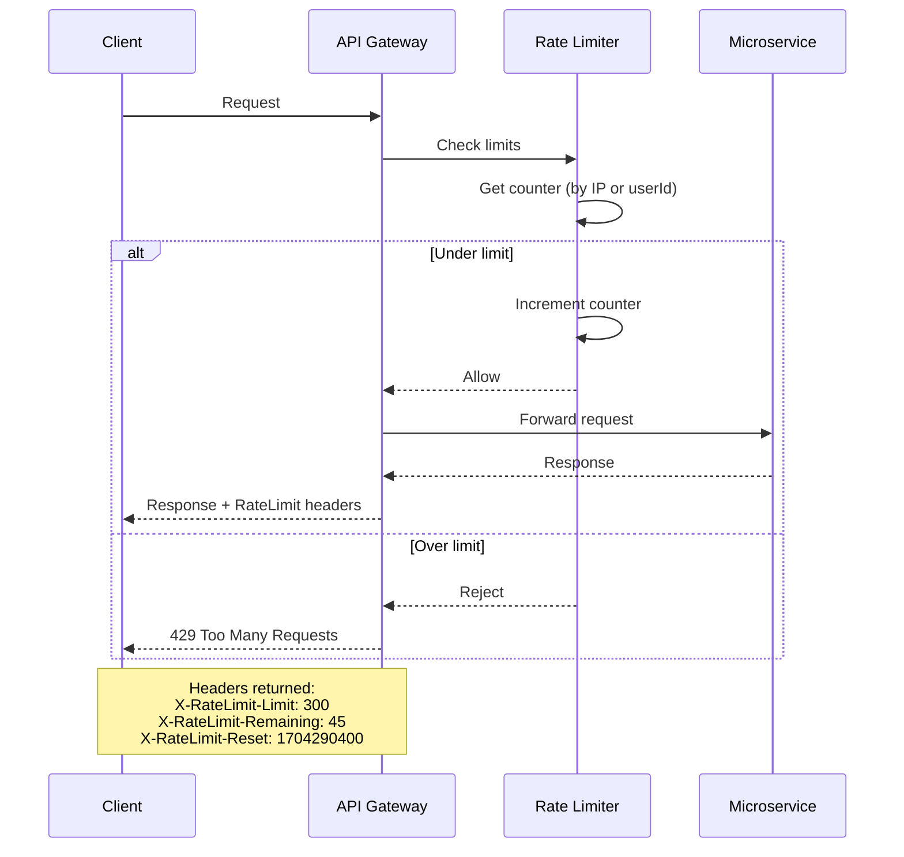
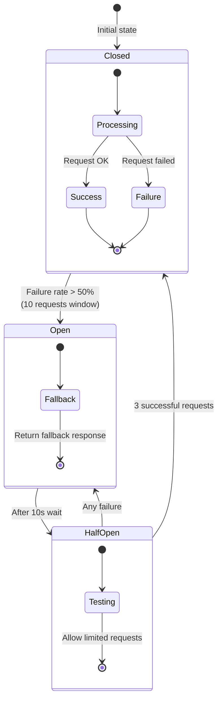
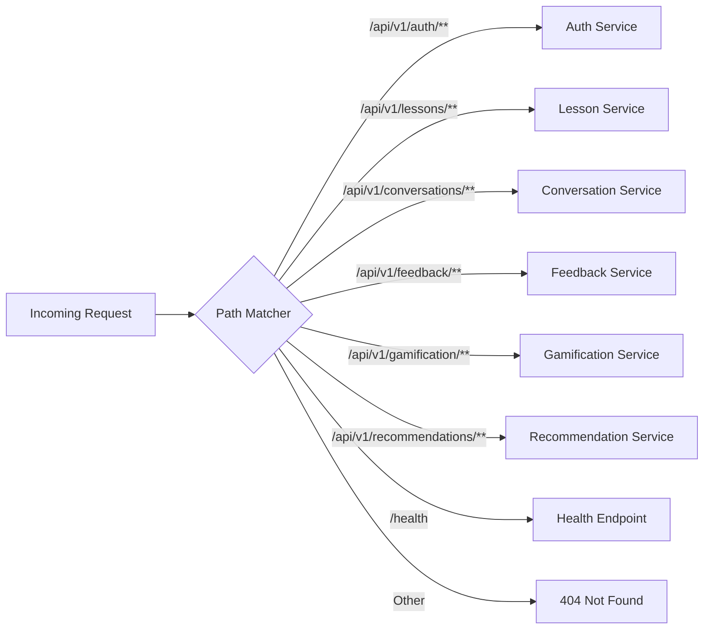
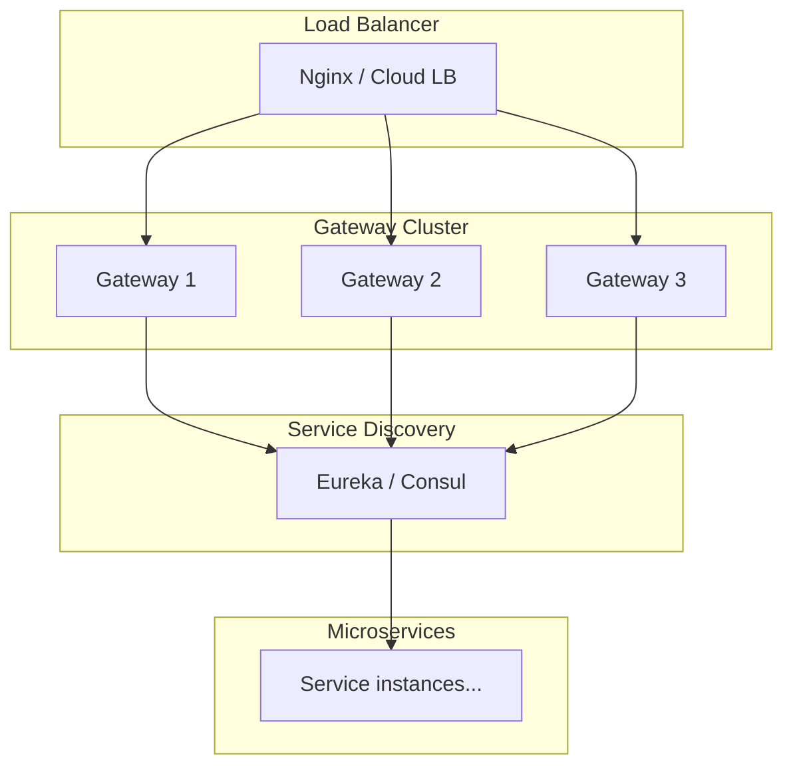

# API Gateway - Diagrammes

## Architecture Globale

```mermaid
flowchart TB
    subgraph "Clients"
        WEB[Web App<br/>Angular]
        MOB[Mobile App]
    end

    subgraph "API Gateway"
        GW[Spring Cloud<br/>Gateway]
        AUTH_F[Auth Filter]
        RATE[Rate Limiter]
        CORS[CORS Handler]
    end

    subgraph "Microservices"
        AS[Auth Service<br/>:8081]
        LS[Lesson Service<br/>:8082]
        CS[Conversation Service<br/>:8083]
        FS[Feedback Service<br/>:8084]
        GS[Gamification Service<br/>:8085]
        RS[Recommendation Service<br/>:8086]
    end

    WEB --> GW
    MOB --> GW
    
    GW --> CORS
    CORS --> RATE
    RATE --> AUTH_F
    
    AUTH_F --> AS
    AUTH_F --> LS
    AUTH_F --> CS
    AUTH_F --> FS
    AUTH_F --> GS
    AUTH_F --> RS
```

## Flux d'Authentification

```mermaid
sequenceDiagram
    participant C as Client
    participant GW as API Gateway
    participant AF as Auth Filter
    participant AS as Auth Service
    participant MS as Microservice

    C->>GW: Request with JWT
    GW->>AF: Check Authentication
    
    alt Public Endpoint
        AF->>MS: Forward request
        MS-->>GW: Response
        GW-->>C: Response
    else Protected Endpoint
        AF->>AF: Extract JWT from header
        
        alt Valid Token
            AF->>AF: Validate signature & expiry
            AF->>AF: Extract userId, roles
            AF->>MS: Forward with X-User-Id, X-User-Roles
            MS-->>GW: Response
            GW-->>C: Response
        else Invalid/Missing Token
            AF-->>GW: 401 Unauthorized
            GW-->>C: 401 Error
        else Expired Token
            AF-->>GW: 401 Token Expired
            GW-->>C: 401 + Refresh hint
        end
    end
```

## Flux de Rate Limiting

```mermaid
sequenceDiagram
    participant C as Client
    participant GW as API Gateway
    participant RL as Rate Limiter
    participant MS as Microservice

    C->>GW: Request
    GW->>RL: Check limits
    
    RL->>RL: Get counter (by IP or userId)
    
    alt Under limit
        RL->>RL: Increment counter
        RL-->>GW: Allow
        GW->>MS: Forward request
        MS-->>GW: Response
        GW-->>C: Response + RateLimit headers
    else Over limit
        RL-->>GW: Reject
        GW-->>C: 429 Too Many Requests
    end

    Note over C,GW: Headers returned:<br/>X-RateLimit-Limit: 300<br/>X-RateLimit-Remaining: 45<br/>X-RateLimit-Reset: 1704290400
```

## Circuit Breaker Pattern

```mermaid
stateDiagram-v2
    [*] --> Closed: Initial state
    
    Closed --> Open: Failure rate > 50%<br/>(10 requests window)
    Open --> HalfOpen: After 10s wait
    HalfOpen --> Closed: 3 successful requests
    HalfOpen --> Open: Any failure
    
    state Closed {
        [*] --> Processing
        Processing --> Success: Request OK
        Processing --> Failure: Request failed
        Success --> [*]
        Failure --> [*]
    }
    
    state Open {
        [*] --> Fallback
        Fallback --> [*]: Return fallback response
    }
    
    state HalfOpen {
        [*] --> Testing
        Testing --> [*]: Allow limited requests
    }
```

## Routage des Requêtes

```mermaid
flowchart LR
    REQ[Incoming Request]
    
    REQ --> MATCH{Path Matcher}
    
    MATCH -->|/api/v1/auth/**| AS[Auth Service]
    MATCH -->|/api/v1/lessons/**| LS[Lesson Service]
    MATCH -->|/api/v1/conversations/**| CS[Conversation Service]
    MATCH -->|/api/v1/feedback/**| FS[Feedback Service]
    MATCH -->|/api/v1/gamification/**| GS[Gamification Service]
    MATCH -->|/api/v1/recommendations/**| RS[Recommendation Service]
    MATCH -->|/health| HEALTH[Health Endpoint]
    MATCH -->|Other| E404[404 Not Found]
```

## Architecture de Déploiement

```mermaid
flowchart TB
    subgraph "Load Balancer"
        LB[Nginx / Cloud LB]
    end

    subgraph "Gateway Cluster"
        GW1[Gateway 1]
        GW2[Gateway 2]
        GW3[Gateway 3]
    end

    subgraph "Service Discovery"
        SD[Eureka / Consul]
    end

    subgraph "Microservices"
        MS1[Service instances...]
    end

    LB --> GW1
    LB --> GW2
    LB --> GW3
    
    GW1 --> SD
    GW2 --> SD
    GW3 --> SD
    
    SD --> MS1
```
