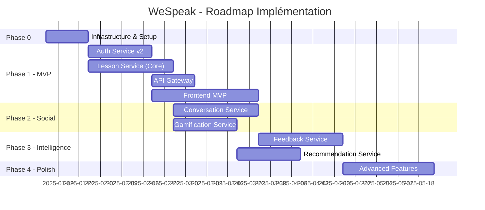

# WeSpeak - Plan d'Implémentation Détaillé

## 🎯 Vision du Plan

Ce plan d'implémentation suit une approche **itérative et incrémentale**, permettant de livrer de la valeur à chaque phase tout en construisant progressivement la plateforme complète.

**Principes directeurs** :
- ✅ **MVP First** : Livrer une version utilisable rapidement
- ✅ **Value-Driven** : Chaque phase apporte de la valeur utilisateur
- ✅ **Risk Mitigation** : Tester les composants critiques tôt (WebRTC, IA)
- ✅ **Dependencies First** : Construire les fondations avant les features avancées
- ✅ **Parallel Development** : Services indépendants peuvent être développés en parallèle

---

## 📊 Vue d'Ensemble des Phases

**Estimation totale** : ~6 mois (avec équipe de 3-4 développeurs fullstack)

---

## 🏗️ Phase 0 : Infrastructure & Setup (2 semaines)

### Objectif
Préparer l'environnement technique et les outils de développement.

### Livrables

#### 1. Infrastructure Cloud
**Tâches** :
- [ ] Créer organisation Cloud (AWS/GCP/Azure)
- [ ] Setup Kubernetes cluster (dev, staging, prod)
- [ ] Configurer MongoDB Atlas (clusters dev/prod)
- [ ] Setup Redis Cluster (Elasticache/MemoryStore)
- [ ] Configurer Kafka (Confluent Cloud ou MSK)
- [ ] Setup S3 bucket (ou équivalent) pour stockage médias

**Estimation** : 3 jours

#### 2. Keycloak Deployment
**Tâches** :
- [ ] Déployer Keycloak (container ou managed)
- [ ] Créer Realm "wespeak"
- [ ] Configurer OAuth2 providers (Google, Facebook)
- [ ] Setup clients (web-app, mobile-app)
- [ ] Configurer event listener vers Kafka
- [ ] Personnaliser login pages (branding WeSpeak)

**Estimation** : 4 jours

#### 3. DevOps & CI/CD
**Tâches** :
- [ ] Setup GitHub Actions workflows
- [ ] Configurer Docker registry
- [ ] Créer Helm charts base pour services
- [ ] Setup Prometheus + Grafana
- [ ] Configurer ELK Stack (logs)
- [ ] Setup Jaeger (tracing)

**Estimation** : 4 jours

#### 4. Monorepo Structure
**Tâches** :
- [ ] Créer organisation GitHub we-speak-org
- [ ] Setup monorepo ou multi-repos strategy
- [ ] Configurer shared libraries (DTOs, utils)
- [ ] Setup code quality tools (SonarQube, ESLint)
- [ ] Documenter conventions (commit, branch, PR)

**Estimation** : 2 jours

**🎯 Critères de succès** :
- Infrastructure accessible et opérationnelle
- Keycloak fonctionnel avec login Google
- Pipeline CI/CD exécute un "Hello World" service
- Monitoring dashboards disponibles

---

## 🚀 Phase 1 : MVP - Learning Platform (5 semaines)

### Objectif
Livrer une plateforme d'apprentissage fonctionnelle permettant aux utilisateurs de suivre des leçons et progresser.

### User Stories Principales

**US-1.1** : En tant qu'apprenant, je peux créer mon compte via Google et définir ma langue cible  
**US-1.2** : En tant qu'apprenant, je peux accéder à un curriculum de leçons adaptées à mon niveau  
**US-1.3** : En tant qu'apprenant, je peux compléter une leçon et voir ma progression  
**US-1.4** : En tant qu'apprenant, je peux gagner des XP et débloquer de nouvelles leçons  

### Services à Développer

#### 1. Auth Service v2 (3 semaines)

**Sprint 1 : Foundation (1 semaine)**
- [ ] Setup Spring Boot project + MongoDB
- [ ] Implémenter Keycloak event listener (Kafka consumer)
- [ ] Créer collections MongoDB (user_profiles, learning_profiles)
- [ ] Endpoint POST /api/learning-profiles (création profil)
- [ ] Tests unitaires + intégration

**Sprint 2 : CRUD & Credits (1 semaine)**
- [ ] Endpoints CRUD profils utilisateurs
- [ ] Système de crédits (conversations, AI minutes)
- [ ] Endpoint GET /api/credits
- [ ] Endpoint POST /api/credits/consume (internal)
- [ ] Publier événements Kafka (user.registered, learning_profile.created)

**Sprint 3 : Polish & Deployment (1 semaine)**
- [ ] Gestion quotas Free/Premium
- [ ] Reset automatique crédits hebdomadaires (cron job)
- [ ] Documentation OpenAPI
- [ ] Déploiement staging
- [ ] Tests de charge (100 users simultanés)

**Estimation** : 3 semaines (1 dev backend)

---

#### 2. Lesson Service - Core (4 semaines)

**Sprint 1 : Data Model & Seed (1 semaine)**
- [ ] Setup Spring Boot project + MongoDB
- [ ] Collections : courses, units, lessons, exercises, skills
- [ ] Script seed data : 1 course (English A1-A2, 20 lessons)
- [ ] Indexes MongoDB
- [ ] Tests unitaires modèles

**Sprint 2 : Read APIs (1 semaine)**
- [ ] GET /api/courses (avec filtres)
- [ ] GET /api/courses/:id/units
- [ ] GET /api/lessons/:id
- [ ] GET /api/lessons/:id/exercises
- [ ] GET /api/skills (par langue)
- [ ] Cache Redis pour métadonnées

**Sprint 3 : Progression Engine (1 semaine)**
- [ ] Collection lesson_progress (MongoDB)
- [ ] POST /api/lessons/:id/start
- [ ] POST /api/exercises/:id/submit
- [ ] POST /api/lessons/:id/complete
- [ ] Algorithme déblocage séquentiel
- [ ] Publier événements Kafka (lesson.completed, skill.acquired)

**Sprint 4 : Gamification Integration (1 semaine)**
- [ ] Calcul XP par leçon (score-based multipliers)
- [ ] Skills mastery tracking
- [ ] Système de révisions (spaced repetition logic)
- [ ] Tests d'intégration complets
- [ ] Déploiement staging

**Estimation** : 4 semaines (1 dev backend)

---

#### 3. API Gateway (2 semaines)

**Sprint 1 : Core Setup (1 semaine)**
- [ ] Setup Spring Cloud Gateway project
- [ ] Configuration routes vers auth-service + lesson-service
- [ ] Intégration Keycloak (JWT validation)
- [ ] CORS configuration
- [ ] Health checks

**Sprint 2 : Advanced Features (1 semaine)**
- [ ] Rate limiting (Redis Token Bucket)
- [ ] Circuit breaker (Resilience4j)
- [ ] Request enrichment (X-User-Id headers)
- [ ] Logging + tracing
- [ ] Déploiement + tests load

**Estimation** : 2 semaines (1 dev backend)

---

#### 4. Frontend MVP (5 semaines)

**Sprint 1 : Setup & Auth (1 semaine)**
- [ ] Setup Angular 17 + Angular Universal (SSR)
- [ ] Intégration Keycloak (OAuth2 flow)
- [ ] Login page + callback handler
- [ ] Guards (auth, role-based)
- [ ] Interceptors (JWT injection)

**Sprint 2 : Onboarding Flow (1 semaine)**
- [ ] Page sélection langue cible + native
- [ ] Page sélection niveau (A1-C2)
- [ ] Page définition objectifs
- [ ] Appels API auth-service (create learning_profile)
- [ ] Navigation vers dashboard

**Sprint 3 : Learning Dashboard (1 semaine)**
- [ ] Dashboard layout (sidebar, header)
- [ ] Affichage curriculum (courses → units → lessons)
- [ ] Indicateurs progression (XP, niveau, lessons completed)
- [ ] Card lesson (locked/unlocked states)

**Sprint 4 : Lesson Player (1 semaine)**
- [ ] Page lesson detail
- [ ] Composants exercises (MCQ, Fill Gap, Listen & Repeat)
- [ ] Soumission réponses + feedback immédiat
- [ ] Progression bar dans leçon
- [ ] Animation completion + XP earned

**Sprint 5 : Polish & i18n (1 semaine)**
- [ ] Internationalisation complète (@angular/localize)
- [ ] Gestion erreurs + fallbacks
- [ ] Loading states + skeletons
- [ ] Responsive design (mobile-first)
- [ ] Tests E2E (Cypress)

**Estimation** : 5 semaines (1 dev frontend + 1 designer UI/UX)

---

### 🎯 Critères de Succès Phase 1 (MVP)

**Fonctionnel** :
- ✅ User peut s'inscrire via Google
- ✅ User peut créer un learning profile (EN, FR, ES)
- ✅ User voit un curriculum de 20 leçons niveau A1-A2
- ✅ User peut compléter une leçon (3-5 exercices)
- ✅ User gagne des XP et débloque leçon suivante
- ✅ User voit sa progression (lessons completed, XP)

**Technique** :
- ✅ Services déployés sur Kubernetes (staging)
- ✅ CI/CD fonctionnel (deploy automatique sur merge)
- ✅ Monitoring opérationnel (métriques, logs, traces)
- ✅ Tests automatisés (unitaires + intégration)

**Business** :
- ✅ Demo utilisable pour investisseurs/beta-testers
- ✅ Feedback collecté sur UX/UI

---

## 💬 Phase 2 : Social Learning - Conversations (6 semaines)

### Objectif
Ajouter la fonctionnalité de conversations 1v1 en temps réel.

### User Stories

**US-2.1** : En tant qu'apprenant, je peux rechercher un partenaire de conversation pour pratiquer  
**US-2.2** : En tant qu'apprenant, je suis matché avec un partenaire de niveau compatible  
**US-2.3** : En tant qu'apprenant, je peux avoir une conversation WebRTC avec prompts guidés  
**US-2.4** : En tant qu'apprenant, ma conversation est enregistrée pour feedback futur  

### Services à Développer

#### 1. Conversation Service (4 semaines)

**Sprint 1 : Core Setup + Matching (1 semaine)**
- [ ] Setup Spring Boot WebFlux + MongoDB
- [ ] Collections : match_requests, conversation_sessions, topics
- [ ] Seed data : 20 topics (A1-B1)
- [ ] POST /api/conversations/match-request
- [ ] Algorithme matchmaking basique (Redis queue)

**Sprint 2 : WebRTC Signaling (1.5 semaines)**
- [ ] Setup Socket.io (WebSocket server)
- [ ] Gestion rooms par sessionId
- [ ] Events : offer, answer, ice_candidate
- [ ] Tests WebRTC avec 2 clients simulés

**Sprint 3 : Session Management (1 semaine)**
- [ ] POST /api/conversations/sessions/:id/join
- [ ] Prompts dynamiques (timer-based)
- [ ] Enregistrement audio (upload S3)
- [ ] POST /api/conversations/sessions/:id/end
- [ ] Publier événements Kafka (conversation.completed)

**Sprint 4 : Polish (0.5 semaine)**
- [ ] Gestion quotas Free tier (3 conversations/semaine)
- [ ] Matchmaking timeout + retry
- [ ] Documentation + déploiement

**Estimation** : 4 semaines (1 dev backend)

---

#### 2. Gamification Service (3 semaines)

**Sprint 1 : XP & Levels (1 semaine)**
- [ ] Setup Spring Boot WebFlux + PostgreSQL
- [ ] Tables : user_gamification_profiles, xp_transactions
- [ ] Kafka consumer (lesson.completed, conversation.completed)
- [ ] POST /api/gamification/xp/award (internal)
- [ ] Calcul niveaux (formule N²)

**Sprint 2 : Badges & Streaks (1 semaine)**
- [ ] Tables : badges, user_challenges
- [ ] Seed badges (first_lesson, 10_lessons, first_conversation)
- [ ] Algorithme déblocage automatique badges
- [ ] Gestion streaks quotidiennes
- [ ] POST /api/gamification/streak/freeze (Premium)

**Sprint 3 : Leaderboards (1 semaine)**
- [ ] Redis Sorted Sets (leaderboards temps réel)
- [ ] GET /api/gamification/leaderboard (global, language, level)
- [ ] Job cron : snapshots hebdomadaires (PostgreSQL)
- [ ] Défis quotidiens/hebdomadaires
- [ ] Déploiement + tests

**Estimation** : 3 semaines (1 dev backend)

---

#### 3. Frontend - Conversations (3 semaines)

**Sprint 1 : Matchmaking UI (1 semaine)**
- [ ] Page "Find Partner" (sélection topic, niveau partenaire)
- [ ] Composant waiting room (animation)
- [ ] WebSocket connection (match notifications)
- [ ] Gestion timeouts + retry

**Sprint 2 : Video Chat (1.5 semaines)**
- [ ] Composant WebRTC video chat
- [ ] Affichage prompts conversation
- [ ] Recording indicator
- [ ] Bouton "End Conversation"
- [ ] Tests WebRTC multi-browsers

**Sprint 3 : Post-Conversation (0.5 semaine)**
- [ ] Page feedback (rate partner, comments)
- [ ] Affichage XP earned
- [ ] Liste historique conversations
- [ ] Badges unlocked notifications

**Estimation** : 3 semaines (1 dev frontend)

---

### 🎯 Critères de Succès Phase 2

**Fonctionnel** :
- ✅ User peut trouver un partenaire en < 60 secondes
- ✅ Conversation WebRTC stable (audio + vidéo)
- ✅ Prompts affichés toutes les 3-5 minutes
- ✅ Enregistrement sauvegardé sur S3
- ✅ XP attribué après conversation
- ✅ Badges débloqués automatiquement

**Technique** :
- ✅ WebRTC fonctionne avec NAT traversal (STUN/TURN)
- ✅ Leaderboards mis à jour en temps réel
- ✅ Kafka events traités sans lag

---

## 🤖 Phase 3 : AI Intelligence (7 semaines)

### Objectif
Ajouter l'analyse IA des performances et les recommandations personnalisées.

### User Stories

**US-3.1** : En tant qu'apprenant, je reçois un rapport détaillé après ma conversation avec scores et erreurs  
**US-3.2** : En tant qu'apprenant, je reçois des recommandations de leçons basées sur mes lacunes  
**US-3.3** : En tant qu'apprenant, je vois mon évolution dans le temps (graphiques)  

### Services à Développer

#### 1. Feedback Service (4 semaines)

**Sprint 1 : STT Pipeline (1.5 semaines)**
- [ ] Setup Quarkus + MongoDB
- [ ] Intégration OpenAI Whisper API
- [ ] Kafka consumer (conversation.completed)
- [ ] Download audio S3 → Transcription
- [ ] Collection conversation_transcripts

**Sprint 2 : NLP Analysis (1.5 semaines)**
- [ ] Intégration LanguageTool (grammar check)
- [ ] Analyse vocabulaire (richesse lexicale)
- [ ] Détection erreurs + catégorisation
- [ ] Collection error_instances
- [ ] Calcul scores (grammar, vocabulary, fluency)

**Sprint 3 : Report Generation (1 semaine)**
- [ ] Intégration GPT-4 (recommendations)
- [ ] Génération rapport complet
- [ ] Collection feedback_reports
- [ ] GET /api/feedback/reports/:sessionId
- [ ] Publier événements (feedback_report.generated)

**Estimation** : 4 semaines (1 dev backend + accès APIs IA)

---

#### 2. Recommendation Service (3 semaines)

**Sprint 1 : Profile Builder (1 semaine)**
- [ ] Setup Spring Boot + MongoDB
- [ ] Collection learner_profiles (agrégation données)
- [ ] Kafka consumers (lesson, conversation, feedback events)
- [ ] Update automatique profils apprenants

**Sprint 2 : Recommendation Engine (1.5 semaines)**
- [ ] Algorithme scoring leçons (relevance, difficulty, engagement)
- [ ] GET /api/recommendations/next-lesson
- [ ] GET /api/recommendations/conversation-topics
- [ ] Skill gaps detection
- [ ] Cache Redis (recommendations pré-calculées)

**Sprint 3 : Learning Path (0.5 semaine)**
- [ ] GET /api/recommendations/learning-path
- [ ] Next best action (lesson vs conversation)
- [ ] Tests + déploiement

**Estimation** : 3 semaines (1 dev backend)

---

#### 3. Frontend - AI Features (2 semaines)

**Sprint 1 : Feedback Reports (1 semaine)**
- [ ] Page rapport conversation (scores, erreurs)
- [ ] Graphiques évolution (Chart.js)
- [ ] Liste erreurs avec explications
- [ ] Recommandations leçons

**Sprint 2 : Dashboard Intelligence (1 semaine)**
- [ ] Widget "Next Best Action"
- [ ] Widget skill gaps
- [ ] Graphiques progression
- [ ] Notifications badges/achievements

**Estimation** : 2 semaines (1 dev frontend)

---

### 🎯 Critères de Succès Phase 3

**Fonctionnel** :
- ✅ Rapport feedback disponible < 5 minutes après conversation
- ✅ Erreurs détectées avec reformulations
- ✅ Recommandations pertinentes (> 70% CTR)
- ✅ Dashboard affiche prochaine action optimale

**Technique** :
- ✅ Pipeline STT → NLP traité en < 300 secondes
- ✅ Coûts API IA maîtrisés (cache, batching)
- ✅ Recommandations temps réel (< 500ms)

---

## 🎨 Phase 4 : Polish & Advanced Features (4 semaines)

### Objectif
Affiner l'expérience utilisateur et ajouter des fonctionnalités premium.

### Features

**Sprint 1 : Premium Features (1 semaine)**
- [ ] Système d'abonnement (intégration Stripe)
- [ ] Unlock premium lessons
- [ ] Conversations illimitées
- [ ] Advanced analytics

**Sprint 2 : Social Features (1 semaine)**
- [ ] Système d'amis
- [ ] Leaderboards friends
- [ ] Partage achievements (social media)

**Sprint 3 : Content Management (1 semaine)**
- [ ] Admin panel (gestion leçons, topics)
- [ ] Bulk upload exercises (CSV)
- [ ] A/B testing recommendations

**Sprint 4 : Mobile App (1 semaine)**
- [ ] Setup React Native (ou PWA)
- [ ] Login + core features
- [ ] Push notifications

**Estimation** : 4 semaines (équipe complète)

---

## 📈 Métriques de Succès Globales

### Métriques Produit
- **Activation** : 70% users complètent onboarding
- **Engagement** : 40% DAU/MAU (Daily/Monthly Active Users)
- **Retention** : 60% retention J7, 30% retention J30
- **Conversion** : 5% Free → Premium dans 30 jours

### Métriques Techniques
- **Performance** : P95 latency < 500ms
- **Disponibilité** : 99.5% uptime
- **Erreurs** : < 1% error rate
- **Scalabilité** : Support 10,000 users simultanés

---

## 👥 Équipe Recommandée

**Core Team** (Phase 1-3) :
- 2 × Backend Developers (Java/Spring Boot/Quarkus)
- 1 × Frontend Developer (Angular)
- 1 × UI/UX Designer
- 1 × DevOps Engineer (part-time)
- 1 × Product Owner (vous !)

**Phase 4** :
- +1 Mobile Developer (React Native)
- +1 Data Analyst

---

## 🎯 Prochaines Actions Immédiates

### Semaine 1-2 : Kick-off
1. **Recruter l'équipe technique**
2. **Setup infrastructure cloud** (Phase 0)
3. **Déployer Keycloak + MongoDB Atlas**
4. **Créer backlog détaillé** (User Stories, Tasks)
5. **Setup outils** (Jira, Slack, GitHub)

### Semaine 3 : Sprint Planning
6. **Prioriser features MVP**
7. **Définir Definition of Done**
8. **Planifier Sprint 1** (Auth Service v2)

---

**🚀 Ready to build WeSpeak ?**

Ce plan peut être ajusté selon vos contraintes (budget, équipe, timeline). L'important est de livrer un MVP fonctionnel rapidement pour valider le product-market fit avant d'investir dans les features avancées.

**Questions à valider** :
- Quel est votre budget/timeline réaliste ?
- Avez-vous déjà une équipe ou besoin de recruter ?
- Préférez-vous développer le mobile après le MVP web ?
- Quelles intégrations IA prioriser (Whisper vs alternatives moins coûteuses) ?
