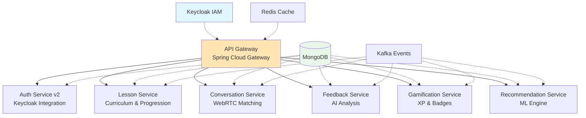
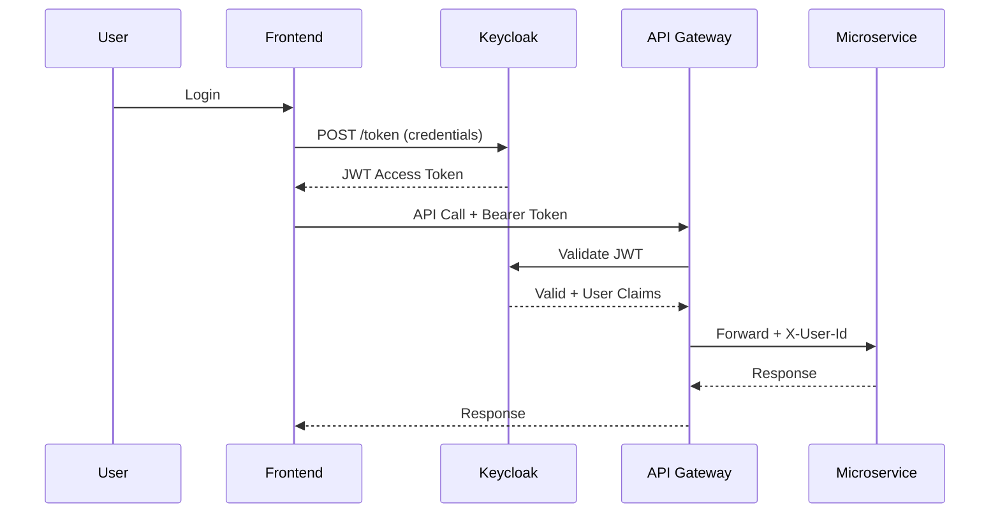

# WeSpeak - Spécifications Techniques Complètes

## 📚 Vue d'ensemble

Ce repository contient l'ensemble des spécifications techniques détaillées de la plateforme **WeSpeak**, une plateforme innovante d'apprentissage des langues combinant :

- 🎓 **Structure pédagogique progressive** (inspiration Duolingo)
- 💬 **Conversations réelles 1v1** via WebRTC (inspiration SpeakDuo)
- 🤖 **Coaching IA personnalisé** (STT, NLP, LLM)
- 🏆 **Gamification immersive** (XP, badges, streaks, défis)

---

## 🏗️ Architecture Technique

### Stack Unifiée

- **Frontend** : Angular 17+ avec SSR
- **Backend** : Java 21 (Spring Boot 3.2 / Quarkus 3.x)
- **Base de données** : **MongoDB** (unified stack)
- **IAM** : **Keycloak** (OAuth2/OIDC)
- **Cache** : Redis
- **Event Streaming** : Kafka
- **Storage** : S3-compatible

### Microservices



---

## 📋 Services Détaillés

### 1. [API Gateway](./services/07-api-gateway.md) 
**Point d'entrée unique de la plateforme**

**Responsabilités** :
- Routing intelligent vers microservices
- Authentification JWT (validation via Keycloak)
- Rate limiting par tier (Free/Premium)
- Circuit breaker (Resilience4j)
- Agrégation de réponses (BFF pattern)
- CORS, logging, monitoring

**Technologies** : Spring Cloud Gateway, Redis, Consul/Eureka

---

### 2. [Auth Service v2](./services/01-auth-service-v2.md)
**Gestion profils utilisateurs et crédits** (Keycloak pour authentification)

**Scope réduit** :
- ✅ Profils utilisateurs WeSpeak (avatar, préférences)
- ✅ Learning Profiles multi-langues
- ✅ Gestion crédits/quotas (conversations, minutes IA)
- ✅ Synchronisation événements Keycloak

**Délégué à Keycloak** :
- ❌ Login/Register/Logout → Keycloak
- ❌ Tokens JWT → Keycloak
- ❌ OAuth2 (Google, Facebook) → Keycloak
- ❌ Password management → Keycloak

**Technologies** : Spring Boot, MongoDB, Kafka

---

### 3. [Lesson Service](./services/02-lesson-service.md)
**Curriculum pédagogique et progression**

**Responsabilités** :
- Gestion courses, units, lessons, exercises
- Système de progression avec déblocage séquentiel
- Skills tracking (mastery levels)
- Révisions espacées (spaced repetition)
- Attribution XP par leçon

**Algorithmes** :
- Déblocage conditionnel (score ≥ 70%)
- Calcul XP avec multiplicateurs (streak, score)
- Spaced repetition (Ebbinghaus curve)

**Technologies** : Spring Boot, MongoDB, Redis Cache

---

### 4. [Conversation Service](./services/03-conversation-service.md)
**Matchmaking et sessions WebRTC**

**Responsabilités** :
- Algorithme de matchmaking intelligent
- Gestion sessions 1v1 (WebRTC signaling)
- Topics de conversation par niveau
- Enregistrement audio automatique
- Prompts dynamiques pendant conversation

**Algorithme de matching** :
- Même langue cible (obligatoire)
- Niveau compatible (± 1 niveau)
- Topic identique
- Score compatibilité (historique, préférences)
- Élargissement progressif si timeout

**Technologies** : Spring Boot WebFlux, MongoDB, Redis Queue, Socket.io

---

### 5. [Feedback Service](./services/04-feedback-service.md)
**Analyse IA des performances orales**

**Pipeline de traitement** :
```
Audio S3 → STT (Whisper) → NLP Analysis → Error Detection → 
Score Calculation → LLM Recommendations → Report Generation
```

**Analyses** :
- **Grammar** : LanguageTool (détection erreurs)
- **Vocabulary** : Richesse lexicale, niveau CEFR
- **Fluency** : WPM, pauses, filler words
- **Pronunciation** : Comparaison phonétique
- **Comprehension** : Pertinence réponses aux prompts

**Scores calculés** : 0-100 par dimension (weighted average)

**Technologies** : Quarkus, MongoDB, OpenAI Whisper, GPT-4

---

### 6. [Gamification Service](./services/05-gamification-service.md)
**Système XP, badges, streaks, leaderboards**

**Responsabilités** :
- Attribution XP automatique (leçons, conversations)
- Calcul niveaux (formule : XP = 100 × N²)
- Gestion streaks quotidiennes + freeze
- Déblocage badges automatique (criteria matching)
- Leaderboards temps réel (Redis Sorted Sets)
- Défis quotidiens/hebdomadaires

**Système XP** :
- Leçon : 50-150 XP (selon score)
- Conversation : 100-200 XP (selon durée)
- Badge : 50-500 XP (selon rareté)
- Multiplicateurs : streak bonus, premium, événements

**Technologies** : Spring Boot WebFlux, PostgreSQL, Redis, Kafka

---

### 7. [Recommendation Service](./services/06-recommendation-service.md)
**Moteur de recommandations personnalisées**

**Algorithmes** :

**Next Best Lesson** :
```
score = relevance × 0.35 + difficulty_match × 0.25 + 
        engagement_prediction × 0.20 + collaborative × 0.15 + 
        urgency × 0.05
```

**Facteurs** :
- **Relevance** : Skill gaps, error remediation
- **Difficulty Match** : Zone proximale de développement
- **Engagement** : Préférences contenu, moment optimal
- **Collaborative** : Success patterns d'apprenants similaires

**Next Best Action** : Décision leçon vs conversation
- Heuristiques basées sur balance learning/practice
- Time of day preferences
- Streak maintenance
- Skill readiness for conversations

**Technologies** : Spring Boot, MongoDB, Redis, Apache Spark (batch)

---

## 🔐 Sécurité

### Architecture Keycloak



**Avantages** :
- Standards OAuth2/OIDC
- SSO ready
- MFA out-of-the-box
- Admin UI included
- User federation (LDAP, AD)

---

## 📊 Observabilité

**Metrics** : Prometheus + Grafana
**Tracing** : Jaeger (distributed tracing)
**Logging** : ELK Stack (JSON structured logs)
**Alerting** : Prometheus Alertmanager

**Key Metrics** :
- Request latency p95/p99 par service
- Error rate 5xx
- Circuit breaker states
- Rate limit hits
- Active sessions (WebRTC)
- XP awarded per minute
- Recommendation accuracy (CTR)

---

## 🚀 Déploiement

**Infrastructure** :
- Kubernetes (Helm charts)
- Docker containers
- CI/CD : GitHub Actions
- Environments : Dev, Staging, Production

**Databases** :
- MongoDB Atlas (managed)
- Redis Cluster (Elasticache)
- Kafka Cluster (Confluent Cloud / MSK)

**Keycloak** :
- Standalone ou managed (Red Hat SSO)
- PostgreSQL backend
- Réplication multi-AZ

---

## 📖 Documentation

Chaque service dispose de :
- ✅ Architecture fonctionnelle (diagrammes Mermaid)
- ✅ Modèle de données (MongoDB schemas)
- ✅ API REST (endpoints, schemas, errors)
- ✅ Événements Kafka (formats, partitioning)
- ✅ Algorithmes métier (détails implémentation)
- ✅ Règles de validation
- ✅ Configuration (variables d'environnement)

---

## 🎯 Prochaines Étapes

1. **Setup Infrastructure** :
   - Déployer Keycloak + Realm WeSpeak
   - Configurer MongoDB Atlas
   - Setup Kafka cluster

2. **Développement par ordre** :
   - Auth Service v2 (foundation)
   - Lesson Service (content)
   - Gamification Service (engagement)
   - Conversation Service (practice)
   - Feedback Service (AI analysis)
   - Recommendation Service (intelligence)
   - API Gateway (orchestration)

3. **Intégrations** :
   - OpenAI Whisper + GPT-4
   - Stripe (payments)
   - SendGrid (emails)
   - Twilio (SMS MFA)

---

## 📞 Contact

**Product Owner AI** : WeSpeak Team
**Repository** : https://github.com/we-speak-org/wespeak-specifications
**Version** : 1.0.0
**Last Updated** : 2025-01-15

---

**Note** : Ces spécifications sont évolutives. Les retours d'implémentation permettront d'affiner l'architecture et les algorithmes.
