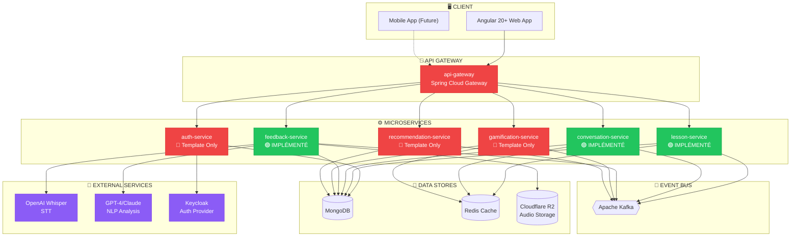
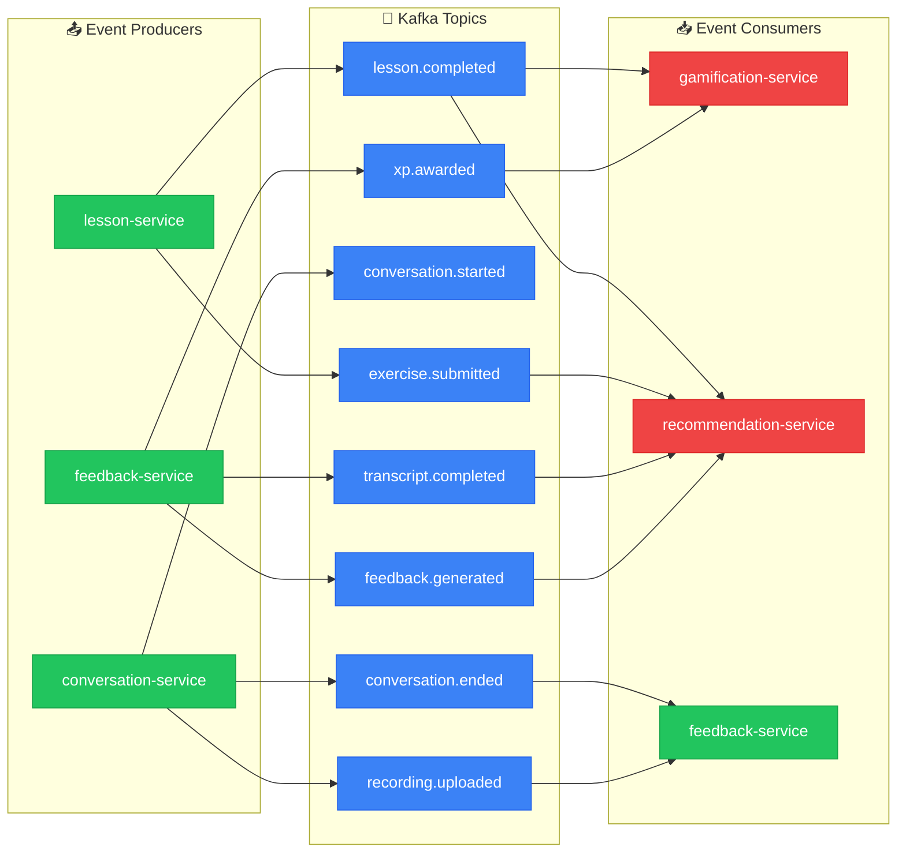
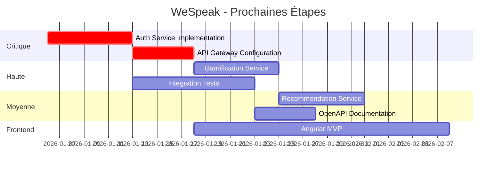

# WeSpeak - Rétrospective Projet
## Date : 6 Janvier 2026

---

## 📊 Vue d'Ensemble de l'Architecture



---

## 🎯 État d'Avancement par Service

### Légende
- 🟢 **IMPLÉMENTÉ** : Service fonctionnel avec logique métier
- 🟡 **EN COURS** : Développement actif
- 🔴 **TEMPLATE** : Structure de base uniquement (code template)

---

### 1. **auth-service** 🔴 TEMPLATE
| Aspect | État |
|--------|------|
| Structure Spring Boot | ✅ |
| MongoDB Connection | ✅ |
| Entités User/LearningProfile | ❌ |
| API CRUD Users | ❌ |
| Intégration Keycloak | ❌ |
| Kafka Events | ❌ |
| Tests | ❌ |

**Dernière activité** : 4 Jan 2026 (CI: spotless formatting)  
**Commits** : 2 commits (Initial + CI fix)  
**Fichiers Java** : 17 (tous templates)

---

### 2. **lesson-service** 🟢 IMPLÉMENTÉ
| Aspect | État |
|--------|------|
| Structure Spring Boot | ✅ |
| MongoDB Connection | ✅ |
| Entités (Course, Unit, Lesson, Exercise) | ✅ |
| User Progress Tracking | ✅ |
| API Courses/Lessons/Units | ✅ |
| Exercise Validators (6 types) | ✅ |
| Unlock System | ✅ |
| Kafka Event Publisher | ✅ |
| Seed Controller | ✅ |
| Tests | 🟡 Partiel |

**Dernière activité** : 4 Jan 2026  
**Commits** : 5+ commits (par Emergent.sh)  
**Fichiers Java** : 63 fichiers implémentés

**Fonctionnalités implémentées** :
- ✅ `CourseController` - CRUD courses
- ✅ `UnitController` - CRUD units
- ✅ `LessonController` - CRUD lessons
- ✅ `ExerciseController` - Submit exercises
- ✅ `ProgressController` - Track user progress
- ✅ `SeedController` - Data seeding
- ✅ Validators: MCQ, FillGap, Translation, Ordering, MatchPairs, ListenRepeat

---

### 3. **conversation-service** 🟢 IMPLÉMENTÉ
| Aspect | État |
|--------|------|
| Structure Spring Boot | ✅ |
| MongoDB Connection | ✅ |
| Entités (Session, Participant, TimeSlot, Registration) | ✅ |
| WebSocket/Signaling | ✅ |
| API TimeSlots | ✅ |
| API Registrations | ✅ |
| API Sessions | ✅ |
| Kafka Event Publisher | ✅ |
| Seed Controller | ✅ |

**Dernière activité** : 4 Jan 2026  
**Commits** : 5+ commits (par Emergent.sh + CI)  
**Fichiers Java** : 41 fichiers implémentés

**Fonctionnalités implémentées** :
- ✅ `TimeSlotController` - Gestion créneaux
- ✅ `RegistrationController` - Inscription sessions
- ✅ `SessionController` - Gestion sessions
- ✅ `SignalingWebSocketHandler` - WebRTC signaling
- ✅ Scheduling configuration

---

### 4. **feedback-service** 🟢 IMPLÉMENTÉ
| Aspect | État |
|--------|------|
| Structure Spring Boot | ✅ |
| MongoDB Connection | ✅ |
| Entités (Transcript, Feedback, UserStats) | ✅ |
| Cloudflare R2 Integration | ✅ |
| Transcription Service | ✅ |
| Analysis Service | ✅ |
| Stats Service | ✅ |
| API Feedback | ✅ |
| Kafka Listeners | ✅ |
| .env Configuration | ✅ |

**Dernière activité** : 5 Jan 2026 (plus récent!)  
**Commits** : 5+ commits (par Emergent.sh)  
**Fichiers Java** : 42 fichiers implémentés

**Fonctionnalités implémentées** :
- ✅ `FeedbackController` - API feedback
- ✅ `TranscriptionService` - STT processing
- ✅ `AnalysisService` - NLP analysis
- ✅ `StatsService` - User statistics
- ✅ `R2StorageService` - Cloudflare R2 storage
- ✅ Kafka listeners for events
- ✅ Error types & severity classification

---

### 5. **gamification-service** 🔴 TEMPLATE
| Aspect | État |
|--------|------|
| Structure Spring Boot | ✅ |
| MongoDB Connection | ✅ |
| Entités XP/Badges/Streaks | ❌ |
| API Gamification | ❌ |
| Leaderboards | ❌ |
| Kafka Consumers | ❌ |

**Dernière activité** : 4 Jan 2026 (CI fix)  
**Commits** : 2 commits  
**Fichiers Java** : 17 (tous templates)

---

### 6. **recommendation-service** 🔴 TEMPLATE
| Aspect | État |
|--------|------|
| Structure Spring Boot | ✅ |
| MongoDB Connection | ✅ |
| Recommendation Engine | ❌ |
| Learning Path | ❌ |
| API Recommendations | ❌ |

**Dernière activité** : 4 Jan 2026 (CI fix)  
**Commits** : 2 commits  
**Fichiers Java** : 17 (tous templates)

---

### 7. **api-gateway** 🔴 TEMPLATE
| Aspect | État |
|--------|------|
| Structure Spring Cloud Gateway | ❌ (template Spring Boot) |
| Route Configuration | ❌ |
| JWT Validation | ❌ |
| Rate Limiting | ❌ |
| Circuit Breaker | ❌ |

**Dernière activité** : 4 Jan 2026 (CI fix)  
**Commits** : 2 commits  
**Fichiers Java** : 17 (tous templates)

---

## 📈 Interactions entre Services (Kafka Events)



---

## 📊 Résumé Quantitatif

| Service | État | Fichiers Java | Commits | Entités | Endpoints |
|---------|------|---------------|---------|---------|-----------|
| auth-service | 🔴 Template | 17 | 2 | 0 | 2 (health) |
| lesson-service | 🟢 Implémenté | 63 | 5+ | 5 | 15+ |
| conversation-service | 🟢 Implémenté | 41 | 5+ | 4 | 10+ |
| feedback-service | 🟢 Implémenté | 42 | 5+ | 5 | 8+ |
| gamification-service | 🔴 Template | 17 | 2 | 0 | 2 (health) |
| recommendation-service | 🔴 Template | 17 | 2 | 0 | 2 (health) |
| api-gateway | 🔴 Template | 17 | 2 | 0 | 2 (health) |

**Total fichiers implémentés** : ~163 fichiers Java métier  
**Services opérationnels** : 3/7 (43%)  
**Services template** : 4/7 (57%)

---

## 🔥 Points Forts

1. **Lesson Service** - Complètement fonctionnel avec système de progression
2. **Conversation Service** - WebSocket signaling opérationnel
3. **Feedback Service** - Pipeline STT/NLP avec Cloudflare R2 intégré
4. **CI/CD** - Spotless formatting automatique sur tous les repos
5. **Uniformité** - Tous les services utilisent le même template Spring Boot

---

## ⚠️ Points d'Attention

1. **Auth Service** - Critique mais non implémenté (blocage pour prod)
2. **API Gateway** - Nécessaire pour routing et sécurité
3. **Gamification** - Dépend de lesson + conversation events
4. **Tests** - Couverture partielle sur services implémentés
5. **Documentation API** - OpenAPI à compléter

---

## 🎯 Prochaines Étapes Recommandées

### Priorité 1 - CRITIQUE (Semaine prochaine)
1. **Implémenter auth-service**
   - Entités User/LearningProfile
   - Intégration Keycloak
   - API CRUD utilisateurs
   - Kafka events user.registered

2. **Configurer api-gateway**
   - Spring Cloud Gateway
   - Routes vers tous les services
   - JWT validation

### Priorité 2 - HAUTE (Semaines 2-3)
3. **Implémenter gamification-service**
   - Consommateur Kafka lesson.completed
   - Système XP/Levels
   - Badges système

4. **Tests d'intégration**
   - Tests bout en bout lesson-service
   - Tests WebSocket conversation
   - Tests pipeline feedback

### Priorité 3 - MOYENNE (Semaines 4-5)
5. **Implémenter recommendation-service**
   - Consommateur événements multiples
   - Algorithme recommendations

6. **Documentation OpenAPI**
   - Swagger UI pour tous services
   - Contrats API documentés

### Priorité 4 - NICE TO HAVE
7. **Frontend Angular**
   - Onboarding flow
   - Dashboard utilisateur
   - Player de leçons

---

## 📅 Timeline Suggérée



---

## 🛠️ Actions Immédiates

```bash
# 1. Prioriser auth-service
cd auth-service
# Utiliser les specs dans wespeak-specifications/01-auth-service/

# 2. Configurer api-gateway  
cd api-gateway
# Transformer en Spring Cloud Gateway

# 3. Ajouter tests manquants
cd lesson-service
./gradlew test --info
```

---

## 📝 Notes Techniques

- **Stack** : Spring Boot 4 + MongoDB + Kafka + Redis
- **Développeur principal** : Emergent.sh (AI Agent)
- **CI/CD** : GitHub Actions avec Spotless formatting
- **Storage** : Cloudflare R2 pour audio
- **Templates** : Uniformisés via springboot-service-template

---

*Rapport généré le 6 Janvier 2026*  
*Product Owner IA WeSpeak*
