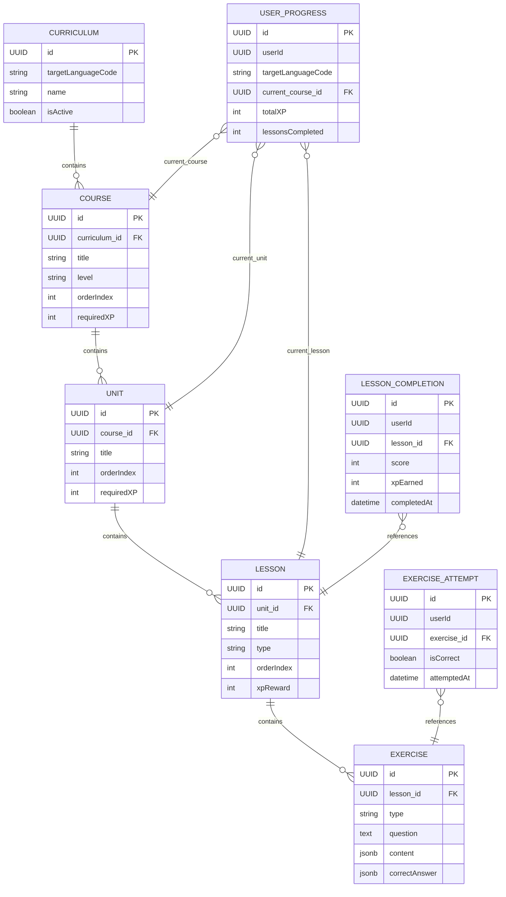

# Lesson Service - Spécifications Techniques v1.0

## 📋 Table des Matières

1. [Vue d'Ensemble](#1-vue-densemble)
2. [Modèle de Données](#2-modèle-de-données)
3. [API REST](#3-api-rest)
4. [Événements Asynchrones](#4-événements-asynchrones)
5. [Règles Métier](#5-règles-métier)
6. [Performance et Scalabilité](#6-performance-et-scalabilité)
7. [Sécurité](#7-sécurité)
8. [Tests](#8-tests)
9. [Monitoring et Logs](#9-monitoring-et-logs)
10. [Configuration](#10-configuration)
11. [Migration et Déploiement](#11-migration-et-déploiement)

---

## 1. Vue d'Ensemble

### 1.1 Responsabilité

Le **Lesson Service** est le cœur pédagogique de WeSpeak. Il gère :

- **Curriculum** : Structure globale des cours par langue et niveau CECRL
- **Courses** : Cours regroupant plusieurs unités thématiques
- **Units** : Unités thématiques composées de leçons
- **Lessons** : Leçons individuelles avec objectifs pédagogiques
- **Exercises** : Exercices variés (vocabulaire, grammaire, écoute, prononciation)
- **Progression** : Suivi de l'avancement utilisateur
- **Déblocage** : Logique de déblocage basée sur XP et complétion

### 1.2 Périmètre Fonctionnel

**Inclus** :
- Gestion du curriculum multi-langues (CECRL A1-C2)
- CRUD des cours, unités, leçons, exercices
- Suivi de progression par utilisateur/langue
- Logique de déblocage (prérequis, XP)
- Validation des réponses et calcul de score
- Recommandation de contenu pédagogique

**Exclus** :
- Gamification (badges, XP, leaderboards) → gamification-service
- Conversations 1v1 → conversation-service
- Feedback IA avancé → feedback-service
- Authentification → auth-service

### 1.3 Technologies

- **Backend** : Spring Boot 4.0, Java 21, Gradle 9.2.1
- **Database** : PostgreSQL 16 (données relationnelles)
- **Cache** : Redis (progression, leçons actives)
- **Messaging** : Kafka (Spring Cloud Stream)
- **API** : REST + OpenAPI 3.0
- **Monitoring** : Prometheus + Grafana

---

## 2. Modèle de Données

### 2.1 Entités

#### 2.1.1 Curriculum

Structure globale par langue cible.

```java
@Entity
@Table(name = "curriculums")
public class Curriculum {
    @Id
    @GeneratedValue(strategy = GenerationType.UUID)
    private UUID id;
    
    @Column(nullable = false, length = 10)
    private String targetLanguageCode; // ex: "en", "fr", "es"
    
    @Column(nullable = false, length = 100)
    private String name; // ex: "English for Beginners"
    
    @Column(length = 500)
    private String description;
    
    @Column(nullable = false)
    private Boolean isActive = true;
    
    @Column(nullable = false)
    private LocalDateTime createdAt;
    
    @Column(nullable = false)
    private LocalDateTime updatedAt;
    
    @OneToMany(mappedBy = "curriculum", cascade = CascadeType.ALL)
    private List<Course> courses;
}
```

**Index** :
- `idx_curriculum_language` sur `(targetLanguageCode, isActive)`

---

#### 2.1.2 Course

Cours regroupant plusieurs unités.

```java
@Entity
@Table(name = "courses")
public class Course {
    @Id
    @GeneratedValue(strategy = GenerationType.UUID)
    private UUID id;
    
    @ManyToOne(fetch = FetchType.LAZY)
    @JoinColumn(name = "curriculum_id", nullable = false)
    private Curriculum curriculum;
    
    @Column(nullable = false, length = 200)
    private String title;
    
    @Column(length = 1000)
    private String description;
    
    @Enumerated(EnumType.STRING)
    @Column(nullable = false, length = 5)
    private CECRLevel level; // A1, A2, B1, B2, C1, C2
    
    @Column(nullable = false)
    private Integer orderIndex; // Position dans le curriculum
    
    @Column(nullable = false)
    private Integer requiredXP = 0; // XP requis pour débloquer
    
    @Column(length = 255)
    private String iconUrl;
    
    @Column(nullable = false)
    private Boolean isActive = true;
    
    @Column(nullable = false)
    private LocalDateTime createdAt;
    
    @Column(nullable = false)
    private LocalDateTime updatedAt;
    
    @OneToMany(mappedBy = "course", cascade = CascadeType.ALL)
    private List<Unit> units;
}
```

**Index** :
- `idx_course_curriculum_order` sur `(curriculum_id, orderIndex)`
- `idx_course_level` sur `(level, isActive)`

---

#### 2.1.3 Unit

Unité thématique (ex: "Les salutations", "Au restaurant").

```java
@Entity
@Table(name = "units")
public class Unit {
    @Id
    @GeneratedValue(strategy = GenerationType.UUID)
    private UUID id;
    
    @ManyToOne(fetch = FetchType.LAZY)
    @JoinColumn(name = "course_id", nullable = false)
    private Course course;
    
    @Column(nullable = false, length = 200)
    private String title;
    
    @Column(length = 1000)
    private String description;
    
    @Column(nullable = false)
    private Integer orderIndex;
    
    @Column(nullable = false)
    private Integer requiredXP = 0;
    
    @Column(length = 255)
    private String iconUrl;
    
    @Column(nullable = false)
    private Boolean isActive = true;
    
    @Column(nullable = false)
    private LocalDateTime createdAt;
    
    @Column(nullable = false)
    private LocalDateTime updatedAt;
    
    @OneToMany(mappedBy = "unit", cascade = CascadeType.ALL)
    private List<Lesson> lessons;
}
```

**Index** :
- `idx_unit_course_order` sur `(course_id, orderIndex)`

---

#### 2.1.4 Lesson

Leçon individuelle avec exercices.

```java
@Entity
@Table(name = "lessons")
public class Lesson {
    @Id
    @GeneratedValue(strategy = GenerationType.UUID)
    private UUID id;
    
    @ManyToOne(fetch = FetchType.LAZY)
    @JoinColumn(name = "unit_id", nullable = false)
    private Unit unit;
    
    @Column(nullable = false, length = 200)
    private String title;
    
    @Column(length = 1000)
    private String description;
    
    @Enumerated(EnumType.STRING)
    @Column(nullable = false, length = 30)
    private LessonType type; // VOCABULARY, GRAMMAR, LISTENING, PRONUNCIATION, MIXED
    
    @Column(nullable = false)
    private Integer orderIndex;
    
    @Column(nullable = false)
    private Integer estimatedDurationMinutes = 10;
    
    @Column(nullable = false)
    private Integer xpReward = 10;
    
    @Column(nullable = false)
    private Integer requiredXP = 0;
    
    @Column(length = 255)
    private String iconUrl;
    
    @Column(nullable = false)
    private Boolean isActive = true;
    
    @Column(nullable = false)
    private LocalDateTime createdAt;
    
    @Column(nullable = false)
    private LocalDateTime updatedAt;
    
    @OneToMany(mappedBy = "lesson", cascade = CascadeType.ALL)
    private List<Exercise> exercises;
}
```

**Index** :
- `idx_lesson_unit_order` sur `(unit_id, orderIndex)`
- `idx_lesson_type` sur `(type, isActive)`

---

#### 2.1.5 Exercise

Exercice dans une leçon.

```java
@Entity
@Table(name = "exercises")
public class Exercise {
    @Id
    @GeneratedValue(strategy = GenerationType.UUID)
    private UUID id;
    
    @ManyToOne(fetch = FetchType.LAZY)
    @JoinColumn(name = "lesson_id", nullable = false)
    private Lesson lesson;
    
    @Enumerated(EnumType.STRING)
    @Column(nullable = false, length = 30)
    private ExerciseType type; // MULTIPLE_CHOICE, FILL_BLANK, TRANSLATION, LISTENING, PRONUNCIATION, ORDERING
    
    @Column(nullable = false)
    private Integer orderIndex;
    
    @Column(nullable = false, columnDefinition = "TEXT")
    private String question;
    
    @Column(columnDefinition = "TEXT")
    private String hint;
    
    @Column(columnDefinition = "TEXT")
    private String audioUrl; // Pour exercices d'écoute
    
    @Column(columnDefinition = "TEXT")
    private String imageUrl;
    
    @Column(nullable = false, columnDefinition = "JSONB")
    @Type(JsonType.class)
    private ExerciseContent content; // Stocké en JSON
    
    @Column(nullable = false, columnDefinition = "JSONB")
    @Type(JsonType.class)
    private ExerciseAnswer correctAnswer; // Réponse(s) correcte(s)
    
    @Column(nullable = false)
    private Integer points = 10;
    
    @Column(nullable = false)
    private Boolean isActive = true;
    
    @Column(nullable = false)
    private LocalDateTime createdAt;
    
    @Column(nullable = false)
    private LocalDateTime updatedAt;
}
```

**Index** :
- `idx_exercise_lesson_order` sur `(lesson_id, orderIndex)`
- `idx_exercise_type` sur `(type, isActive)`

**Exemple de contenu JSON** :

```json
{
  "type": "MULTIPLE_CHOICE",
  "options": [
    {"id": "a", "text": "Hello"},
    {"id": "b", "text": "Goodbye"},
    {"id": "c", "text": "Thank you"}
  ],
  "correctOptionId": "a"
}
```

---

#### 2.1.6 UserProgress

Progression utilisateur par langue.

```java
@Entity
@Table(name = "user_progress")
public class UserProgress {
    @Id
    @GeneratedValue(strategy = GenerationType.UUID)
    private UUID id;
    
    @Column(nullable = false)
    private UUID userId; // Référence auth-service
    
    @Column(nullable = false, length = 10)
    private String targetLanguageCode;
    
    @ManyToOne(fetch = FetchType.LAZY)
    @JoinColumn(name = "current_course_id")
    private Course currentCourse;
    
    @ManyToOne(fetch = FetchType.LAZY)
    @JoinColumn(name = "current_unit_id")
    private Unit currentUnit;
    
    @ManyToOne(fetch = FetchType.LAZY)
    @JoinColumn(name = "current_lesson_id")
    private Lesson currentLesson;
    
    @Column(nullable = false)
    private Integer totalXP = 0;
    
    @Column(nullable = false)
    private Integer lessonsCompleted = 0;
    
    @Column(nullable = false)
    private Integer exercisesCompleted = 0;
    
    @Column(nullable = false)
    private Double averageAccuracy = 0.0; // Pourcentage
    
    @Column(nullable = false)
    private LocalDateTime lastActivityAt;
    
    @Column(nullable = false)
    private LocalDateTime createdAt;
    
    @Column(nullable = false)
    private LocalDateTime updatedAt;
}
```

**Index** :
- `idx_user_progress_user_lang` sur `(userId, targetLanguageCode)` **(UNIQUE)**
- `idx_user_progress_last_activity` sur `(userId, lastActivityAt)`

---

#### 2.1.7 LessonCompletion

Historique de complétion des leçons.

```java
@Entity
@Table(name = "lesson_completions")
public class LessonCompletion {
    @Id
    @GeneratedValue(strategy = GenerationType.UUID)
    private UUID id;
    
    @Column(nullable = false)
    private UUID userId;
    
    @ManyToOne(fetch = FetchType.LAZY)
    @JoinColumn(name = "lesson_id", nullable = false)
    private Lesson lesson;
    
    @Column(nullable = false)
    private LocalDateTime completedAt;
    
    @Column(nullable = false)
    private Integer score; // Pourcentage (0-100)
    
    @Column(nullable = false)
    private Integer xpEarned;
    
    @Column(nullable = false)
    private Integer attemptNumber = 1;
    
    @Column(nullable = false)
    private Integer timeSpentSeconds;
    
    @Column(nullable = false)
    private Integer correctAnswers;
    
    @Column(nullable = false)
    private Integer totalAnswers;
}
```

**Index** :
- `idx_lesson_completion_user_lesson` sur `(userId, lesson_id, completedAt DESC)`
- `idx_lesson_completion_user_date` sur `(userId, completedAt DESC)`

---

#### 2.1.8 ExerciseAttempt

Tentatives d'exercices (pour analytics).

```java
@Entity
@Table(name = "exercise_attempts")
public class ExerciseAttempt {
    @Id
    @GeneratedValue(strategy = GenerationType.UUID)
    private UUID id;
    
    @Column(nullable = false)
    private UUID userId;
    
    @ManyToOne(fetch = FetchType.LAZY)
    @JoinColumn(name = "exercise_id", nullable = false)
    private Exercise exercise;
    
    @Column(nullable = false, columnDefinition = "JSONB")
    @Type(JsonType.class)
    private Object userAnswer;
    
    @Column(nullable = false)
    private Boolean isCorrect;
    
    @Column(nullable = false)
    private Integer pointsEarned;
    
    @Column(nullable = false)
    private LocalDateTime attemptedAt;
    
    @Column(nullable = false)
    private Integer attemptNumber;
    
    @Column(nullable = false)
    private Integer timeSpentSeconds;
}
```

**Index** :
- `idx_exercise_attempt_user_exercise` sur `(userId, exercise_id, attemptedAt DESC)`
- `idx_exercise_attempt_user_date` sur `(userId, attemptedAt DESC)`

---

### 2.2 Relations (ERD)



---

### 2.3 Indexes Recommandés

#### Performances READ :

```sql
-- Curriculums
CREATE INDEX idx_curriculum_language ON curriculums(target_language_code, is_active);

-- Courses
CREATE INDEX idx_course_curriculum_order ON courses(curriculum_id, order_index);
CREATE INDEX idx_course_level ON courses(level, is_active);

-- Units
CREATE INDEX idx_unit_course_order ON units(course_id, order_index);

-- Lessons
CREATE INDEX idx_lesson_unit_order ON lessons(unit_id, order_index);
CREATE INDEX idx_lesson_type ON lessons(type, is_active);

-- Exercises
CREATE INDEX idx_exercise_lesson_order ON exercises(lesson_id, order_index);
CREATE INDEX idx_exercise_type ON exercises(type, is_active);

-- User Progress
CREATE UNIQUE INDEX idx_user_progress_user_lang ON user_progress(user_id, target_language_code);
CREATE INDEX idx_user_progress_last_activity ON user_progress(user_id, last_activity_at);

-- Lesson Completions
CREATE INDEX idx_lesson_completion_user_lesson ON lesson_completions(user_id, lesson_id, completed_at DESC);
CREATE INDEX idx_lesson_completion_user_date ON lesson_completions(user_id, completed_at DESC);

-- Exercise Attempts
CREATE INDEX idx_exercise_attempt_user_exercise ON exercise_attempts(user_id, exercise_id, attempted_at DESC);
CREATE INDEX idx_exercise_attempt_user_date ON exercise_attempts(user_id, attempted_at DESC);
```

---

## 3. API REST

### 3.1 Endpoints

| Méthode | Route | Description | Auth |
|---------|-------|-------------|------|
| **Curriculum** | | | |
| GET | `/api/v1/curriculums` | Liste des curriculums | Public |
| GET | `/api/v1/curriculums/{language}` | Curriculum par langue | Public |
| **Courses** | | | |
| GET | `/api/v1/courses` | Liste des cours (filtrés) | Public |
| GET | `/api/v1/courses/{courseId}` | Détail d'un cours | Public |
| **Units** | | | |
| GET | `/api/v1/units/{unitId}` | Détail d'une unité | Public |
| **Lessons** | | | |
| GET | `/api/v1/lessons/{lessonId}` | Détail d'une leçon | Public |
| POST | `/api/v1/lessons/{lessonId}/start` | Démarrer une leçon | JWT |
| POST | `/api/v1/lessons/{lessonId}/complete` | Terminer une leçon | JWT |
| **Exercises** | | | |
| GET | `/api/v1/exercises/{exerciseId}` | Détail d'un exercice | Public |
| POST | `/api/v1/exercises/{exerciseId}/submit` | Soumettre une réponse | JWT |
| **Progression** | | | |
| GET | `/api/v1/progress` | Ma progression globale | JWT |
| GET | `/api/v1/progress/{language}` | Progression par langue | JWT |
| GET | `/api/v1/progress/history` | Historique d'activité | JWT |
| **Admin** | | | |
| POST | `/api/v1/admin/courses` | Créer un cours | ADMIN |
| PUT | `/api/v1/admin/courses/{courseId}` | Modifier un cours | ADMIN |
| DELETE | `/api/v1/admin/courses/{courseId}` | Supprimer un cours | ADMIN |

---

### 3.2 Schemas Détaillés

#### GET `/api/v1/curriculums/{language}`

**Response 200** :

```json
{
  "id": "uuid",
  "targetLanguageCode": "en",
  "name": "English Curriculum",
  "description": "Complete English learning path from A1 to C2",
  "courses": [
    {
      "id": "uuid",
      "title": "English Basics",
      "level": "A1",
      "orderIndex": 1,
      "requiredXP": 0,
      "iconUrl": "https://cdn.wespeak.com/icons/course-a1.png",
      "totalUnits": 5,
      "totalLessons": 25,
      "isUnlocked": true,
      "progress": {
        "completedLessons": 3,
        "totalLessons": 25,
        "percentageComplete": 12
      }
    }
  ]
}
```

---

#### GET `/api/v1/lessons/{lessonId}`

**Response 200** :

```json
{
  "id": "uuid",
  "title": "Greetings and Introductions",
  "description": "Learn how to greet people and introduce yourself",
  "type": "VOCABULARY",
  "orderIndex": 1,
  "estimatedDurationMinutes": 10,
  "xpReward": 15,
  "iconUrl": "https://cdn.wespeak.com/icons/lesson-greetings.png",
  "unit": {
    "id": "uuid",
    "title": "Unit 1: Basics"
  },
  "exercises": [
    {
      "id": "uuid",
      "type": "MULTIPLE_CHOICE",
      "orderIndex": 1,
      "question": "How do you say 'Hello' in English?",
      "points": 10
    },
    {
      "id": "uuid",
      "type": "FILL_BLANK",
      "orderIndex": 2,
      "question": "Complete: Nice to ___ you!",
      "points": 10
    }
  ],
  "isUnlocked": true,
  "userCompletion": {
    "isCompleted": false,
    "bestScore": null,
    "attempts": 0,
    "lastAttemptedAt": null
  }
}
```

---

#### POST `/api/v1/exercises/{exerciseId}/submit`

**Request Body** :

```json
{
  "userAnswer": {
    "type": "MULTIPLE_CHOICE",
    "selectedOptionId": "a"
  },
  "timeSpentSeconds": 15
}
```

**Response 200** :

```json
{
  "isCorrect": true,
  "pointsEarned": 10,
  "correctAnswer": {
    "optionId": "a",
    "explanation": "Hello is the most common greeting in English."
  },
  "feedback": "Great job! You got it right!",
  "attemptNumber": 1
}
```

---

#### POST `/api/v1/lessons/{lessonId}/complete`

**Request Body** :

```json
{
  "score": 85,
  "timeSpentSeconds": 420,
  "correctAnswers": 17,
  "totalAnswers": 20
}
```

**Response 200** :

```json
{
  "lessonCompletion": {
    "id": "uuid",
    "lessonId": "uuid",
    "completedAt": "2025-01-15T14:30:00Z",
    "score": 85,
    "xpEarned": 15,
    "attemptNumber": 1
  },
  "progression": {
    "totalXP": 245,
    "xpGained": 15,
    "lessonsCompleted": 8,
    "nextLesson": {
      "id": "uuid",
      "title": "Basic Conversations"
    },
    "unlockedContent": [
      {
        "type": "LESSON",
        "id": "uuid",
        "title": "Basic Conversations"
      }
    ]
  },
  "achievements": [
    {
      "type": "STREAK",
      "message": "3 days in a row!"
    }
  ]
}
```

---

#### GET `/api/v1/progress/{language}`

**Response 200** :

```json
{
  "userId": "uuid",
  "targetLanguageCode": "en",
  "currentCourse": {
    "id": "uuid",
    "title": "English Basics",
    "level": "A1"
  },
  "currentUnit": {
    "id": "uuid",
    "title": "Unit 1: Basics"
  },
  "currentLesson": {
    "id": "uuid",
    "title": "Greetings and Introductions"
  },
  "totalXP": 245,
  "lessonsCompleted": 8,
  "exercisesCompleted": 160,
  "averageAccuracy": 87.5,
  "lastActivityAt": "2025-01-15T14:30:00Z",
  "progressSummary": {
    "coursesStarted": 1,
    "coursesCompleted": 0,
    "unitsCompleted": 0,
    "currentStreak": 3,
    "totalTimeSpentMinutes": 125
  }
}
```

---

### 3.3 Codes d'Erreur

| Code | Message | Description |
|------|---------|-------------|
| 400 | INVALID_ANSWER_FORMAT | Format de réponse invalide |
| 403 | LESSON_LOCKED | Leçon non débloquée |
| 404 | LESSON_NOT_FOUND | Leçon introuvable |
| 404 | EXERCISE_NOT_FOUND | Exercice introuvable |
| 409 | LESSON_ALREADY_COMPLETED | Leçon déjà terminée |
| 429 | TOO_MANY_ATTEMPTS | Trop de tentatives |
| 500 | PROGRESS_CALCULATION_ERROR | Erreur calcul progression |

---

## 4. Événements Asynchrones

### 4.1 Messages Publiés

#### Topic : `lesson.events`

**Event : `lesson.started`**

```json
{
  "eventType": "lesson.started",
  "version": "1.0",
  "timestamp": "2025-01-15T14:00:00Z",
  "payload": {
    "userId": "uuid",
    "lessonId": "uuid",
    "lessonTitle": "Greetings and Introductions",
    "lessonType": "VOCABULARY",
    "targetLanguageCode": "en",
    "unitId": "uuid",
    "courseId": "uuid"
  },
  "metadata": {
    "correlationId": "uuid",
    "source": "lesson-service"
  }
}
```

**Consommé par** : recommendation-service, gamification-service

---

**Event : `lesson.completed`**

```json
{
  "eventType": "lesson.completed",
  "version": "1.0",
  "timestamp": "2025-01-15T14:30:00Z",
  "payload": {
    "userId": "uuid",
    "lessonId": "uuid",
    "lessonTitle": "Greetings and Introductions",
    "score": 85,
    "xpEarned": 15,
    "timeSpentSeconds": 420,
    "correctAnswers": 17,
    "totalAnswers": 20,
    "attemptNumber": 1,
    "targetLanguageCode": "en",
    "unitId": "uuid",
    "courseId": "uuid",
    "completionId": "uuid"
  },
  "metadata": {
    "correlationId": "uuid",
    "source": "lesson-service"
  }
}
```

**Consommé par** : gamification-service, recommendation-service, analytics-service

---

**Event : `exercise.attempted`**

```json
{
  "eventType": "exercise.attempted",
  "version": "1.0",
  "timestamp": "2025-01-15T14:15:00Z",
  "payload": {
    "userId": "uuid",
    "exerciseId": "uuid",
    "exerciseType": "MULTIPLE_CHOICE",
    "lessonId": "uuid",
    "isCorrect": true,
    "pointsEarned": 10,
    "attemptNumber": 1,
    "timeSpentSeconds": 15,
    "targetLanguageCode": "en"
  },
  "metadata": {
    "correlationId": "uuid",
    "source": "lesson-service"
  }
}
```

**Consommé par** : gamification-service, analytics-service

---

**Event : `unit.completed`**

```json
{
  "eventType": "unit.completed",
  "version": "1.0",
  "timestamp": "2025-01-16T10:00:00Z",
  "payload": {
    "userId": "uuid",
    "unitId": "uuid",
    "unitTitle": "Unit 1: Basics",
    "courseId": "uuid",
    "targetLanguageCode": "en",
    "totalXPEarned": 150,
    "averageScore": 88,
    "totalLessons": 5,
    "completedAt": "2025-01-16T10:00:00Z"
  },
  "metadata": {
    "correlationId": "uuid",
    "source": "lesson-service"
  }
}
```

**Consommé par** : gamification-service, recommendation-service

---

**Event : `course.completed`**

```json
{
  "eventType": "course.completed",
  "version": "1.0",
  "timestamp": "2025-02-01T15:00:00Z",
  "payload": {
    "userId": "uuid",
    "courseId": "uuid",
    "courseTitle": "English Basics",
    "level": "A1",
    "targetLanguageCode": "en",
    "totalXPEarned": 500,
    "averageScore": 90,
    "totalUnits": 5,
    "totalLessons": 25,
    "completedAt": "2025-02-01T15:00:00Z"
  },
  "metadata": {
    "correlationId": "uuid",
    "source": "lesson-service"
  }
}
```

**Consommé par** : gamification-service, recommendation-service

---

### 4.2 Messages Consommés

#### Topic : `user.events`

**Event : `user.registered`**

**Action** :
- Créer une entrée `UserProgress` initiale pour la langue cible du premier `LearningProfile`
- Initialiser `totalXP = 0`, `lessonsCompleted = 0`

**Listener** :

```java
@Bean
public Consumer<CloudEvent<UserRegisteredPayload>> userRegisteredListener(ProgressService progressService) {
    return event -> {
        UserRegisteredPayload payload = event.getData();
        progressService.initializeProgressForNewUser(
            payload.getUserId(),
            payload.getLearningProfiles()
        );
    };
}
```

---

## 5. Règles Métier

### 5.1 Déblocage de Contenu

#### Règles de déblocage :

1. **Cours** :
   - Premier cours du curriculum : débloqué par défaut
   - Cours suivant : débloqué quand `user.totalXP >= course.requiredXP`

2. **Unité** :
   - Première unité d'un cours : débloquée si le cours est débloqué
   - Unité suivante : débloquée quand l'unité précédente est complétée à 100%

3. **Leçon** :
   - Première leçon d'une unité : débloquée si l'unité est débloquée
   - Leçon suivante : débloquée quand la leçon précédente est complétée avec score >= 70%

**Algorithme de déblocage** :

```java
public boolean isLessonUnlocked(UUID userId, Lesson lesson) {
    // Vérifier si l'unité parent est débloquée
    if (!isUnitUnlocked(userId, lesson.getUnit())) {
        return false;
    }
    
    // Vérifier si c'est la première leçon
    if (lesson.getOrderIndex() == 1) {
        return true;
    }
    
    // Vérifier si la leçon précédente est complétée avec score >= 70%
    Lesson previousLesson = lessonRepository.findByUnitAndOrderIndex(
        lesson.getUnit(),
        lesson.getOrderIndex() - 1
    );
    
    LessonCompletion completion = lessonCompletionRepository
        .findLatestByUserIdAndLessonId(userId, previousLesson.getId());
    
    return completion != null && completion.getScore() >= 70;
}
```

---

### 5.2 Calcul de Score

**Formule de score par leçon** :

```
score = (correctAnswers / totalAnswers) * 100
```

**Formule XP gagné** :

```
xpEarned = baseXP * (score / 100)

- Si score >= 90% : bonus +20%
- Si score < 70% : penalty -30%
```

**Exemple** :

```java
public int calculateXPEarned(Lesson lesson, int score) {
    int baseXP = lesson.getXpReward();
    double multiplier = score / 100.0;
    
    int earnedXP = (int) (baseXP * multiplier);
    
    if (score >= 90) {
        earnedXP = (int) (earnedXP * 1.2); // Bonus +20%
    } else if (score < 70) {
        earnedXP = (int) (earnedXP * 0.7); // Penalty -30%
    }
    
    return earnedXP;
}
```

---

### 5.3 Validation des Réponses

#### Multiple Choice :

```java
public boolean validateMultipleChoice(Exercise exercise, UserAnswer answer) {
    ExerciseContent content = exercise.getContent();
    return content.getCorrectOptionId().equals(answer.getSelectedOptionId());
}
```

#### Fill in the Blank :

```java
public boolean validateFillBlank(Exercise exercise, UserAnswer answer) {
    String correctAnswer = exercise.getCorrectAnswer().getText().trim().toLowerCase();
    String userAnswer = answer.getText().trim().toLowerCase();
    
    // Tolérance aux fautes d'orthographe mineures (Levenshtein distance <= 2)
    return LevenshteinDistance.calculate(correctAnswer, userAnswer) <= 2;
}
```

#### Translation :

```java
public boolean validateTranslation(Exercise exercise, UserAnswer answer) {
    List<String> acceptedTranslations = exercise.getCorrectAnswer().getAcceptedAnswers();
    String userTranslation = answer.getText().trim().toLowerCase();
    
    return acceptedTranslations.stream()
        .anyMatch(accepted -> accepted.equalsIgnoreCase(userTranslation));
}
```

---

### 5.4 Progression par Langue

Un utilisateur peut avoir plusieurs profils d'apprentissage (multi-langues).

Chaque `UserProgress` est **isolé par langue** :

- `UserProgress` pour `en` (anglais)
- `UserProgress` pour `fr` (français)
- `UserProgress` pour `es` (espagnol)

Les XP, leçons complétées et progression sont **indépendants** entre les langues.

---

## 6. Performance et Scalabilité

### 6.1 Stratégies de Cache

#### Redis Cache :

**Clés** :

```
lesson:content:{lessonId}              # TTL: 1 hour
exercise:content:{exerciseId}          # TTL: 1 hour
user:progress:{userId}:{language}      # TTL: 5 minutes
curriculum:{language}                  # TTL: 24 hours
course:{courseId}                      # TTL: 1 hour
```

**Invalidation** :

- Invalider `user:progress` après chaque complétion de leçon
- Invalider `course:*` lors de modification admin
- Invalider `curriculum:*` lors d'ajout de nouveau cours

---

### 6.2 Optimisations

1. **Eager Loading** :
   - Charger `exercises` avec `@EntityGraph` quand on récupère une leçon

2. **Pagination** :
   - Toutes les listes (historique, tentatives) doivent être paginées
   - Taille par défaut : 20 items

3. **Projections** :
   - Utiliser des DTOs légers pour les listes (ne pas charger toutes les relations)

4. **Batch Processing** :
   - Lors de calcul de progression globale, traiter par batch de 100 leçons

---

### 6.3 Limites et Quotas

| Limite | Valeur | Description |
|--------|--------|-------------|
| Max tentatives par exercice | 3 | Limite par jour |
| Max leçons par jour (free) | 10 | Rate limiting |
| Max leçons par jour (premium) | Illimité | - |
| Max exercices par leçon | 50 | - |
| Max cours par curriculum | 20 | - |

---

## 7. Sécurité

### 7.1 Authentification

- **JWT** obligatoire pour tous les endpoints `/api/v1/progress/*` et `/api/v1/lessons/*/complete`
- **Public** pour consultation de contenu (`GET /lessons`, `GET /courses`)

### 7.2 Autorisation

**Rôles** :

- `USER` : Accès lecture + progression personnelle
- `ADMIN` : CRUD complet sur curriculum, cours, unités, leçons, exercices
- `CONTENT_CREATOR` : CRUD sur leçons et exercices uniquement

**Validation** :

- Un utilisateur ne peut soumettre que **ses propres** exercices
- Un utilisateur ne peut voir que **sa propre** progression

### 7.3 Validation des Entrées

```java
@PostMapping("/lessons/{lessonId}/complete")
public ResponseEntity<LessonCompletionResponse> completeLesson(
    @PathVariable UUID lessonId,
    @Valid @RequestBody CompleteLessonRequest request
) {
    // Validation : score entre 0 et 100
    if (request.getScore() < 0 || request.getScore() > 100) {
        throw new InvalidScoreException("Score must be between 0 and 100");
    }
    
    // Validation : cohérence correctAnswers / totalAnswers
    if (request.getCorrectAnswers() > request.getTotalAnswers()) {
        throw new InvalidDataException("Correct answers cannot exceed total answers");
    }
    
    // ...
}
```

---

## 8. Tests

### 8.1 Tests Unitaires

**Couverture minimale** : 80%

**Tests critiques** :

```java
@Test
void shouldUnlockNextLessonWhenPreviousCompletedWithScoreAbove70() {
    // Given
    UUID userId = UUID.randomUUID();
    Lesson lesson1 = createLesson(1, unit);
    Lesson lesson2 = createLesson(2, unit);
    
    LessonCompletion completion = new LessonCompletion();
    completion.setUserId(userId);
    completion.setLesson(lesson1);
    completion.setScore(75);
    
    lessonCompletionRepository.save(completion);
    
    // When
    boolean isUnlocked = progressService.isLessonUnlocked(userId, lesson2);
    
    // Then
    assertTrue(isUnlocked);
}

@Test
void shouldCalculateXPWithBonusWhenScoreAbove90() {
    // Given
    Lesson lesson = createLesson();
    lesson.setXpReward(10);
    
    // When
    int xpEarned = xpCalculator.calculateXPEarned(lesson, 95);
    
    // Then
    assertEquals(11, xpEarned); // 10 * 0.95 * 1.2 = 11.4 → 11
}

@Test
void shouldValidateMultipleChoiceAnswer() {
    // Given
    Exercise exercise = createMultipleChoiceExercise("a");
    UserAnswer userAnswer = new UserAnswer("a");
    
    // When
    boolean isCorrect = answerValidator.validate(exercise, userAnswer);
    
    // Then
    assertTrue(isCorrect);
}
```

---

### 8.2 Tests d'Intégration

```java
@SpringBootTest
@AutoConfigureTestDatabase
@ActiveProfiles("test")
class LessonControllerIntegrationTest {
    
    @Autowired
    private MockMvc mockMvc;
    
    @Test
    @WithMockUser(userId = "user-123")
    void shouldCompleteLessonAndUpdateProgress() throws Exception {
        // Given
        UUID lessonId = UUID.fromString("lesson-uuid");
        
        CompleteLessonRequest request = new CompleteLessonRequest();
        request.setScore(85);
        request.setTimeSpentSeconds(420);
        request.setCorrectAnswers(17);
        request.setTotalAnswers(20);
        
        // When & Then
        mockMvc.perform(post("/api/v1/lessons/{lessonId}/complete", lessonId)
                .contentType(MediaType.APPLICATION_JSON)
                .content(objectMapper.writeValueAsString(request)))
            .andExpect(status().isOk())
            .andExpect(jsonPath("$.lessonCompletion.score").value(85))
            .andExpect(jsonPath("$.progression.xpGained").value(15));
    }
}
```

---

### 8.3 Tests de Charge

**Scénarios** :

1. **100 utilisateurs simultanés** complétant une leçon
2. **500 requêtes/sec** sur `GET /curriculums/{language}`
3. **1000 soumissions d'exercices/min**

**Outils** : Gatling, JMeter

**Critères de succès** :

- P95 latency < 500ms
- P99 latency < 1s
- Taux d'erreur < 0.1%

---

## 9. Monitoring et Logs

### 9.1 Métriques à Tracker

**Métriques métier** :

- Nombre de leçons complétées par jour
- Taux de réussite moyen par exercice
- Temps moyen par leçon
- Taux d'abandon par leçon
- Distribution des scores par type d'exercice

**Métriques techniques** :

- Latency par endpoint (P50, P95, P99)
- Taux d'erreur HTTP
- Cache hit rate
- Database query time
- Kafka message lag

---

### 9.2 Logs Applicatifs

**Niveau INFO** :

- Lesson started
- Lesson completed
- Exercise attempted
- Progress updated

**Niveau ERROR** :

- Failed to calculate XP
- Failed to update progress
- Failed to publish Kafka event

**Format structuré (JSON)** :

```json
{
  "timestamp": "2025-01-15T14:30:00Z",
  "level": "INFO",
  "service": "lesson-service",
  "traceId": "abc123",
  "userId": "user-uuid",
  "event": "lesson.completed",
  "lessonId": "lesson-uuid",
  "score": 85,
  "xpEarned": 15
}
```

---

### 9.3 Alertes

| Alerte | Condition | Action |
|--------|-----------|--------|
| High error rate | Error rate > 5% for 5 min | Page on-call |
| Slow queries | P95 latency > 1s for 10 min | Investigate DB |
| Kafka lag | Consumer lag > 10000 | Scale consumers |
| Cache miss rate | Cache miss > 50% for 15 min | Check Redis |
| Low completion rate | < 30% lessons completed | Review difficulty |

---

## 10. Configuration

### 10.1 Variables d'Environnement

```properties
# Application
spring.application.name=lesson-service
server.port=8081

# Database
spring.datasource.url=jdbc:postgresql://localhost:5432/lesson_db
spring.datasource.username=${DB_USERNAME}
spring.datasource.password=${DB_PASSWORD}
spring.jpa.hibernate.ddl-auto=validate
spring.jpa.show-sql=false

# Redis Cache
spring.data.redis.host=${REDIS_HOST:localhost}
spring.data.redis.port=${REDIS_PORT:6379}
spring.cache.type=redis
spring.cache.redis.time-to-live=3600000

# Kafka
spring.cloud.stream.kafka.binder.brokers=${KAFKA_BROKERS:localhost:9092}
spring.cloud.function.definition=userRegisteredListener

# Kafka Bindings
spring.cloud.stream.bindings.userRegisteredListener-in-0.destination=user.events
spring.cloud.stream.bindings.userRegisteredListener-in-0.group=lesson-service

# Kafka Producer
spring.cloud.stream.kafka.binder.producer.configuration.acks=all
spring.cloud.stream.kafka.binder.producer.configuration.retries=3

# Security
jwt.secret=${JWT_SECRET}
jwt.expiration=86400000

# Business Rules
lesson.max-attempts-per-day=3
lesson.min-score-to-unlock-next=70
lesson.xp-bonus-threshold=90
lesson.xp-penalty-threshold=70

# Logging
logging.level.org.wespeak.lesson=INFO
logging.pattern.console=%d{yyyy-MM-dd HH:mm:ss} - %msg%n

# Monitoring
management.endpoints.web.exposure.include=health,metrics,prometheus
management.metrics.tags.application=${spring.application.name}
```

---

## 11. Migration et Déploiement

### 11.1 Stratégie de Migration

**Flyway** pour gestion des migrations SQL.

**Exemple de migration** :

```sql
-- V1__create_curriculum_tables.sql
CREATE TABLE curriculums (
    id UUID PRIMARY KEY,
    target_language_code VARCHAR(10) NOT NULL,
    name VARCHAR(100) NOT NULL,
    description VARCHAR(500),
    is_active BOOLEAN NOT NULL DEFAULT TRUE,
    created_at TIMESTAMP NOT NULL DEFAULT NOW(),
    updated_at TIMESTAMP NOT NULL DEFAULT NOW()
);

CREATE INDEX idx_curriculum_language ON curriculums(target_language_code, is_active);
```

---

### 11.2 Blue/Green Deployment

1. Déployer la nouvelle version sur un cluster séparé (Green)
2. Tester avec un échantillon de trafic (5%)
3. Si OK, basculer 100% du trafic vers Green
4. Garder Blue en standby pendant 1 heure
5. Si problème, rollback vers Blue en 30 secondes

---

### 11.3 Rollback Strategy

**Critères de rollback** :

- Error rate > 10%
- Latency P99 > 2s
- Critical bug détecté

**Procédure** :

```bash
# Rollback immédiat
kubectl rollout undo deployment/lesson-service

# Vérifier le statut
kubectl rollout status deployment/lesson-service
```

---

## Résumé

Le **Lesson Service** est le cœur pédagogique de WeSpeak, gérant tout le curriculum d'apprentissage structuré en **Courses → Units → Lessons → Exercises**. Il suit la progression des utilisateurs par langue, applique une logique de déblocage progressive basée sur XP et score, et publie des événements Kafka pour synchroniser avec les autres services (gamification, recommendation).

**Technologies clés** : Spring Boot 4, PostgreSQL, Redis, Kafka, Spring Cloud Stream

**Prochaines étapes** :
1. Implémenter le service avec Spring Boot
2. Créer les migrations Flyway
3. Développer les tests unitaires et d'intégration
4. Déployer sur Kubernetes avec Helm
5. Configurer les alertes Prometheus/Grafana
