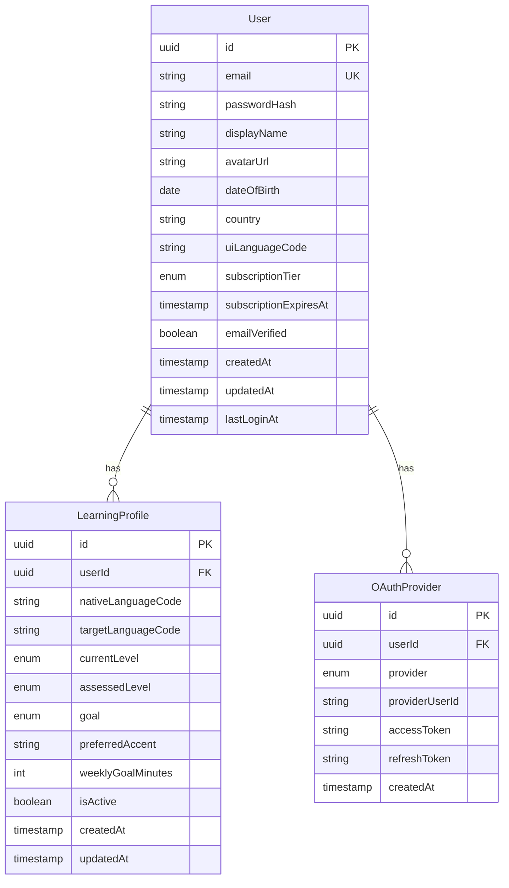

# Auth Service - Spécifications Techniques Détaillées v1.0

## 📋 Table des Matières

1. [Vue d'Ensemble](#1-vue-densemble)
2. [Modèle de Données](#2-modèle-de-données)
3. [API REST](#3-api-rest)
4. [Événements Asynchrones](#4-événements-asynchrones)
5. [Règles Métier](#5-règles-métier)
6. [Performance et Scalabilité](#6-performance-et-scalabilité)
7. [Sécurité](#7-sécurité)
8. [Tests](#8-tests)
9. [Monitoring et Logs](#9-monitoring-et-logs)
10. [Configuration](#10-configuration)

---

## 1. Vue d'Ensemble

### 1.1 Responsabilité Principale

Le **auth-service** est responsable de :
- **Authentification** : Inscription, connexion, logout, gestion tokens JWT
- **Gestion des comptes utilisateurs** : CRUD profils utilisateurs
- **Profils d'apprentissage multi-langues** : Gestion des LearningProfile (une par langue cible)
- **Abonnements** : Gestion des tiers (Free/Premium/Enterprise)
- **Vérification email** et récupération mot de passe

### 1.2 Périmètre Fonctionnel

**In Scope** :
- Authentification locale (email/password)
- OAuth 2.0 (Google, Facebook)
- JWT avec refresh tokens
- Profils utilisateurs (infos personnelles, préférences UI)
- Profils d'apprentissage par langue
- Gestion abonnements et quotas

**Out of Scope** :
- Logique de progression pédagogique → `lesson-service`
- Calcul XP et gamification → `gamification-service`
- Recommandations → `recommendation-service`

### 1.3 Dépendances

**Services consommés** :
- Aucun (service fondation)

**Services consommateurs** :
- Tous les autres services (via JWT validation)
- `api-gateway` (authentification centralisée)

**Technologies** :
- **Runtime** : Node.js 20+ LTS, TypeScript 5+
- **Framework** : NestJS 10+
- **Database** : PostgreSQL 15+ (données relationnelles)
- **Cache** : Redis 7+ (sessions, tokens blacklist)
- **Message Queue** : Kafka (événements asynchrones)
- **Auth Library** : Passport.js, bcrypt, jsonwebtoken
- **Validation** : class-validator, class-transformer

---

## 2. Modèle de Données

### 2.1 Entités

#### 2.1.1 User

```typescript
import { Entity, Column, PrimaryGeneratedColumn, CreateDateColumn, UpdateDateColumn, OneToMany } from 'typeorm';
import { IsEmail, IsString, MinLength, MaxLength, IsEnum, IsOptional, IsBoolean, IsDate } from 'class-validator';

export enum SubscriptionTier {
  FREE = 'free',
  PREMIUM = 'premium',
  ENTERPRISE = 'enterprise'
}

@Entity('users')
export class User {
  @PrimaryGeneratedColumn('uuid')
  id: string;

  @Column({ unique: true })
  @IsEmail()
  email: string;

  @Column({ name: 'password_hash' })
  passwordHash: string;

  @Column({ name: 'display_name', length: 100 })
  @IsString()
  @MinLength(2)
  @MaxLength(100)
  displayName: string;

  @Column({ name: 'avatar_url', nullable: true })
  @IsOptional()
  avatarUrl?: string;

  @Column({ name: 'date_of_birth', type: 'date', nullable: true })
  @IsOptional()
  @IsDate()
  dateOfBirth?: Date;

  @Column({ length: 2, nullable: true })
  @IsOptional()
  country?: string; // ISO 3166-1 alpha-2

  @Column({ name: 'ui_language_code', length: 5, default: 'en' })
  @IsString()
  uiLanguageCode: string; // ex: 'en', 'fr', 'es'

  @Column({
    name: 'subscription_tier',
    type: 'enum',
    enum: SubscriptionTier,
    default: SubscriptionTier.FREE
  })
  @IsEnum(SubscriptionTier)
  subscriptionTier: SubscriptionTier;

  @Column({ name: 'subscription_expires_at', type: 'timestamp', nullable: true })
  @IsOptional()
  subscriptionExpiresAt?: Date;

  @Column({ name: 'email_verified', default: false })
  @IsBoolean()
  emailVerified: boolean;

  @Column({ name: 'email_verification_token', nullable: true })
  emailVerificationToken?: string;

  @Column({ name: 'email_verification_expires_at', type: 'timestamp', nullable: true })
  emailVerificationExpiresAt?: Date;

  @Column({ name: 'password_reset_token', nullable: true })
  passwordResetToken?: string;

  @Column({ name: 'password_reset_expires_at', type: 'timestamp', nullable: true })
  passwordResetExpiresAt?: Date;

  @Column({ name: 'refresh_token_hash', nullable: true })
  refreshTokenHash?: string;

  @CreateDateColumn({ name: 'created_at' })
  createdAt: Date;

  @UpdateDateColumn({ name: 'updated_at' })
  updatedAt: Date;

  @Column({ name: 'last_login_at', type: 'timestamp', nullable: true })
  lastLoginAt?: Date;

  // Relations
  @OneToMany(() => LearningProfile, (profile) => profile.user)
  learningProfiles: LearningProfile[];

  @OneToMany(() => OAuthProvider, (provider) => provider.user)
  oauthProviders: OAuthProvider[];
}
```

#### 2.1.2 LearningProfile

```typescript
import { Entity, Column, PrimaryGeneratedColumn, CreateDateColumn, UpdateDateColumn, ManyToOne, JoinColumn, Index } from 'typeorm';
import { IsString, IsEnum, IsInt, Min, Max, IsBoolean, IsOptional } from 'class-validator';

export enum CEFRLevel {
  A1 = 'A1',
  A2 = 'A2',
  B1 = 'B1',
  B2 = 'B2',
  C1 = 'C1',
  C2 = 'C2'
}

export enum LearningGoal {
  WORK = 'work',
  TRAVEL = 'travel',
  STUDIES = 'studies',
  PERSONAL = 'personal',
  OTHER = 'other'
}

@Entity('learning_profiles')
@Index(['userId', 'targetLanguageCode'], { unique: true }) // Un seul profil actif par langue
export class LearningProfile {
  @PrimaryGeneratedColumn('uuid')
  id: string;

  @Column({ name: 'user_id', type: 'uuid' })
  userId: string;

  @Column({ name: 'native_language_code', length: 5 })
  @IsString()
  nativeLanguageCode: string; // ex: 'fr', 'en-US'

  @Column({ name: 'target_language_code', length: 5 })
  @IsString()
  targetLanguageCode: string; // ex: 'en', 'es', 'pt-BR'

  @Column({
    name: 'current_level',
    type: 'enum',
    enum: CEFRLevel,
    default: CEFRLevel.A1
  })
  @IsEnum(CEFRLevel)
  currentLevel: CEFRLevel;

  @Column({ name: 'assessed_level', type: 'enum', enum: CEFRLevel, nullable: true })
  @IsOptional()
  assessedLevel?: CEFRLevel; // Niveau évalué par test initial

  @Column({
    type: 'enum',
    enum: LearningGoal,
    default: LearningGoal.PERSONAL
  })
  @IsEnum(LearningGoal)
  goal: LearningGoal;

  @Column({ name: 'preferred_accent', length: 10, nullable: true })
  @IsOptional()
  preferredAccent?: string; // ex: 'en-US', 'en-GB', 'es-ES', 'es-MX'

  @Column({ name: 'weekly_goal_minutes', default: 180 })
  @IsInt()
  @Min(30)
  @Max(10080) // Max 1 semaine
  weeklyGoalMinutes: number;

  @Column({ name: 'is_active', default: true })
  @IsBoolean()
  isActive: boolean;

  @CreateDateColumn({ name: 'created_at' })
  createdAt: Date;

  @UpdateDateColumn({ name: 'updated_at' })
  updatedAt: Date;

  // Relations
  @ManyToOne(() => User, (user) => user.learningProfiles, { onDelete: 'CASCADE' })
  @JoinColumn({ name: 'user_id' })
  user: User;
}
```

#### 2.1.3 OAuthProvider

```typescript
import { Entity, Column, PrimaryGeneratedColumn, CreateDateColumn, ManyToOne, JoinColumn, Index } from 'typeorm';

export enum OAuthProviderName {
  GOOGLE = 'google',
  FACEBOOK = 'facebook',
  APPLE = 'apple'
}

@Entity('oauth_providers')
@Index(['provider', 'providerUserId'], { unique: true })
export class OAuthProvider {
  @PrimaryGeneratedColumn('uuid')
  id: string;

  @Column({ name: 'user_id', type: 'uuid' })
  userId: string;

  @Column({
    type: 'enum',
    enum: OAuthProviderName
  })
  provider: OAuthProviderName;

  @Column({ name: 'provider_user_id' })
  providerUserId: string;

  @Column({ name: 'access_token', nullable: true })
  accessToken?: string;

  @Column({ name: 'refresh_token', nullable: true })
  refreshToken?: string;

  @CreateDateColumn({ name: 'created_at' })
  createdAt: Date;

  // Relations
  @ManyToOne(() => User, (user) => user.oauthProviders, { onDelete: 'CASCADE' })
  @JoinColumn({ name: 'user_id' })
  user: User;
}
```

#### 2.1.4 RefreshToken (Cache Redis)

```typescript
// Stocké dans Redis avec TTL
interface RefreshTokenCache {
  userId: string;
  tokenHash: string;
  expiresAt: number; // timestamp
  createdAt: number;
  deviceInfo?: {
    userAgent: string;
    ip: string;
  };
}

// Key pattern: refresh_token:{userId}:{tokenId}
// TTL: 30 jours
```

### 2.2 Relations



### 2.3 Indexes

**Table `users`** :
```sql
CREATE INDEX idx_users_email ON users(email);
CREATE INDEX idx_users_subscription_tier ON users(subscription_tier);
CREATE INDEX idx_users_created_at ON users(created_at DESC);
CREATE INDEX idx_users_email_verification_token ON users(email_verification_token) WHERE email_verification_token IS NOT NULL;
CREATE INDEX idx_users_password_reset_token ON users(password_reset_token) WHERE password_reset_token IS NOT NULL;
```

**Table `learning_profiles`** :
```sql
CREATE UNIQUE INDEX idx_learning_profiles_user_target_lang ON learning_profiles(user_id, target_language_code);
CREATE INDEX idx_learning_profiles_target_language ON learning_profiles(target_language_code);
CREATE INDEX idx_learning_profiles_level ON learning_profiles(current_level);
CREATE INDEX idx_learning_profiles_active ON learning_profiles(is_active) WHERE is_active = true;
```

**Table `oauth_providers`** :
```sql
CREATE UNIQUE INDEX idx_oauth_provider_user ON oauth_providers(provider, provider_user_id);
CREATE INDEX idx_oauth_user_id ON oauth_providers(user_id);
```

---

## 3. API REST

### 3.1 Endpoints

| Méthode | Route | Description | Auth | Tier |
|---------|-------|-------------|------|------|
| POST | `/api/auth/register` | Inscription utilisateur | Non | All |
| POST | `/api/auth/login` | Connexion | Non | All |
| POST | `/api/auth/logout` | Déconnexion | Oui | All |
| POST | `/api/auth/refresh-token` | Rafraîchir access token | Non | All |
| POST | `/api/auth/forgot-password` | Demande reset password | Non | All |
| POST | `/api/auth/reset-password` | Reset password | Non | All |
| GET | `/api/auth/verify-email/:token` | Vérifier email | Non | All |
| POST | `/api/auth/resend-verification` | Renvoyer email vérification | Oui | All |
| POST | `/api/auth/oauth/google` | OAuth Google | Non | All |
| POST | `/api/auth/oauth/facebook` | OAuth Facebook | Non | All |
| GET | `/api/users/me` | Profil utilisateur connecté | Oui | All |
| PUT | `/api/users/me` | Modifier profil | Oui | All |
| DELETE | `/api/users/me` | Supprimer compte | Oui | All |
| PUT | `/api/users/me/password` | Changer mot de passe | Oui | All |
| GET | `/api/learning-profiles` | Liste profils apprentissage | Oui | All |
| POST | `/api/learning-profiles` | Créer profil apprentissage | Oui | All |
| GET | `/api/learning-profiles/:id` | Détail profil | Oui | All |
| PUT | `/api/learning-profiles/:id` | Modifier profil | Oui | All |
| DELETE | `/api/learning-profiles/:id` | Supprimer profil | Oui | All |

### 3.2 Schemas Détaillés

#### 3.2.1 POST `/api/auth/register`

**Request** :
```json
{
  "email": "user@example.com",
  "password": "SecurePass123!",
  "displayName": "John Doe",
  "uiLanguageCode": "en",
  "learningProfile": {
    "nativeLanguageCode": "fr",
    "targetLanguageCode": "en",
    "currentLevel": "A1",
    "goal": "travel",
    "weeklyGoalMinutes": 180
  }
}
```

**Response 201** :
```json
{
  "user": {
    "id": "uuid",
    "email": "user@example.com",
    "displayName": "John Doe",
    "subscriptionTier": "free",
    "emailVerified": false
  },
  "learningProfile": {
    "id": "uuid",
    "targetLanguageCode": "en",
    "nativeLanguageCode": "fr",
    "currentLevel": "A1"
  },
  "tokens": {
    "accessToken": "jwt_access_token",
    "refreshToken": "jwt_refresh_token",
    "expiresIn": 3600
  }
}
```

**Response 400** :
```json
{
  "statusCode": 400,
  "message": "Email already exists",
  "error": "Bad Request"
}
```

#### 3.2.2 POST `/api/auth/login`

**Request** :
```json
{
  "email": "user@example.com",
  "password": "SecurePass123!"
}
```

**Response 200** :
```json
{
  "user": {
    "id": "uuid",
    "email": "user@example.com",
    "displayName": "John Doe",
    "avatarUrl": "https://...",
    "subscriptionTier": "premium",
    "subscriptionExpiresAt": "2025-12-31T23:59:59Z"
  },
  "tokens": {
    "accessToken": "jwt_access_token",
    "refreshToken": "jwt_refresh_token",
    "expiresIn": 3600
  }
}
```

**Response 401** :
```json
{
  "statusCode": 401,
  "message": "Invalid credentials",
  "error": "Unauthorized"
}
```

#### 3.2.3 POST `/api/auth/refresh-token`

**Request** :
```json
{
  "refreshToken": "jwt_refresh_token"
}
```

**Response 200** :
```json
{
  "accessToken": "new_jwt_access_token",
  "refreshToken": "new_jwt_refresh_token",
  "expiresIn": 3600
}
```

#### 3.2.4 POST `/api/auth/forgot-password`

**Request** :
```json
{
  "email": "user@example.com"
}
```

**Response 200** :
```json
{
  "message": "Password reset email sent"
}
```

#### 3.2.5 POST `/api/auth/reset-password`

**Request** :
```json
{
  "token": "reset_token_from_email",
  "newPassword": "NewSecurePass123!"
}
```

**Response 200** :
```json
{
  "message": "Password successfully reset"
}
```

#### 3.2.6 GET `/api/auth/verify-email/:token`

**Response 200** :
```json
{
  "message": "Email successfully verified"
}
```

**Response 400** :
```json
{
  "statusCode": 400,
  "message": "Invalid or expired token",
  "error": "Bad Request"
}
```

#### 3.2.7 GET `/api/users/me`

**Headers** :
```
Authorization: Bearer {access_token}
```

**Response 200** :
```json
{
  "id": "uuid",
  "email": "user@example.com",
  "displayName": "John Doe",
  "avatarUrl": "https://...",
  "dateOfBirth": "1990-05-15",
  "country": "FR",
  "uiLanguageCode": "fr",
  "subscriptionTier": "premium",
  "subscriptionExpiresAt": "2025-12-31T23:59:59Z",
  "emailVerified": true,
  "createdAt": "2024-01-15T10:30:00Z",
  "lastLoginAt": "2025-01-15T08:20:00Z",
  "learningProfiles": [
    {
      "id": "uuid",
      "nativeLanguageCode": "fr",
      "targetLanguageCode": "en",
      "currentLevel": "B1",
      "goal": "work",
      "weeklyGoalMinutes": 300,
      "isActive": true
    }
  ]
}
```

#### 3.2.8 PUT `/api/users/me`

**Request** :
```json
{
  "displayName": "Jane Doe",
  "avatarUrl": "https://...",
  "dateOfBirth": "1990-05-15",
  "country": "FR",
  "uiLanguageCode": "fr"
}
```

**Response 200** :
```json
{
  "id": "uuid",
  "email": "user@example.com",
  "displayName": "Jane Doe",
  "avatarUrl": "https://...",
  "dateOfBirth": "1990-05-15",
  "country": "FR",
  "uiLanguageCode": "fr",
  "updatedAt": "2025-01-15T10:30:00Z"
}
```

#### 3.2.9 POST `/api/learning-profiles`

**Request** :
```json
{
  "nativeLanguageCode": "en",
  "targetLanguageCode": "es",
  "currentLevel": "A1",
  "goal": "travel",
  "preferredAccent": "es-ES",
  "weeklyGoalMinutes": 240
}
```

**Response 201** :
```json
{
  "id": "uuid",
  "userId": "uuid",
  "nativeLanguageCode": "en",
  "targetLanguageCode": "es",
  "currentLevel": "A1",
  "goal": "travel",
  "preferredAccent": "es-ES",
  "weeklyGoalMinutes": 240,
  "isActive": true,
  "createdAt": "2025-01-15T10:30:00Z"
}
```

**Response 400** :
```json
{
  "statusCode": 400,
  "message": "Learning profile for this language already exists",
  "error": "Bad Request"
}
```

### 3.3 Codes d'Erreur

| Code | Message | Description |
|------|---------|-------------|
| 200 | OK | Succès |
| 201 | Created | Ressource créée |
| 400 | Bad Request | Données invalides |
| 401 | Unauthorized | Token manquant/invalide |
| 403 | Forbidden | Accès refusé |
| 404 | Not Found | Ressource introuvable |
| 409 | Conflict | Email/profil déjà existant |
| 422 | Unprocessable Entity | Validation échouée |
| 429 | Too Many Requests | Rate limit dépassé |
| 500 | Internal Server Error | Erreur serveur |

---

## 4. Événements Asynchrones

### 4.1 Messages Publiés

**Topic** : `user.events`  
**Partitioning Key** : `userId`

#### 4.1.1 Event : `user.registered`

```json
{
  "eventType": "user.registered",
  "version": "1.0",
  "timestamp": "2025-01-15T10:30:00Z",
  "payload": {
    "userId": "uuid",
    "email": "user@example.com",
    "displayName": "John Doe",
    "subscriptionTier": "free",
    "uiLanguageCode": "en",
    "learningProfiles": [
      {
        "id": "uuid",
        "targetLanguageCode": "en",
        "nativeLanguageCode": "fr",
        "currentLevel": "A1",
        "goal": "travel"
      }
    ]
  },
  "metadata": {
    "correlationId": "uuid",
    "source": "auth-service",
    "userId": "uuid"
  }
}
```

**Consommateurs** :
- `gamification-service` : Créer profil gamification + badge "Welcome"
- `recommendation-service` : Initialiser profil recommandations
- `notification-service` : Envoyer email bienvenue

#### 4.1.2 Event : `user.subscription.upgraded`

```json
{
  "eventType": "user.subscription.upgraded",
  "version": "1.0",
  "timestamp": "2025-01-15T10:30:00Z",
  "payload": {
    "userId": "uuid",
    "previousTier": "free",
    "newTier": "premium",
    "expiresAt": "2026-01-15T10:30:00Z"
  },
  "metadata": {
    "correlationId": "uuid",
    "source": "auth-service",
    "userId": "uuid"
  }
}
```

**Consommateurs** :
- `gamification-service` : Badge "Premium Member"
- `notification-service` : Email confirmation

#### 4.1.3 Event : `user.learning_profile.created`

```json
{
  "eventType": "user.learning_profile.created",
  "version": "1.0",
  "timestamp": "2025-01-15T10:30:00Z",
  "payload": {
    "userId": "uuid",
    "profileId": "uuid",
    "targetLanguageCode": "es",
    "nativeLanguageCode": "en",
    "currentLevel": "A1",
    "goal": "travel"
  },
  "metadata": {
    "correlationId": "uuid",
    "source": "auth-service",
    "userId": "uuid"
  }
}
```

**Consommateurs** :
- `lesson-service` : Débloquer cours de niveau A1 pour espagnol
- `recommendation-service` : Générer recommandations initiales

#### 4.1.4 Event : `user.email.verified`

```json
{
  "eventType": "user.email.verified",
  "version": "1.0",
  "timestamp": "2025-01-15T10:30:00Z",
  "payload": {
    "userId": "uuid",
    "email": "user@example.com"
  },
  "metadata": {
    "correlationId": "uuid",
    "source": "auth-service",
    "userId": "uuid"
  }
}
```

**Consommateurs** :
- `gamification-service` : Badge "Email Verified" + 50 XP

### 4.2 Messages Consommés

Aucun (service fondation).

---

## 5. Règles Métier

### 5.1 Inscription

1. **Email unique** : Vérification avant création
2. **Mot de passe** :
   - Min 8 caractères
   - Au moins 1 majuscule, 1 minuscule, 1 chiffre, 1 caractère spécial
   - Hash avec bcrypt (cost factor: 12)
3. **Profil d'apprentissage initial** : Créé automatiquement à l'inscription
4. **Email de vérification** : Envoyé automatiquement (lien valide 24h)
5. **Tier par défaut** : Free

### 5.2 Authentification

1. **JWT Access Token** :
   - Durée de vie : 1 heure
   - Payload : `{ userId, email, subscriptionTier, iat, exp }`
   - Signature : RS256 (clé privée)
   
2. **JWT Refresh Token** :
   - Durée de vie : 30 jours
   - Stocké hashé (bcrypt) en base + Redis
   - Rotation : nouveau refresh token à chaque usage
   
3. **Rate limiting** :
   - Login : 5 tentatives / 15 min / IP
   - Register : 3 / heure / IP
   - Password reset : 3 / heure / email

### 5.3 Profils d'Apprentissage

1. **Maximum profils** :
   - Free : 2 langues cibles
   - Premium : 5 langues cibles
   - Enterprise : illimité

2. **Un seul profil actif par langue cible**

3. **Suppression profil** :
   - Soft delete (marquer `isActive = false`)
   - Conservation données progression 90 jours

### 5.4 Abonnements

1. **Downgrade Premium → Free** :
   - Effective à la fin de période payée
   - Conservation données complètes
   - Limitations appliquées progressivement

2. **Upgrade Free → Premium** :
   - Effective immédiatement
   - Déblocage fonctionnalités instantané

### 5.5 Sécurité

1. **Tokens blacklist** :
   - Stockée dans Redis (logout, reset password)
   - TTL = durée de vie originale du token

2. **Device tracking** :
   - Max 5 devices actifs simultanés
   - Logout automatique du plus ancien si dépassement

---

## 6. Performance et Scalabilité

### 6.1 Stratégies de Cache

**Redis Cache** :

```typescript
// User profile cache
key: `user:profile:{userId}`
TTL: 1 heure
Invalidation: PUT /api/users/me

// Learning profiles cache
key: `user:learning_profiles:{userId}`
TTL: 30 minutes
Invalidation: POST/PUT/DELETE /api/learning-profiles

// JWT blacklist
key: `jwt:blacklist:{jti}`
TTL: Durée de vie du token

// Rate limiting
key: `ratelimit:login:{ip}`
TTL: 15 minutes
```

### 6.2 Optimisations Requêtes

1. **Eager loading** : Charger `learningProfiles` avec `user` en une requête
2. **Indexes** : Sur email, subscription_tier, target_language_code
3. **Connection pooling** : PostgreSQL (pool size: 20)
4. **Prepared statements** : Pour prévenir SQL injection

### 6.3 Limites et Quotas

| Resource | Free | Premium |
|----------|------|---------|
| Learning Profiles | 2 | 5 |
| API Requests/min | 60 | 300 |
| Password resets/hour | 3 | 10 |

---

## 7. Sécurité

### 7.1 Authentification

- **JWT** : RS256 (asymmetric)
- **Refresh tokens** : Rotation automatique
- **Password storage** : bcrypt (cost: 12)
- **OAuth** : Validation state parameter (CSRF protection)

### 7.2 Autorisation

**Middleware JWT** :
```typescript
@Injectable()
export class JwtAuthGuard extends AuthGuard('jwt') {
  canActivate(context: ExecutionContext) {
    // Validate JWT
    // Check token not blacklisted
    // Attach user to request
  }
}
```

**RBAC** (pour future extension) :
```typescript
enum UserRole {
  USER = 'user',
  MODERATOR = 'moderator',
  ADMIN = 'admin'
}
```

### 7.3 Validation des Entrées

```typescript
// Example DTO
export class RegisterDto {
  @IsEmail()
  @MaxLength(255)
  email: string;

  @IsString()
  @MinLength(8)
  @MaxLength(100)
  @Matches(/^(?=.*[a-z])(?=.*[A-Z])(?=.*\d)(?=.*[@$!%*?&])[A-Za-z\d@$!%*?&]/)
  password: string;

  @IsString()
  @MinLength(2)
  @MaxLength(100)
  displayName: string;
}
```

### 7.4 Protection Données Sensibles

1. **Logs** : Ne jamais logger passwords, tokens
2. **Database** : Encryption at rest (PostgreSQL pgcrypto)
3. **Transit** : HTTPS obligatoire
4. **GDPR** : Endpoint DELETE `/api/users/me` (right to be forgotten)

---

## 8. Tests

### 8.1 Tests Unitaires

**Couverture minimale** : 80%

```typescript
// Example: auth.service.spec.ts
describe('AuthService', () => {
  describe('register', () => {
    it('should create user with hashed password', async () => {
      // Test password hashing
    });

    it('should throw error if email exists', async () => {
      // Test duplicate email
    });

    it('should create learning profile automatically', async () => {
      // Test profile creation
    });

    it('should publish user.registered event', async () => {
      // Test Kafka event
    });
  });

  describe('login', () => {
    it('should return tokens for valid credentials', async () => {
      // Test login success
    });

    it('should throw UnauthorizedException for invalid password', async () => {
      // Test login failure
    });

    it('should update lastLoginAt', async () => {
      // Test timestamp update
    });
  });
});
```

### 8.2 Tests d'Intégration

```typescript
// Example: auth.controller.e2e-spec.ts
describe('AuthController (e2e)', () => {
  it('POST /api/auth/register - should register new user', () => {
    return request(app.getHttpServer())
      .post('/api/auth/register')
      .send({
        email: 'test@example.com',
        password: 'Test123!@#',
        displayName: 'Test User',
        learningProfile: { /* ... */ }
      })
      .expect(201)
      .expect((res) => {
        expect(res.body.user.email).toBe('test@example.com');
        expect(res.body.tokens.accessToken).toBeDefined();
      });
  });

  it('POST /api/auth/login - should login existing user', () => {
    // Test login
  });

  it('GET /api/users/me - should require authentication', () => {
    return request(app.getHttpServer())
      .get('/api/users/me')
      .expect(401);
  });
});
```

### 8.3 Tests de Charge

**Scénarios** :
1. **Registration spike** : 1000 users/minute
2. **Login concurrent** : 5000 req/s
3. **Token refresh** : 10000 req/s

**Outils** : k6, Artillery

---

## 9. Monitoring et Logs

### 9.1 Métriques (Prometheus)

```typescript
// Metrics to track
- auth_register_total (counter)
- auth_register_errors_total (counter)
- auth_login_total (counter)
- auth_login_errors_total (counter)
- auth_token_refresh_total (counter)
- auth_password_reset_requests_total (counter)
- auth_jwt_validation_duration_seconds (histogram)
- auth_active_sessions (gauge)
```

### 9.2 Logs Structurés (JSON)

```typescript
// Example log entries
{
  "timestamp": "2025-01-15T10:30:00Z",
  "level": "info",
  "service": "auth-service",
  "event": "user.registered",
  "userId": "uuid",
  "email": "user@example.com",
  "correlationId": "uuid"
}

{
  "timestamp": "2025-01-15T10:31:00Z",
  "level": "warn",
  "service": "auth-service",
  "event": "login.failed",
  "email": "user@example.com",
  "reason": "invalid_password",
  "ip": "192.168.1.1",
  "correlationId": "uuid"
}
```

### 9.3 Alertes

| Alerte | Condition | Sévérité |
|--------|-----------|----------|
| High error rate | >5% errors / 5min | Critical |
| Failed logins spike | >100 failed logins / min | Warning |
| JWT validation slow | p95 >500ms | Warning |
| Database connection pool exhausted | Available connections <10% | Critical |

---

## 10. Configuration

### 10.1 Variables d'Environnement

```bash
# Application
NODE_ENV=production
PORT=3001
LOG_LEVEL=info

# Database
DB_HOST=localhost
DB_PORT=5432
DB_NAME=wespeak_auth
DB_USER=auth_service
DB_PASSWORD=secret
DB_POOL_SIZE=20

# Redis
REDIS_HOST=localhost
REDIS_PORT=6379
REDIS_PASSWORD=secret
REDIS_DB=0

# JWT
JWT_SECRET=your-secret-key
JWT_ACCESS_TOKEN_EXPIRATION=3600 # 1 hour in seconds
JWT_REFRESH_TOKEN_EXPIRATION=2592000 # 30 days in seconds
JWT_PRIVATE_KEY_PATH=/secrets/jwt-private.pem
JWT_PUBLIC_KEY_PATH=/secrets/jwt-public.pem

# Kafka
KAFKA_BROKERS=kafka1:9092,kafka2:9092
KAFKA_CLIENT_ID=auth-service
KAFKA_GROUP_ID=auth-service-group
KAFKA_TOPIC_USER_EVENTS=user.events

# OAuth
GOOGLE_CLIENT_ID=your-google-client-id
GOOGLE_CLIENT_SECRET=your-google-client-secret
FACEBOOK_CLIENT_ID=your-facebook-client-id
FACEBOOK_CLIENT_SECRET=your-facebook-client-secret

# Email
SMTP_HOST=smtp.example.com
SMTP_PORT=587
SMTP_USER=noreply@wespeak.com
SMTP_PASSWORD=secret
EMAIL_FROM=WeSpeak <noreply@wespeak.com>

# Rate Limiting
RATE_LIMIT_LOGIN_MAX=5
RATE_LIMIT_LOGIN_WINDOW=900 # 15 minutes in seconds
RATE_LIMIT_REGISTER_MAX=3
RATE_LIMIT_REGISTER_WINDOW=3600 # 1 hour in seconds

# Frontend URL (for email links)
FRONTEND_URL=https://wespeak.com
```

### 10.2 Configuration par Environnement

**Development** :
- JWT expiration courte (15 min access, 1 jour refresh)
- Logs verbose (debug level)
- CORS permissif

**Staging** :
- Configuration proche production
- Données de test
- Monitoring activé

**Production** :
- JWT expiration standard
- Logs info/warn/error only
- CORS restrictif
- Rate limiting strict
- Database replicas (read)

---

## 11. Migration et Déploiement

### 11.1 Stratégie de Migration

**TypeORM Migrations** :
```bash
# Generate migration
npm run migration:generate -- -n CreateUserTable

# Run migrations
npm run migration:run

# Revert last migration
npm run migration:revert
```

### 11.2 Déploiement

**Rolling Deployment** :
1. Déployer nouvelle version en parallèle
2. Health check endpoint `/health`
3. Basculer trafic progressivement (10% → 50% → 100%)
4. Rollback automatique si error rate >5%

**Health Check** :
```typescript
@Get('/health')
async healthCheck() {
  return {
    status: 'ok',
    database: await this.checkDatabase(),
    redis: await this.checkRedis(),
    kafka: await this.checkKafka(),
    timestamp: new Date()
  };
}
```

---

## 12. Checklist de Validation

- [ ] Tous les endpoints API implémentés et documentés
- [ ] Tests unitaires (>80% coverage)
- [ ] Tests d'intégration (scénarios critiques)
- [ ] JWT RS256 configuré
- [ ] Rate limiting activé
- [ ] Kafka events publiés correctement
- [ ] Redis cache fonctionnel
- [ ] Migrations database testées
- [ ] Logs structurés (JSON)
- [ ] Métriques Prometheus exposées
- [ ] Health check endpoint
- [ ] Documentation OpenAPI/Swagger
- [ ] Variables d'env documentées
- [ ] GDPR compliance (delete user data)

---

**Fin des spécifications auth-service v1.0**
