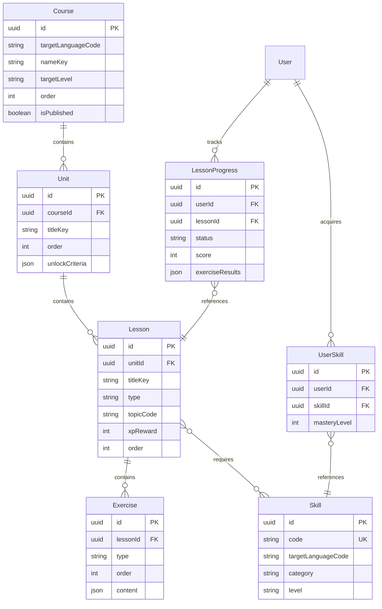

# Lesson Service - Spécifications Techniques Détaillées

## 📋 Table des Matières

1. [Vue d'Ensemble](#1-vue-densemble)
2. [Modèle de Données](#2-modèle-de-données)
3. [API REST](#3-api-rest)
4. [Événements Asynchrones](#4-événements-asynchrones)
5. [Règles Métier](#5-règles-métier)
6. [Performance et Scalabilité](#6-performance-et-scalabilité)
7. [Sécurité](#7-sécurité)
8. [Tests](#8-tests)
9. [Monitoring et Logs](#9-monitoring-et-logs)
10. [Configuration](#10-configuration)

---

## 1. Vue d'Ensemble

### 1.1 Responsabilité

Le **Lesson Service** gère l'intégralité du curriculum pédagogique de WeSpeak, incluant :
- Courses (parcours complets par langue)
- Units (groupes thématiques)
- Lessons (leçons individuelles)
- Exercises (exercices variés)
- Skills (compétences linguistiques)
- Progression utilisateur

### 1.2 Périmètre fonctionnel

**Fonctionnalités principales** :
- Curriculum structuré par langue et niveau (A1-C2)
- Exercices variés (vocabulaire, grammaire, écoute, répétition, oral)
- Progression personnalisée avec déblocage séquentiel
- Système de révisions espacées (spaced repetition)
- Tracking détaillé des performances par exercice
- Gestion des compétences (skills) acquises

**Hors périmètre** :
- Analyse de feedback oral (→ feedback-service)
- Système XP et badges (→ gamification-service)
- Recommandations personnalisées (→ recommendation-service)

### 1.3 Dépendances

**Services appelés** :
- `auth-service` : Validation tokens JWT, récupération profils d'apprentissage
- `gamification-service` : Attribution XP à la complétion de leçons
- `recommendation-service` : Notification de nouvelles données pour re-calcul

**Services appelant** :
- `api-gateway` : Toutes les requêtes frontend
- `recommendation-service` : Récupération métadonnées leçons/skills
- `feedback-service` : Mapping erreurs → skills recommandés

### 1.4 Technologies

- **Runtime** : Node.js 20+ avec TypeScript
- **Framework** : NestJS (modules, dependency injection, decorators)
- **Database** : PostgreSQL 15+ (données relationnelles structurées)
- **Cache** : Redis (leçons fréquentes, métadonnées courses)
- **Message Queue** : Kafka (événements progression)
- **Validation** : class-validator, class-transformer
- **ORM** : TypeORM ou Prisma
- **Testing** : Jest, Supertest

---

## 2. Modèle de Données

### 2.1 Entités principales

#### Course

```typescript
interface Course {
  id: string; // UUID
  targetLanguageCode: string; // ISO 639-1 (ex: 'en', 'fr', 'es')
  uiSupportedLanguages: string[]; // Langues UI supportées pour ce cours
  nameKey: string; // Clé i18n ex: 'course.travel.beginner'
  descriptionKey: string; // Clé i18n
  targetLevel: string; // 'A1' | 'A2' | 'B1' | 'B2' | 'C1' | 'C2'
  goal?: string; // 'work' | 'travel' | 'studies' | 'personal'
  imageUrl?: string;
  estimatedHours: number;
  order: number; // Ordre d'affichage
  isPublished: boolean;
  createdAt: Date;
  updatedAt: Date;
}
```

**Indexes** :
- `idx_course_language_level` : (targetLanguageCode, targetLevel)
- `idx_course_published` : (isPublished, order)

#### Unit

```typescript
interface Unit {
  id: string; // UUID
  courseId: string; // FK Course
  titleKey: string; // Clé i18n
  descriptionKey: string; // Clé i18n
  order: number;
  unlockCriteria?: {
    previousUnitId?: string;
    minScore?: number; // Score minimum requis sur l'unité précédente
    minXP?: number;
  };
  imageUrl?: string;
  createdAt: Date;
  updatedAt: Date;
}
```

**Indexes** :
- `idx_unit_course` : (courseId, order)

#### Lesson

```typescript
interface Lesson {
  id: string; // UUID
  unitId: string; // FK Unit
  titleKey: string; // Clé i18n
  descriptionKey?: string; // Clé i18n
  type: 'vocab' | 'grammar' | 'listening' | 'speaking' | 'conversation_prep';
  topicCode: string; // ex: 'restaurant.ordering', 'travel.airport'
  targetLanguageCode: string;
  estimatedDurationMinutes: number;
  order: number;
  xpReward: number; // XP de base attribué à la complétion
  unlockCriteria?: {
    previousLessonId?: string;
    requiredSkills?: string[]; // Skill IDs requis
  };
  createdAt: Date;
  updatedAt: Date;
}
```

**Indexes** :
- `idx_lesson_unit` : (unitId, order)
- `idx_lesson_language_topic` : (targetLanguageCode, topicCode)

#### Exercise

```typescript
interface Exercise {
  id: string; // UUID
  lessonId: string; // FK Lesson
  type: 'mcq' | 'fill_gap' | 'listen_and_repeat' | 'speak_sentence' | 'translate' | 'match_pairs';
  order: number;
  promptKey: string; // Clé i18n pour la consigne
  promptAudioUrl?: string; // Audio de la consigne

  // Données spécifiques selon le type
  content: {
    // Type: MCQ (Multiple Choice Question)
    questionKey?: string;
    optionsKeys?: string[]; // Clés i18n des options
    correctOptionIndex?: number;

    // Type: Fill gap
    sentenceTemplateKey?: string; // Phrase avec {blank}
    missingWords?: string[]; // Mots acceptés (variations)

    // Type: Listen and repeat
    targetSentence?: string;
    targetAudioUrl?: string;

    // Type: Speak sentence
    targetSentence?: string; // Phrase cible à prononcer
    context?: string; // Contexte situationnel

    // Type: Translate
    sourceSentence?: string;
    targetSentence?: string;

    // Type: Match pairs
    leftItems?: string[]; // Clés i18n
    rightItems?: string[]; // Clés i18n
    correctPairs?: number[][]; // [[0,2], [1,0], ...] indexes
  };

  hints?: string[]; // Clés i18n pour indices progressifs
  explanation?: string; // Clé i18n pour explication après réponse
  difficultyLevel: number; // 1-5
  createdAt: Date;
  updatedAt: Date;
}
```

**Indexes** :
- `idx_exercise_lesson` : (lessonId, order)

#### Skill

```typescript
interface Skill {
  id: string; // UUID
  code: string; // ex: 'past_simple.en', 'food_vocab.es', 'pronunciation_th.en'
  targetLanguageCode: string;
  nameKey: string; // Clé i18n
  descriptionKey: string; // Clé i18n
  category: 'grammar' | 'vocabulary' | 'pronunciation' | 'expression';
  level: string; // 'A1' | 'A2' | ...
  parentSkillId?: string; // Pour hiérarchie (ex: 'verbs.en' parent de 'past_simple.en')
  relatedSkills?: string[]; // Skills connexes
  createdAt: Date;
  updatedAt: Date;
}
```

**Indexes** :
- `idx_skill_code` : (code) UNIQUE
- `idx_skill_language_category` : (targetLanguageCode, category, level)

#### LessonProgress

```typescript
interface LessonProgress {
  id: string; // UUID
  userId: string; // FK User (auth-service)
  lessonId: string; // FK Lesson
  targetLanguageCode: string; // Dénormalisé pour queries rapides
  status: 'not_started' | 'in_progress' | 'completed' | 'mastered';
  score: number; // 0-100
  attempts: number;
  timeSpentSeconds: number;
  completedAt?: Date;
  lastAttemptAt: Date;
  
  exerciseResults: {
    exerciseId: string;
    correct: boolean;
    attempts: number;
    timeSpentSeconds: number;
  }[];
  
  skillsAcquired: string[]; // Skill IDs débloqués par cette leçon
  createdAt: Date;
  updatedAt: Date;
}
```

**Indexes** :
- `idx_progress_user_lesson` : (userId, lessonId) UNIQUE
- `idx_progress_user_language_status` : (userId, targetLanguageCode, status)
- `idx_progress_completed_at` : (userId, completedAt)

#### UserSkill (Compétences acquises par utilisateur)

```typescript
interface UserSkill {
  id: string; // UUID
  userId: string;
  skillId: string;
  targetLanguageCode: string;
  masteryLevel: number; // 0-100
  timesEncountered: number;
  timesCorrect: number;
  lastPracticedAt: Date;
  createdAt: Date;
  updatedAt: Date;
}
```

**Indexes** :
- `idx_user_skill` : (userId, skillId) UNIQUE
- `idx_user_skill_language` : (userId, targetLanguageCode, masteryLevel)

### 2.2 Relations entre entités



### 2.3 Stratégie de migration

**Outils** : TypeORM migrations ou Prisma Migrate

**Migrations initiales** :
1. `001_create_courses_units_lessons.sql`
2. `002_create_exercises.sql`
3. `003_create_skills.sql`
4. `004_create_user_progress.sql`
5. `005_create_indexes.sql`

**Seed data** :
- Curriculum initial pour anglais (A1-B1)
- Skills de base par langue
- Exemples de leçons pour démo

---

## 3. API REST

### 3.1 Endpoints

| Méthode | Route | Description | Auth |
|---------|-------|-------------|------|
| `GET` | `/api/courses` | Liste des courses filtrés | JWT |
| `GET` | `/api/courses/:id` | Détails d'un course | JWT |
| `GET` | `/api/courses/:id/units` | Units d'un course | JWT |
| `GET` | `/api/units/:id` | Détails d'une unit | JWT |
| `GET` | `/api/units/:id/lessons` | Lessons d'une unit | JWT |
| `GET` | `/api/lessons/:id` | Détails d'une leçon | JWT |
| `GET` | `/api/lessons/:id/exercises` | Exercices d'une leçon | JWT |
| `POST` | `/api/lessons/:id/start` | Démarrer une leçon | JWT |
| `POST` | `/api/lessons/:id/complete` | Compléter une leçon | JWT |
| `GET` | `/api/lessons/:id/progress` | Progression sur une leçon | JWT |
| `POST` | `/api/exercises/:id/submit` | Soumettre réponse exercice | JWT |
| `GET` | `/api/skills` | Liste skills par langue | JWT |
| `GET` | `/api/skills/:id` | Détails d'un skill | JWT |
| `GET` | `/api/users/me/skills` | Skills acquis par user | JWT |
| `GET` | `/api/users/me/progress` | Progression globale user | JWT |

### 3.2 Schemas détaillés

#### `GET /api/courses`

**Query Parameters** :
```typescript
{
  targetLanguageCode: string; // Required
  level?: string; // 'A1', 'A2', etc.
  goal?: string; // 'work', 'travel', etc.
}
```

**Response 200** :
```typescript
{
  courses: [{
    id: string;
    targetLanguageCode: string;
    nameKey: string;
    descriptionKey: string;
    targetLevel: string;
    goal?: string;
    imageUrl?: string;
    estimatedHours: number;
    order: number;
    isPublished: boolean;
    unitsCount: number;
    lessonsCount: number;
    userProgress?: {
      completedLessons: number;
      totalLessons: number;
      percentageComplete: number;
    };
  }]
}
```

#### `GET /api/lessons/:id`

**Response 200** :
```typescript
{
  lesson: {
    id: string;
    unitId: string;
    titleKey: string;
    descriptionKey?: string;
    type: string;
    topicCode: string;
    targetLanguageCode: string;
    estimatedDurationMinutes: number;
    order: number;
    xpReward: number;
    unlockCriteria?: {
      previousLessonId?: string;
      requiredSkills?: string[];
    };
    isUnlocked: boolean; // Calculé dynamiquement
    exercisesCount: number;
    userProgress?: {
      status: string;
      score: number;
      attempts: number;
      lastAttemptAt: Date;
    };
  }
}
```

#### `POST /api/lessons/:id/start`

**Response 200** :
```typescript
{
  progressId: string;
  startedAt: Date;
}
```

#### `POST /api/exercises/:id/submit`

**Request Body** :
```typescript
{
  answer: any; // Format dépend du type d'exercice
  timeSpentSeconds: number;
}
```

**Response 200** :
```typescript
{
  correct: boolean;
  correctAnswer?: any; // Si incorrect
  explanation?: string; // Clé i18n
  xpEarned: number;
  skillsAcquired?: string[]; // Si skill débloqué
  nextExerciseId?: string;
  lessonCompleted: boolean;
}
```

#### `POST /api/lessons/:id/complete`

**Request Body** :
```typescript
{
  score: number; // 0-100
  timeSpentSeconds: number;
  exerciseResults: {
    exerciseId: string;
    correct: boolean;
    attempts: number;
    timeSpentSeconds: number;
  }[];
}
```

**Response 200** :
```typescript
{
  progressId: string;
  finalScore: number;
  xpEarned: number;
  skillsAcquired: string[];
  nextLesson?: {
    id: string;
    titleKey: string;
  };
  achievementsUnlocked?: string[]; // Badge IDs (depuis gamification-service)
}
```

#### `GET /api/users/me/progress`

**Query Parameters** :
```typescript
{
  targetLanguageCode: string; // Required
}
```

**Response 200** :
```typescript
{
  totalLessons: number;
  completedLessons: number;
  inProgressLessons: number;
  percentageComplete: number;
  totalXP: number; // Depuis gamification-service
  currentStreak: number; // Depuis gamification-service
  skillsAcquired: {
    total: number;
    byCategory: {
      grammar: number;
      vocabulary: number;
      pronunciation: number;
      expression: number;
    };
  };
  recentActivity: {
    lessonId: string;
    titleKey: string;
    completedAt: Date;
    score: number;
  }[];
}
```

### 3.3 Codes d'erreur

| Code HTTP | Message | Cas d'usage |
|-----------|---------|-------------|
| `400` | `INVALID_REQUEST` | Paramètres manquants/invalides |
| `401` | `UNAUTHORIZED` | Token JWT absent/invalide |
| `403` | `LESSON_LOCKED` | Leçon non débloquée (prérequis manquants) |
| `403` | `PREMIUM_REQUIRED` | Contenu premium pour Free tier |
| `404` | `LESSON_NOT_FOUND` | Leçon inexistante |
| `409` | `LESSON_ALREADY_COMPLETED` | Tentative de redémarrer leçon complétée |
| `422` | `INVALID_ANSWER_FORMAT` | Format de réponse incorrect |
| `500` | `INTERNAL_ERROR` | Erreur serveur |

---

## 4. Événements Asynchrones

### 4.1 Messages publiés (Kafka)

#### Topic : `lesson.events`

**Partitioning** : Par `userId` (garantit ordre événements par utilisateur)

**Event: `lesson.started`**
```json
{
  "eventType": "lesson.started",
  "version": "1.0",
  "timestamp": "2025-01-15T10:30:00Z",
  "payload": {
    "userId": "uuid",
    "lessonId": "uuid",
    "targetLanguageCode": "en",
    "lessonType": "vocab",
    "topicCode": "restaurant.ordering"
  },
  "metadata": {
    "correlationId": "uuid",
    "source": "lesson-service"
  }
}
```

**Event: `lesson.completed`**
```json
{
  "eventType": "lesson.completed",
  "version": "1.0",
  "timestamp": "2025-01-15T10:45:00Z",
  "payload": {
    "userId": "uuid",
    "lessonId": "uuid",
    "targetLanguageCode": "en",
    "score": 85,
    "timeSpentSeconds": 900,
    "xpEarned": 125,
    "skillsAcquired": ["past_simple.en", "food_vocab.en"],
    "perfectScore": false
  },
  "metadata": {
    "correlationId": "uuid",
    "source": "lesson-service"
  }
}
```

**Event: `skill.acquired`**
```json
{
  "eventType": "skill.acquired",
  "version": "1.0",
  "timestamp": "2025-01-15T10:45:00Z",
  "payload": {
    "userId": "uuid",
    "skillId": "uuid",
    "skillCode": "past_simple.en",
    "targetLanguageCode": "en",
    "masteryLevel": 60,
    "acquiredVia": "lesson", // 'lesson' | 'conversation' | 'practice'
    "sourceId": "lesson-uuid"
  },
  "metadata": {
    "correlationId": "uuid",
    "source": "lesson-service"
  }
}
```

**Consommé par** :
- `gamification-service` : Attribution XP, mise à jour streaks, badges
- `recommendation-service` : Mise à jour profil apprenant, recalcul recommandations
- `analytics-service` : Tracking progression, métriques engagement

### 4.2 Messages consommés

#### Topic : `user.events` (Consumer group: `lesson-service`)

**Event: `user.registered`**
```json
{
  "eventType": "user.registered",
  "payload": {
    "userId": "uuid",
    "learningProfiles": [{
      "targetLanguageCode": "en",
      "currentLevel": "A1"
    }]
  }
}
```

**Action déclenchée** :
- Initialiser progression vide pour tous les courses du niveau
- Créer entrées UserSkill pour skills de base

#### Topic : `feedback.events` (Consumer group: `lesson-service`)

**Event: `skill.mastery_updated`**
```json
{
  "eventType": "skill.mastery_updated",
  "payload": {
    "userId": "uuid",
    "skillId": "uuid",
    "newMasteryLevel": 75,
    "previousMasteryLevel": 60
  }
}
```

**Action déclenchée** :
- Mettre à jour `UserSkill.masteryLevel`
- Débloquer nouvelles leçons si seuils atteints

---

## 5. Règles Métier

### 5.1 Déblocage de contenu

**Règles de déblocage de leçons** :
1. **Prérequis de leçon** : Si `unlockCriteria.previousLessonId` existe :
   - Leçon précédente doit avoir `status = 'completed'`
   - Score ≥ 70% sur leçon précédente

2. **Prérequis de skills** : Si `unlockCriteria.requiredSkills` existe :
   - Tous les skills requis doivent être dans `UserSkill` avec `masteryLevel ≥ 50`

3. **Prérequis d'unité** : Si `Unit.unlockCriteria` existe :
   - Unité précédente complétée à minScore%
   - OU XP total ≥ minXP

**Algorithme de vérification** :
```typescript
function isLessonUnlocked(userId: string, lessonId: string): boolean {
  const lesson = await getLessonById(lessonId);
  
  // Check previous lesson
  if (lesson.unlockCriteria?.previousLessonId) {
    const prevProgress = await getLessonProgress(userId, lesson.unlockCriteria.previousLessonId);
    if (!prevProgress || prevProgress.status !== 'completed' || prevProgress.score < 70) {
      return false;
    }
  }
  
  // Check required skills
  if (lesson.unlockCriteria?.requiredSkills?.length > 0) {
    const userSkills = await getUserSkills(userId, lesson.unlockCriteria.requiredSkills);
    const allMastered = userSkills.every(skill => skill.masteryLevel >= 50);
    if (!allMastered) {
      return false;
    }
  }
  
  // Check unit unlock
  const unit = await getUnitById(lesson.unitId);
  if (unit.unlockCriteria?.previousUnitId) {
    // ... check unit completion
  }
  
  return true;
}
```

### 5.2 Calcul des scores et XP

**Score d'une leçon** :
```
score = (correctExercises / totalExercises) × 100
```

**XP attribué** :
```
baseXP = lesson.xpReward

if (score >= 90) {
  multiplier = 1.5  // Perfect mastery
} else if (score >= 80) {
  multiplier = 1.25 // High performance
} else if (score >= 70) {
  multiplier = 1.0  // Pass
} else {
  multiplier = 0.5  // Incomplete (no completion, retry required)
}

xpEarned = baseXP × multiplier × streakBonus
```

### 5.3 Système de révisions espacées

**Courbe d'oubli** (Ebbinghaus) :
```
Révision requise après :
- 1 jour (si masteryLevel < 70)
- 3 jours (si 70 ≤ masteryLevel < 85)
- 7 jours (si 85 ≤ masteryLevel < 95)
- 14 jours (si masteryLevel ≥ 95)
```

**Mise en place** :
- Job quotidien (cron) identifie leçons à réviser
- Leçons marquées `status: 'review_due'` dans progression
- Affichées prioritairement dans recommendations

### 5.4 Acquisition de skills

**Conditions d'acquisition** :
1. Compléter une leçon contenant le skill avec score ≥ 70%
2. Réussir ≥ 80% des exercices liés à ce skill dans la leçon

**Calcul du `masteryLevel`** :
```
initialMastery = 50 (si première acquisition)

masteryLevel = min(100, currentMastery + (scoreLesson / 100) × 20)

Si exercices du skill échoués :
  masteryLevel -= 10 par échec (minimum 0)
```

### 5.5 Quotas Free tier

**Limites Free** :
- Accès courses niveau A1-A2 uniquement
- 5 leçons/jour maximum
- Pas de révisions espacées automatiques

**Premium** :
- Accès tous niveaux
- Illimité leçons/jour
- Révisions espacées activées
- Contenu exclusif (leçons avancées)

---

## 6. Performance et Scalabilité

### 6.1 Stratégies de cache (Redis)

**Données cachées** :
- **Métadonnées courses** : `course:{languageCode}:list` (TTL: 1h)
- **Détails lesson** : `lesson:{id}` (TTL: 30min)
- **Skills par langue** : `skills:{languageCode}` (TTL: 2h)
- **User progress summary** : `progress:{userId}:{languageCode}` (TTL: 5min)

**Invalidation** :
- Lors de `lesson.completed` : invalider `progress:{userId}:*`
- Lors de création/modification contenu : invalider caches concernés

### 6.2 Optimisations queries

**Indexes critiques** :
```sql
CREATE INDEX idx_lesson_progress_user_language ON lesson_progress(user_id, target_language_code, status);
CREATE INDEX idx_lesson_progress_completed ON lesson_progress(user_id, completed_at DESC) WHERE status = 'completed';
CREATE INDEX idx_user_skill_mastery ON user_skill(user_id, target_language_code, mastery_level DESC);
```

**Queries optimisées** :
- Utiliser `SELECT DISTINCT` avec précaution
- Eager loading des relations fréquentes (units → lessons)
- Pagination systématique pour listes (limit 50 par défaut)

### 6.3 Limites et quotas

**Rate limiting** :
- 100 requêtes/minute par utilisateur
- 10 soumissions d'exercices/minute (anti-spam)

**Contraintes DB** :
- Max 100 exercices par leçon
- Max 50 leçons par unit
- Max 20 units par course

---

## 7. Sécurité

### 7.1 Authentification

**JWT validation** :
- Tous les endpoints nécessitent header `Authorization: Bearer <token>`
- Validation signature JWT via clé publique partagée avec auth-service
- Extraction `userId` depuis claims JWT

### 7.2 Autorisation

**Règles** :
- Utilisateur ne peut accéder qu'à ses propres progressions
- Vérification ownership : `userId` dans JWT === `userId` dans ressource
- Admin role peut accéder à toutes ressources (pour support)

### 7.3 Validation des entrées

**Validation schemas** (class-validator) :
```typescript
class SubmitExerciseDto {
  @IsNotEmpty()
  answer: any;

  @IsInt()
  @Min(0)
  @Max(3600)
  timeSpentSeconds: number;
}
```

**Sanitization** :
- Réponses textuelles : trim, lowercase pour comparaison
- Pas de HTML/scripts autorisés dans réponses

### 7.4 Protection données sensibles

**Logs** :
- Ne jamais logger réponses utilisateurs complètes
- Anonymiser userId dans logs publics (hash)

---

## 8. Tests

### 8.1 Tests unitaires

**Couverture cible** : 80%

**Cas critiques** :
- Calcul scores leçons
- Algorithme déblocage leçons
- Calcul XP avec multiplicateurs
- Logique acquisition skills

**Exemple** :
```typescript
describe('LessonProgressService', () => {
  describe('calculateScore', () => {
    it('should return 100 if all exercises correct', () => {
      const results = [
        { correct: true },
        { correct: true },
        { correct: true }
      ];
      expect(service.calculateScore(results)).toBe(100);
    });

    it('should return 67 if 2/3 exercises correct', () => {
      const results = [
        { correct: true },
        { correct: true },
        { correct: false }
      ];
      expect(service.calculateScore(results)).toBe(67);
    });
  });
});
```

### 8.2 Tests d'intégration

**Scénarios** :
1. **Parcours complet leçon** :
   - Start lesson → Submit exercises → Complete lesson
   - Vérifier progression saved, XP attribué, skills acquis

2. **Déblocage séquentiel** :
   - Complete lesson 1 (score 80%)
   - Vérifier lesson 2 unlocked
   - Complete lesson 1 (score 50%)
   - Vérifier lesson 2 still locked

3. **Révisions espacées** :
   - Complete lesson → attendre 1 jour (simulé)
   - Vérifier status = 'review_due'

### 8.3 Tests de charge

**Outils** : k6, Artillery

**Scénarios** :
- 1000 utilisateurs simultanés consultant leçons
- 500 soumissions exercices/seconde
- Temps de réponse p95 < 200ms

---

## 9. Monitoring et Logs

### 9.1 Métriques (Prometheus)

**Métriques métier** :
- `lessons_started_total{language, level}` : Counter
- `lessons_completed_total{language, level, score_range}` : Counter
- `lesson_completion_time_seconds` : Histogram
- `exercises_submitted_total{type, correct}` : Counter
- `skills_acquired_total{language, category}` : Counter

**Métriques techniques** :
- `http_requests_total{method, endpoint, status}` : Counter
- `http_request_duration_seconds` : Histogram
- `db_query_duration_seconds` : Histogram
- `cache_hits_total` : Counter
- `cache_misses_total` : Counter

### 9.2 Logs applicatifs

**Format** : JSON structuré

**Niveaux** :
- `INFO` : Lesson started, completed, skills acquired
- `WARN` : Slow query, cache miss critique
- `ERROR` : DB errors, Kafka publish failures

**Exemple** :
```json
{
  "timestamp": "2025-01-15T10:30:00Z",
  "level": "INFO",
  "service": "lesson-service",
  "event": "lesson.completed",
  "userId": "hash",
  "lessonId": "uuid",
  "score": 85,
  "xpEarned": 125,
  "duration": 900
}
```

### 9.3 Alertes

**Alertes critiques** :
- Taux d'erreur > 5% sur 5min
- P95 latency > 500ms sur 5min
- DB connexions pool saturé > 80%
- Kafka consumer lag > 1000 messages

**Alertes warning** :
- Cache hit rate < 70%
- Leçons complétées/jour < 50% moyenne hebdo (churn signal)

---

## 10. Configuration

### 10.1 Variables d'environnement

```bash
# Service
NODE_ENV=production|development
PORT=3002
SERVICE_NAME=lesson-service

# Database
DB_HOST=postgres.example.com
DB_PORT=5432
DB_NAME=wespeak_lessons
DB_USER=lesson_service
DB_PASSWORD=***
DB_POOL_MIN=5
DB_POOL_MAX=20

# Redis
REDIS_HOST=redis.example.com
REDIS_PORT=6379
REDIS_PASSWORD=***
REDIS_DB=2

# Kafka
KAFKA_BROKERS=kafka1:9092,kafka2:9092,kafka3:9092
KAFKA_CLIENT_ID=lesson-service
KAFKA_GROUP_ID=lesson-service-group
KAFKA_TOPIC_LESSONS=lesson.events
KAFKA_TOPIC_USER=user.events
KAFKA_TOPIC_FEEDBACK=feedback.events

# Auth
JWT_PUBLIC_KEY=*** # RSA public key from auth-service

# Services
AUTH_SERVICE_URL=http://auth-service:3001
GAMIFICATION_SERVICE_URL=http://gamification-service:3005

# Cache TTL (seconds)
CACHE_TTL_COURSES=3600
CACHE_TTL_LESSONS=1800
CACHE_TTL_SKILLS=7200
CACHE_TTL_PROGRESS=300

# Rate limiting
RATE_LIMIT_GENERAL=100 # requests per minute
RATE_LIMIT_SUBMIT=10   # exercise submissions per minute

# Features flags
ENABLE_SPACED_REPETITION=true
ENABLE_PREMIUM_CONTENT=true
FREE_TIER_DAILY_LIMIT=5
```

### 10.2 Configuration par environnement

**Development** :
- DB local (docker-compose)
- Cache Redis local
- Kafka local (optionnel, mock events)
- Seed data automatique

**Staging** :
- DB staging (replica production)
- Redis staging cluster
- Kafka staging
- Monitoring activé

**Production** :
- DB PostgreSQL managed (RDS/CloudSQL)
- Redis Cluster (Elasticache/MemoryStore)
- Kafka Cluster (MSK/Confluent)
- Réplication multi-zone
- Backups quotidiens DB

---

## 11. Migration et Déploiement

### 11.1 Stratégie de déploiement

**Rolling deployment** :
- 0 downtime
- Déploiement progressif par pods (Kubernetes)
- Health checks avant routing trafic

**Health checks** :
```
GET /health
→ 200 OK si DB accessible + Redis accessible

GET /health/ready
→ 200 OK si service prêt à recevoir trafic
```

### 11.2 Rollback

**Conditions rollback automatique** :
- Health checks échouent > 3 fois
- Taux d'erreur > 10% pendant 2min

**Procédure rollback** :
- Redéployer version N-1
- Vérifier Kafka consumers rattrapent lag
- Invalider caches si changements schema

### 11.3 Migrations DB

**Process** :
1. Exécuter migration avant déploiement code
2. Migrations backward-compatible (ajout colonnes nullable)
3. Déployer nouvelle version code
4. Cleanup ancien schema après validation (migration suivante)

**Exemple migration additive** :
```sql
-- Migration 006: Add review scheduling
ALTER TABLE lesson_progress ADD COLUMN next_review_at TIMESTAMP NULL;
CREATE INDEX idx_next_review ON lesson_progress(user_id, next_review_at) WHERE next_review_at IS NOT NULL;
```

---

## Checklist de validation

- [ ] Toutes les entités ont indexes pour queries fréquentes
- [ ] Cache Redis configuré pour endpoints haute fréquence
- [ ] Événements Kafka publiés pour toutes actions critiques
- [ ] JWT validation sur tous endpoints
- [ ] Rate limiting configuré
- [ ] Tests unitaires couvrent logique métier critique
- [ ] Tests d'intégration pour workflows complets
- [ ] Métriques Prometheus exposées
- [ ] Logs structurés JSON avec correlation IDs
- [ ] Health checks implémentés
- [ ] Documentation OpenAPI générée
- [ ] Variables d'environnement documentées
- [ ] Seed data pour démo/tests

---

**Version** : 1.0.0  
**Dernière mise à jour** : 2025-01-15  
**Auteur** : WeSpeak Product Owner AI
