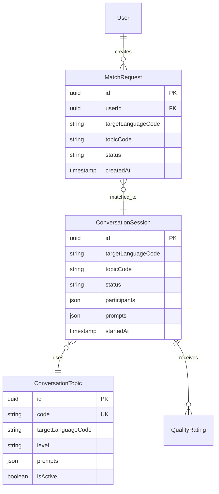
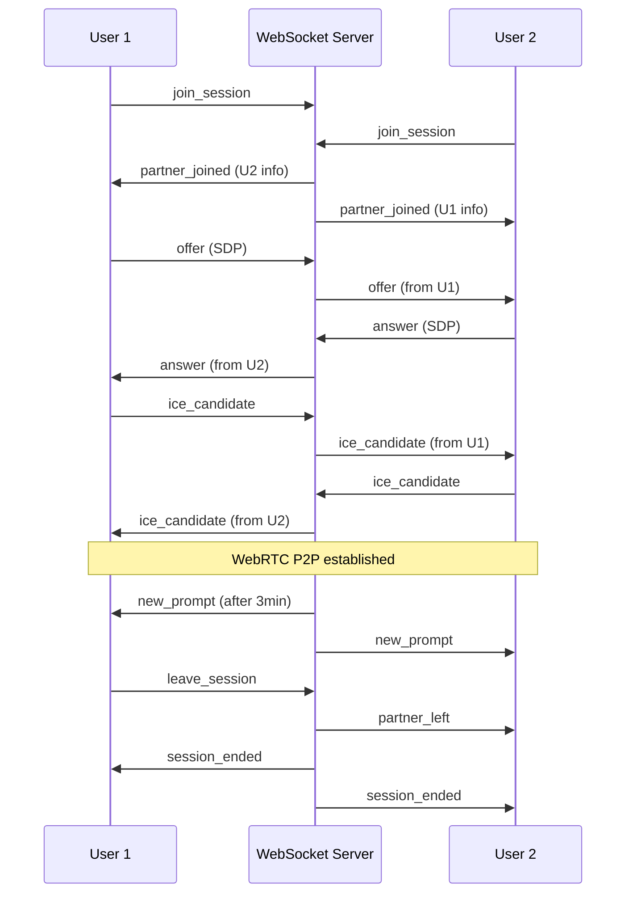

# Conversation Service - Spécifications Techniques Détaillées

## 📋 Table des Matières

1. [Vue d'Ensemble](#1-vue-densemble)
2. [Modèle de Données](#2-modèle-de-données)
3. [API REST](#3-api-rest)
4. [WebRTC Signaling](#4-webrtc-signaling)
5. [Événements Asynchrones](#5-événements-asynchrones)
6. [Règles Métier](#6-règles-métier)
7. [Performance et Scalabilité](#7-performance-et-scalabilité)
8. [Sécurité](#8-sécurité)
9. [Tests](#9-tests)
10. [Monitoring et Logs](#10-monitoring-et-logs)
11. [Configuration](#11-configuration)

---

## 1. Vue d'Ensemble

### 1.1 Responsabilité

Le **Conversation Service** gère les conversations orales en temps réel entre apprenants, incluant :
- Matchmaking intelligent par langue, niveau, thème
- Sessions de conversation 1v1 via WebRTC
- Gestion des prompts de discussion guidés
- Enregistrement automatique pour feedback IA
- Mode "tandem" pour échange linguistique bidirectionnel

### 1.2 Périmètre fonctionnel

**Fonctionnalités principales** :
- Algorithme de matchmaking intelligent
- WebRTC signaling (SDP exchange, ICE candidates)
- Gestion du cycle de vie des sessions
- Topics de conversation structurés par niveau
- Enregistrement audio automatique (Cloudflare R2)
- Ratings et feedback post-conversation

**Hors périmètre** :
- Transcription et analyse (→ feedback-service)
- Attribution XP (→ gamification-service)
- Recommandations de topics (→ recommendation-service)

### 1.3 Dépendances

**Services appelés** :
- `auth-service` : Validation JWT, récupération profils d'apprentissage
- `gamification-service` : Attribution XP post-conversation
- `feedback-service` : Déclenchement analyse audio
- `storage-service` : Upload enregistrements audio (R2)

**Services appelant** :
- `api-gateway` : Toutes les requêtes frontend
- `recommendation-service` : Statistiques pour suggestions topics

### 1.4 Technologies

- **Runtime** : Node.js 20+ avec TypeScript
- **Framework** : NestJS
- **WebSocket** : Socket.io (signaling WebRTC)
- **Database** : PostgreSQL (sessions, ratings)
- **Cache** : Redis (matchmaking queue, sessions actives)
- **Message Queue** : Kafka (événements conversations)
- **Storage** : Cloudflare R2 (enregistrements audio)
- **Real-time** : Redis Pub/Sub (coordination multi-instances)

---

## 2. Modèle de Données

### 2.1 Entités principales

#### MatchRequest

```typescript
interface MatchRequest {
  id: string; // UUID
  userId: string; // FK User
  targetLanguageCode: string; // Langue à pratiquer
  nativeLanguageCode: string; // Langue maternelle
  currentLevel: string; // 'A1' | 'A2' | ...
  preferredPartnerLevel?: string; // 'same' | 'higher' | 'lower' | 'any'
  preferredPartnerNativeLanguageCode?: string; // Pour mode tandem
  topicCode: string; // ex: 'daily_life', 'travel.airport'
  preferredAccent?: string; // ex: 'en-US', 'en-GB'
  mode: 'now' | 'scheduled'; // Immédiat ou planifié
  scheduledFor?: Date; // Si mode=scheduled
  maxWaitTimeSeconds: number; // Timeout avant abandon
  status: 'pending' | 'matched' | 'expired' | 'cancelled';
  matchedSessionId?: string; // Si matched
  createdAt: Date;
  matchedAt?: Date;
  expiresAt: Date;
}
```

**Indexes** :
- `idx_match_status_language` : (status, targetLanguageCode, createdAt)
- `idx_match_user` : (userId, status)

#### ConversationSession

```typescript
interface ConversationSession {
  id: string; // UUID
  targetLanguageCode: string;
  topicCode: string;
  targetLevel: string; // Niveau moyen des participants
  sessionType: 'practice' | 'tandem'; // Practice: même langue / Tandem: échange

  participants: [{
    userId: string;
    nativeLanguageCode: string;
    targetLanguageCode: string; // Langue qu'il pratique
    role: 'learner' | 'partner';
    joinedAt: Date;
    leftAt?: Date;
    spokenSeconds: number; // Temps de parole calculé
    turnCount: number; // Nombre de prises de parole
    audioStreamUrl?: string; // URL track audio individuel
  }];

  prompts: [{
    promptKey: string; // Clé i18n
    displayedAt: Date;
    category: 'icebreaker' | 'main_topic' | 'follow_up';
  }];

  status: 'waiting' | 'active' | 'completed' | 'aborted';
  startedAt?: Date; // Quand 2 participants ont rejoint
  endedAt?: Date;
  durationSeconds: number;

  recordingUrl?: string; // URL enregistrement complet R2
  transcriptId?: string; // UUID du transcript (feedback-service)

  qualityRating?: [{
    userId: string;
    rating: number; // 1-5
    feedback?: string;
    ratedAt: Date;
  }];

  createdAt: Date;
  updatedAt: Date;
}
```

**Indexes** :
- `idx_session_status` : (status, createdAt)
- `idx_session_user` : Utiliser JSON index sur participants.userId
- `idx_session_completed` : (status, endedAt) WHERE status='completed'

#### ConversationTopic

```typescript
interface ConversationTopic {
  id: string; // UUID
  code: string; // ex: 'restaurant.ordering', 'travel.airport'
  targetLanguageCode: string;
  nameKey: string; // Clé i18n
  descriptionKey: string; // Clé i18n
  level: string; // 'A1' | 'A2' | ...
  category: 'daily_life' | 'travel' | 'work' | 'hobbies' | 'culture' | 'other';

  prompts: [{
    promptKey: string; // Clé i18n
    type: 'icebreaker' | 'main' | 'follow_up';
    order: number;
  }];

  requiredSkills?: string[]; // Skill IDs requis (pour déblocage)
  estimatedDurationMinutes: number;
  imageUrl?: string;
  isActive: boolean;
  popularityScore: number; // Calculé selon usage (pour recommendations)
  createdAt: Date;
  updatedAt: Date;
}
```

**Indexes** :
- `idx_topic_code` : (code) UNIQUE
- `idx_topic_language_level` : (targetLanguageCode, level, isActive)

### 2.2 Relations entre entités



### 2.3 Stockage Redis (Cache & Queue)

**Matchmaking Queue** :
```
Key: match_queue:{languageCode}:{level}:{topicCode}
Type: Sorted Set
Score: timestamp (pour FIFO et timeout)
Value: matchRequestId
TTL: 300 seconds (auto-cleanup expired)
```

**Active Sessions** :
```
Key: session:{sessionId}
Type: Hash
Fields: {status, participantIds, startedAt, promptIndex}
TTL: 3600 seconds (cleanup sessions zombies)
```

**User active session** :
```
Key: user_session:{userId}
Type: String
Value: sessionId
TTL: 3600 seconds
```

---

## 3. API REST

### 3.1 Endpoints

| Méthode | Route | Description | Auth |
|---------|-------|-------------|------|
| `POST` | `/api/conversations/match-request` | Créer demande de match | JWT |
| `DELETE` | `/api/conversations/match-request/:id` | Annuler demande | JWT |
| `GET` | `/api/conversations/match-request/status` | Statut match en cours | JWT |
| `GET` | `/api/conversations/topics` | Liste topics disponibles | JWT |
| `GET` | `/api/conversations/topics/:code` | Détails d'un topic | JWT |
| `POST` | `/api/conversations/sessions/:id/join` | Rejoindre session | JWT |
| `POST` | `/api/conversations/sessions/:id/leave` | Quitter session | JWT |
| `GET` | `/api/conversations/sessions/:id` | Détails session | JWT |
| `POST` | `/api/conversations/sessions/:id/end` | Terminer session | JWT |
| `POST` | `/api/conversations/sessions/:id/rate` | Noter session | JWT |
| `GET` | `/api/conversations/history` | Historique conversations | JWT |
| `GET` | `/api/conversations/sessions/:id/transcript` | Transcript disponible | JWT |

### 3.2 Schemas détaillés

#### `POST /api/conversations/match-request`

**Request Body** :
```typescript
{
  targetLanguageCode: string; // Required
  topicCode: string; // Required
  preferredPartnerLevel?: 'same' | 'higher' | 'lower' | 'any'; // Default: 'same'
  preferredPartnerNativeLanguageCode?: string; // Pour tandem
  mode: 'now' | 'scheduled'; // Default: 'now'
  scheduledFor?: string; // ISO date si mode='scheduled'
}
```

**Response 201** :
```typescript
{
  matchRequest: {
    id: string;
    status: 'pending';
    estimatedWaitTimeSeconds: number;
    expiresAt: string; // ISO date
  }
}
```

#### `GET /api/conversations/match-request/status`

**Response 200** :
```typescript
{
  matchRequest: {
    id: string;
    status: 'pending' | 'matched' | 'expired';
    sessionId?: string; // Si matched
    waitedSeconds: number;
    expiresAt: string;
  }
}
```

#### `GET /api/conversations/topics`

**Query Parameters** :
```typescript
{
  targetLanguageCode: string; // Required
  level?: string; // Filtrer par niveau
  category?: string; // Filtrer par catégorie
}
```

**Response 200** :
```typescript
{
  topics: [{
    code: string;
    nameKey: string;
    descriptionKey: string;
    level: string;
    category: string;
    imageUrl?: string;
    estimatedDurationMinutes: number;
    popularityScore: number;
    isUnlocked: boolean; // Calculé selon requiredSkills
  }]
}
```

#### `POST /api/conversations/sessions/:id/join`

**Response 200** :
```typescript
{
  session: {
    id: string;
    status: 'waiting' | 'active';
    participants: [{
      userId: string;
      displayName: string;
      avatarUrl?: string;
      nativeLanguageCode: string;
      targetLanguageCode: string;
    }];
    topic: {
      code: string;
      nameKey: string;
      firstPromptKey: string;
    };
    webrtcConfig: {
      iceServers: [{
        urls: string[];
        username?: string;
        credential?: string;
      }];
    };
  }
}
```

#### `GET /api/conversations/sessions/:id`

**Response 200** :
```typescript
{
  session: {
    id: string;
    status: string;
    topicCode: string;
    participants: [{
      userId: string;
      displayName: string;
      nativeLanguageCode: string;
      targetLanguageCode: string;
      spokenSeconds: number;
      turnCount: number;
    }];
    durationSeconds: number;
    startedAt?: string;
    endedAt?: string;
    recordingUrl?: string;
    transcriptAvailable: boolean;
  }
}
```

#### `POST /api/conversations/sessions/:id/rate`

**Request Body** :
```typescript
{
  rating: number; // 1-5
  feedback?: string; // Optionnel, max 500 chars
}
```

**Response 200** :
```typescript
{
  success: true;
  averageRating: number; // Moyenne des ratings de la session
}
```

#### `GET /api/conversations/history`

**Query Parameters** :
```typescript
{
  userId?: string; // Si admin, sinon auto depuis JWT
  targetLanguageCode?: string;
  limit?: number; // Default: 20, max: 100
  offset?: number; // Default: 0
}
```

**Response 200** :
```typescript
{
  conversations: [{
    sessionId: string;
    topicCode: string;
    topicNameKey: string;
    partnerDisplayName: string;
    durationSeconds: number;
    completedAt: string;
    myRating?: number;
    transcriptAvailable: boolean;
  }];
  total: number;
  hasMore: boolean;
}
```

### 3.3 Codes d'erreur

| Code HTTP | Message | Cas d'usage |
|-----------|---------|-------------|
| `400` | `INVALID_REQUEST` | Paramètres manquants/invalides |
| `401` | `UNAUTHORIZED` | Token JWT absent/invalide |
| `403` | `TOPIC_LOCKED` | Skills requis non acquis |
| `403` | `DAILY_LIMIT_REACHED` | Quota Free tier atteint |
| `404` | `SESSION_NOT_FOUND` | Session inexistante |
| `409` | `ALREADY_IN_SESSION` | Utilisateur déjà dans une session |
| `409` | `ALREADY_MATCHED` | Déjà une demande de match active |
| `410` | `MATCH_EXPIRED` | Timeout matchmaking |
| `422` | `INVALID_RATING` | Rating hors plage 1-5 |
| `500` | `INTERNAL_ERROR` | Erreur serveur |
| `503` | `MATCHING_UNAVAILABLE` | Service matchmaking indisponible |

---

## 4. WebRTC Signaling

### 4.1 WebSocket Connection

**Endpoint** : `wss://api.wespeak.com/ws/conversations/:sessionId`

**Authentication** :
```typescript
// Lors de la connexion
socket.emit('authenticate', { token: JWT_TOKEN });
```

### 4.2 Events Client → Server

#### `join_session`
```typescript
{
  userId: string;
  sessionId: string;
}
```

#### `offer`
```typescript
{
  sessionId: string;
  sdp: string; // SDP offer WebRTC
  targetUserId: string; // Destinataire
}
```

#### `answer`
```typescript
{
  sessionId: string;
  sdp: string; // SDP answer
  targetUserId: string;
}
```

#### `ice_candidate`
```typescript
{
  sessionId: string;
  candidate: RTCIceCandidateInit;
  targetUserId: string;
}
```

#### `leave_session`
```typescript
{
  sessionId: string;
  userId: string;
}
```

#### `request_next_prompt`
```typescript
{
  sessionId: string;
}
```

### 4.3 Events Server → Client

#### `partner_joined`
```typescript
{
  partnerId: string;
  partnerName: string;
  partnerAvatar?: string;
  nativeLanguageCode: string;
  targetLanguageCode: string;
}
```

#### `offer`
```typescript
{
  from: string; // userId
  sdp: string;
}
```

#### `answer`
```typescript
{
  from: string;
  sdp: string;
}
```

#### `ice_candidate`
```typescript
{
  from: string;
  candidate: RTCIceCandidateInit;
}
```

#### `partner_left`
```typescript
{
  partnerId: string;
  reason: 'disconnect' | 'ended' | 'timeout';
}
```

#### `session_ended`
```typescript
{
  reason: 'completed' | 'partner_left' | 'timeout' | 'error';
  durationSeconds: number;
  recordingUrl?: string;
}
```

#### `new_prompt`
```typescript
{
  promptKey: string; // Clé i18n
  category: 'icebreaker' | 'main_topic' | 'follow_up';
}
```

#### `recording_started`
```typescript
{
  message: string; // "Recording started for feedback analysis"
}
```

### 4.4 Séquence WebRTC typique



---

## 5. Événements Asynchrones

### 5.1 Messages publiés (Kafka)

#### Topic : `conversation.events`

**Partitioning** : Par `userId` (pour ordre événements)

**Event: `match.requested`**
```json
{
  "eventType": "match.requested",
  "version": "1.0",
  "timestamp": "2025-01-15T10:30:00Z",
  "payload": {
    "matchRequestId": "uuid",
    "userId": "uuid",
    "targetLanguageCode": "en",
    "topicCode": "restaurant.ordering",
    "preferredPartnerLevel": "same"
  },
  "metadata": {
    "correlationId": "uuid",
    "source": "conversation-service"
  }
}
```

**Event: `conversation.matched`**
```json
{
  "eventType": "conversation.matched",
  "version": "1.0",
  "timestamp": "2025-01-15T10:32:00Z",
  "payload": {
    "sessionId": "uuid",
    "matchRequestIds": ["uuid1", "uuid2"],
    "participants": [{
      "userId": "uuid",
      "targetLanguageCode": "en",
      "nativeLanguageCode": "fr"
    }],
    "topicCode": "restaurant.ordering",
    "waitTimeSeconds": 120
  },
  "metadata": {
    "correlationId": "uuid",
    "source": "conversation-service"
  }
}
```

**Event: `conversation.started`**
```json
{
  "eventType": "conversation.started",
  "version": "1.0",
  "timestamp": "2025-01-15T10:33:00Z",
  "payload": {
    "sessionId": "uuid",
    "participants": [{
      "userId": "uuid",
      "targetLanguageCode": "en"
    }],
    "topicCode": "restaurant.ordering"
  },
  "metadata": {
    "correlationId": "uuid",
    "source": "conversation-service"
  }
}
```

**Event: `conversation.completed`**
```json
{
  "eventType": "conversation.completed",
  "version": "1.0",
  "timestamp": "2025-01-15T10:48:00Z",
  "payload": {
    "sessionId": "uuid",
    "participants": [{
      "userId": "uuid",
      "targetLanguageCode": "en",
      "spokenSeconds": 450,
      "turnCount": 12
    }],
    "durationSeconds": 900,
    "topicCode": "restaurant.ordering",
    "recordingUrl": "s3://wespeak-recordings/session-uuid.webm",
    "averageRating": 4.5
  },
  "metadata": {
    "correlationId": "uuid",
    "source": "conversation-service"
  }
}
```

**Consommé par** :
- `gamification-service` : Attribution XP, mise à jour streaks
- `feedback-service` : Déclenchement analyse audio
- `recommendation-service` : Mise à jour préférences topics
- `analytics-service` : Métriques engagement

### 5.2 Messages consommés

#### Topic : `user.events` (Consumer group: `conversation-service`)

**Event: `user.registered`**
- Aucune action spécifique (topics débloqués selon skills)

#### Topic : `lesson.events` (Consumer group: `conversation-service`)

**Event: `skill.acquired`**
```json
{
  "eventType": "skill.acquired",
  "payload": {
    "userId": "uuid",
    "skillId": "uuid",
    "skillCode": "restaurant_vocab.en"
  }
}
```

**Action déclenchée** :
- Invalider cache `unlocked_topics:{userId}`
- Recalculer topics accessibles

---

## 6. Règles Métier

### 6.1 Algorithme de matchmaking

**Étapes** :

1. **Critères obligatoires** :
   - `targetLanguageCode` identique
   - `topicCode` identique (ou compatible selon mapping)

2. **Critères préférentiels** (score de compatibilité) :
   - **Niveau** : ± 1 niveau max (sauf si `preferredPartnerLevel = 'any'`)
     - Même niveau : +50 points
     - ± 1 niveau : +30 points
     - > 1 niveau : 0 points (incompatible)
   
   - **Langue native** :
     - Si mode tandem : match si nativeLanguageCode de l'un = targetLanguageCode de l'autre (+100 points)
     - Sinon : pas de contrainte
   
   - **Accent préféré** :
     - Si match : +20 points
     - Sinon : 0 points
   
   - **Historique** :
     - Pas de conversation récente ensemble (< 7 jours) : +30 points
     - Déjà conversé ensemble : +10 points
     - Jamais conversé : +20 points

3. **Élargissement progressif** :
   - **0-30 secondes** : Critères stricts (score ≥ 100)
   - **30-60 secondes** : Élargir niveau (± 1 niveau accepté)
   - **60-120 secondes** : Élargir topic (topics compatibles de même catégorie)
   - **> 120 secondes** : Match "any level" + notification "estimated level difference"

4. **Sélection finale** :
   - Parmi candidats compatibles, prendre meilleur score
   - Si égalité, FIFO (premier arrivé)

**Implémentation** :
```typescript
async function findMatch(matchRequest: MatchRequest): Promise<MatchRequest | null> {
  const waitedSeconds = (Date.now() - matchRequest.createdAt.getTime()) / 1000;
  
  // Critères de base
  const candidates = await redis.zrangebyscore(
    `match_queue:${matchRequest.targetLanguageCode}:${matchRequest.topicCode}`,
    0,
    Date.now()
  );
  
  let bestMatch: MatchRequest | null = null;
  let bestScore = 0;
  
  for (const candidateId of candidates) {
    if (candidateId === matchRequest.id) continue;
    
    const candidate = await getMatchRequest(candidateId);
    const score = calculateCompatibilityScore(matchRequest, candidate, waitedSeconds);
    
    if (score > bestScore && score >= getMinScoreThreshold(waitedSeconds)) {
      bestScore = score;
      bestMatch = candidate;
    }
  }
  
  return bestMatch;
}

function calculateCompatibilityScore(req1: MatchRequest, req2: MatchRequest, waitedSeconds: number): number {
  let score = 0;
  
  // Niveau
  const levelDiff = Math.abs(getLevelNumber(req1.currentLevel) - getLevelNumber(req2.currentLevel));
  if (levelDiff === 0) score += 50;
  else if (levelDiff === 1) score += 30;
  else if (waitedSeconds < 60) return 0; // Incompatible si < 60s
  
  // Historique (async check, cached)
  const hasRecentConversation = await checkRecentConversation(req1.userId, req2.userId);
  if (!hasRecentConversation) score += 30;
  
  // Accent
  if (req1.preferredAccent && req1.preferredAccent === req2.preferredAccent) score += 20;
  
  return score;
}
```

### 6.2 Gestion des sessions

**États du cycle de vie** :

```
waiting → active → completed
   ↓         ↓
expired   aborted
```

**Transitions** :
- `waiting → active` : Quand 2 participants ont rejoint (WebSocket connected)
- `active → completed` : Quand un participant clique "End conversation" ou après 60min (premium) / 15min (free)
- `active → aborted` : Si un participant déconnecte < 1min après début
- `waiting → expired` : Si 2e participant ne rejoint pas dans 60 secondes

**Cleanup automatique** :
- Job cron toutes les 5min : marquer sessions `active` > 60min (premium) / 15min (free) comme `completed`
- Supprimer sessions `waiting` > 5min

### 6.3 Prompts dynamiques

**Fréquence** :
- Prompt initial (icebreaker) : dès connexion
- Prompts suivants : tous les 3-5 minutes (aléatoire)
- Max 5 prompts par session

**Sélection** :
```typescript
function selectNextPrompt(session: ConversationSession): string {
  const topic = getTopicByCode(session.topicCode);
  const displayedPrompts = session.prompts.map(p => p.promptKey);
  
  // Filter unused prompts
  const availablePrompts = topic.prompts.filter(p => 
    !displayedPrompts.includes(p.promptKey)
  );
  
  if (availablePrompts.length === 0) {
    // Recycle main_topic prompts
    return topic.prompts.find(p => p.type === 'main')?.promptKey || '';
  }
  
  // Prioritize: follow_up > main > icebreaker (après le 1er)
  const prioritized = availablePrompts.sort((a, b) => {
    const order = { follow_up: 1, main: 2, icebreaker: 3 };
    return order[a.type] - order[b.type];
  });
  
  return prioritized[0].promptKey;
}
```

### 6.4 Enregistrement audio

**Process** :
1. Frontend enregistre via MediaRecorder API (format: WebM Opus)
2. Chunks envoyés en stream pendant conversation (WebSocket binary)
3. Backend assemble et upload vers R2
4. URL R2 ajouté à `session.recordingUrl`
5. Event Kafka `conversation.completed` déclenche analyse (feedback-service)

**Consentement** :
- Affiché avant matchmaking : "Conversations are recorded for AI feedback"
- Utilisateur accepte via checkbox (requis)
- Pas d'enregistrement si désactivé (mais pas de feedback détaillé)

### 6.5 Quotas et limitations

**Free tier** :
- 3 conversations/semaine
- 15 minutes max par session
- Topics niveau A1-A2 uniquement
- Pas de scheduling (mode "now" uniquement)

**Premium** :
- Conversations illimitées
- 60 minutes max par session
- Tous topics accessibles
- Scheduling disponible (planifier jusqu'à 7 jours à l'avance)
- Priorité dans matchmaking (+50 points compatibilité)

---

## 7. Performance et Scalabilité

### 7.1 Stratégies de cache (Redis)

**Données cachées** :
- **Topics par langue/niveau** : `topics:{languageCode}:{level}` (TTL: 1h)
- **Unlocked topics par user** : `unlocked_topics:{userId}` (TTL: 10min)
- **Active sessions** : `session:{sessionId}` (TTL: 1h, auto-refresh)
- **User current session** : `user_session:{userId}` (TTL: 1h)

**Invalidation** :
- `skill.acquired` → invalider `unlocked_topics:{userId}`
- `session.completed` → delete `session:{id}` et `user_session:{userId}`

### 7.2 Scalabilité WebSocket

**Architecture multi-instances** :
- Redis Pub/Sub pour broadcast events entre instances
- Chaque instance WebSocket subscribe à `ws_events:{sessionId}`
- Lors de `offer`/`answer`/`ice_candidate`, publier sur Redis pour routage

**Sticky sessions** :
- WebSocket connections sticky par `sessionId` (via load balancer)
- Si instance crash, client reconnecte automatiquement (exponential backoff)

**Optimisations** :
- Heartbeat toutes les 30s pour détecter déconnexions
- Binary messages pour audio chunks (pas JSON)
- Compression WebSocket activée (permessage-deflate)

### 7.3 Limites et quotas

**Rate limiting** :
- 10 match requests/hour par user (anti-spam)
- 5 session joins/minute par user
- 100 WebSocket messages/minute par session (ICE candidates)

**Capacité système** :
- 10,000 sessions simultanées par instance WebSocket
- 100,000 match requests en queue (Redis sorted set)
- Timeout matchmaking : 2min (puis retry ou cancel)

---

## 8. Sécurité

### 8.1 Authentification WebSocket

```typescript
io.use(async (socket, next) => {
  const token = socket.handshake.auth.token;
  if (!token) return next(new Error('Authentication error'));
  
  try {
    const decoded = jwt.verify(token, JWT_PUBLIC_KEY);
    socket.data.userId = decoded.sub;
    next();
  } catch (err) {
    next(new Error('Invalid token'));
  }
});
```

### 8.2 Autorisation

**Règles** :
- User ne peut join que ses propres sessions (vérif `userId` dans `participants`)
- User ne peut rate que sessions auxquelles il a participé
- Admin peut voir toutes sessions (pour modération)

### 8.3 Validation WebRTC

**SDP Sanitization** :
- Valider format SDP avant broadcast (éviter injection)
- Limiter taille SDP à 10KB
- Rate limit ICE candidates (max 50/session)

### 8.4 Modération contenu

**Système de report** :
- Bouton "Report partner" post-conversation
- Stockage `session.reports` avec raison
- Si > 3 reports sur même user → flag pour review humaine

**Enregistrements** :
- Conservés 30 jours (analyse + contestations)
- Supprimés automatiquement après (GDPR compliant)
- Accès restreint (équipe modération uniquement)

---

## 9. Tests

### 9.1 Tests unitaires

**Couverture cible** : 80%

**Cas critiques** :
- Algorithme de matchmaking (scores compatibilité)
- Sélection prompts dynamiques
- Calcul temps de parole par participant
- État transitions session

**Exemple** :
```typescript
describe('MatchmakingService', () => {
  describe('calculateCompatibilityScore', () => {
    it('should return 80 for same level and no recent conversation', () => {
      const req1 = { currentLevel: 'A2', userId: 'user1' };
      const req2 = { currentLevel: 'A2', userId: 'user2' };
      const score = service.calculateCompatibilityScore(req1, req2, 10);
      expect(score).toBe(80); // 50 (level) + 30 (no recent)
    });

    it('should return 30 for +1 level difference', () => {
      const req1 = { currentLevel: 'A2' };
      const req2 = { currentLevel: 'B1' };
      const score = service.calculateCompatibilityScore(req1, req2, 10);
      expect(score).toBe(30);
    });
  });
});
```

### 9.2 Tests d'intégration

**Scénarios** :
1. **Matchmaking flow complet** :
   - Create 2 match requests (compatible)
   - Vérifier match dans < 5s
   - Vérifier session créée avec 2 participants

2. **WebRTC signaling** :
   - Simuler 2 clients WebSocket
   - Échanger offer/answer/ICE candidates
   - Vérifier broadcast correct

3. **Session timeout** :
   - Créer session `active`
   - Simuler 16min (free tier limit)
   - Vérifier auto-completion

### 9.3 Tests de charge

**Outils** : k6, Artillery

**Scénarios** :
- 1000 match requests simultanés
- 500 sessions WebRTC actives
- 100 matches/seconde
- Temps matchmaking p95 < 5s
- WebSocket latency p95 < 100ms

---

## 10. Monitoring et Logs

### 10.1 Métriques (Prometheus)

**Métriques métier** :
- `match_requests_total{language, topic}` : Counter
- `match_success_rate` : Gauge (%)
- `match_wait_time_seconds` : Histogram
- `conversations_active` : Gauge
- `conversations_completed_total{language, duration_range}` : Counter
- `conversation_rating_avg{topic}` : Gauge
- `prompts_displayed_total{type}` : Counter

**Métriques techniques** :
- `websocket_connections_active` : Gauge
- `websocket_messages_total{type}` : Counter
- `redis_queue_size{language}` : Gauge
- `r2_upload_duration_seconds` : Histogram

### 10.2 Logs applicatifs

**Format** : JSON structuré

**Niveaux** :
- `INFO` : Match found, conversation started/completed, prompts displayed
- `WARN` : Match timeout, session aborted, recording failed
- `ERROR` : WebSocket errors, Redis failures, R2 upload errors

**Exemple** :
```json
{
  "timestamp": "2025-01-15T10:32:00Z",
  "level": "INFO",
  "service": "conversation-service",
  "event": "conversation.matched",
  "sessionId": "uuid",
  "participants": ["user1", "user2"],
  "waitTimeSeconds": 120,
  "compatibilityScore": 80
}
```

### 10.3 Alertes

**Alertes critiques** :
- Match timeout rate > 30% (5min window)
- WebSocket disconnections > 10% (5min window)
- Enregistrements upload failures > 5%
- Redis queue size > 10,000

**Alertes warning** :
- Average wait time > 60s
- Conversation abort rate > 20%
- Rating average < 3.5 pour un topic

---

## 11. Configuration

### 11.1 Variables d'environnement

```bash
# Service
NODE_ENV=production
PORT=3003
SERVICE_NAME=conversation-service

# Database
DB_HOST=postgres.example.com
DB_PORT=5432
DB_NAME=wespeak_conversations
DB_USER=conversation_service
DB_PASSWORD=***

# Redis
REDIS_HOST=redis.example.com
REDIS_PORT=6379
REDIS_PASSWORD=***
REDIS_DB=3

# Kafka
KAFKA_BROKERS=kafka1:9092,kafka2:9092
KAFKA_CLIENT_ID=conversation-service
KAFKA_GROUP_ID=conversation-service-group
KAFKA_TOPIC_CONVERSATIONS=conversation.events
KAFKA_TOPIC_USER=user.events
KAFKA_TOPIC_LESSONS=lesson.events

# WebSocket
WS_PORT=3003
WS_PATH=/ws/conversations
WS_HEARTBEAT_INTERVAL=30000
WS_MAX_CONNECTIONS=10000

# WebRTC
TURN_SERVER_URL=turn:turn.wespeak.com:3478
TURN_USERNAME=***
TURN_CREDENTIAL=***
STUN_SERVER_URL=stun:stun.wespeak.com:3478

# Storage (Cloudflare R2)
R2_BUCKET_NAME=wespeak-recordings
R2_ACCOUNT_ID=***
R2_ACCESS_KEY=***
R2_SECRET_KEY=***
R2_RECORDINGS_PREFIX=sessions/

# Auth
JWT_PUBLIC_KEY=***

# Matching
MATCH_TIMEOUT_SECONDS=120
MATCH_QUEUE_CLEANUP_INTERVAL=60000
MIN_COMPATIBILITY_SCORE=50

# Session
SESSION_MAX_DURATION_FREE=900     # 15min
SESSION_MAX_DURATION_PREMIUM=3600 # 60min
SESSION_CLEANUP_INTERVAL=300000   # 5min
PROMPT_INTERVAL_MIN=180           # 3min
PROMPT_INTERVAL_MAX=300           # 5min

# Quotas
FREE_TIER_WEEKLY_LIMIT=3
RATE_LIMIT_MATCH_REQUESTS=10      # per hour
RATE_LIMIT_SESSION_JOINS=5        # per minute

# Recording
ENABLE_RECORDING=true
RECORDING_RETENTION_DAYS=30
```

### 11.2 Configuration TURN/STUN

**Production** :
- Serveurs TURN dédiés (coturn) pour NAT traversal
- Multiple STUN servers (failover)
- Credentials rotatives (TTL: 24h)

**Development** :
- STUN public (Google, Cloudflare)
- Pas de TURN (assume open network)

---

## Checklist de validation

- [ ] Algorithme matchmaking testé avec divers scénarios
- [ ] WebSocket signaling functional avec 2 clients simulés
- [ ] Enregistrements audio uploadés correctement vers R2
- [ ] Events Kafka publiés à chaque étape critique
- [ ] JWT validation sur tous endpoints REST
- [ ] WebSocket authentication avant join
- [ ] Rate limiting configuré (match requests, joins)
- [ ] Timeouts sessions (free vs premium)
- [ ] Redis queue cleanup job actif
- [ ] Métriques Prometheus exposées
- [ ] Logs structurés avec session/user IDs
- [ ] Health checks REST + WebSocket
- [ ] Tests de charge validés (500 sessions simultanées)
- [ ] TURN/STUN servers configurés et testés
- [ ] Seed data topics disponibles (A1-B2)

---

**Version** : 1.0.0  
**Dernière mise à jour** : 2025-01-15  
**Auteur** : WeSpeak Product Owner AI
