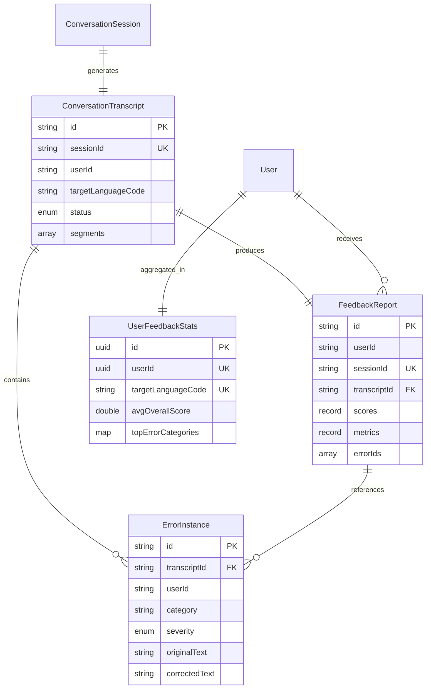
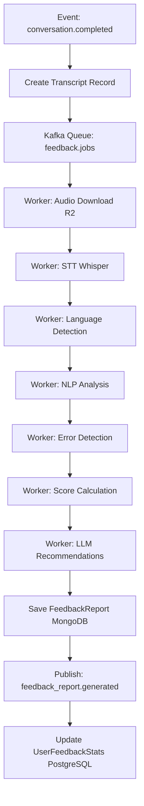

# Feedback Service - Spécifications Techniques Détaillées

## 📋 Table des Matières

1. [Vue d'Ensemble](#1-vue-densemble)
2. [Modèle de Données](#2-modèle-de-données)
3. [API REST](#3-api-rest)
4. [Événements Asynchrones](#4-événements-asynchrones)
5. [Pipeline de Traitement IA](#5-pipeline-de-traitement-ia)
6. [Règles Métier](#6-règles-métier)
7. [Performance et Scalabilité](#7-performance-et-scalabilité)
8. [Sécurité](#8-sécurité)
9. [Tests](#9-tests)
10. [Monitoring et Logs](#10-monitoring-et-logs)
11. [Configuration](#11-configuration)

---

## 1. Vue d'Ensemble

### 1.1 Responsabilité

Le **Feedback Service** est responsable de l'analyse intelligente des performances orales des apprenants, incluant :
- Transcription automatique (STT - Speech-to-Text)
- Analyse linguistique multi-niveaux (grammaire, vocabulaire, prononciation, fluence)
- Détection et catégorisation des erreurs
- Génération de rapports de feedback personnalisés
- Calcul de scores par dimension linguistique
- Recommandations pédagogiques ciblées

### 1.2 Périmètre fonctionnel

**Fonctionnalités principales** :
- Pipeline asynchrone de traitement audio → texte → analyse
- Intégration IA : Whisper (STT), modèles NLP, LLM (GPT-4/Claude)
- Détection d'erreurs grammaticales, lexicales, phonétiques
- Génération de reformulations correctives
- Calcul de métriques (WPM, pauses, richesse lexicale)
- Tracking des patterns d'erreurs récurrents
- Export de statistiques agrégées

**Hors périmètre** :
- Enregistrement audio (→ conversation-service)
- Attribution XP (→ gamification-service)
- Suggestions de leçons (→ recommendation-service)
- Gestion du contenu pédagogique (→ lesson-service)

### 1.3 Dépendances

**Services appelés** :
- `auth-service` : Validation JWT, récupération profils utilisateurs
- `lesson-service` : Mapping erreurs → skills, récupération skills acquis
- `conversation-service` : Récupération détails sessions
- **Services IA externes** : 
  - OpenAI Whisper API (STT)
  - OpenAI GPT-4 / Anthropic Claude (analyse, reformulations)
  - Services NLP spécialisés (LanguageTool, spaCy)

**Services appelant** :
- `api-gateway` : Requêtes frontend consultation feedback
- `recommendation-service` : Récupération patterns erreurs pour recommandations

### 1.4 Technologies

**Stack Java** :
- **Framework** : Quarkus 3.x (réactif, startup rapide, optimisé cloud-native)
- **Alternative** : Spring Boot 3.x avec WebFlux (si préférence ecosystem Spring)
- **Langage** : Java 21 (LTS) avec records, pattern matching, virtual threads

**Bases de données** :
- **MongoDB** : Stockage transcripts, rapports feedback (documents JSON flexibles)
- **PostgreSQL** : Métadonnées, agrégations, user stats

**Messaging & Cache** :
- **Kafka** : Queue traitement asynchrone, événements
- **Redis** : Cache résultats récents, rate limiting

**Intégrations IA** :
- **OpenAI Java SDK** : Whisper, GPT-4
- **Anthropic Java SDK** : Claude
- **LanguageTool Java API** : Vérification grammaticale
- **Apache OpenNLP** / **Stanford NLP** : Analyse linguistique locale

**Bibliothèques Java** :
- **SmallRye Mutiny** (Quarkus) / **Project Reactor** (Spring) : Programmation réactive
- **Jackson** : Sérialisation JSON
- **Hibernate Reactive** (Quarkus) / **Spring Data MongoDB Reactive** : Accès base de données réactif
- **Micrometer** : Métriques Prometheus
- **Testcontainers** : Tests d'intégration

---

## 2. Modèle de Données

### 2.1 Entités principales

#### ConversationTranscript (MongoDB)

```java
@Document(collection = "conversation_transcripts")
public class ConversationTranscript {
    
    @Id
    private String id; // MongoDB ObjectId
    
    @Indexed
    private String sessionId; // UUID de la conversation
    
    @Indexed
    private String userId; // UUID de l'utilisateur
    
    @Indexed
    private String targetLanguageCode; // ex: 'en', 'fr'
    
    private TranscriptStatus status; // PROCESSING, COMPLETED, FAILED
    
    private List<TranscriptSegment> segments;
    
    private String audioUrl; // URL R2 de l'enregistrement
    
    private AudioMetadata audioMetadata;
    
    private LocalDateTime processedAt;
    
    @CreationTimestamp
    private LocalDateTime createdAt;
    
    @UpdateTimestamp
    private LocalDateTime updatedAt;
    
    // Nested class
    public record TranscriptSegment(
        double startTime,     // secondes
        double endTime,
        Speaker speaker,      // USER, PARTNER
        String text,
        String detectedLanguage,
        double confidence     // 0.0-1.0
    ) {}
    
    public record AudioMetadata(
        long durationSeconds,
        String format,        // webm, mp3, wav
        int sampleRate,
        int channels
    ) {}
    
    public enum TranscriptStatus {
        PROCESSING, COMPLETED, FAILED
    }
    
    public enum Speaker {
        USER, PARTNER
    }
}
```

**Indexes MongoDB** :
```javascript
db.conversation_transcripts.createIndex({ "sessionId": 1 }, { unique: true })
db.conversation_transcripts.createIndex({ "userId": 1, "createdAt": -1 })
db.conversation_transcripts.createIndex({ "status": 1, "createdAt": 1 })
```

#### FeedbackReport (MongoDB)

```java
@Document(collection = "feedback_reports")
public class FeedbackReport {
    
    @Id
    private String id;
    
    @Indexed
    private String userId;
    
    @Indexed
    private String sessionId;
    
    private String transcriptId;
    
    @Indexed
    private String targetLanguageCode;
    
    private ScoreBreakdown scores;
    
    private PerformanceMetrics metrics;
    
    private List<Strength> strengths;
    
    private List<String> errorIds; // Références vers ErrorInstance
    
    private Recommendations recommendations;
    
    private LocalDateTime generatedAt;
    
    private LocalDateTime viewedAt;
    
    @CreationTimestamp
    private LocalDateTime createdAt;
    
    // Nested records
    public record ScoreBreakdown(
        int overall,          // 0-100
        int grammar,
        int vocabulary,
        int fluency,
        int pronunciation,
        int comprehension
    ) {}
    
    public record PerformanceMetrics(
        int totalWords,
        int uniqueWords,
        long speakingTimeSeconds,
        int pausesCount,
        double avgPauseDurationSeconds,
        double wordsPerMinute,
        int fillerWordsCount,
        double lexicalDiversity  // uniqueWords / totalWords
    ) {}
    
    public record Strength(
        StrengthCategory category,
        String descriptionKey,   // Clé i18n
        List<String> examples
    ) {}
    
    public record Recommendations(
        List<String> lessonIds,      // UUID lessons recommandées
        List<String> skillIds,       // UUID skills à travailler
        List<String> practiceAreas   // Codes: 'grammar.tenses', 'vocab.business'
    ) {}
    
    public enum StrengthCategory {
        GRAMMAR, VOCABULARY, FLUENCY, PRONUNCIATION, COMPREHENSION
    }
}
```

**Indexes MongoDB** :
```javascript
db.feedback_reports.createIndex({ "userId": 1, "sessionId": 1 }, { unique: true })
db.feedback_reports.createIndex({ "userId": 1, "generatedAt": -1 })
db.feedback_reports.createIndex({ "targetLanguageCode": 1, "generatedAt": -1 })
```

#### ErrorInstance (MongoDB)

```java
@Document(collection = "error_instances")
public class ErrorInstance {
    
    @Id
    private String id;
    
    @Indexed
    private String transcriptId;
    
    @Indexed
    private String userId;
    
    @Indexed
    private String languageCode;
    
    private ErrorType errorType;
    
    private String category; // ex: 'verb_tense', 'article_usage', 'word_choice'
    
    private ErrorSeverity severity;
    
    private String originalText;
    
    private String correctedText;
    
    private String explanationKey; // Clé i18n
    
    private ErrorContext context;
    
    private String relatedSkillId; // UUID skill concerné
    
    private double timestamp; // Position dans la conversation (secondes)
    
    @CreationTimestamp
    private LocalDateTime createdAt;
    
    // Nested records
    public record ErrorContext(
        String sentence,       // Phrase complète
        int startIndex,        // Position début erreur dans sentence
        int endIndex           // Position fin erreur
    ) {}
    
    public enum ErrorType {
        GRAMMAR, VOCABULARY, PRONUNCIATION, USAGE
    }
    
    public enum ErrorSeverity {
        MINOR, MODERATE, MAJOR
    }
}
```

**Indexes MongoDB** :
```javascript
db.error_instances.createIndex({ "userId": 1, "languageCode": 1, "createdAt": -1 })
db.error_instances.createIndex({ "transcriptId": 1 })
db.error_instances.createIndex({ "category": 1, "severity": 1 })
```

#### UserFeedbackStats (PostgreSQL - Agrégations)

```java
@Entity
@Table(name = "user_feedback_stats")
public class UserFeedbackStats {
    
    @Id
    @GeneratedValue(strategy = GenerationType.UUID)
    private UUID id;
    
    @Column(nullable = false)
    private UUID userId;
    
    @Column(nullable = false, length = 10)
    private String targetLanguageCode;
    
    private Integer totalConversationsAnalyzed;
    
    private Double averageOverallScore;
    
    private Double averageGrammarScore;
    
    private Double averageVocabularyScore;
    
    private Double averageFluencyScore;
    
    private Double averagePronunciationScore;
    
    private Long totalSpeakingTimeSeconds;
    
    private Integer totalErrorsDetected;
    
    @Convert(converter = ErrorPatternConverter.class)
    @Column(columnDefinition = "jsonb")
    private Map<String, Integer> topErrorCategories; // category -> count
    
    @Convert(converter = SkillGapConverter.class)
    @Column(columnDefinition = "jsonb")
    private List<String> identifiedSkillGaps; // skill IDs
    
    private LocalDateTime lastAnalysisDate;
    
    @CreationTimestamp
    private LocalDateTime createdAt;
    
    @UpdateTimestamp
    private LocalDateTime updatedAt;
}
```

**Indexes PostgreSQL** :
```sql
CREATE UNIQUE INDEX idx_user_stats_user_language ON user_feedback_stats(user_id, target_language_code);
CREATE INDEX idx_user_stats_score ON user_feedback_stats(user_id, average_overall_score DESC);
CREATE INDEX idx_user_stats_last_analysis ON user_feedback_stats(last_analysis_date DESC);
```

### 2.2 Relations entre entités



### 2.3 Stratégie de stockage

**MongoDB** (Documents flexibles) :
- Transcripts avec segments variables
- Rapports feedback avec structures riches
- Erreurs avec contexte linguistique

**PostgreSQL** (Données structurées) :
- Statistiques agrégées
- Métadonnées relationnelles
- Queries analytiques performantes

**Avantage architecture hybride** :
- MongoDB : Flexibilité, performance lecture documents complets
- PostgreSQL : Agrégations complexes, ACID, relations

---

## 3. API REST

### 3.1 Endpoints

| Méthode | Route | Description | Auth |
|---------|-------|-------------|------|
| `POST` | `/api/feedback/analyze` | Déclencher analyse audio | Service-to-Service |
| `GET` | `/api/feedback/reports/session/:sessionId` | Rapport par session | JWT |
| `GET` | `/api/feedback/reports/:id` | Rapport par ID | JWT |
| `GET` | `/api/feedback/transcripts/:id` | Transcript par ID | JWT |
| `GET` | `/api/feedback/user-stats` | Stats utilisateur | JWT |
| `GET` | `/api/feedback/error-patterns` | Patterns d'erreurs | JWT |
| `GET` | `/api/feedback/progress-history` | Évolution scores | JWT |
| `POST` | `/api/feedback/reports/:id/mark-viewed` | Marquer rapport consulté | JWT |

### 3.2 Schemas détaillés

#### `POST /api/feedback/analyze`

**Authentication** : Service-to-Service (API Key)

**Request Body** :
```java
public record AnalyzeRequest(
    @NotNull String sessionId,
    @NotNull String audioUrl,
    @NotNull String userId,
    @NotNull String targetLanguageCode,
    String nativeLanguageCode,
    AudioFormat audioFormat,
    Long durationSeconds
) {}

public enum AudioFormat {
    WEBM, MP3, WAV, OGG
}
```

**Response 202 Accepted** :
```java
public record AnalyzeResponse(
    String transcriptId,
    String status, // "QUEUED"
    String message,
    Integer estimatedProcessingTimeSeconds
) {}
```

#### `GET /api/feedback/reports/session/:sessionId`

**Response 200** :
```java
public record FeedbackReportDto(
    String id,
    String sessionId,
    String targetLanguageCode,
    ScoreBreakdownDto scores,
    PerformanceMetricsDto metrics,
    List<StrengthDto> strengths,
    List<ErrorSummaryDto> errors,
    RecommendationsDto recommendations,
    LocalDateTime generatedAt,
    Boolean viewed
) {}

public record ScoreBreakdownDto(
    int overall,
    int grammar,
    int vocabulary,
    int fluency,
    int pronunciation,
    int comprehension,
    String levelEstimate // ex: "B1"
) {}

public record ErrorSummaryDto(
    String id,
    String errorType,
    String category,
    String severity,
    String originalText,
    String correctedText,
    String explanationKey,
    double timestamp
) {}
```

#### `GET /api/feedback/user-stats`

**Query Parameters** :
```java
@QueryParam("targetLanguageCode") @NotNull String languageCode;
@QueryParam("period") @DefaultValue("all") String period; // week, month, all
```

**Response 200** :
```java
public record UserStatsDto(
    String userId,
    String targetLanguageCode,
    StatsOverview overview,
    ScoreTrends trends,
    ErrorAnalysis errorAnalysis,
    ImprovementAreas improvementAreas
) {}

public record StatsOverview(
    int totalConversations,
    long totalSpeakingMinutes,
    double averageOverallScore,
    String currentLevel // ex: "B1"
) {}

public record ScoreTrends(
    List<ScoreDataPoint> grammarTrend,
    List<ScoreDataPoint> vocabularyTrend,
    List<ScoreDataPoint> fluencyTrend,
    List<ScoreDataPoint> pronunciationTrend
) {}

public record ScoreDataPoint(
    LocalDate date,
    double score
) {}

public record ErrorAnalysis(
    int totalErrors,
    Map<String, Integer> errorsByCategory, // category -> count
    Map<String, Integer> errorsBySeverity, // severity -> count
    List<RecurringError> topRecurringErrors
) {}

public record RecurringError(
    String category,
    String descriptionKey,
    int occurrences,
    String exampleOriginal,
    String exampleCorrected
) {}

public record ImprovementAreas(
    List<SkillGap> identifiedGaps,
    List<String> recommendedLessons,
    String primaryFocusArea // ex: "grammar.verb_tenses"
) {}

public record SkillGap(
    String skillId,
    String skillCode,
    String nameKey,
    int errorCount,
    int priority // 1-5
) {}
```

#### `GET /api/feedback/progress-history`

**Query Parameters** :
```java
@QueryParam("targetLanguageCode") @NotNull String languageCode;
@QueryParam("startDate") @NotNull LocalDate startDate;
@QueryParam("endDate") @NotNull LocalDate endDate;
```

**Response 200** :
```java
public record ProgressHistoryDto(
    List<ConversationProgress> conversations,
    AggregatedProgress aggregated
) {}

public record ConversationProgress(
    String sessionId,
    LocalDateTime date,
    int overallScore,
    int grammar,
    int vocabulary,
    int fluency,
    int pronunciation,
    int errorsCount,
    long durationSeconds
) {}

public record AggregatedProgress(
    double averageScoreChange, // +/- vs période précédente
    double grammarImprovement,
    double vocabularyImprovement,
    int totalErrors,
    String progressSummaryKey // Clé i18n: "progress.improving", "progress.stable"
) {}
```

### 3.3 Codes d'erreur

| Code HTTP | Message | Cas d'usage |
|-----------|---------|-------------|
| `400` | `INVALID_REQUEST` | Paramètres manquants/invalides |
| `401` | `UNAUTHORIZED` | Token JWT absent/invalide |
| `403` | `FORBIDDEN` | Accès rapport d'un autre utilisateur |
| `404` | `REPORT_NOT_FOUND` | Rapport inexistant |
| `404` | `TRANSCRIPT_NOT_FOUND` | Transcript inexistant |
| `409` | `ANALYSIS_ALREADY_RUNNING` | Analyse déjà en cours pour cette session |
| `422` | `UNSUPPORTED_AUDIO_FORMAT` | Format audio non supporté |
| `503` | `STT_SERVICE_UNAVAILABLE` | Service Whisper indisponible |
| `500` | `INTERNAL_ERROR` | Erreur serveur |

---

## 4. Événements Asynchrones

### 4.1 Messages publiés (Kafka)

#### Topic : `feedback.events`

**Partitioning** : Par `userId`

**Event: `transcript.processing_started`**
```json
{
  "eventType": "transcript.processing_started",
  "version": "1.0",
  "timestamp": "2025-01-15T10:50:00Z",
  "payload": {
    "transcriptId": "mongo-objectid",
    "sessionId": "uuid",
    "userId": "uuid",
    "targetLanguageCode": "en",
    "audioUrl": "r2://wespeak-recordings/session-uuid.webm",
    "estimatedDurationSeconds": 120
  },
  "metadata": {
    "correlationId": "uuid",
    "source": "feedback-service"
  }
}
```

**Event: `transcript.completed`**
```json
{
  "eventType": "transcript.completed",
  "version": "1.0",
  "timestamp": "2025-01-15T10:52:00Z",
  "payload": {
    "transcriptId": "mongo-objectid",
    "sessionId": "uuid",
    "userId": "uuid",
    "targetLanguageCode": "en",
    "totalWords": 450,
    "totalSegments": 28,
    "processingTimeSeconds": 45
  },
  "metadata": {
    "correlationId": "uuid",
    "source": "feedback-service"
  }
}
```

**Event: `feedback_report.generated`**
```json
{
  "eventType": "feedback_report.generated",
  "version": "1.0",
  "timestamp": "2025-01-15T10:55:00Z",
  "payload": {
    "reportId": "mongo-objectid",
    "userId": "uuid",
    "sessionId": "uuid",
    "transcriptId": "mongo-objectid",
    "targetLanguageCode": "en",
    "scores": {
      "overall": 78,
      "grammar": 75,
      "vocabulary": 82,
      "fluency": 80,
      "pronunciation": 72,
      "comprehension": 85
    },
    "errorsDetected": 12,
    "skillGapsIdentified": ["past_simple.en", "prepositions.en"],
    "recommendedLessons": ["lesson-uuid-1", "lesson-uuid-2"]
  },
  "metadata": {
    "correlationId": "uuid",
    "source": "feedback-service"
  }
}
```

**Event: `skill.mastery_updated`**
```json
{
  "eventType": "skill.mastery_updated",
  "version": "1.0",
  "timestamp": "2025-01-15T10:55:00Z",
  "payload": {
    "userId": "uuid",
    "skillId": "uuid",
    "skillCode": "past_simple.en",
    "targetLanguageCode": "en",
    "previousMasteryLevel": 60,
    "newMasteryLevel": 55,
    "change": -5,
    "basedOn": "conversation_errors"
  },
  "metadata": {
    "correlationId": "uuid",
    "source": "feedback-service"
  }
}
```

**Consommé par** :
- `recommendation-service` : Génération recommandations leçons
- `lesson-service` : Mise à jour skill mastery
- `gamification-service` : Unlock badges "improvement"
- `notification-service` : Notification utilisateur "Feedback disponible"

### 4.2 Messages consommés

#### Topic : `conversation.events` (Consumer group: `feedback-service`)

**Event: `conversation.completed`**
```json
{
  "eventType": "conversation.completed",
  "payload": {
    "sessionId": "uuid",
    "participants": [{
      "userId": "uuid",
      "targetLanguageCode": "en",
      "spokenSeconds": 450
    }],
    "recordingUrl": "r2://...",
    "durationSeconds": 900
  }
}
```

**Action déclenchée** :
1. Créer `ConversationTranscript` avec status=PROCESSING
2. Publier message Kafka interne `feedback.jobs` pour démarrer pipeline
3. Traitement asynchrone (détails section 5)

---

## 5. Pipeline de Traitement IA

### 5.1 Architecture pipeline



### 5.2 Étapes détaillées

#### Étape 1 : Audio Download & Preprocessing

**Implémentation Quarkus** :
```java
@ApplicationScoped
public class AudioPreprocessor {
    
    @Inject
    S3Client s3Client;
    
    public Uni<AudioFile> downloadAndPreprocess(String audioUrl) {
        return Uni.createFrom().item(() -> {
            // Download from R2
            GetObjectRequest request = GetObjectRequest.builder()
                .bucket(extractBucket(audioUrl))
                .key(extractKey(audioUrl))
                .build();
            
            ResponseInputStream<GetObjectResponse> response = 
                s3Client.getObject(request);
            
            // Convert to WAV 16kHz mono if needed (for Whisper)
            byte[] audio = convertToWav(response);
            
            return new AudioFile(audio, "wav", 16000, 1);
        }).runSubscriptionOn(Infrastructure.getDefaultWorkerPool());
    }
    
    private byte[] convertToWav(InputStream input) {
        // Use FFmpeg Java wrapper or javax.sound.sampled
        // Convert to: 16kHz, mono, 16-bit PCM WAV
        return /* conversion logic */;
    }
}
```

#### Étape 2 : Speech-to-Text (Whisper)

**Implémentation avec OpenAI Java SDK** :
```java
@ApplicationScoped
public class SpeechToTextService {
    
    @Inject
    OpenAIClient openAIClient;
    
    @ConfigProperty(name = "openai.whisper.model")
    String whisperModel; // "whisper-1"
    
    public Uni<TranscriptionResult> transcribe(
        AudioFile audio, 
        String targetLanguage
    ) {
        return Uni.createFrom().completionStage(() -> 
            openAIClient.createTranscription(
                CreateTranscriptionRequest.builder()
                    .model(whisperModel)
                    .file(audio.getBytes())
                    .language(targetLanguage) // ISO 639-1
                    .responseFormat("verbose_json") // Timestamps
                    .temperature(0.0) // Deterministic
                    .build()
            )
        ).map(this::parseTranscriptionResponse);
    }
    
    private TranscriptionResult parseTranscriptionResponse(
        TranscriptionResponse response
    ) {
        List<TranscriptSegment> segments = response.getSegments().stream()
            .map(s -> new TranscriptSegment(
                s.getStart(),
                s.getEnd(),
                Speaker.USER, // Inféré via diarization si multi-speaker
                s.getText(),
                response.getLanguage(),
                s.getAvgLogprob() // Confidence proxy
            ))
            .toList();
        
        return new TranscriptionResult(segments, response.getDuration());
    }
}
```

**Note Speaker Diarization** :
- Whisper ne fait pas de diarization native
- Options :
  1. Utiliser pyannote.audio (Python service)
  2. Heuristique : alterner speakers selon pauses longues (>2s)
  3. Future : Whisper large-v3 avec diarization

#### Étape 3 : NLP Analysis

**Détection langue par segment** :
```java
@ApplicationScoped
public class LanguageDetector {
    
    @Inject
    LanguageDetectorModel model; // Apache OpenNLP ou Lingua
    
    public String detectLanguage(String text) {
        return model.predictLanguage(text).getLanguage();
    }
}
```

**Analyse grammaticale (LanguageTool)** :
```java
@ApplicationScoped
public class GrammarAnalyzer {
    
    private final JLanguageTool languageTool;
    
    public GrammarAnalyzer() {
        this.languageTool = new JLanguageTool(
            Languages.getLanguageForShortCode("en")
        );
    }
    
    public List<ErrorInstance> analyzeGrammar(
        String text, 
        String languageCode
    ) {
        try {
            List<RuleMatch> matches = languageTool.check(text);
            
            return matches.stream()
                .map(match -> new ErrorInstance(
                    null, // ID généré MongoDB
                    null, // transcriptId set later
                    null, // userId set later
                    languageCode,
                    ErrorType.GRAMMAR,
                    match.getRule().getCategory().getId().toString(),
                    classifySeverity(match),
                    text.substring(match.getFromPos(), match.getToPos()),
                    match.getSuggestedReplacements().isEmpty() 
                        ? null 
                        : match.getSuggestedReplacements().get(0),
                    "error.grammar." + match.getRule().getId(),
                    new ErrorContext(
                        text,
                        match.getFromPos(),
                        match.getToPos()
                    ),
                    null, // relatedSkillId mapped later
                    0.0,  // timestamp set later
                    LocalDateTime.now()
                ))
                .toList();
        } catch (IOException e) {
            throw new RuntimeException("Grammar analysis failed", e);
        }
    }
    
    private ErrorSeverity classifySeverity(RuleMatch match) {
        String category = match.getRule().getCategory().getId().toString();
        return switch (category) {
            case "TYPOS", "TYPOGRAPHY" -> ErrorSeverity.MINOR;
            case "GRAMMAR", "CONFUSED_WORDS" -> ErrorSeverity.MAJOR;
            default -> ErrorSeverity.MODERATE;
        };
    }
}
```

**Analyse vocabulaire** :
```java
@ApplicationScoped
public class VocabularyAnalyzer {
    
    public VocabularyMetrics analyze(List<String> words) {
        Set<String> uniqueWords = new HashSet<>(words);
        
        // Remove stop words
        Set<String> contentWords = uniqueWords.stream()
            .filter(w -> !StopWords.isStopWord(w))
            .collect(Collectors.toSet());
        
        // Calculate lexical diversity (Type-Token Ratio)
        double lexicalDiversity = (double) uniqueWords.size() / words.size();
        
        // Identify advanced vocabulary (CEFR level)
        Map<String, String> wordLevels = contentWords.stream()
            .collect(Collectors.toMap(
                w -> w,
                w -> CefrDictionary.getLevel(w) // A1, A2, B1, ...
            ));
        
        return new VocabularyMetrics(
            words.size(),
            uniqueWords.size(),
            lexicalDiversity,
            wordLevels
        );
    }
}
```

#### Étape 4 : Pronunciation Analysis

**Approche** :
- Comparaison phonétique via IPA (International Phonetic Alphabet)
- Utilisation de modèles pré-entraînés (wav2vec2-phoneme)
- Alternative : API cloud (Google Speech-to-Text avec phonetic transcription)

```java
@ApplicationScoped
public class PronunciationAnalyzer {
    
    @RestClient
    PronunciationApiClient apiClient;
    
    public Uni<PronunciationScore> analyze(
        byte[] audioSegment,
        String expectedText,
        String targetLanguage
    ) {
        return apiClient.analyzePronunciation(
            audioSegment,
            expectedText,
            targetLanguage
        ).map(response -> new PronunciationScore(
            response.getOverallScore(),
            response.getPhonemeAccuracy(),
            response.getMispronunciations()
        ));
    }
}
```

#### Étape 5 : Score Calculation

```java
@ApplicationScoped
public class ScoreCalculator {
    
    public ScoreBreakdown calculateScores(
        AnalysisData data
    ) {
        int grammarScore = calculateGrammarScore(data.getErrors());
        int vocabularyScore = calculateVocabularyScore(data.getVocabMetrics());
        int fluencyScore = calculateFluencyScore(data.getMetrics());
        int pronunciationScore = data.getPronunciationScore();
        int comprehensionScore = calculateComprehensionScore(data);
        
        int overall = (int) Math.round(
            grammarScore * 0.25 +
            vocabularyScore * 0.20 +
            fluencyScore * 0.20 +
            pronunciationScore * 0.20 +
            comprehensionScore * 0.15
        );
        
        return new ScoreBreakdown(
            overall,
            grammarScore,
            vocabularyScore,
            fluencyScore,
            pronunciationScore,
            comprehensionScore
        );
    }
    
    private int calculateGrammarScore(List<ErrorInstance> errors) {
        long majorErrors = errors.stream()
            .filter(e -> e.severity() == ErrorSeverity.MAJOR && 
                        e.errorType() == ErrorType.GRAMMAR)
            .count();
        
        long moderateErrors = errors.stream()
            .filter(e -> e.severity() == ErrorSeverity.MODERATE && 
                        e.errorType() == ErrorType.GRAMMAR)
            .count();
        
        // Scoring formula
        int baseScore = 100;
        int deduction = (int) (majorErrors * 10 + moderateErrors * 5);
        
        return Math.max(0, baseScore - deduction);
    }
    
    private int calculateVocabularyScore(VocabularyMetrics metrics) {
        // Lexical diversity + CEFR level variety
        double diversityScore = metrics.lexicalDiversity() * 100;
        
        long advancedWords = metrics.wordLevels().values().stream()
            .filter(level -> level.equals("B2") || level.equals("C1") || level.equals("C2"))
            .count();
        
        double advancedBonus = Math.min(20, advancedWords * 2);
        
        return (int) Math.min(100, diversityScore * 0.7 + advancedBonus);
    }
    
    private int calculateFluencyScore(PerformanceMetrics metrics) {
        // WPM normalisé (target: 120-150 WPM)
        double wpmScore = Math.min(100, (metrics.wordsPerMinute() / 150.0) * 100);
        
        // Pénalité pauses excessives
        double pausePenalty = Math.min(20, metrics.pausesCount() * 0.5);
        
        // Pénalité filler words
        double fillerPenalty = Math.min(15, metrics.fillerWordsCount() * 1.5);
        
        return (int) Math.max(0, wpmScore - pausePenalty - fillerPenalty);
    }
    
    private int calculateComprehensionScore(AnalysisData data) {
        // Basé sur pertinence réponses aux prompts
        // Analyse sémantique via embedding similarity
        // Placeholder: 80 par défaut
        return 80;
    }
}
```

#### Étape 6 : LLM Recommendations

```java
@ApplicationScoped
public class RecommendationGenerator {
    
    @Inject
    OpenAIClient openAIClient;
    
    @ConfigProperty(name = "openai.gpt.model")
    String gptModel; // "gpt-4-turbo"
    
    public Uni<Recommendations> generateRecommendations(
        FeedbackReport report,
        List<ErrorInstance> errors,
        String nativeLanguage
    ) {
        String prompt = buildPrompt(report, errors, nativeLanguage);
        
        return Uni.createFrom().completionStage(() ->
            openAIClient.createChatCompletion(
                CreateChatCompletionRequest.builder()
                    .model(gptModel)
                    .messages(List.of(
                        ChatMessage.systemMessage(
                            "You are an expert language teacher. Analyze errors " +
                            "and suggest targeted practice areas and lessons."
                        ),
                        ChatMessage.userMessage(prompt)
                    ))
                    .temperature(0.3)
                    .maxTokens(500)
                    .build()
            )
        ).map(response -> parseRecommendations(
            response.getChoices().get(0).getMessage().getContent()
        ));
    }
    
    private String buildPrompt(
        FeedbackReport report,
        List<ErrorInstance> errors,
        String nativeLanguage
    ) {
        StringBuilder sb = new StringBuilder();
        sb.append("User native language: ").append(nativeLanguage).append("\n");
        sb.append("Target language: ").append(report.targetLanguageCode()).append("\n");
        sb.append("Scores: ").append(report.scores()).append("\n");
        sb.append("Top errors:\n");
        
        errors.stream()
            .limit(5)
            .forEach(e -> sb.append("- ")
                .append(e.category())
                .append(": ")
                .append(e.originalText())
                .append(" → ")
                .append(e.correctedText())
                .append("\n")
            );
        
        sb.append("\nProvide:\n");
        sb.append("1. Top 3 practice areas (format: 'grammar.tenses', 'vocab.prepositions')\n");
        sb.append("2. Primary focus area\n");
        sb.append("3. Explanation in JSON format\n");
        
        return sb.toString();
    }
    
    private Recommendations parseRecommendations(String llmResponse) {
        // Parse JSON response from LLM
        // Map practice areas to lesson IDs via lesson-service API
        // Return structured recommendations
        return /* parsed recommendations */;
    }
}
```

### 5.3 Gestion asynchrone (Kafka Workers)

**Configuration Quarkus** :
```java
@ApplicationScoped
public class FeedbackWorkers {
    
    @Inject
    TranscriptService transcriptService;
    
    @Inject
    FeedbackReportService reportService;
    
    @Incoming("feedback-jobs")
    @Outgoing("feedback-transcripts")
    @Blocking // Heavy CPU/IO work
    public Uni<TranscriptResult> processTranscription(AnalyzeJobMessage job) {
        return transcriptService.processFullPipeline(job)
            .onFailure().retry().atMost(3)
            .onFailure().invoke(e -> 
                Log.error("Transcription failed for session: " + job.sessionId(), e)
            );
    }
    
    @Incoming("feedback-transcripts")
    @Outgoing("feedback-reports")
    @Blocking
    public Uni<FeedbackReport> generateReport(TranscriptResult transcript) {
        return reportService.generateFullReport(transcript)
            .onFailure().retry().atMost(2);
    }
    
    @Incoming("feedback-reports")
    @Acknowledgment(Acknowledgment.Strategy.POST_PROCESSING)
    public Uni<Void> publishReportEvent(FeedbackReport report) {
        return reportService.publishReportGeneratedEvent(report);
    }
}
```

---

## 6. Règles Métier

### 6.1 Priorisation traitement

**Queue prioritaire** :
- Premium users : priorité haute (topic Kafka dédié)
- Free users : priorité normale
- SLA :
  - Premium : < 2 minutes
  - Free : < 5 minutes

**Implémentation** :
```java
@ApplicationScoped
public class PriorityQueueManager {
    
    @Inject
    @Channel("feedback-jobs-priority")
    Emitter<AnalyzeJobMessage> priorityEmitter;
    
    @Inject
    @Channel("feedback-jobs-normal")
    Emitter<AnalyzeJobMessage> normalEmitter;
    
    public void enqueueAnalysis(AnalyzeJobMessage job, String userTier) {
        if ("premium".equals(userTier) || "enterprise".equals(userTier)) {
            priorityEmitter.send(job);
        } else {
            normalEmitter.send(job);
        }
    }
}
```

### 6.2 Retry et timeout

**Stratégie retry** :
- STT failures : 3 tentatives (expo backoff 5s, 15s, 45s)
- NLP failures : 2 tentatives
- LLM timeouts : 2 tentatives
- Si échec final : marquer transcript status=FAILED, notifier support

**Timeout** :
- STT : 120s max
- Full pipeline : 300s max (5min)

### 6.3 Détection erreurs récurrentes

**Algorithme** :
```java
public List<RecurringError> identifyRecurringErrors(
    List<ErrorInstance> recentErrors,
    int windowDays
) {
    Map<String, List<ErrorInstance>> errorsByCategory = recentErrors.stream()
        .filter(e -> e.createdAt().isAfter(
            LocalDateTime.now().minusDays(windowDays)
        ))
        .collect(Collectors.groupingBy(ErrorInstance::category));
    
    return errorsByCategory.entrySet().stream()
        .filter(entry -> entry.getValue().size() >= 3) // Threshold
        .map(entry -> new RecurringError(
            entry.getKey(),
            "error.recurring." + entry.getKey(),
            entry.getValue().size(),
            entry.getValue().get(0).originalText(),
            entry.getValue().get(0).correctedText()
        ))
        .sorted(Comparator.comparingInt(RecurringError::occurrences).reversed())
        .limit(5)
        .toList();
}
```

### 6.4 Mise à jour skill mastery

**Formule** :
```
Si erreurs sur skill dans conversation:
  newMastery = max(0, currentMastery - (errorCount × 5))

Si usage correct du skill (détecté via NLP):
  newMastery = min(100, currentMastery + 3)
```

**Event publié** : `skill.mastery_updated` (consommé par lesson-service)

---

## 7. Performance et Scalabilité

### 7.1 Optimisations STT

**Streaming transcription** :
- Whisper ne supporte pas streaming natif
- Alternative : découper audio en chunks 30s, transcrire en parallèle
- Reassembler avec timestamps

**Caching** :
- Cache Redis pour transcripts récents (clé: sessionId, TTL: 1h)
- Évite re-transcription si re-demande

### 7.2 Parallélisation pipeline

**Étapes parallélisables** :
```java
public Uni<FeedbackReport> generateFullReport(TranscriptResult transcript) {
    // Run in parallel
    Uni<List<ErrorInstance>> grammarAnalysis = 
        Uni.createFrom().item(() -> grammarAnalyzer.analyze(transcript));
    
    Uni<VocabularyMetrics> vocabAnalysis = 
        Uni.createFrom().item(() -> vocabularyAnalyzer.analyze(transcript));
    
    Uni<Integer> pronunciationScore = 
        pronunciationAnalyzer.analyze(transcript.getAudioSegments());
    
    return Uni.combine().all().unis(
        grammarAnalysis,
        vocabAnalysis,
        pronunciationScore
    ).asTuple().flatMap(tuple -> {
        // Combine results
        return generateFinalReport(tuple.getItem1(), tuple.getItem2(), tuple.getItem3());
    });
}
```

### 7.3 Database performance

**MongoDB indexes** :
- Créer compound indexes pour queries fréquentes
- Utiliser projection pour ne récupérer que champs nécessaires

**PostgreSQL read replicas** :
- Statistiques agrégées lues depuis replica
- Writes vers master uniquement

### 7.4 Rate limiting

**Quotas** :
- Free : 3 analyses/semaine (limite conversations)
- Premium : illimité
- API analyze : 10 req/min par service (via API key)

---

## 8. Sécurité

### 8.1 API Keys pour services

**Authentification service-to-service** :
```java
@Provider
@Priority(Priorities.AUTHENTICATION)
public class ApiKeyAuthenticationFilter implements ContainerRequestFilter {
    
    @ConfigProperty(name = "api.keys.conversation-service")
    String conversationServiceKey;
    
    @Override
    public void filter(ContainerRequestContext requestContext) {
        String apiKey = requestContext.getHeaderString("X-API-Key");
        
        if (apiKey == null || !isValidApiKey(apiKey)) {
            requestContext.abortWith(
                Response.status(Response.Status.UNAUTHORIZED)
                    .entity("Invalid API Key")
                    .build()
            );
        }
    }
    
    private boolean isValidApiKey(String key) {
        return conversationServiceKey.equals(key);
        // Production: check against database with rotation support
    }
}
```

### 8.2 Anonymisation données sensibles

**Logs** :
- Ne jamais logger transcripts complets
- Hash userId dans logs

**Exemple** :
```java
Log.info("Transcript completed for user: " + hashUserId(userId) + 
         ", sessionId: " + sessionId);
```

### 8.3 Encryption at rest

**MongoDB** :
- Activer encryption at rest (MongoDB Atlas ou self-hosted)
- Transcripts contiennent données personnelles

**Cloudflare R2** :
- Server-Side Encryption (SSE-S3)

### 8.4 RGPD Compliance

**Retention policy** :
- Transcripts : 90 jours
- Rapports feedback : 1 an
- Erreurs anonymisées : illimité (analytics)

**Right to deletion** :
```java
@DELETE
@Path("/users/{userId}/feedback-data")
public Uni<Response> deleteUserFeedbackData(@PathParam("userId") String userId) {
    return Uni.combine().all().unis(
        transcriptRepository.deleteByUserId(userId),
        feedbackReportRepository.deleteByUserId(userId),
        errorRepository.anonymizeByUserId(userId) // Anonymize, not delete
    ).asTuple().map(tuple -> 
        Response.ok().entity("Feedback data deleted").build()
    );
}
```

---

## 9. Tests

### 9.1 Tests unitaires

**Couverture cible** : 85%

**Exemples** :
```java
@QuarkusTest
class ScoreCalculatorTest {
    
    @Inject
    ScoreCalculator scoreCalculator;
    
    @Test
    void shouldCalculateGrammarScoreWithMajorErrors() {
        List<ErrorInstance> errors = List.of(
            createError(ErrorType.GRAMMAR, ErrorSeverity.MAJOR),
            createError(ErrorType.GRAMMAR, ErrorSeverity.MAJOR)
        );
        
        int score = scoreCalculator.calculateGrammarScore(errors);
        
        assertEquals(80, score); // 100 - (2 × 10)
    }
    
    @Test
    void shouldCalculateVocabularyScoreWithHighDiversity() {
        VocabularyMetrics metrics = new VocabularyMetrics(
            100, // totalWords
            60,  // uniqueWords
            0.6, // diversity
            Map.of("advanced", "C1", "intermediate", "B1")
        );
        
        int score = scoreCalculator.calculateVocabularyScore(metrics);
        
        assertTrue(score >= 70);
    }
}
```

### 9.2 Tests d'intégration

**Testcontainers** :
```java
@QuarkusTest
@TestProfile(IntegrationTestProfile.class)
class FeedbackPipelineIntegrationTest {
    
    @Container
    static MongoDBContainer mongoContainer = new MongoDBContainer("mongo:7.0");
    
    @Container
    static KafkaContainer kafkaContainer = new KafkaContainer(
        DockerImageName.parse("confluentinc/cp-kafka:7.5.0")
    );
    
    @Inject
    TranscriptService transcriptService;
    
    @Test
    void shouldProcessCompleteTranscriptionPipeline() {
        // Given
        String audioUrl = "r2://test-bucket/test-audio.wav";
        AnalyzeRequest request = new AnalyzeRequest(
            "session-123",
            audioUrl,
            "user-123",
            "en",
            "fr",
            AudioFormat.WAV,
            120L
        );
        
        // When
        Uni<FeedbackReport> result = transcriptService
            .processFullPipeline(request)
            .map(transcript -> feedbackReportService.generate(transcript));
        
        // Then
        FeedbackReport report = result.await().indefinitely();
        assertNotNull(report.id());
        assertTrue(report.scores().overall() > 0);
        assertFalse(report.metrics().totalWords() == 0);
    }
}
```

### 9.3 Tests de charge

**Scenario k6** :
```javascript
import http from 'k6/http';

export let options = {
  stages: [
    { duration: '2m', target: 100 },  // Ramp-up
    { duration: '5m', target: 100 },  // Sustained load
    { duration: '2m', target: 0 },    // Ramp-down
  ],
  thresholds: {
    http_req_duration: ['p(95)<3000'], // 95% requests < 3s
  },
};

export default function() {
  http.post('https://api.wespeak.com/api/feedback/analyze', JSON.stringify({
    sessionId: 'test-session',
    audioUrl: 'r2://test/audio.wav',
    userId: 'test-user',
    targetLanguageCode: 'en'
  }), {
    headers: { 
      'Content-Type': 'application/json',
      'X-API-Key': 'test-key'
    },
  });
}
```

---

## 10. Monitoring et Logs

### 10.1 Métriques (Prometheus)

**Configuration Quarkus** :
```java
@ApplicationScoped
public class FeedbackMetrics {
    
    @Inject
    MeterRegistry registry;
    
    private Counter transcriptionsTotal;
    private Counter transcriptionsSuccessful;
    private Counter transcriptionsFailed;
    private Timer transcriptionDuration;
    private Gauge activeProcessing;
    
    @PostConstruct
    public void init() {
        transcriptionsTotal = registry.counter(
            "feedback.transcriptions.total",
            Tags.of("language", "en") // Dynamic tag
        );
        
        transcriptionDuration = registry.timer(
            "feedback.transcription.duration.seconds"
        );
        
        activeProcessing = registry.gauge(
            "feedback.processing.active",
            new AtomicInteger(0)
        );
    }
    
    public void recordTranscriptionStart() {
        transcriptionsTotal.increment();
        ((AtomicInteger) activeProcessing.value()).incrementAndGet();
    }
    
    public void recordTranscriptionSuccess(Duration duration) {
        transcriptionsSuccessful.increment();
        transcriptionDuration.record(duration);
        ((AtomicInteger) activeProcessing.value()).decrementAndGet();
    }
}
```

**Métriques métier** :
- `feedback_transcriptions_total{language, status}` : Counter
- `feedback_transcription_duration_seconds` : Histogram
- `feedback_reports_generated_total{language}` : Counter
- `feedback_errors_detected_total{type, severity}` : Counter
- `feedback_average_score{language, dimension}` : Gauge
- `feedback_processing_active` : Gauge

**Métriques techniques** :
- `stt_api_calls_total{provider, status}` : Counter
- `llm_api_calls_total{model, status}` : Counter
- `mongodb_operations_duration_seconds` : Histogram

### 10.2 Logs structurés

**Configuration Logback** :
```xml
<appender name="JSON" class="ch.qos.logback.core.ConsoleAppender">
  <encoder class="net.logstash.logback.encoder.LogstashEncoder">
    <includeContext>true</includeContext>
    <includeMdc>true</includeMdc>
  </encoder>
</appender>
```

**Exemple logging** :
```java
@Slf4j
@ApplicationScoped
public class TranscriptService {
    
    public Uni<Transcript> processTranscription(AnalyzeRequest request) {
        MDC.put("sessionId", request.sessionId());
        MDC.put("userId", hashUserId(request.userId()));
        MDC.put("language", request.targetLanguageCode());
        
        log.info("Starting transcription processing");
        
        return sttService.transcribe(request.audioUrl())
            .onItem().invoke(transcript -> 
                log.info("Transcription completed: {} words, {} segments",
                    transcript.totalWords(),
                    transcript.segments().size()
                )
            )
            .onFailure().invoke(error ->
                log.error("Transcription failed", error)
            )
            .eventually(() -> {
                MDC.clear();
                return Uni.createFrom().voidItem();
            });
    }
}
```

### 10.3 Alertes

**Alertes critiques** :
- Taux échec transcription > 10% (5min window)
- STT API latency p95 > 60s
- Pipeline timeout rate > 5%
- MongoDB connexion pool exhausted

**Alertes warning** :
- Average processing time > 180s
- LLM API error rate > 2%
- Queue lag > 50 messages

---

## 11. Configuration

### 11.1 Variables d'environnement

```properties
# Quarkus
quarkus.application.name=feedback-service
quarkus.http.port=8084

# MongoDB
quarkus.mongodb.connection-string=mongodb://mongo:27017
quarkus.mongodb.database=wespeak_feedback
quarkus.mongodb.credentials.username=feedback_user
quarkus.mongodb.credentials.password=${MONGODB_PASSWORD}

# PostgreSQL (stats)
quarkus.datasource.db-kind=postgresql
quarkus.datasource.jdbc.url=jdbc:postgresql://postgres:5432/wespeak_feedback_stats
quarkus.datasource.username=feedback_service
quarkus.datasource.password=${POSTGRES_PASSWORD}

# Kafka
kafka.bootstrap.servers=kafka:9092
mp.messaging.incoming.feedback-jobs.connector=smallrye-kafka
mp.messaging.incoming.feedback-jobs.topic=feedback.jobs
mp.messaging.incoming.feedback-jobs.group.id=feedback-workers
mp.messaging.outgoing.feedback-events.connector=smallrye-kafka
mp.messaging.outgoing.feedback-events.topic=feedback.events

# Redis
quarkus.redis.hosts=redis://redis:6379
quarkus.redis.password=${REDIS_PASSWORD}

# OpenAI
openai.api.key=${OPENAI_API_KEY}
openai.whisper.model=whisper-1
openai.gpt.model=gpt-4-turbo
openai.timeout.seconds=120

# Cloudflare R2
quarkus.s3.endpoint-override=https://${R2_ACCOUNT_ID}.r2.cloudflarestorage.com
quarkus.s3.aws.region=auto
quarkus.s3.aws.credentials.static-provider.access-key-id=${R2_ACCESS_KEY}
quarkus.s3.aws.credentials.static-provider.secret-access-key=${R2_SECRET_KEY}

# Processing
feedback.processing.max-retries=3
feedback.processing.timeout-seconds=300
feedback.stt.timeout-seconds=120
feedback.priority.premium-queue=feedback.jobs.priority
feedback.priority.normal-queue=feedback.jobs.normal

# Cache
feedback.cache.transcripts.ttl-seconds=3600
feedback.cache.reports.ttl-seconds=7200

# Features
feedback.pronunciation-analysis.enabled=true
feedback.llm-recommendations.enabled=true
feedback.advanced-nlp.enabled=true
```

---

## Checklist de validation

- [ ] Pipeline complet testé end-to-end (audio → rapport)
- [ ] Intégration Whisper API fonctionnelle
- [ ] LanguageTool configuré pour langues supportées
- [ ] Scores calculés avec formules validées
- [ ] Événements Kafka publiés à chaque étape
- [ ] MongoDB indexes créés et optimisés
- [ ] PostgreSQL stats mises à jour correctement
- [ ] API Key authentication pour endpoint /analyze
- [ ] JWT validation sur endpoints publics
- [ ] Rate limiting configuré
- [ ] Retry logic avec exponential backoff
- [ ] Timeout sur appels STT/LLM
- [ ] Métriques Prometheus exposées
- [ ] Logs structurés avec MDC context
- [ ] Testcontainers pour tests d'intégration
- [ ] Health checks (/health, /health/ready)
- [ ] Documentation OpenAPI générée

---

**Version** : 1.0.0  
**Dernière mise à jour** : 2025-01-15  
**Auteur** : WeSpeak Product Owner AI  
**Stack** : Java 21 + Quarkus 3.x
