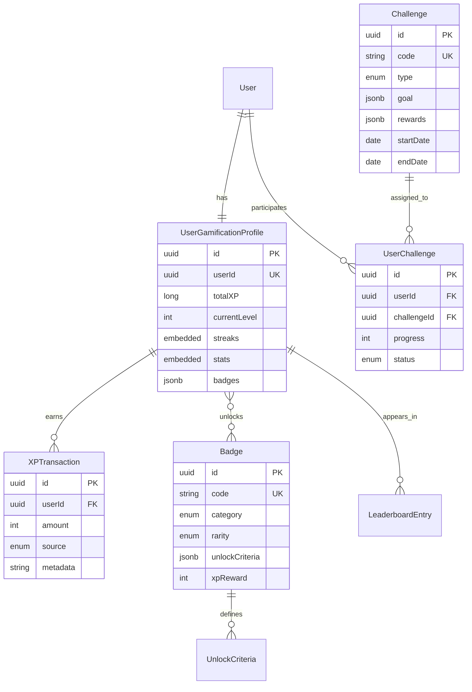

# Gamification Service - Spécifications Techniques Détaillées

## 📋 Table des Matières

1. [Vue d'Ensemble](#1-vue-densemble)
2. [Modèle de Données](#2-modèle-de-données)
3. [API REST](#3-api-rest)
4. [Événements Asynchrones](#4-événements-asynchrones)
5. [Règles Métier](#5-règles-métier)
6. [Performance et Scalabilité](#6-performance-et-scalabilité)
7. [Sécurité](#7-sécurité)
8. [Tests](#8-tests)
9. [Monitoring et Logs](#9-monitoring-et-logs)
10. [Configuration](#10-configuration)

---

## 1. Vue d'Ensemble

### 1.1 Responsabilité

Le **Gamification Service** gère l'ensemble du système de motivation et d'engagement des apprenants, incluant :
- Système XP (points d'expérience) et niveaux
- Streaks quotidiennes et freeze streak
- Badges et achievements
- Leaderboards (global, par langue, par niveau, entre amis)
- Défis quotidiens et hebdomadaires
- Système de récompenses

### 1.2 Périmètre fonctionnel

**Fonctionnalités principales** :
- Attribution automatique XP (leçons, conversations, défis)
- Calcul et maintien des streaks
- Déblocage automatique de badges selon critères
- Génération et mise à jour des leaderboards
- Création et validation de défis
- Tracking statistiques d'engagement
- Notifications achievements (via events)

**Hors périmètre** :
- Système d'amis/social (→ social-service si implémenté)
- Notifications push (→ notification-service)
- Contenu pédagogique (→ lesson-service)
- Analyse performances linguistiques (→ feedback-service)

### 1.3 Dépendances

**Services appelés** :
- `auth-service` : Validation JWT, récupération profils utilisateurs
- `lesson-service` : Validation completion leçons (pour challenges)
- `conversation-service` : Validation conversations (pour challenges)

**Services appelant** :
- `api-gateway` : Toutes les requêtes frontend
- `recommendation-service` : Récupération stats engagement

### 1.4 Technologies

**Stack Java** :
- **Framework** : Spring Boot 3.2.x avec Spring WebFlux (réactif)
- **Alternative** : Quarkus 3.x (si uniformisation avec feedback-service)
- **Langage** : Java 21 (LTS) avec records, sealed classes

**Bases de données** :
- **PostgreSQL** : Profils gamification, badges, challenges, leaderboards
- **Redis** : Cache leaderboards, streaks actives, rate limiting

**Messaging** :
- **Kafka** : Consommation événements (lessons, conversations), publication achievements

**Bibliothèques Java** :
- **Spring Data R2DBC** : Accès réactif PostgreSQL
- **Spring Data Redis Reactive** : Cache réactif
- **Spring Kafka** : Intégration Kafka
- **Micrometer** : Métriques Prometheus
- **Testcontainers** : Tests d'intégration

---

## 2. Modèle de Données

### 2.1 Entités principales

#### UserGamificationProfile (PostgreSQL)

```java
@Entity
@Table(name = "user_gamification_profiles")
public class UserGamificationProfile {
    
    @Id
    @GeneratedValue(strategy = GenerationType.UUID)
    private UUID id;
    
    @Column(nullable = false, unique = true)
    private UUID userId;
    
    @Column(nullable = false)
    private Long totalXP = 0L;
    
    @Column(nullable = false)
    private Integer currentLevel = 1;
    
    @Column(nullable = false)
    private Long xpToNextLevel;
    
    @Embedded
    private StreakInfo streaks;
    
    @Embedded
    private UserStats stats;
    
    @Convert(converter = BadgeListConverter.class)
    @Column(columnDefinition = "jsonb")
    private List<UUID> badges = new ArrayList<>(); // Badge IDs
    
    @Convert(converter = AchievementListConverter.class)
    @Column(columnDefinition = "jsonb")
    private List<UUID> achievements = new ArrayList<>();
    
    @Column(nullable = false)
    private Integer streakFreezeCount = 0; // Premium: 2/mois
    
    @Column
    private LocalDate lastStreakFreezeUsed;
    
    @CreationTimestamp
    private LocalDateTime createdAt;
    
    @UpdateTimestamp
    private LocalDateTime updatedAt;
}

@Embeddable
public class StreakInfo {
    
    @Column(nullable = false)
    private Integer current = 0;
    
    @Column(nullable = false)
    private Integer longest = 0;
    
    @Column
    private LocalDate lastActivityDate;
    
    @Column
    private LocalDateTime lastActivityTime;
}

@Embeddable
public class UserStats {
    
    @Column(nullable = false)
    private Integer lessonsCompleted = 0;
    
    @Column(nullable = false)
    private Integer conversationsCompleted = 0;
    
    @Column(nullable = false)
    private Long totalMinutesSpoken = 0L;
    
    @Column(nullable = false)
    private Long totalMinutesLearning = 0L;
    
    @Column(nullable = false)
    private Integer perfectScoresCount = 0;
    
    @Column(nullable = false)
    private Integer challengesCompleted = 0;
}
```

**Indexes PostgreSQL** :
```sql
CREATE UNIQUE INDEX idx_gamification_user ON user_gamification_profiles(user_id);
CREATE INDEX idx_gamification_level ON user_gamification_profiles(current_level, total_xp DESC);
CREATE INDEX idx_gamification_streak ON user_gamification_profiles((streaks->>'current')::int DESC);
```

#### Badge (PostgreSQL)

```java
@Entity
@Table(name = "badges")
public class Badge {
    
    @Id
    @GeneratedValue(strategy = GenerationType.UUID)
    private UUID id;
    
    @Column(nullable = false, unique = true, length = 100)
    private String code; // ex: 'first_conversation', 'grammar_master_en'
    
    @Column(nullable = false, length = 100)
    private String nameKey; // Clé i18n: 'badge.first_conversation.name'
    
    @Column(nullable = false, length = 255)
    private String descriptionKey; // Clé i18n
    
    @Enumerated(EnumType.STRING)
    @Column(nullable = false)
    private BadgeCategory category;
    
    @Enumerated(EnumType.STRING)
    @Column(nullable = false)
    private BadgeRarity rarity;
    
    @Column(length = 500)
    private String iconUrl;
    
    @Convert(converter = UnlockCriteriaConverter.class)
    @Column(columnDefinition = "jsonb", nullable = false)
    private UnlockCriteria unlockCriteria;
    
    @Column(nullable = false)
    private Integer xpReward = 0;
    
    @Column(nullable = false)
    private Boolean isActive = true;
    
    @Column(length = 10)
    private String targetLanguageCode; // null = tous
    
    @CreationTimestamp
    private LocalDateTime createdAt;
    
    @UpdateTimestamp
    private LocalDateTime updatedAt;
}

public enum BadgeCategory {
    MILESTONE,      // Premier pas, 10 leçons, etc.
    SKILL,          // Maîtrise grammaire, vocabulaire
    SOCIAL,         // Conversations, partenaires
    STREAK,         // Streaks 7, 30, 100 jours
    SPECIAL,        // Événements, saisonniers
    ACHIEVEMENT     // Perfect scores, vitesse
}

public enum BadgeRarity {
    COMMON,         // XP: 50
    RARE,           // XP: 100
    EPIC,           // XP: 250
    LEGENDARY       // XP: 500
}

public record UnlockCriteria(
    CriteriaType type,
    Integer threshold,
    String specificCondition, // JSON string pour conditions complexes
    String targetLanguageCode
) {}

public enum CriteriaType {
    LESSONS_COMPLETED,
    CONVERSATIONS_COUNT,
    PERFECT_SCORES,
    STREAK_DAYS,
    XP_EARNED,
    MINUTES_SPOKEN,
    SKILL_MASTERED,
    CUSTOM
}
```

**Indexes** :
```sql
CREATE UNIQUE INDEX idx_badge_code ON badges(code);
CREATE INDEX idx_badge_category ON badges(category, is_active);
CREATE INDEX idx_badge_language ON badges(target_language_code, is_active);
```

#### Challenge (PostgreSQL)

```java
@Entity
@Table(name = "challenges")
public class Challenge {
    
    @Id
    @GeneratedValue(strategy = GenerationType.UUID)
    private UUID id;
    
    @Column(nullable = false, unique = true, length = 100)
    private String code; // ex: 'daily_3_lessons', 'weekly_5_conversations'
    
    @Column(nullable = false, length = 100)
    private String nameKey;
    
    @Column(nullable = false, length = 255)
    private String descriptionKey;
    
    @Enumerated(EnumType.STRING)
    @Column(nullable = false)
    private ChallengeType type;
    
    @Column(length = 10)
    private String targetLanguageCode; // null = all languages
    
    @Convert(converter = ChallengeGoalConverter.class)
    @Column(columnDefinition = "jsonb", nullable = false)
    private ChallengeGoal goal;
    
    @Convert(converter = ChallengeRewardsConverter.class)
    @Column(columnDefinition = "jsonb", nullable = false)
    private ChallengeRewards rewards;
    
    @Column(nullable = false)
    private LocalDate startDate;
    
    @Column(nullable = false)
    private LocalDate endDate;
    
    @Column(nullable = false)
    private Boolean isActive = true;
    
    @CreationTimestamp
    private LocalDateTime createdAt;
    
    @UpdateTimestamp
    private LocalDateTime updatedAt;
}

public enum ChallengeType {
    DAILY,
    WEEKLY,
    SPECIAL // Events, seasonal
}

public record ChallengeGoal(
    GoalType type,
    Integer target,
    String specificRequirement // JSON for complex goals
) {}

public enum GoalType {
    COMPLETE_LESSONS,
    HAVE_CONVERSATIONS,
    EARN_XP,
    PRACTICE_SKILL,
    MAINTAIN_STREAK,
    PERFECT_SCORES
}

public record ChallengeRewards(
    Integer xp,
    UUID badgeId, // Optional
    Integer streakFreezeBonus // Premium: +1 freeze
) {}
```

**Indexes** :
```sql
CREATE UNIQUE INDEX idx_challenge_code ON challenges(code);
CREATE INDEX idx_challenge_active ON challenges(is_active, type, start_date, end_date);
CREATE INDEX idx_challenge_dates ON challenges(start_date, end_date) WHERE is_active = true;
```

#### UserChallenge (PostgreSQL)

```java
@Entity
@Table(name = "user_challenges")
public class UserChallenge {
    
    @Id
    @GeneratedValue(strategy = GenerationType.UUID)
    private UUID id;
    
    @Column(nullable = false)
    private UUID userId;
    
    @Column(nullable = false)
    private UUID challengeId;
    
    @Column(nullable = false)
    private Integer progress = 0; // Current progress towards goal
    
    @Enumerated(EnumType.STRING)
    @Column(nullable = false)
    private ChallengeStatus status = ChallengeStatus.ACTIVE;
    
    @Column
    private LocalDateTime startedAt;
    
    @Column
    private LocalDateTime completedAt;
    
    @Column
    private LocalDateTime claimedAt; // When user claimed reward
    
    @CreationTimestamp
    private LocalDateTime createdAt;
    
    @UpdateTimestamp
    private LocalDateTime updatedAt;
}

public enum ChallengeStatus {
    ACTIVE,
    COMPLETED,
    CLAIMED,
    EXPIRED
}
```

**Indexes** :
```sql
CREATE INDEX idx_user_challenge_user ON user_challenges(user_id, status);
CREATE INDEX idx_user_challenge_status ON user_challenges(challenge_id, status);
CREATE UNIQUE INDEX idx_user_challenge_unique ON user_challenges(user_id, challenge_id, started_at);
```

#### Leaderboard (Redis + PostgreSQL snapshots)

**Redis Structure** :
```
Key: leaderboard:{type}:{period}:{language?}:{level?}
Type: Sorted Set
Score: XP total
Member: userId
TTL: Depends on period (daily: 24h, weekly: 7d, monthly: 30d)
```

**PostgreSQL Snapshots** (pour historique) :
```java
@Entity
@Table(name = "leaderboard_snapshots")
public class LeaderboardSnapshot {
    
    @Id
    @GeneratedValue(strategy = GenerationType.UUID)
    private UUID id;
    
    @Enumerated(EnumType.STRING)
    @Column(nullable = false)
    private LeaderboardType type;
    
    @Enumerated(EnumType.STRING)
    @Column(nullable = false)
    private LeaderboardPeriod period;
    
    @Column(length = 10)
    private String targetLanguageCode;
    
    @Column(length = 10)
    private String level;
    
    @Convert(converter = LeaderboardEntriesConverter.class)
    @Column(columnDefinition = "jsonb", nullable = false)
    private List<LeaderboardEntry> entries;
    
    @Column(nullable = false)
    private LocalDateTime snapshotDate;
    
    @CreationTimestamp
    private LocalDateTime createdAt;
}

public enum LeaderboardType {
    GLOBAL,
    LANGUAGE,
    LEVEL,
    FRIENDS
}

public enum LeaderboardPeriod {
    DAILY,
    WEEKLY,
    MONTHLY,
    ALL_TIME
}

public record LeaderboardEntry(
    Integer rank,
    UUID userId,
    String displayName,
    String avatarUrl,
    Long xp,
    Integer streak,
    Integer change // Position change vs previous period
) {}
```

**Indexes** :
```sql
CREATE INDEX idx_leaderboard_type_period ON leaderboard_snapshots(type, period, snapshot_date DESC);
CREATE INDEX idx_leaderboard_language ON leaderboard_snapshots(target_language_code, period, snapshot_date DESC);
```

#### XPTransaction (PostgreSQL - Audit trail)

```java
@Entity
@Table(name = "xp_transactions")
public class XPTransaction {
    
    @Id
    @GeneratedValue(strategy = GenerationType.UUID)
    private UUID id;
    
    @Column(nullable = false)
    private UUID userId;
    
    @Column(nullable = false)
    private Integer amount; // Can be negative (penalties)
    
    @Enumerated(EnumType.STRING)
    @Column(nullable = false)
    private XPSource source;
    
    @Column(length = 500)
    private String reason; // Human-readable
    
    @Column(columnDefinition = "jsonb")
    private String metadata; // JSON: {lessonId, sessionId, etc.}
    
    @Column
    private Double multiplier; // Streak bonus, event multiplier
    
    @CreationTimestamp
    private LocalDateTime createdAt;
}

public enum XPSource {
    LESSON_COMPLETED,
    EXERCISE_CORRECT,
    CONVERSATION_COMPLETED,
    BADGE_UNLOCKED,
    CHALLENGE_COMPLETED,
    STREAK_BONUS,
    DAILY_LOGIN,
    MANUAL_ADJUSTMENT // Admin
}
```

**Indexes** :
```sql
CREATE INDEX idx_xp_user ON xp_transactions(user_id, created_at DESC);
CREATE INDEX idx_xp_source ON xp_transactions(source, created_at DESC);
```

### 2.2 Relations entre entités



### 2.3 Calcul des niveaux

**Formule XP par niveau** :
```
Niveau N : XP requis = 100 × N²

Exemples:
- Niveau 1 → 2 : 100 XP
- Niveau 2 → 3 : 400 XP (total: 500)
- Niveau 10 → 11 : 10,000 XP
- Niveau 100 : 1,000,000 XP total
```

**Implémentation** :
```java
public class LevelCalculator {
    
    public static int calculateLevel(long totalXP) {
        // Inverse formula: N = sqrt(totalXP / 100)
        return (int) Math.floor(Math.sqrt(totalXP / 100.0)) + 1;
    }
    
    public static long xpRequiredForLevel(int level) {
        return 100L * level * level;
    }
    
    public static long xpToNextLevel(long totalXP, int currentLevel) {
        long xpForNextLevel = xpRequiredForLevel(currentLevel + 1);
        long xpForCurrentLevel = xpRequiredForLevel(currentLevel);
        return xpForNextLevel - totalXP;
    }
}
```

---

## 3. API REST

### 3.1 Endpoints

| Méthode | Route | Description | Auth |
|---------|-------|-------------|------|
| `GET` | `/api/gamification/profile` | Profil gamification user | JWT |
| `GET` | `/api/gamification/profile/stats` | Statistiques détaillées | JWT |
| `POST` | `/api/gamification/xp/award` | Attribuer XP (internal) | Service-to-Service |
| `GET` | `/api/gamification/badges` | Liste tous badges | JWT |
| `GET` | `/api/gamification/badges/:id` | Détails badge | JWT |
| `GET` | `/api/gamification/profile/badges` | Badges débloqués user | JWT |
| `GET` | `/api/gamification/challenges` | Défis actifs | JWT |
| `GET` | `/api/gamification/profile/challenges` | Défis user actifs | JWT |
| `POST` | `/api/gamification/challenges/:id/claim` | Réclamer récompense | JWT |
| `POST` | `/api/gamification/streak/freeze` | Utiliser streak freeze | JWT |
| `GET` | `/api/gamification/leaderboard` | Leaderboard (query params) | JWT |
| `GET` | `/api/gamification/leaderboard/friends` | Leaderboard amis | JWT |

### 3.2 Schemas détaillés

#### `GET /api/gamification/profile`

**Response 200** :
```java
public record GamificationProfileDto(
    UUID userId,
    Long totalXP,
    Integer currentLevel,
    Long xpToNextLevel,
    Double progressToNextLevel, // Percentage
    StreakInfoDto streaks,
    UserStatsDto stats,
    List<BadgeSummaryDto> recentBadges, // Last 5
    Integer totalBadges,
    Integer streakFreezeAvailable
) {}

public record StreakInfoDto(
    Integer current,
    Integer longest,
    LocalDate lastActivityDate,
    Boolean isActiveToday,
    Integer daysUntilBreak // 0 if active today, 1 if not
) {}

public record UserStatsDto(
    Integer lessonsCompleted,
    Integer conversationsCompleted,
    Long totalMinutesSpoken,
    Long totalMinutesLearning,
    Integer perfectScoresCount,
    Integer challengesCompleted
) {}

public record BadgeSummaryDto(
    UUID id,
    String code,
    String nameKey,
    BadgeRarity rarity,
    String iconUrl,
    LocalDateTime unlockedAt
) {}
```

#### `POST /api/gamification/xp/award`

**Authentication** : Service-to-Service (API Key)

**Request Body** :
```java
public record AwardXPRequest(
    @NotNull UUID userId,
    @NotNull @Positive Integer amount,
    @NotNull XPSource source,
    String reason,
    Map<String, Object> metadata // {lessonId, sessionId, etc.}
) {}
```

**Response 200** :
```java
public record AwardXPResponse(
    Long previousXP,
    Long newXP,
    Integer previousLevel,
    Integer newLevel,
    Boolean leveledUp,
    List<BadgeSummaryDto> badgesUnlocked,
    List<AchievementDto> achievementsUnlocked
) {}
```

#### `GET /api/gamification/badges`

**Query Parameters** :
```java
@QueryParam("category") BadgeCategory category;
@QueryParam("rarity") BadgeRarity rarity;
@QueryParam("targetLanguageCode") String languageCode;
@QueryParam("unlockedOnly") @DefaultValue("false") Boolean unlockedOnly;
```

**Response 200** :
```java
public record BadgesResponse(
    List<BadgeDto> badges,
    Integer total,
    Integer unlocked
) {}

public record BadgeDto(
    UUID id,
    String code,
    String nameKey,
    String descriptionKey,
    BadgeCategory category,
    BadgeRarity rarity,
    String iconUrl,
    Integer xpReward,
    UnlockCriteriaDto criteria,
    Boolean unlocked, // Pour l'user connecté
    LocalDateTime unlockedAt,
    Double progress // 0.0-1.0 si pas unlocked
) {}

public record UnlockCriteriaDto(
    CriteriaType type,
    Integer threshold,
    String descriptionKey // Clé i18n humanisée
) {}
```

#### `GET /api/gamification/challenges`

**Query Parameters** :
```java
@QueryParam("type") @DefaultValue("daily") ChallengeType type;
@QueryParam("targetLanguageCode") String languageCode;
```

**Response 200** :
```java
public record ChallengesResponse(
    List<ChallengeDto> challenges,
    LocalDateTime nextRefresh // When daily/weekly challenges refresh
) {}

public record ChallengeDto(
    UUID id,
    String code,
    String nameKey,
    String descriptionKey,
    ChallengeType type,
    ChallengeGoalDto goal,
    ChallengeRewardsDto rewards,
    LocalDate endDate,
    UserChallengeProgressDto userProgress // null if not enrolled
) {}

public record ChallengeGoalDto(
    GoalType type,
    Integer target,
    String descriptionKey
) {}

public record ChallengeRewardsDto(
    Integer xp,
    BadgeSummaryDto badge
) {}

public record UserChallengeProgressDto(
    Integer current,
    Integer target,
    Double percentage,
    ChallengeStatus status,
    Boolean canClaim
) {}
```

#### `POST /api/gamification/challenges/:id/claim`

**Response 200** :
```java
public record ClaimChallengeResponse(
    UUID challengeId,
    String challengeNameKey,
    Integer xpEarned,
    BadgeSummaryDto badgeUnlocked,
    Long newTotalXP,
    Integer newLevel,
    Boolean leveledUp
) {}
```

#### `POST /api/gamification/streak/freeze`

**Response 200** :
```java
public record StreakFreezeResponse(
    Boolean success,
    Integer freezesRemaining,
    LocalDate validUntil // Next day covered
) {}
```

**Response 403** (si quota épuisé) :
```java
{
  "error": "FREEZE_QUOTA_EXCEEDED",
  "message": "Streak freeze quota exhausted for this month",
  "resetDate": "2025-02-01"
}
```

#### `GET /api/gamification/leaderboard`

**Query Parameters** :
```java
@QueryParam("type") @DefaultValue("global") LeaderboardType type;
@QueryParam("period") @DefaultValue("weekly") LeaderboardPeriod period;
@QueryParam("targetLanguageCode") String languageCode; // Required si type=LANGUAGE
@QueryParam("level") String level; // Required si type=LEVEL
@QueryParam("limit") @DefaultValue("50") @Max(100) Integer limit;
```

**Response 200** :
```java
public record LeaderboardResponse(
    LeaderboardType type,
    LeaderboardPeriod period,
    String targetLanguageCode,
    String level,
    List<LeaderboardEntryDto> entries,
    UserLeaderboardPosition currentUserPosition, // Position du user connecté
    LocalDateTime lastUpdated,
    LocalDateTime nextUpdate
) {}

public record LeaderboardEntryDto(
    Integer rank,
    UUID userId,
    String displayName,
    String avatarUrl,
    Long xp,
    Integer streak,
    Integer change, // +5, -2, etc. vs previous period
    Boolean isCurrentUser
) {}

public record UserLeaderboardPosition(
    Integer rank,
    Long xp,
    Integer usersAbove,
    Integer usersBelow
) {}
```

### 3.3 Codes d'erreur

| Code HTTP | Message | Cas d'usage |
|-----------|---------|-------------|
| `400` | `INVALID_REQUEST` | Paramètres manquants/invalides |
| `401` | `UNAUTHORIZED` | Token JWT absent/invalide |
| `403` | `CHALLENGE_NOT_COMPLETED` | Tentative claim sans complétion |
| `403` | `FREEZE_QUOTA_EXCEEDED` | Quota freeze streak épuisé |
| `404` | `BADGE_NOT_FOUND` | Badge inexistant |
| `404` | `CHALLENGE_NOT_FOUND` | Challenge inexistant |
| `409` | `CHALLENGE_ALREADY_CLAIMED` | Récompense déjà réclamée |
| `422` | `INVALID_XP_AMOUNT` | Montant XP invalide (négatif non autorisé) |
| `500` | `INTERNAL_ERROR` | Erreur serveur |

---

## 4. Événements Asynchrones

### 4.1 Messages publiés (Kafka)

#### Topic : `gamification.events`

**Partitioning** : Par `userId`

**Event: `xp.awarded`**
```json
{
  "eventType": "xp.awarded",
  "version": "1.0",
  "timestamp": "2025-01-15T10:30:00Z",
  "payload": {
    "userId": "uuid",
    "amount": 125,
    "source": "LESSON_COMPLETED",
    "reason": "Completed lesson: Basic Greetings",
    "metadata": {
      "lessonId": "uuid",
      "score": 85,
      "multiplier": 1.25
    },
    "totalXP": 5420,
    "currentLevel": 8,
    "leveledUp": false
  },
  "metadata": {
    "correlationId": "uuid",
    "source": "gamification-service"
  }
}
```

**Event: `level.up`**
```json
{
  "eventType": "level.up",
  "version": "1.0",
  "timestamp": "2025-01-15T10:30:00Z",
  "payload": {
    "userId": "uuid",
    "previousLevel": 7,
    "newLevel": 8,
    "totalXP": 5500,
    "xpToNextLevel": 1100
  },
  "metadata": {
    "correlationId": "uuid",
    "source": "gamification-service"
  }
}
```

**Event: `badge.unlocked`**
```json
{
  "eventType": "badge.unlocked",
  "version": "1.0",
  "timestamp": "2025-01-15T10:30:00Z",
  "payload": {
    "userId": "uuid",
    "badgeId": "uuid",
    "badgeCode": "grammar_master_en",
    "badgeNameKey": "badge.grammar_master.name",
    "rarity": "EPIC",
    "xpReward": 250,
    "unlockedVia": "SKILL_MASTERED",
    "context": {
      "skillId": "uuid",
      "masteryLevel": 95
    }
  },
  "metadata": {
    "correlationId": "uuid",
    "source": "gamification-service"
  }
}
```

**Event: `streak.updated`**
```json
{
  "eventType": "streak.updated",
  "version": "1.0",
  "timestamp": "2025-01-15T10:30:00Z",
  "payload": {
    "userId": "uuid",
    "previousStreak": 6,
    "newStreak": 7,
    "longestStreak": 15,
    "action": "INCREMENTED", // INCREMENTED, BROKEN, FROZEN
    "bonusXP": 50
  },
  "metadata": {
    "correlationId": "uuid",
    "source": "gamification-service"
  }
}
```

**Event: `challenge.completed`**
```json
{
  "eventType": "challenge.completed",
  "version": "1.0",
  "timestamp": "2025-01-15T10:30:00Z",
  "payload": {
    "userId": "uuid",
    "challengeId": "uuid",
    "challengeCode": "daily_3_lessons",
    "challengeType": "DAILY",
    "completedAt": "2025-01-15T10:30:00Z",
    "rewards": {
      "xp": 100,
      "badgeId": null
    }
  },
  "metadata": {
    "correlationId": "uuid",
    "source": "gamification-service"
  }
}
```

**Consommé par** :
- `notification-service` : Notifications badges, level-up, challenges
- `analytics-service` : Tracking engagement, retention
- `recommendation-service` : Ajustement recommandations selon engagement

### 4.2 Messages consommés

#### Topic : `lesson.events` (Consumer group: `gamification-service`)

**Event: `lesson.completed`**
```json
{
  "eventType": "lesson.completed",
  "payload": {
    "userId": "uuid",
    "lessonId": "uuid",
    "targetLanguageCode": "en",
    "score": 85,
    "timeSpentSeconds": 900,
    "xpEarned": 125,
    "perfectScore": false
  }
}
```

**Actions déclenchées** :
1. Créer `XPTransaction` (source: LESSON_COMPLETED)
2. Mettre à jour `UserGamificationProfile`:
   - `totalXP += xpEarned`
   - `stats.lessonsCompleted++`
   - `stats.totalMinutesLearning += timeSpentSeconds / 60`
   - Si `perfectScore`: `stats.perfectScoresCount++`
3. Recalculer niveau (si level-up → publier event)
4. Vérifier critères badges (déblocage automatique)
5. Mettre à jour progression challenges actifs
6. Mettre à jour streak (si première activité du jour)

#### Topic : `conversation.events` (Consumer group: `gamification-service`)

**Event: `conversation.completed`**
```json
{
  "eventType": "conversation.completed",
  "payload": {
    "sessionId": "uuid",
    "participants": [{
      "userId": "uuid",
      "targetLanguageCode": "en",
      "spokenSeconds": 450
    }],
    "durationSeconds": 900
  }
}
```

**Actions déclenchées** :
1. Attribution XP (base: 100-200 selon durée et qualité)
2. Mise à jour stats:
   - `conversationsCompleted++`
   - `totalMinutesSpoken += spokenSeconds / 60`
3. Check badges sociaux
4. Progression challenges conversations
5. Streak update

#### Topic : `feedback.events` (Consumer group: `gamification-service`)

**Event: `feedback_report.generated`**
```json
{
  "eventType": "feedback_report.generated",
  "payload": {
    "userId": "uuid",
    "sessionId": "uuid",
    "scores": {
      "overall": 78,
      "grammar": 75
    },
    "skillGapsIdentified": ["past_simple.en"]
  }
}
```

**Actions déclenchées** :
1. XP bonus si score élevé (>85: +50 XP)
2. Check badges "Improvement" (si progression vs sessions précédentes)

---

## 5. Règles Métier

### 5.1 Système XP

**Sources XP et montants** :
```java
public enum XPRewards {
    LESSON_COMPLETED_BASE(50),
    LESSON_PERFECT_SCORE(100),      // Score 100%
    EXERCISE_CORRECT(10),
    CONVERSATION_15MIN(100),
    CONVERSATION_30MIN(150),
    CONVERSATION_60MIN(200),
    DAILY_LOGIN(20),
    CHALLENGE_DAILY(100),
    CHALLENGE_WEEKLY(300),
    BADGE_COMMON(50),
    BADGE_RARE(100),
    BADGE_EPIC(250),
    BADGE_LEGENDARY(500);
    
    private final int baseXP;
}
```

**Multiplicateurs** :
```java
public class XPMultiplierCalculator {
    
    public double calculateMultiplier(UserGamificationProfile profile, XPSource source) {
        double multiplier = 1.0;
        
        // Streak bonus: +10% per 7 days (max +50% at 35 days)
        if (profile.getStreaks().getCurrent() >= 7) {
            int streakBonusTiers = Math.min(5, profile.getStreaks().getCurrent() / 7);
            multiplier += streakBonusTiers * 0.10;
        }
        
        // Premium bonus: +20%
        if (isPremiumUser(profile.getUserId())) {
            multiplier += 0.20;
        }
        
        // Event multipliers (weekends, holidays)
        if (isEventPeriod()) {
            multiplier += 0.25;
        }
        
        return multiplier;
    }
}
```

### 5.2 Système de Streaks

**Règles** :
1. **Activité valide** : ≥ 10 minutes d'activité (leçons OU conversations)
2. **Calcul quotidien** : Basé sur timezone utilisateur
3. **Réinitialisation** : Si absence ≥ 2 jours consécutifs
4. **Streak freeze** :
   - Premium : 2 utilisations/mois
   - Couvre 1 jour d'absence
   - Expire fin du mois

**Implémentation** :
```java
@Service
public class StreakService {
    
    public Mono<StreakUpdateResult> updateStreak(
        UUID userId,
        LocalDateTime activityTime,
        int activityMinutes
    ) {
        if (activityMinutes < 10) {
            return Mono.just(StreakUpdateResult.insufficient());
        }
        
        return gamificationRepository.findByUserId(userId)
            .flatMap(profile -> {
                LocalDate today = LocalDate.now(getUserTimezone(userId));
                LocalDate lastActivity = profile.getStreaks().getLastActivityDate();
                
                if (lastActivity == null || lastActivity.isBefore(today.minusDays(1))) {
                    // First activity or broken streak
                    if (lastActivity != null && lastActivity.equals(today.minusDays(1))) {
                        // Check freeze
                        if (hasActiveFreeze(profile, today)) {
                            return continueStreak(profile, today);
                        }
                    }
                    // Streak broken
                    return resetStreak(profile, today);
                } else if (lastActivity.equals(today.minusDays(1))) {
                    // Continue streak
                    return continueStreak(profile, today);
                } else {
                    // Already active today
                    return Mono.just(StreakUpdateResult.alreadyActive(profile.getStreaks()));
                }
            });
    }
    
    private Mono<StreakUpdateResult> continueStreak(
        UserGamificationProfile profile,
        LocalDate today
    ) {
        int newStreak = profile.getStreaks().getCurrent() + 1;
        profile.getStreaks().setCurrent(newStreak);
        profile.getStreaks().setLongest(Math.max(newStreak, profile.getStreaks().getLongest()));
        profile.getStreaks().setLastActivityDate(today);
        
        // Award XP bonus
        int bonusXP = calculateStreakBonus(newStreak);
        profile.setTotalXP(profile.getTotalXP() + bonusXP);
        
        return gamificationRepository.save(profile)
            .map(saved -> StreakUpdateResult.incremented(saved.getStreaks(), bonusXP));
    }
    
    private int calculateStreakBonus(int streakDays) {
        if (streakDays == 7) return 100;
        if (streakDays == 30) return 500;
        if (streakDays == 100) return 2000;
        return streakDays * 5; // Default: 5 XP per day
    }
}
```

### 5.3 Déblocage automatique de badges

**Process** :
1. À chaque mise à jour de stats, évaluer critères badges
2. Parcourir badges actifs non-débloqués
3. Vérifier conditions avec contexte utilisateur
4. Si débloqué : attribuer + XP reward + publier event

**Implémentation** :
```java
@Service
public class BadgeUnlockService {
    
    @Transactional
    public Mono<List<Badge>> checkAndUnlockBadges(UUID userId) {
        return Mono.zip(
            gamificationRepository.findByUserId(userId),
            badgeRepository.findActiveNotUnlockedByUser(userId)
        ).flatMapMany(tuple -> {
            UserGamificationProfile profile = tuple.getT1();
            List<Badge> candidates = tuple.getT2();
            
            return Flux.fromIterable(candidates)
                .filter(badge -> evaluateCriteria(badge, profile))
                .flatMap(badge -> unlockBadge(userId, badge, profile));
        }).collectList();
    }
    
    private boolean evaluateCriteria(Badge badge, UserGamificationProfile profile) {
        UnlockCriteria criteria = badge.getUnlockCriteria();
        
        return switch (criteria.type()) {
            case LESSONS_COMPLETED -> 
                profile.getStats().getLessonsCompleted() >= criteria.threshold();
            case CONVERSATIONS_COUNT -> 
                profile.getStats().getConversationsCompleted() >= criteria.threshold();
            case STREAK_DAYS -> 
                profile.getStreaks().getCurrent() >= criteria.threshold();
            case XP_EARNED -> 
                profile.getTotalXP() >= criteria.threshold();
            case PERFECT_SCORES -> 
                profile.getStats().getPerfectScoresCount() >= criteria.threshold();
            case SKILL_MASTERED -> 
                evaluateSkillMasteryCondition(profile, criteria);
            case CUSTOM -> 
                evaluateCustomCondition(profile, criteria);
            default -> false;
        };
    }
    
    private Mono<Badge> unlockBadge(
        UUID userId,
        Badge badge,
        UserGamificationProfile profile
    ) {
        // Add badge to profile
        profile.getBadges().add(badge.getId());
        
        // Award XP
        profile.setTotalXP(profile.getTotalXP() + badge.getXpReward());
        
        // Save and publish event
        return gamificationRepository.save(profile)
            .flatMap(saved -> {
                kafkaProducer.publishBadgeUnlocked(userId, badge);
                return Mono.just(badge);
            });
    }
}
```

### 5.4 Leaderboards

**Mise à jour** :
- **Temps réel** : Redis Sorted Sets (ZADD sur chaque XP award)
- **Snapshots** : Job quotidien/hebdomadaire → PostgreSQL
- **Invalidation** : TTL automatique selon période

**Génération** :
```java
@Service
public class LeaderboardService {
    
    public Mono<LeaderboardResponse> getLeaderboard(
        LeaderboardType type,
        LeaderboardPeriod period,
        String languageCode,
        String level,
        int limit
    ) {
        String redisKey = buildLeaderboardKey(type, period, languageCode, level);
        
        return redisTemplate.opsForZSet()
            .reverseRangeWithScores(redisKey, 0, limit - 1)
            .flatMap(this::enrichWithUserInfo)
            .collectList()
            .map(entries -> new LeaderboardResponse(
                type, period, languageCode, level, entries,
                findCurrentUserPosition(entries),
                LocalDateTime.now(),
                calculateNextUpdate(period)
            ));
    }
    
    @Scheduled(cron = "0 0 0 * * MON") // Every Monday at midnight
    public void snapshotWeeklyLeaderboards() {
        // Save top 100 for each leaderboard type to PostgreSQL
        leaderboardTypes.forEach(type -> {
            String redisKey = buildLeaderboardKey(type, LeaderboardPeriod.WEEKLY, null, null);
            
            redisTemplate.opsForZSet()
                .reverseRangeWithScores(redisKey, 0, 99)
                .collectList()
                .flatMap(entries -> {
                    LeaderboardSnapshot snapshot = new LeaderboardSnapshot(
                        type,
                        LeaderboardPeriod.WEEKLY,
                        null,
                        null,
                        mapToEntries(entries),
                        LocalDateTime.now()
                    );
                    return snapshotRepository.save(snapshot);
                })
                .subscribe();
        });
    }
}
```

### 5.5 Défis quotidiens et hebdomadaires

**Génération automatique** :
```java
@Scheduled(cron = "0 0 0 * * *") // Daily at midnight
public void generateDailyChallenges() {
    LocalDate today = LocalDate.now();
    
    // Generate 3 daily challenges per language
    supportedLanguages.forEach(lang -> {
        List<Challenge> dailyChallenges = List.of(
            createChallenge("daily_3_lessons_" + lang, today, lang, 
                GoalType.COMPLETE_LESSONS, 3, 100),
            createChallenge("daily_1_conversation_" + lang, today, lang,
                GoalType.HAVE_CONVERSATIONS, 1, 100),
            createChallenge("daily_500_xp_" + lang, today, lang,
                GoalType.EARN_XP, 500, 150)
        );
        
        challengeRepository.saveAll(dailyChallenges).subscribe();
    });
}

@Scheduled(cron = "0 0 0 * * MON") // Weekly on Monday
public void generateWeeklyChallenges() {
    LocalDate startOfWeek = LocalDate.now();
    LocalDate endOfWeek = startOfWeek.plusDays(6);
    
    supportedLanguages.forEach(lang -> {
        List<Challenge> weeklyChallenges = List.of(
            createChallenge("weekly_15_lessons_" + lang, startOfWeek, endOfWeek, lang,
                GoalType.COMPLETE_LESSONS, 15, 300),
            createChallenge("weekly_5_conversations_" + lang, startOfWeek, endOfWeek, lang,
                GoalType.HAVE_CONVERSATIONS, 5, 300),
            createChallenge("weekly_maintain_streak_" + lang, startOfWeek, endOfWeek, lang,
                GoalType.MAINTAIN_STREAK, 7, 500)
        );
        
        challengeRepository.saveAll(weeklyChallenges).subscribe();
    });
}
```

**Auto-enrollment** :
- User automatiquement inscrit aux défis daily/weekly actifs
- Lors de 1ère activité du jour/semaine : créer `UserChallenge`

---

## 6. Performance et Scalabilité

### 6.1 Cache Redis

**Stratégies** :
- **Leaderboards** : Sorted Sets (ZADD O(log N))
- **User profiles récents** : Hash (TTL 5min)
- **Badge criteria evaluation** : Liste badges actifs (TTL 1h)

**Optimisations** :
```java
@Configuration
public class RedisConfig {
    
    @Bean
    public ReactiveRedisTemplate<String, Object> reactiveRedisTemplate(
        ReactiveRedisConnectionFactory factory
    ) {
        RedisSerializationContext<String, Object> context = 
            RedisSerializationContext.<String, Object>newSerializationContext()
                .key(StringRedisSerializer.UTF_8)
                .value(GenericJackson2JsonRedisSerializer.INSTANCE)
                .hashKey(StringRedisSerializer.UTF_8)
                .hashValue(GenericJackson2JsonRedisSerializer.INSTANCE)
                .build();
        
        return new ReactiveRedisTemplate<>(factory, context);
    }
}
```

### 6.2 Database optimizations

**Read replicas** :
- Leaderboards historiques (snapshots) : read from replica
- Stats agrégées : read from replica
- Writes (XP, badges) : master only

**Connection pooling** :
```properties
spring.r2dbc.pool.initial-size=10
spring.r2dbc.pool.max-size=50
spring.r2dbc.pool.max-idle-time=30m
```

### 6.3 Async processing

**Kafka consumers** :
```java
@Configuration
public class KafkaConsumerConfig {
    
    @Bean
    public ReactiveKafkaConsumerTemplate<String, LessonCompletedEvent> lessonEventsConsumer(
        ReceiverOptions<String, LessonCompletedEvent> options
    ) {
        return new ReactiveKafkaConsumerTemplate<>(options);
    }
    
    @Bean
    public ReceiverOptions<String, LessonCompletedEvent> receiverOptions() {
        Map<String, Object> props = Map.of(
            ConsumerConfig.GROUP_ID_CONFIG, "gamification-service",
            ConsumerConfig.MAX_POLL_RECORDS_CONFIG, 100,
            ConsumerConfig.ENABLE_AUTO_COMMIT_CONFIG, false
        );
        
        return ReceiverOptions.<String, LessonCompletedEvent>create(props)
            .subscription(List.of("lesson.events"))
            .addAssignListener(partitions -> 
                log.info("Partitions assigned: {}", partitions)
            );
    }
}
```

---

## 7. Sécurité

### 7.1 API Key pour endpoints internes

```java
@Component
public class ApiKeyFilter implements WebFilter {
    
    @Value("${api.keys.internal}")
    private String internalApiKey;
    
    @Override
    public Mono<Void> filter(ServerWebExchange exchange, WebFilterChain chain) {
        String path = exchange.getRequest().getPath().toString();
        
        if (path.startsWith("/api/gamification/xp/award")) {
            String apiKey = exchange.getRequest().getHeaders().getFirst("X-API-Key");
            
            if (!internalApiKey.equals(apiKey)) {
                exchange.getResponse().setStatusCode(HttpStatus.UNAUTHORIZED);
                return exchange.getResponse().setComplete();
            }
        }
        
        return chain.filter(exchange);
    }
}
```

### 7.2 Rate limiting

```java
@Component
public class RateLimitFilter implements WebFilter {
    
    @Inject
    ReactiveRedisTemplate<String, String> redisTemplate;
    
    @Override
    public Mono<Void> filter(ServerWebExchange exchange, WebFilterChain chain) {
        String userId = extractUserIdFromJWT(exchange);
        String rateLimitKey = "ratelimit:gamification:" + userId;
        
        return redisTemplate.opsForValue()
            .increment(rateLimitKey)
            .flatMap(count -> {
                if (count == 1) {
                    redisTemplate.expire(rateLimitKey, Duration.ofMinutes(1)).subscribe();
                }
                
                if (count > 100) { // 100 req/min
                    exchange.getResponse().setStatusCode(HttpStatus.TOO_MANY_REQUESTS);
                    return exchange.getResponse().setComplete();
                }
                
                return chain.filter(exchange);
            });
    }
}
```

### 7.3 Validation entrées

```java
@RestController
@Validated
public class GamificationController {
    
    @PostMapping("/xp/award")
    public Mono<AwardXPResponse> awardXP(
        @Valid @RequestBody AwardXPRequest request
    ) {
        // Validation automatique via @Valid
        return gamificationService.awardXP(request);
    }
}

public record AwardXPRequest(
    @NotNull UUID userId,
    @Positive @Max(10000) Integer amount, // Max 10k XP per award
    @NotNull XPSource source,
    @Size(max = 500) String reason,
    Map<String, Object> metadata
) {}
```

---

## 8. Tests

### 8.1 Tests unitaires

```java
@ExtendWith(MockitoExtension.class)
class LevelCalculatorTest {
    
    @Test
    void shouldCalculateCorrectLevelForXP() {
        assertEquals(1, LevelCalculator.calculateLevel(0));
        assertEquals(1, LevelCalculator.calculateLevel(99));
        assertEquals(2, LevelCalculator.calculateLevel(100));
        assertEquals(3, LevelCalculator.calculateLevel(500));
        assertEquals(10, LevelCalculator.calculateLevel(10000));
    }
    
    @Test
    void shouldCalculateXPToNextLevel() {
        long xpToLevel2 = LevelCalculator.xpToNextLevel(50, 1);
        assertEquals(50, xpToLevel2); // 100 - 50
        
        long xpToLevel3 = LevelCalculator.xpToNextLevel(300, 2);
        assertEquals(200, xpToLevel3); // 500 - 300
    }
}

@ExtendWith(MockitoExtension.class)
class BadgeUnlockServiceTest {
    
    @Mock
    private BadgeRepository badgeRepository;
    
    @Mock
    private GamificationRepository gamificationRepository;
    
    @InjectMocks
    private BadgeUnlockService service;
    
    @Test
    void shouldUnlockBadgeWhenCriteriaMet() {
        // Given
        UUID userId = UUID.randomUUID();
        UserGamificationProfile profile = createProfile(userId, 100, 10);
        Badge badge = createBadge("10_lessons", CriteriaType.LESSONS_COMPLETED, 10);
        
        when(badgeRepository.findActiveNotUnlockedByUser(userId))
            .thenReturn(Flux.just(badge));
        when(gamificationRepository.findByUserId(userId))
            .thenReturn(Mono.just(profile));
        when(gamificationRepository.save(any()))
            .thenReturn(Mono.just(profile));
        
        // When
        List<Badge> unlocked = service.checkAndUnlockBadges(userId).block();
        
        // Then
        assertNotNull(unlocked);
        assertEquals(1, unlocked.size());
        assertEquals(badge.getCode(), unlocked.get(0).getCode());
        assertTrue(profile.getBadges().contains(badge.getId()));
    }
}
```

### 8.2 Tests d'intégration

```java
@SpringBootTest
@Testcontainers
@AutoConfigureWebTestClient
class GamificationIntegrationTest {
    
    @Container
    static PostgreSQLContainer<?> postgres = new PostgreSQLContainer<>("postgres:15")
        .withDatabaseName("test_gamification");
    
    @Container
    static GenericContainer<?> redis = new GenericContainer<>("redis:7-alpine")
        .withExposedPorts(6379);
    
    @Autowired
    private WebTestClient webClient;
    
    @Autowired
    private GamificationRepository repository;
    
    @Test
    void shouldAwardXPAndLevelUp() {
        // Given
        UUID userId = UUID.randomUUID();
        createUserProfile(userId, 9500L, 10); // Just below level 11
        
        AwardXPRequest request = new AwardXPRequest(
            userId,
            600,
            XPSource.LESSON_COMPLETED,
            "Test lesson",
            Map.of()
        );
        
        // When
        webClient.post()
            .uri("/api/gamification/xp/award")
            .header("X-API-Key", "test-key")
            .bodyValue(request)
            .exchange()
            // Then
            .expectStatus().isOk()
            .expectBody(AwardXPResponse.class)
            .value(response -> {
                assertEquals(10100L, response.newXP());
                assertEquals(10, response.previousLevel());
                assertEquals(11, response.newLevel());
                assertTrue(response.leveledUp());
            });
    }
}
```

---

## 9. Monitoring et Logs

### 9.1 Métriques Prometheus

```java
@Component
public class GamificationMetrics {
    
    private final Counter xpAwarded;
    private final Counter badgesUnlocked;
    private final Counter levelsGained;
    private final Gauge activeStreaks;
    private final Timer badgeEvaluationTime;
    
    public GamificationMetrics(MeterRegistry registry) {
        this.xpAwarded = Counter.builder("gamification.xp.awarded")
            .tag("source", "all")
            .description("Total XP awarded")
            .register(registry);
        
        this.badgesUnlocked = Counter.builder("gamification.badges.unlocked")
            .tag("rarity", "all")
            .description("Badges unlocked")
            .register(registry);
        
        this.levelsGained = Counter.builder("gamification.levels.gained")
            .description("Level-ups")
            .register(registry);
        
        this.activeStreaks = Gauge.builder("gamification.streaks.active", this, 
            m -> getActiveStreaksCount())
            .description("Users with active streaks")
            .register(registry);
        
        this.badgeEvaluationTime = Timer.builder("gamification.badge.evaluation.duration")
            .description("Time to evaluate badge criteria")
            .register(registry);
    }
}
```

### 9.2 Logs structurés

```java
@Slf4j
@Service
public class XPService {
    
    public Mono<AwardXPResponse> awardXP(AwardXPRequest request) {
        return Mono.deferContextual(ctx -> {
            String correlationId = ctx.get("correlationId");
            
            MDC.put("correlationId", correlationId);
            MDC.put("userId", hashUserId(request.userId()));
            MDC.put("xpSource", request.source().name());
            
            log.info("Awarding XP: amount={}, source={}, reason={}",
                request.amount(), request.source(), request.reason());
            
            return processXPAward(request)
                .doOnSuccess(response -> 
                    log.info("XP awarded successfully: newXP={}, leveledUp={}",
                        response.newXP(), response.leveledUp())
                )
                .doOnError(error ->
                    log.error("Failed to award XP", error)
                )
                .doFinally(signal -> MDC.clear());
        });
    }
}
```

---

## 10. Configuration

```properties
# Spring Boot
spring.application.name=gamification-service
server.port=8085

# PostgreSQL
spring.r2dbc.url=r2dbc:postgresql://postgres:5432/wespeak_gamification
spring.r2dbc.username=gamification_service
spring.r2dbc.password=${POSTGRES_PASSWORD}
spring.r2dbc.pool.initial-size=10
spring.r2dbc.pool.max-size=50

# Redis
spring.data.redis.host=redis
spring.data.redis.port=6379
spring.data.redis.password=${REDIS_PASSWORD}

# Kafka
spring.kafka.bootstrap-servers=kafka:9092
spring.kafka.consumer.group-id=gamification-service
spring.kafka.consumer.auto-offset-reset=earliest
spring.kafka.producer.key-serializer=org.apache.kafka.common.serialization.StringSerializer
spring.kafka.producer.value-serializer=org.springframework.kafka.support.serializer.JsonSerializer

# API Keys
api.keys.internal=${INTERNAL_API_KEY}

# Gamification Rules
gamification.xp.lesson-base=50
gamification.xp.conversation-base=100
gamification.streak.freeze.monthly-limit=2
gamification.leaderboard.update-interval=PT1H

# Features
gamification.badges.auto-unlock=true
gamification.challenges.auto-generate=true
gamification.leaderboards.enabled=true

# Actuator
management.endpoints.web.exposure.include=health,prometheus,metrics
management.metrics.export.prometheus.enabled=true
```

---

## Checklist de validation

- [ ] XP attribution fonctionnelle (toutes sources)
- [ ] Calcul niveaux correct selon formule
- [ ] Streaks calculés avec timezone user
- [ ] Streak freeze fonctionne (quota Premium)
- [ ] Badges débloqués automatiquement
- [ ] Challenges générés quotidiennement/hebdomadairement
- [ ] Leaderboards mis à jour en temps réel (Redis)
- [ ] Snapshots leaderboards sauvegardés (PostgreSQL)
- [ ] Events Kafka publiés (xp, badges, level-up)
- [ ] Events consommés (lessons, conversations)
- [ ] JWT validation sur endpoints publics
- [ ] API Key validation sur endpoints internes
- [ ] Rate limiting configuré
- [ ] Métriques Prometheus exposées
- [ ] Tests unitaires (>80% coverage)
- [ ] Tests d'intégration Testcontainers
- [ ] Documentation OpenAPI générée

---

**Version** : 1.0.0  
**Dernière mise à jour** : 2025-01-15  
**Auteur** : WeSpeak Product Owner AI  
**Stack** : Java 21 + Spring Boot 3.2 (WebFlux)
