# Recommendation Service - Spécifications Techniques Détaillées

## 📋 Table des Matières

1. [Vue d'Ensemble](#1-vue-densemble)
2. [Architecture Fonctionnelle](#2-architecture-fonctionnelle)
3. [Modèle de Données](#3-modèle-de-données)
4. [Algorithmes de Recommandation](#4-algorithmes-de-recommandation)
5. [API REST](#5-api-rest)
6. [Événements Asynchrones](#6-événements-asynchrones)
7. [Règles Métier](#7-règles-métier)
8. [Performance et Scalabilité](#8-performance-et-scalabilité)
9. [Configuration](#9-configuration)

---

## 1. Vue d'Ensemble

### 1.1 Responsabilité

Le **Recommendation Service** est le moteur d'intelligence de la plateforme WeSpeak, responsable de :
- Recommandations personnalisées de leçons (next best lesson)
- Suggestions de topics de conversation adaptés au niveau
- Identification des lacunes d'apprentissage (skill gaps)
- Prédiction de la prochaine meilleure action (leçon vs conversation)
- Parcours d'apprentissage adaptatif
- Analyse des patterns d'apprentissage

### 1.2 Vision Produit

**Objectif** : Transformer WeSpeak en plateforme d'apprentissage intelligente où chaque utilisateur reçoit un parcours personnalisé basé sur :
- Son profil d'apprentissage (niveau, objectifs, langue native)
- Ses performances passées (scores, erreurs récurrentes)
- Son engagement (préférences, temps passé, streaks)
- Son contexte (disponibilité, moment de la journée)
- Les patterns de succès d'apprenants similaires (collaborative filtering)

### 1.3 Périmètre fonctionnel

**Fonctionnalités principales** :
- **Recommandations de contenu** : Leçons, conversations topics
- **Diagnostic des lacunes** : Skills manquants, erreurs récurrentes
- **Prédiction d'actions** : Next best action (learn vs practice)
- **Parcours adaptatif** : Ajustement dynamique selon progression
- **Analyse comportementale** : Patterns d'apprentissage, moments optimaux
- **A/B Testing** : Expérimentations algorithmes de recommandation

**Hors périmètre** :
- Création de contenu pédagogique (→ lesson-service)
- Analyse linguistique (→ feedback-service)
- Attribution XP/badges (→ gamification-service)
- Notifications utilisateurs (→ notification-service)

### 1.4 Technologies

**Stack** :
- **Framework** : Spring Boot 3.2 avec WebFlux (réactif)
- **Base de données** : MongoDB (documents flexibles pour profils évolutifs)
- **Cache** : Redis (recommandations pré-calculées)
- **Message Queue** : Kafka (événements apprentissage)
- **ML/Analytics** : 
  - Apache Spark (batch processing patterns)
  - TensorFlow Lite / ONNX (modèles prédictifs légers)
  - Alternative : Appels API vers service ML externe

---

## 2. Architecture Fonctionnelle

### 2.1 Vue d'ensemble du système


### 2.2 Flux de recommandation


### 2.3 Pipeline de traitement des événements


---

## 3. Modèle de Données

### 3.1 Collection : learner_profiles

**Document principal** :
```javascript
{
  "_id": ObjectId,
  "userId": "uuid",
  "targetLanguageCode": "en",
  "nativeLanguageCode": "fr",
  
  // Learning State
  "currentLevel": "B1",
  "assessedLevel": "A2",
  "goal": "work", // work, travel, studies, personal
  
  // Skills Mastery Map
  "skillsMastery": {
    "grammar.present_simple": {
      "masteryLevel": 85,
      "lastPracticed": ISODate("2025-01-15T10:30:00Z"),
      "encountersCount": 15,
      "correctRate": 0.87
    },
    "vocabulary.business": {
      "masteryLevel": 60,
      "lastPracticed": ISODate("2025-01-10T14:20:00Z"),
      "encountersCount": 8,
      "correctRate": 0.75
    }
  },
  
  // Error Patterns
  "recurringErrors": [
    {
      "category": "grammar.verb_tenses",
      "frequency": 12,
      "severity": "major",
      "lastOccurrence": ISODate("2025-01-15T10:30:00Z"),
      "relatedSkillId": "uuid"
    }
  ],
  
  // Learning History
  "completedLessons": ["lessonId1", "lessonId2", "..."],
  "conversationTopics": [
    {
      "topicCode": "restaurant.ordering",
      "completedCount": 3,
      "averageScore": 78,
      "lastCompleted": ISODate("2025-01-14T16:00:00Z")
    }
  ],
  
  // Engagement Metrics
  "engagement": {
    "preferredTimeOfDay": "evening", // morning, afternoon, evening
    "averageSessionDuration": 25, // minutes
    "lessonsPerWeek": 5,
    "conversationsPerWeek": 2,
    "currentStreak": 7,
    "dropOffRisk": 0.15 // 0.0-1.0
  },
  
  // Learning Preferences (inferred)
  "preferences": {
    "contentTypes": {
      "vocab": 0.6,
      "grammar": 0.3,
      "listening": 0.5,
      "speaking": 0.8
    },
    "difficultyPreference": "challenging", // easy, moderate, challenging
    "pacePreference": "fast" // slow, moderate, fast
  },
  
  // Computed Features (for ML)
  "features": {
    "learningVelocity": 1.2, // XP per day vs avg
    "retentionRate": 0.85,
    "consistencyScore": 0.9,
    "socialEngagement": 0.6
  },
  
  "lastUpdated": ISODate("2025-01-15T10:30:00Z"),
  "createdAt": ISODate("2025-01-01T08:00:00Z")
}
```

**Indexes** :
```javascript
db.learner_profiles.createIndex({ "userId": 1, "targetLanguageCode": 1 }, { unique: true })
db.learner_profiles.createIndex({ "currentLevel": 1, "targetLanguageCode": 1 })
db.learner_profiles.createIndex({ "engagement.dropOffRisk": -1 })
db.learner_profiles.createIndex({ "lastUpdated": -1 })
```

### 3.2 Collection : recommendation_candidates

**Leçons candidates** :
```javascript
{
  "_id": ObjectId,
  "lessonId": "uuid",
  "targetLanguageCode": "en",
  "level": "B1",
  "type": "grammar",
  "topicCode": "past_continuous",
  
  // Metadata pour scoring
  "requiredSkills": ["grammar.present_continuous", "time_expressions"],
  "teachesSkills": ["grammar.past_continuous"],
  "difficultyScore": 6, // 1-10
  "estimatedDuration": 15, // minutes
  "avgCompletionRate": 0.82,
  "avgScore": 76,
  "popularityScore": 0.85,
  
  "lastUpdated": ISODate("2025-01-10T00:00:00Z")
}
```

**Indexes** :
```javascript
db.recommendation_candidates.createIndex({ "targetLanguageCode": 1, "level": 1 })
db.recommendation_candidates.createIndex({ "requiredSkills": 1 })
db.recommendation_candidates.createIndex({ "popularityScore": -1 })
```

### 3.3 Collection : recommendation_logs

**Audit trail des recommandations** :
```javascript
{
  "_id": ObjectId,
  "userId": "uuid",
  "targetLanguageCode": "en",
  "recommendationType": "next_lesson", // next_lesson, conversation_topic, skill_practice
  
  "recommendations": [
    {
      "itemId": "lessonId",
      "rank": 1,
      "score": 0.92,
      "scoringBreakdown": {
        "relevance": 0.9,
        "difficulty": 0.85,
        "engagement": 0.95,
        "collaborative": 0.88
      },
      "reason": "SKILL_GAP" // SKILL_GAP, PROGRESSION, REVIEW, POPULAR
    }
  ],
  
  "contextSnapshot": {
    "currentLevel": "B1",
    "skillGapsCount": 3,
    "daysSinceLastLesson": 2
  },
  
  "userAction": "clicked", // clicked, ignored, dismissed
  "actionTimestamp": ISODate("2025-01-15T10:35:00Z"),
  
  "createdAt": ISODate("2025-01-15T10:30:00Z")
}
```

**Indexes** :
```javascript
db.recommendation_logs.createIndex({ "userId": 1, "createdAt": -1 })
db.recommendation_logs.createIndex({ "recommendationType": 1, "userAction": 1 })
```

### 3.4 Collection : collaborative_patterns

**Patterns d'apprenants similaires** :
```javascript
{
  "_id": ObjectId,
  "profileSignature": {
    "level": "B1",
    "nativeLanguage": "fr",
    "targetLanguage": "en",
    "goal": "work"
  },
  
  "successfulPaths": [
    {
      "lessonSequence": ["lessonId1", "lessonId2", "lessonId3"],
      "avgSuccessRate": 0.88,
      "usersFollowed": 45,
      "avgTimeToComplete": 720 // minutes
    }
  ],
  
  "popularTopics": [
    {
      "topicCode": "business_meetings",
      "engagementScore": 0.9,
      "avgImprovement": 15 // points
    }
  ],
  
  "lastUpdated": ISODate("2025-01-15T00:00:00Z")
}
```

---

## 4. Algorithmes de Recommandation

### 4.1 Score de Recommandation de Leçon

**Formule composite** :
```
final_score = 
  relevance_score × 0.35 +
  difficulty_match × 0.25 +
  engagement_prediction × 0.20 +
  collaborative_score × 0.15 +
  urgency_factor × 0.05

Normalisation: 0.0 - 1.0
```

#### 4.1.1 Relevance Score

**Critères** :
- **Skill gaps** : Leçon enseigne un skill manquant → +0.5
- **Error remediation** : Leçon cible une erreur récurrente → +0.4
- **Sequential progression** : Leçon suivante logique → +0.3
- **Review timing** : Révision espacée due → +0.3

```java
public double calculateRelevanceScore(LearnerProfile profile, LessonCandidate lesson) {
    double score = 0.0;
    
    // Check skill gaps
    for (String skillId : lesson.getTeachesSkills()) {
        if (profile.hasSkillGap(skillId)) {
            score += 0.5;
        }
    }
    
    // Check error remediation
    for (RecurringError error : profile.getRecurringErrors()) {
        if (lesson.addressesErrorCategory(error.getCategory())) {
            score += 0.4 * error.getSeverityWeight();
        }
    }
    
    // Check sequential progression
    if (lesson.isNextInSequence(profile.getCompletedLessons())) {
        score += 0.3;
    }
    
    // Check review timing
    if (lesson.isDueForReview(profile)) {
        score += 0.3;
    }
    
    return Math.min(1.0, score);
}
```

#### 4.1.2 Difficulty Match

**Principe** : Sweet spot = légèrement au-dessus du niveau actuel (zone proximale de développement)

```
difficulty_match = 1.0 - abs(lesson_difficulty - target_difficulty) / 10

Où:
- lesson_difficulty: 1-10
- target_difficulty = user_level + 1.5
  Exemple: B1 (6/10) → target = 7.5/10
```


#### 4.1.3 Engagement Prediction

**Basé sur** :
- Préférences de contenu (vocab vs grammar vs speaking)
- Durée de session moyenne vs durée estimée leçon
- Moment de la journée préféré
- Taux de complétion historique de leçons similaires

```java
public double predictEngagement(LearnerProfile profile, LessonCandidate lesson) {
    double contentTypeMatch = profile.getPreferences()
        .getContentTypes()
        .getOrDefault(lesson.getType(), 0.5);
    
    double durationMatch = 1.0 - Math.abs(
        lesson.getEstimatedDuration() - profile.getEngagement().getAverageSessionDuration()
    ) / 30.0;
    
    double timeOfDayMatch = isOptimalTimeOfDay(profile, lesson) ? 1.0 : 0.7;
    
    double historicalCompletion = lesson.getAvgCompletionRate();
    
    return (contentTypeMatch * 0.4 + 
            durationMatch * 0.2 + 
            timeOfDayMatch * 0.2 + 
            historicalCompletion * 0.2);
}
```

#### 4.1.4 Collaborative Score

**Collaborative Filtering** : Recommandations basées sur apprenants similaires

```java
public double calculateCollaborativeScore(LearnerProfile profile, LessonCandidate lesson) {
    // Find similar learners
    List<LearnerProfile> similarProfiles = findSimilarLearners(profile);
    
    // Check how many completed this lesson successfully
    long successfulCompletions = similarProfiles.stream()
        .filter(p -> p.completedSuccessfully(lesson.getLessonId()))
        .count();
    
    double successRate = (double) successfulCompletions / similarProfiles.size();
    
    // Boost if lesson is part of successful path
    CollaborativePattern pattern = findPatternForProfile(profile);
    if (pattern.isInSuccessfulPath(lesson.getLessonId())) {
        successRate *= 1.2;
    }
    
    return Math.min(1.0, successRate);
}
```

#### 4.1.5 Urgency Factor

**Contexte temporel** :
- Révision due depuis longtemps → urgence élevée
- Défi quotidien expirant → urgence moyenne
- Streak risque de casser → urgence élevée

### 4.2 Recommandation de Topics de Conversation

**Critères spécifiques** :
```
conversation_score = 
  level_match × 0.30 +
  skill_readiness × 0.25 +
  interest_alignment × 0.20 +
  novelty_factor × 0.15 +
  peer_availability × 0.10
```

**Skill Readiness** : User a-t-il les compétences requises ?
```java
public double calculateSkillReadiness(LearnerProfile profile, ConversationTopic topic) {
    List<String> requiredSkills = topic.getRequiredSkills();
    
    if (requiredSkills.isEmpty()) {
        return 1.0; // No prerequisites
    }
    
    double totalMastery = 0.0;
    for (String skillId : requiredSkills) {
        totalMastery += profile.getSkillMastery(skillId);
    }
    
    double avgMastery = totalMastery / requiredSkills.size();
    
    // Threshold: need at least 60% mastery
    return avgMastery >= 60 ? avgMastery / 100.0 : 0.3;
}
```

**Interest Alignment** : Historique des topics conversés
```java
public double calculateInterestAlignment(LearnerProfile profile, ConversationTopic topic) {
    // Check category preferences
    String category = topic.getCategory(); // travel, work, hobbies, etc.
    
    long categoryConversations = profile.getConversationTopics().stream()
        .filter(ct -> ct.getTopicCode().startsWith(category))
        .count();
    
    // Balance: favor topics user likes but also introduce variety
    if (categoryConversations == 0) {
        return 0.5; // Neutral for new categories
    }
    
    double averageScoreInCategory = profile.getConversationTopics().stream()
        .filter(ct -> ct.getTopicCode().startsWith(category))
        .mapToDouble(ConversationTopicHistory::getAverageScore)
        .average()
        .orElse(50.0);
    
    return averageScoreInCategory / 100.0;
}
```

### 4.3 Next Best Action Prediction

**Décision** : Leçon vs Conversation ?


**Règles heuristiques** :
1. **Si > 3 leçons consécutives** : Recommander conversation (practice)
2. **Si > 2 conversations consécutives** : Recommander leçon (learning)
3. **Si skill gaps élevés (> 5)** : Recommander leçon
4. **Si streak risque de casser** : Recommander activité la plus rapide
5. **Si soirée + préférence sociale** : Recommander conversation

---

## 5. API REST

### 5.1 Endpoints

| Méthode | Route | Description |
|---------|-------|-------------|
| `GET` | `/api/recommendations/next-lesson` | Prochaine leçon recommandée |
| `GET` | `/api/recommendations/lessons` | Top N leçons recommandées |
| `GET` | `/api/recommendations/conversation-topics` | Topics de conversation |
| `GET` | `/api/recommendations/next-action` | Next best action (lesson vs conversation) |
| `GET` | `/api/recommendations/learning-path` | Parcours d'apprentissage complet |
| `GET` | `/api/recommendations/skill-gaps` | Lacunes identifiées |
| `POST` | `/api/recommendations/feedback` | Feedback sur recommandation |

### 5.2 Schemas

#### GET /api/recommendations/next-lesson

**Query Parameters** :
```
targetLanguageCode: string (required)
context: string (optional) // "dashboard", "post_lesson", "daily_challenge"
```

**Response 200** :
```json
{
  "recommendation": {
    "lessonId": "uuid",
    "titleKey": "lesson.past_continuous.title",
    "type": "grammar",
    "level": "B1",
    "estimatedDuration": 15,
    "score": 0.92,
    "reason": "SKILL_GAP",
    "reasonKey": "recommendation.reason.skill_gap",
    "targetedSkills": [
      {
        "skillId": "uuid",
        "skillCode": "grammar.past_continuous",
        "currentMastery": 0
      }
    ]
  },
  "alternatives": [
    {
      "lessonId": "uuid",
      "titleKey": "lesson.vocabulary.business",
      "score": 0.87,
      "reason": "POPULAR"
    }
  ],
  "contextInfo": {
    "totalSkillGaps": 5,
    "daysSinceLastLesson": 2,
    "recommendationGenerated": "2025-01-15T10:30:00Z"
  }
}
```

#### GET /api/recommendations/next-action

**Response 200** :
```json
{
  "action": "CONVERSATION", // LESSON, CONVERSATION, REVIEW, BREAK
  "confidence": 0.85,
  "reasoning": {
    "primary": "balance_learning_practice",
    "factors": {
      "consecutiveLessons": 4,
      "skillReadiness": 0.78,
      "timeOfDay": "evening",
      "socialEngagement": 0.6
    }
  },
  "recommendation": {
    "type": "conversation",
    "topicCode": "restaurant.ordering",
    "titleKey": "topic.restaurant.ordering",
    "estimatedDuration": 15
  },
  "alternativeAction": {
    "action": "LESSON",
    "lessonId": "uuid",
    "titleKey": "lesson.food_vocabulary"
  }
}
```

#### GET /api/recommendations/learning-path

**Response 200** :
```json
{
  "currentPhase": "skill_building", // skill_building, practice, mastery, review
  "phaseProgress": 0.6,
  
  "upcomingMilestones": [
    {
      "milestone": "Complete B1 Grammar",
      "lessonsRemaining": 8,
      "estimatedDays": 12
    },
    {
      "milestone": "10 Conversations Completed",
      "conversationsRemaining": 4,
      "estimatedDays": 7
    }
  ],
  
  "recommendedPath": [
    {
      "week": 1,
      "activities": [
        {
          "day": "Monday",
          "type": "LESSON",
          "itemId": "uuid",
          "duration": 15
        },
        {
          "day": "Tuesday",
          "type": "LESSON",
          "itemId": "uuid",
          "duration": 20
        },
        {
          "day": "Wednesday",
          "type": "CONVERSATION",
          "topicCode": "daily_life.hobbies",
          "duration": 15
        }
      ]
    }
  ],
  
  "predictedOutcome": {
    "estimatedLevelIn30Days": "B1+",
    "estimatedXPGain": 2500,
    "skillsToMaster": ["grammar.past_tenses", "vocabulary.work"]
  }
}
```

#### GET /api/recommendations/skill-gaps

**Response 200** :
```json
{
  "identifiedGaps": [
    {
      "skillId": "uuid",
      "skillCode": "grammar.past_continuous",
      "nameKey": "skill.grammar.past_continuous",
      "category": "grammar",
      "priority": 1, // 1=high, 2=medium, 3=low
      "evidence": {
        "errorCount": 8,
        "lastError": "2025-01-15T10:00:00Z",
        "relatedLessonsNotCompleted": 2
      },
      "recommendedActions": [
        {
          "type": "LESSON",
          "itemId": "uuid",
          "titleKey": "lesson.past_continuous_intro"
        }
      ]
    }
  ],
  
  "strengthAreas": [
    {
      "skillCode": "vocabulary.daily_life",
      "masteryLevel": 92,
      "lastPracticed": "2025-01-14T16:00:00Z"
    }
  ],
  
  "summary": {
    "totalGaps": 5,
    "highPriorityGaps": 2,
    "strengthsCount": 12,
    "overallReadiness": 0.75
  }
}
```

### 5.3 Feedback Loop

**POST /api/recommendations/feedback**

Permet au système d'apprendre des choix utilisateurs.

**Request Body** :
```json
{
  "recommendationId": "mongo-objectid",
  "action": "clicked", // clicked, ignored, dismissed
  "itemId": "uuid",
  "timestamp": "2025-01-15T10:35:00Z",
  "context": {
    "position": 1, // Position dans la liste
    "alternatives": 3
  }
}
```

**Response 200** :
```json
{
  "acknowledged": true,
  "message": "Feedback recorded for model improvement"
}
```

---

## 6. Événements Asynchrones

### 6.1 Messages consommés

**Topics** : `lesson.events`, `conversation.events`, `feedback.events`, `gamification.events`

**Traitement** :


**Exemple traitement** :
```java
@Service
public class LearningEventConsumer {
    
    @KafkaListener(topics = "lesson.events", groupId = "recommendation-service")
    public void handleLessonEvent(LessonCompletedEvent event) {
        // Update learner profile
        learnerProfileService.updateFromLessonCompletion(
            event.getUserId(),
            event.getTargetLanguageCode(),
            event.getLessonId(),
            event.getScore(),
            event.getSkillsAcquired()
        ).subscribe();
        
        // Invalidate recommendations cache
        cacheService.invalidateRecommendations(event.getUserId()).subscribe();
        
        // Log for analytics
        recommendationLogger.logLearningEvent(event).subscribe();
    }
    
    @KafkaListener(topics = "feedback.events", groupId = "recommendation-service")
    public void handleFeedbackEvent(FeedbackGeneratedEvent event) {
        // Extract error patterns
        learnerProfileService.updateErrorPatterns(
            event.getUserId(),
            event.getTargetLanguageCode(),
            event.getErrorsDetected()
        ).subscribe();
        
        // Update skill gaps
        skillGapAnalyzer.analyzeAndUpdate(
            event.getUserId(),
            event.getSkillGapsIdentified()
        ).subscribe();
    }
}
```

### 6.2 Messages publiés

**Topic** : `recommendation.events`

**Event : recommendation.generated**
```json
{
  "eventType": "recommendation.generated",
  "version": "1.0",
  "timestamp": "2025-01-15T10:30:00Z",
  "payload": {
    "userId": "uuid",
    "recommendationType": "next_lesson",
    "itemId": "lessonId",
    "score": 0.92,
    "reason": "SKILL_GAP"
  }
}
```

**Consommé par** : analytics-service (A/B testing, performance tracking)

---

## 7. Règles Métier

### 7.1 Règles de priorité

1. **Urgence** > **Relevance** > **Engagement**
2. Si streak risque de casser (dernière activité > 36h) → Recommander activité rapide (10min)
3. Si défi quotidien expire dans < 2h → Recommander activité comptant pour défi
4. Si utilisateur Premium → Privilégier contenu avancé

### 7.2 Filtres et contraintes

**Filtre 1 : Prérequis non remplis**
```java
// Ne recommander que si user a ≥ 80% des skills requis
if (lesson.getRequiredSkills().size() > 0) {
    double skillsCovered = calculateSkillCoverage(profile, lesson);
    if (skillsCovered < 0.8) {
        return false; // Filter out
    }
}
```

**Filtre 2 : Déjà complété récemment**
```java
// Ne pas recommander leçon complétée il y a < 7 jours (sauf si review due)
if (profile.completedRecently(lesson.getLessonId(), 7) && !lesson.isReviewDue()) {
    return false;
}
```

**Filtre 3 : Niveau inadapté**
```java
// Écart max de 2 niveaux
int levelGap = Math.abs(lesson.getLevel().ordinal() - profile.getCurrentLevel().ordinal());
if (levelGap > 2) {
    return false;
}
```

### 7.3 Diversification

**Règle** : Dans top 5 recommandations, au moins 2 types différents (vocab, grammar, speaking, etc.)

```java
public List<Recommendation> diversifyRecommendations(List<Recommendation> ranked) {
    List<Recommendation> diversified = new ArrayList<>();
    Set<String> typesIncluded = new HashSet<>();
    
    for (Recommendation rec : ranked) {
        if (diversified.size() < 5) {
            if (diversified.size() < 3 || !typesIncluded.contains(rec.getType())) {
                diversified.add(rec);
                typesIncluded.add(rec.getType());
            }
        }
    }
    
    return diversified;
}
```

---

## 8. Performance et Scalabilité

### 8.1 Stratégie de cache

**Redis Cache Layers** :
```
Layer 1: Pre-computed recommendations (TTL 5min)
  Key: rec:{userId}:{languageCode}:{type}
  Value: JSON array of recommendations

Layer 2: User profile digest (TTL 10min)
  Key: profile:{userId}:{languageCode}
  Value: Lightweight profile snapshot

Layer 3: Candidate scores (TTL 1h)
  Key: scores:{lessonId}:{profileSignature}
  Value: Pre-computed scores
```

**Invalidation triggers** :
- Lesson completed → Invalidate Layer 1 & 2
- Feedback generated → Invalidate Layer 1 & 2
- Badge unlocked → Invalidate Layer 2
- Daily cron → Invalidate Layer 3

### 8.2 Batch processing

**Nightly jobs** :

```mermaid
gantt
    title Nightly Batch Processing
    dateFormat HH:mm
    section Profile Updates
    Aggregate Learning Stats :a1, 00:00, 1h
    Recalculate Skill Gaps :a2, after a1, 1h
    section Pattern Mining
    Collaborative Filtering :b1, 02:00, 2h
    Success Path Detection :b2, after b1, 1h
    section Cache Warming
    Pre-compute Top Users :c1, 05:00, 1h
    Warm Popular Recommendations :c2, after c1, 30m
```


**Apache Spark jobs** :
```java
// Pseudo-code: Collaborative pattern mining
SparkSession spark = SparkSession.builder()
    .appName("CollaborativePatternMining")
    .getOrCreate();

Dataset<LearnerProfile> profiles = spark.read()
    .format("mongodb")
    .load();

// Group by profile signature (level, languages, goal)
Dataset<Row> grouped = profiles.groupBy("profileSignature")
    .agg(
        collect_list("completedLessons").as("lessonPaths"),
        avg("successRate").as("avgSuccess")
    );

// Identify successful paths (success rate > 80%)
Dataset<CollaborativePattern> patterns = grouped
    .filter(col("avgSuccess").gt(0.8))
    .map(/* create pattern object */);

// Save to MongoDB
patterns.write()
    .format("mongodb")
    .mode("overwrite")
    .save("collaborative_patterns");
```

### 8.3 Scalabilité

**Horizontal scaling** :
- API stateless (recommandations via cache ou DB)
- Kafka consumers partitionnés par userId
- MongoDB sharding par `{userId, targetLanguageCode}`

**Optimisations** :
- Lazy loading: Charger seulement profil + top 50 candidates
- Streaming processing: Kafka Streams pour agrégations temps réel
- CDN: Cache géographique des recommendations populaires

---

## 9. Configuration

```yaml
# Spring Boot
spring:
  application:
    name: recommendation-service
  
  # MongoDB
  data:
    mongodb:
      uri: mongodb://mongo:27017/wespeak_recommendations
      database: wespeak_recommendations
  
  # Redis
  redis:
    host: redis
    port: 6379
    password: ${REDIS_PASSWORD}
  
  # Kafka
  kafka:
    bootstrap-servers: kafka:9092
    consumer:
      group-id: recommendation-service
      auto-offset-reset: earliest
    producer:
      key-serializer: org.apache.kafka.common.serialization.StringSerializer
      value-serializer: org.springframework.kafka.support.serializer.JsonSerializer

# Recommendation Engine
recommendation:
  # Scoring weights
  weights:
    relevance: 0.35
    difficulty: 0.25
    engagement: 0.20
    collaborative: 0.15
    urgency: 0.05
  
  # Cache TTLs (seconds)
  cache:
    recommendations: 300
    profile-digest: 600
    candidate-scores: 3600
  
  # Top N results
  top-n:
    lessons: 5
    conversations: 3
  
  # Filters
  filters:
    min-skill-coverage: 0.80
    max-level-gap: 2
    review-cooldown-days: 7
  
  # Batch processing
  batch:
    enabled: true
    collaborative-mining-cron: "0 0 2 * * ?" # 2 AM daily
    cache-warming-cron: "0 0 5 * * ?" # 5 AM daily

# Machine Learning
ml:
  enabled: false # Enable after MVP
  model-path: /models/recommendation_model.onnx
  feature-extraction:
    enabled: true
  
# Feature Flags
features:
  collaborative-filtering: true
  learning-path-generation: true
  next-action-prediction: true
  ab-testing: false # Enable after MVP
```

---

## Diagramme d'Architecture Complète


---

**Version** : 1.0.0  
**Dernière mise à jour** : 2025-01-15  
**Auteur** : WeSpeak Product Owner AI  
**Focus** : Architecture fonctionnelle et algorithmes de recommandation
