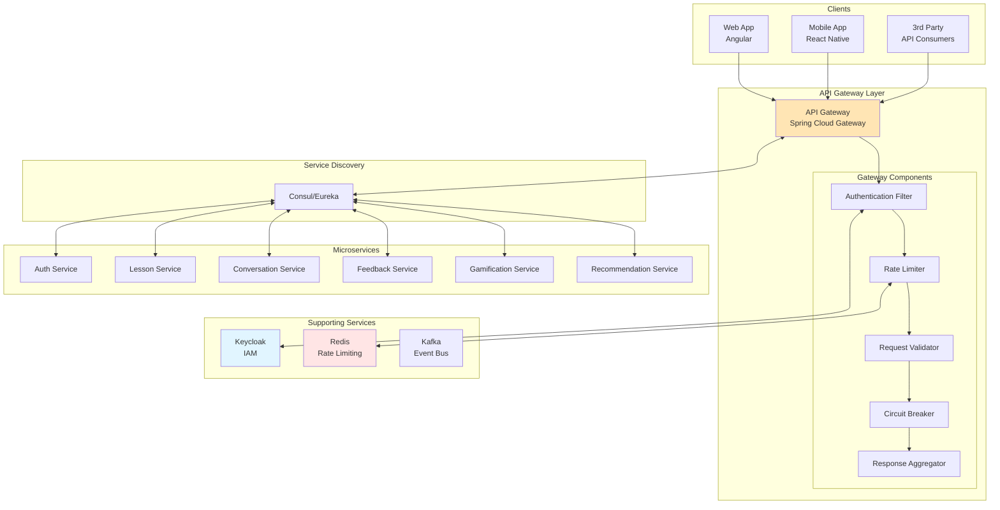
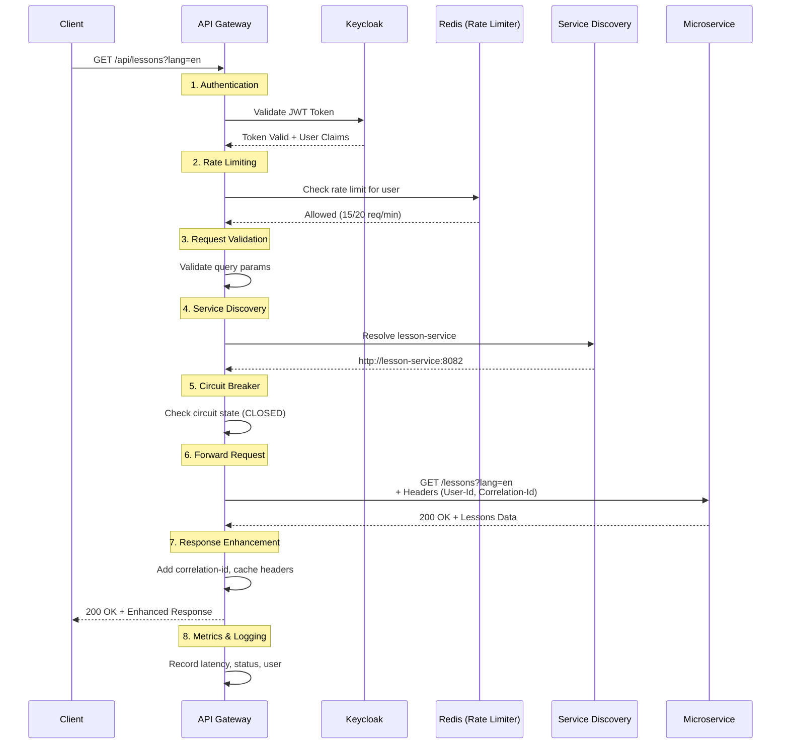
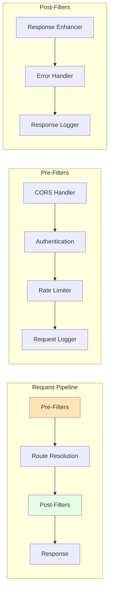
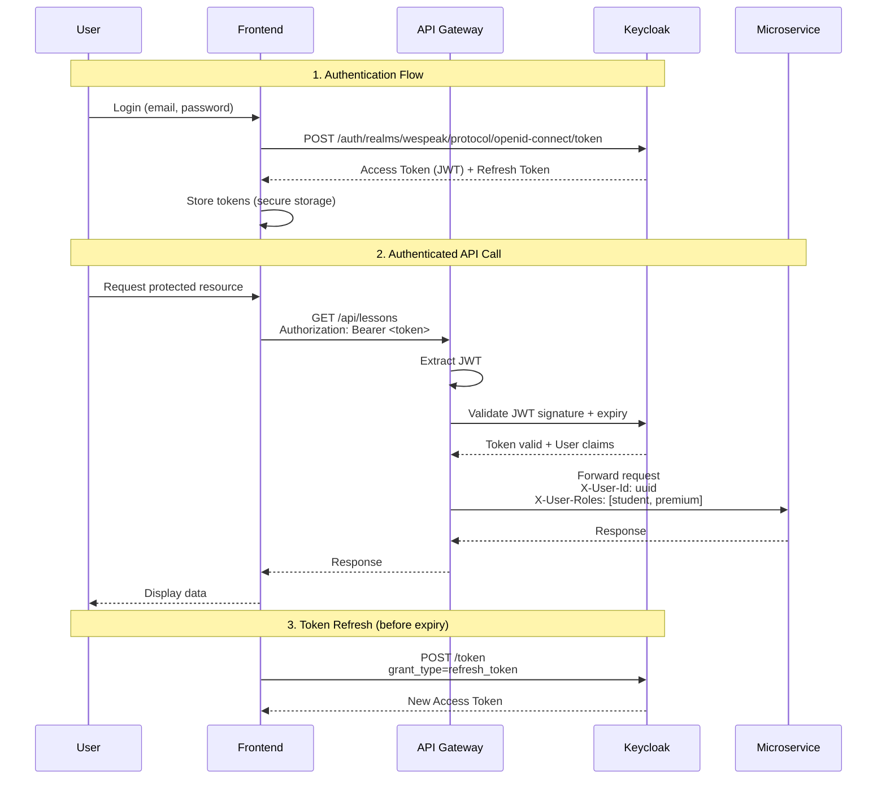
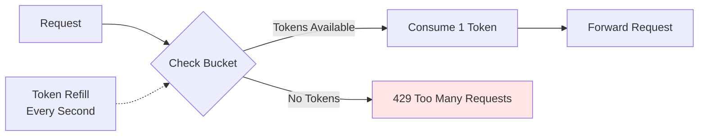
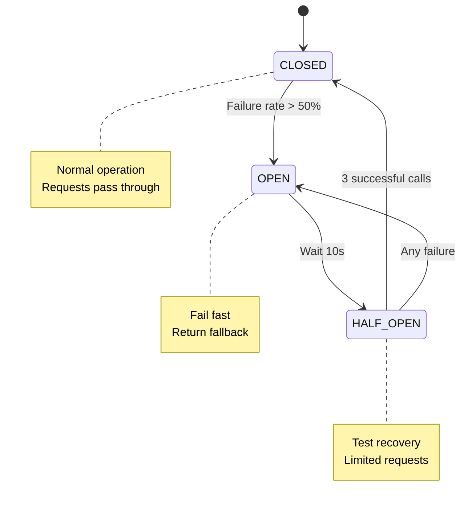
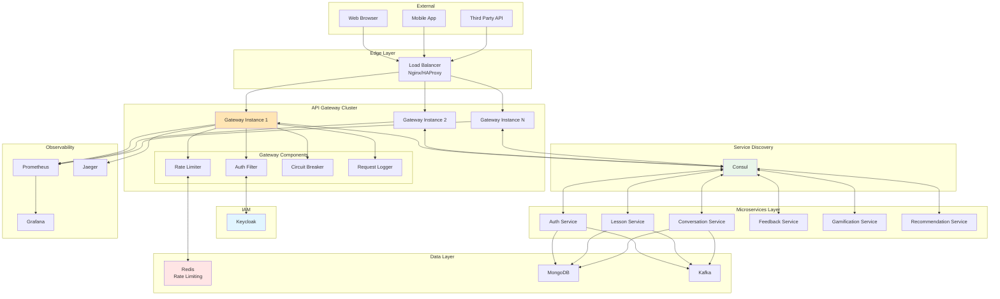

# API Gateway - Spécifications Techniques Détaillées

## 📋 Table des Matières

1. [Vue d'Ensemble](#1-vue-densemble)
2. [Architecture Fonctionnelle](#2-architecture-fonctionnelle)
3. [Routing et Orchestration](#3-routing-et-orchestration)
4. [Sécurité et Authentification](#4-sécurité-et-authentification)
5. [Rate Limiting et Quotas](#5-rate-limiting-et-quotas)
6. [Monitoring et Observabilité](#6-monitoring-et-observabilité)
7. [Configuration](#7-configuration)

---

## 1. Vue d'Ensemble

### 1.1 Responsabilité

L'**API Gateway** est le **point d'entrée unique** de la plateforme WeSpeak, agissant comme :
- **Reverse proxy** : Routing des requêtes vers les microservices appropriés
- **Security gateway** : Authentification, autorisation, validation tokens JWT
- **Traffic manager** : Rate limiting, throttling, load balancing
- **Protocol translator** : REST → gRPC, REST → WebSocket
- **Response aggregator** : Composition de réponses multi-services
- **Observability hub** : Logs centralisés, tracing distribué, métriques

### 1.2 Principes architecturaux

**Design Patterns** :
- **API Gateway Pattern** : Point d'entrée centralisé
- **Backend for Frontend (BFF)** : Routes optimisées par client (web, mobile)
- **Circuit Breaker** : Protection contre défaillances services
- **Bulkhead** : Isolation des pools de ressources
- **Service Discovery** : Résolution dynamique des instances

**Non-responsabilités** :
- ❌ Logique métier (délégation aux microservices)
- ❌ Transformation complexe de données
- ❌ Stockage de données (cache léger autorisé)
- ❌ Orchestration business complexe (→ orchestrator service si besoin)

### 1.3 Technologies

**Stack** :
- **Framework** : Spring Cloud Gateway (Spring Boot 3.2 + WebFlux)
- **Alternative** : Kong, Apache APISIX, Traefik
- **Service Discovery** : Consul / Eureka
- **Circuit Breaker** : Resilience4j
- **Rate Limiting** : Redis + Token Bucket algorithm
- **Observability** : Micrometer + Prometheus + Grafana + Jaeger

---

## 2. Architecture Fonctionnelle

### 2.1 Vue d'ensemble



### 2.2 Flux de requête



### 2.3 Architecture en couches



---

## 3. Routing et Orchestration

### 3.1 Configuration des routes

**Spring Cloud Gateway DSL** :
```yaml
spring:
  cloud:
    gateway:
      routes:
        # Auth Service
        - id: auth-service
          uri: lb://auth-service
          predicates:
            - Path=/api/auth/**, /api/users/**
          filters:
            - StripPrefix=1
            - name: RequestRateLimiter
              args:
                redis-rate-limiter.replenishRate: 10
                redis-rate-limiter.burstCapacity: 20
        
        # Lesson Service
        - id: lesson-service
          uri: lb://lesson-service
          predicates:
            - Path=/api/lessons/**, /api/courses/**, /api/skills/**
          filters:
            - StripPrefix=1
            - name: CircuitBreaker
              args:
                name: lessonServiceCircuitBreaker
                fallbackUri: forward:/fallback/lessons
            - AddRequestHeader=X-Request-Source, gateway
        
        # Conversation Service (REST)
        - id: conversation-service-rest
          uri: lb://conversation-service
          predicates:
            - Path=/api/conversations/**
          filters:
            - StripPrefix=1
            - name: RequestRateLimiter
              args:
                redis-rate-limiter.replenishRate: 20
        
        # Conversation Service (WebSocket)
        - id: conversation-service-ws
          uri: lb:ws://conversation-service
          predicates:
            - Path=/ws/conversations/**
          filters:
            - StripPrefix=0
        
        # Feedback Service
        - id: feedback-service
          uri: lb://feedback-service
          predicates:
            - Path=/api/feedback/**
          filters:
            - StripPrefix=1
            - name: CircuitBreaker
              args:
                name: feedbackServiceCircuitBreaker
        
        # Gamification Service
        - id: gamification-service
          uri: lb://gamification-service
          predicates:
            - Path=/api/gamification/**
          filters:
            - StripPrefix=1
        
        # Recommendation Service
        - id: recommendation-service
          uri: lb://recommendation-service
          predicates:
            - Path=/api/recommendations/**
          filters:
            - StripPrefix=1
            - name: RequestRateLimiter
              args:
                redis-rate-limiter.replenishRate: 30
      
      # Global CORS
      globalcors:
        corsConfigurations:
          '[/**]':
            allowedOrigins:
              - "https://app.wespeak.com"
              - "http://localhost:4200"
            allowedMethods:
              - GET
              - POST
              - PUT
              - DELETE
              - OPTIONS
            allowedHeaders: "*"
            allowCredentials: true
            maxAge: 3600
```

### 3.2 Agrégation de réponses (BFF Pattern)

**Exemple : Dashboard Utilisateur**

Single request `/api/bff/dashboard` → Agrégation de :
- User profile (auth-service)
- Learning stats (gamification-service)
- Next lesson recommendation (recommendation-service)
- Active challenges (gamification-service)

```java
@RestController
@RequestMapping("/api/bff")
public class BFFController {
    
    @Autowired
    private WebClient.Builder webClientBuilder;
    
    @GetMapping("/dashboard")
    public Mono<DashboardResponse> getDashboard(@AuthenticationPrincipal Jwt jwt) {
        String userId = jwt.getSubject();
        
        // Parallel calls to microservices
        Mono<UserProfile> profileMono = webClientBuilder.build()
            .get()
            .uri("lb://auth-service/users/" + userId)
            .retrieve()
            .bodyToMono(UserProfile.class);
        
        Mono<GamificationProfile> gamificationMono = webClientBuilder.build()
            .get()
            .uri("lb://gamification-service/profile")
            .header("Authorization", "Bearer " + jwt.getTokenValue())
            .retrieve()
            .bodyToMono(GamificationProfile.class);
        
        Mono<NextLessonRecommendation> recommendationMono = webClientBuilder.build()
            .get()
            .uri("lb://recommendation-service/next-lesson")
            .header("Authorization", "Bearer " + jwt.getTokenValue())
            .retrieve()
            .bodyToMono(NextLessonRecommendation.class);
        
        // Combine responses
        return Mono.zip(profileMono, gamificationMono, recommendationMono)
            .map(tuple -> new DashboardResponse(
                tuple.getT1(), // profile
                tuple.getT2(), // gamification
                tuple.getT3()  // recommendation
            ))
            .timeout(Duration.ofSeconds(5))
            .onErrorResume(e -> Mono.just(DashboardResponse.empty()));
    }
}
```

---

## 4. Sécurité et Authentification

### 4.1 Intégration Keycloak

**Architecture OAuth2 / OIDC** :



**Configuration Spring Security** :
```java
@Configuration
@EnableWebFluxSecurity
public class SecurityConfig {
    
    @Bean
    public SecurityWebFilterChain springSecurityFilterChain(ServerHttpSecurity http) {
        http
            .cors().and()
            .csrf().disable()
            .authorizeExchange(exchanges -> exchanges
                // Public endpoints
                .pathMatchers("/api/auth/register", "/api/auth/login").permitAll()
                .pathMatchers("/actuator/health", "/actuator/prometheus").permitAll()
                
                // Protected endpoints
                .pathMatchers("/api/**").authenticated()
                .pathMatchers("/ws/**").authenticated()
                
                .anyExchange().denyAll()
            )
            .oauth2ResourceServer(oauth2 -> oauth2
                .jwt(jwt -> jwt
                    .jwtAuthenticationConverter(jwtAuthenticationConverter())
                )
            );
        
        return http.build();
    }
    
    @Bean
    public ReactiveJwtDecoder jwtDecoder() {
        return ReactiveJwtDecoders.fromIssuerLocation(
            "https://keycloak.wespeak.com/auth/realms/wespeak"
        );
    }
    
    @Bean
    public Converter<Jwt, Mono<AbstractAuthenticationToken>> jwtAuthenticationConverter() {
        JwtAuthenticationConverter converter = new JwtAuthenticationConverter();
        converter.setJwtGrantedAuthoritiesConverter(new KeycloakRoleConverter());
        return new ReactiveJwtAuthenticationConverterAdapter(converter);
    }
}
```

**Extraction des rôles Keycloak** :
```java
public class KeycloakRoleConverter implements Converter<Jwt, Collection<GrantedAuthority>> {
    
    @Override
    public Collection<GrantedAuthority> convert(Jwt jwt) {
        Map<String, Object> realmAccess = jwt.getClaim("realm_access");
        
        if (realmAccess == null) {
            return Collections.emptyList();
        }
        
        List<String> roles = (List<String>) realmAccess.get("roles");
        
        return roles.stream()
            .map(role -> new SimpleGrantedAuthority("ROLE_" + role.toUpperCase()))
            .collect(Collectors.toList());
    }
}
```

### 4.2 Enrichissement des requêtes

**Global Filter** : Injection de headers pour microservices
```java
@Component
public class UserContextEnrichmentFilter implements GlobalFilter, Ordered {
    
    @Override
    public Mono<Void> filter(ServerWebExchange exchange, GatewayFilterChain chain) {
        return exchange.getPrincipal()
            .filter(principal -> principal instanceof JwtAuthenticationToken)
            .map(principal -> (JwtAuthenticationToken) principal)
            .map(authentication -> {
                Jwt jwt = (Jwt) authentication.getCredentials();
                
                // Enrich request with user context
                ServerHttpRequest enrichedRequest = exchange.getRequest().mutate()
                    .header("X-User-Id", jwt.getSubject())
                    .header("X-User-Email", jwt.getClaim("email"))
                    .header("X-User-Roles", String.join(",", extractRoles(jwt)))
                    .header("X-Correlation-Id", UUID.randomUUID().toString())
                    .build();
                
                return exchange.mutate().request(enrichedRequest).build();
            })
            .defaultIfEmpty(exchange)
            .flatMap(chain::filter);
    }
    
    @Override
    public int getOrder() {
        return -100; // High priority
    }
    
    private List<String> extractRoles(Jwt jwt) {
        Map<String, Object> realmAccess = jwt.getClaim("realm_access");
        return realmAccess != null 
            ? (List<String>) realmAccess.get("roles") 
            : Collections.emptyList();
    }
}
```

---

## 5. Rate Limiting et Quotas

### 5.1 Stratégie de Rate Limiting

**Token Bucket Algorithm** avec Redis :



**Quotas par tier** :
```yaml
rate-limiting:
  tiers:
    free:
      requests-per-minute: 20
      burst-capacity: 30
      conversation-per-week: 3
    
    premium:
      requests-per-minute: 100
      burst-capacity: 150
      conversation-per-week: -1  # Unlimited
    
    enterprise:
      requests-per-minute: 500
      burst-capacity: 1000
      conversation-per-week: -1
```

**Implémentation** :
```java
@Component
public class TieredRateLimiterGatewayFilterFactory 
    extends AbstractGatewayFilterFactory<TieredRateLimiterGatewayFilterFactory.Config> {
    
    @Autowired
    private ReactiveRedisTemplate<String, String> redisTemplate;
    
    @Override
    public GatewayFilter apply(Config config) {
        return (exchange, chain) -> {
            return exchange.getPrincipal()
                .flatMap(principal -> {
                    String userId = extractUserId(principal);
                    String tier = extractUserTier(principal);
                    
                    RateLimitConfig rateLimitConfig = getRateLimitForTier(tier);
                    
                    return isAllowed(userId, rateLimitConfig)
                        .flatMap(allowed -> {
                            if (allowed) {
                                return chain.filter(exchange);
                            } else {
                                exchange.getResponse().setStatusCode(HttpStatus.TOO_MANY_REQUESTS);
                                return exchange.getResponse().setComplete();
                            }
                        });
                });
        };
    }
    
    private Mono<Boolean> isAllowed(String userId, RateLimitConfig config) {
        String key = "rate_limit:" + userId;
        
        return redisTemplate.opsForValue()
            .increment(key)
            .flatMap(count -> {
                if (count == 1) {
                    // First request, set expiry
                    return redisTemplate.expire(key, Duration.ofMinutes(1))
                        .thenReturn(true);
                }
                
                return Mono.just(count <= config.getRequestsPerMinute());
            });
    }
}
```

### 5.2 Circuit Breaker

**Resilience4j Configuration** :
```yaml
resilience4j:
  circuitbreaker:
    configs:
      default:
        slidingWindowSize: 10
        minimumNumberOfCalls: 5
        failureRateThreshold: 50
        waitDurationInOpenState: 10s
        permittedNumberOfCallsInHalfOpenState: 3
        automaticTransitionFromOpenToHalfOpenEnabled: true
    
    instances:
      lessonServiceCircuitBreaker:
        baseConfig: default
      
      feedbackServiceCircuitBreaker:
        baseConfig: default
        failureRateThreshold: 70  # More lenient (AI service)
        waitDurationInOpenState: 30s
```

**États du Circuit Breaker** :


**Fallback Response** :
```java
@RestController
public class FallbackController {
    
    @GetMapping("/fallback/lessons")
    public Mono<ResponseEntity<FallbackResponse>> lessonServiceFallback() {
        return Mono.just(ResponseEntity.status(HttpStatus.SERVICE_UNAVAILABLE)
            .body(new FallbackResponse(
                "lesson-service",
                "Le service de leçons est temporairement indisponible. Veuillez réessayer dans quelques instants.",
                "SERVICE_UNAVAILABLE"
            ))
        );
    }
}
```

---

## 6. Monitoring et Observabilité

### 6.1 Métriques Prometheus

**Métriques exposées** :
```
# Gateway metrics
gateway_requests_total{route, method, status}
gateway_request_duration_seconds{route, method}
gateway_circuit_breaker_state{service, state}
gateway_rate_limit_exceeded_total{user_tier}

# Service health
gateway_service_discovery_instances{service}
gateway_service_latency_seconds{service}
```

**Dashboard Grafana** :
- Request throughput par route
- P95/P99 latency par service
- Circuit breaker states
- Rate limit hits par tier
- Error rate (5xx) par service

### 6.2 Distributed Tracing

**Spring Cloud Sleuth + Jaeger** :
```yaml
spring:
  sleuth:
    sampler:
      probability: 1.0  # 100% in dev, 10% in prod
  
  zipkin:
    base-url: http://jaeger:9411
    service:
      name: api-gateway
```

**Trace Context Propagation** :
```
User Request → Gateway → Microservice → Database

Trace ID: 5e8b3c2a-4f1d-4a3b-8c2d-3e4f5a6b7c8d
  └─ Span: gateway (50ms)
      └─ Span: lesson-service (30ms)
          └─ Span: mongodb-query (15ms)
```

### 6.3 Logs structurés

**Logback + JSON** :
```json
{
  "timestamp": "2025-01-15T10:30:00.123Z",
  "level": "INFO",
  "service": "api-gateway",
  "traceId": "5e8b3c2a4f1d4a3b",
  "spanId": "8c2d3e4f5a6b",
  "userId": "hash-user-123",
  "method": "GET",
  "path": "/api/lessons",
  "route": "lesson-service",
  "status": 200,
  "duration": 52,
  "userAgent": "Mozilla/5.0...",
  "clientIp": "203.0.113.42"
}
```

---

## 7. Configuration

### 7.1 Configuration complète

```yaml
# application.yml
spring:
  application:
    name: api-gateway
  
  cloud:
    gateway:
      # Discovery
      discovery:
        locator:
          enabled: true
          lower-case-service-id: true
      
      # Global filters
      default-filters:
        - DedupeResponseHeader=Access-Control-Allow-Origin
        - name: Retry
          args:
            retries: 3
            statuses: BAD_GATEWAY, SERVICE_UNAVAILABLE
            backoff:
              firstBackoff: 50ms
              maxBackoff: 500ms
              factor: 2
      
      # Routes (voir section 3.1)
  
  # Security OAuth2
  security:
    oauth2:
      resourceserver:
        jwt:
          issuer-uri: https://keycloak.wespeak.com/auth/realms/wespeak
          jwk-set-uri: ${spring.security.oauth2.resourceserver.jwt.issuer-uri}/protocol/openid-connect/certs
  
  # Redis (Rate Limiting)
  redis:
    host: redis
    port: 6379
    password: ${REDIS_PASSWORD}

# Consul Service Discovery
spring:
  cloud:
    consul:
      host: consul
      port: 8500
      discovery:
        instanceId: ${spring.application.name}:${random.value}
        healthCheckPath: /actuator/health
        healthCheckInterval: 15s

# Resilience4j (voir section 5.2)

# Actuator
management:
  endpoints:
    web:
      exposure:
        include: health, prometheus, metrics, gateway
  metrics:
    export:
      prometheus:
        enabled: true
  endpoint:
    health:
      show-details: always

# Logging
logging:
  level:
    org.springframework.cloud.gateway: DEBUG
    reactor.netty: INFO
  pattern:
    console: "%d{yyyy-MM-dd HH:mm:ss} - %msg%n"

# Custom
gateway:
  rate-limiting:
    enabled: true
  
  circuit-breaker:
    enabled: true
  
  cors:
    allowed-origins:
      - https://app.wespeak.com
      - http://localhost:4200
```

### 7.2 Environnements

**Development** :
```yaml
spring:
  profiles: dev

gateway:
  rate-limiting:
    enabled: false  # Disable for easier testing
  
  cors:
    allowed-origins: "*"

logging:
  level:
    root: DEBUG
```

**Production** :
```yaml
spring:
  profiles: prod

gateway:
  rate-limiting:
    enabled: true
  
  circuit-breaker:
    enabled: true

resilience4j:
  circuitbreaker:
    configs:
      default:
        slidingWindowSize: 20
        waitDurationInOpenState: 30s

logging:
  level:
    root: INFO
    org.springframework.cloud.gateway: WARN
```

---

## Diagramme d'Architecture Complète



---

**Version** : 1.0.0  
**Dernière mise à jour** : 2025-01-15  
**Auteur** : WeSpeak Product Owner AI  
**Focus** : Architecture, Sécurité et Routing
